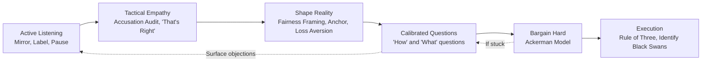
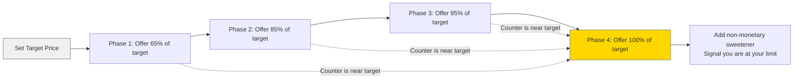
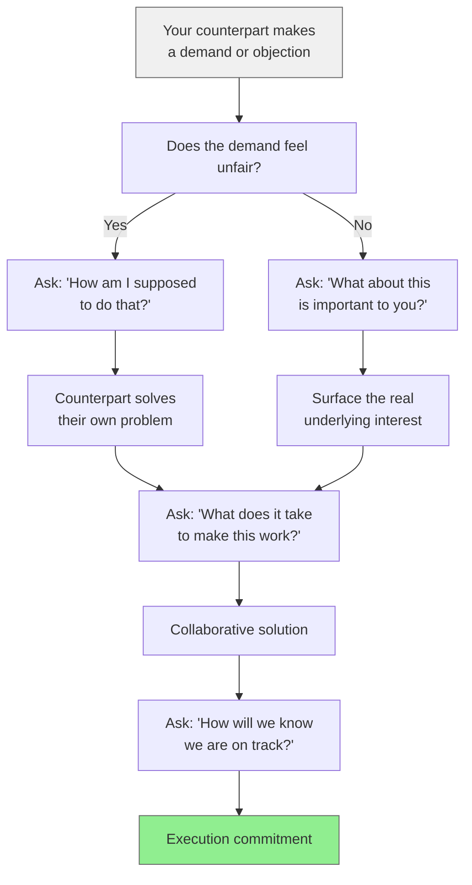
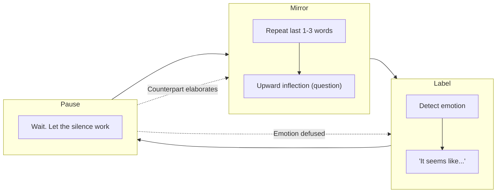
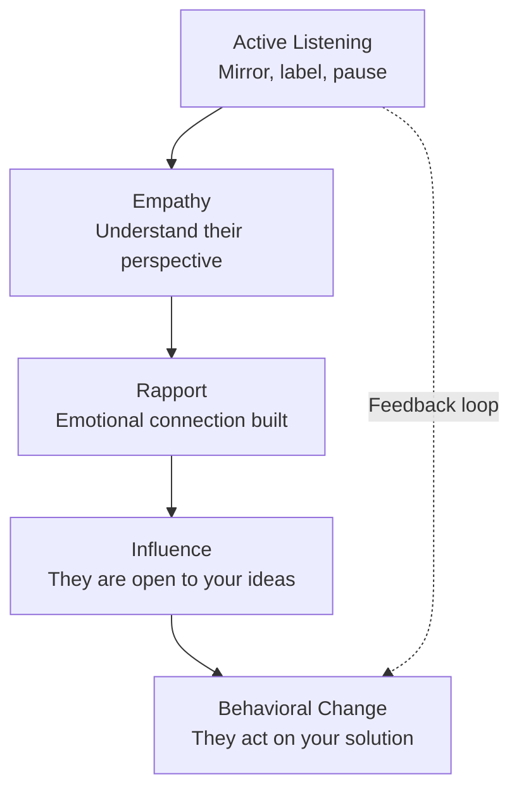
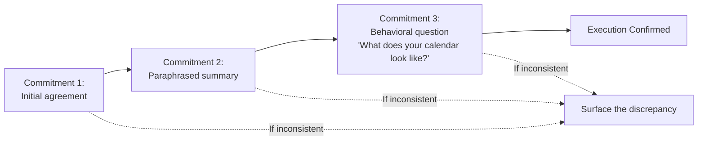
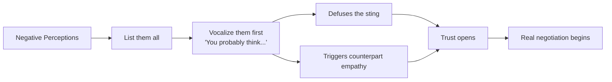

## Diagrams

### The Negotiation Flowchart

### The Ackerman Bargaining Model

### Calibrated Question Decision Tree

### The Labeling-Mirroring-Pause Loop

### Spectrum of Negotiation Approaches

```mermaid
flowchart LR
    subgraph Soft["Soft / Cooperative"]
        S1["Concede first"]
        S2["Focus on relationship"]
        S3["Split the difference"]
    end
    subgraph FBI["FBI Approach (Voss)"]
        F1["Tactical empathy"]
        F2["Mirror and label"]
        F3["Calibrated questions"]
        F4["Ackerman model"]
    end
    subgraph Hard["Hard / Competitive"]
        H1["Make threats"]
        H2["Extreme anchoring"]
        H3["Walk away"]
    end

    Soft -- "Common in<br/>retail/hospitality" --> FBI
    FBI -- "Common in<br/>hostage / high-stakes" --> Hard

    style Soft fill:#add8e6,stroke:#666
    style FBI fill:#ffd700,stroke:#666
    style Hard fill:#ffcccb,stroke:#666
```

---

## Chapter Breakdown

Introduction — The New Rules

Voss opens with a story from a Harvard Negotiation Project seminar where
he, a real FBI negotiator, was asked to negotiate against a Harvard Law
professor. The professor used classic *Getting to Yes* tactics — search
for common interests, find win-win, be rational. Voss used mirrors and
labels. The professor ended up frustrated, defensive, and conceding
ground he had not planned to give.

Voss introduces behavioral economics and Daniel Kahneman's System 1
(emotional, instinctive) and System 2 (rational, deliberate) thinking.
His thesis: humans are fundamentally emotional, not rational.
Negotiation is communication with results, and the most effective
communication happens at the emotional level.

Key concepts: Loss aversion, the failure of traditional negotiation
theory in real-world (hostage) contexts, and the birth of the FBI's
behavioral approach after Attica and Waco.

Chapter 1 — Be a Mirror: How to Quickly Establish Rapport

Mirroring is the simplest and highest-leverage tactic in the book.
Repeat the last 1-3 words your counterpart says, with an upward
inflection. Then pause. The mirror triggers an instinctual bonding
response — the other person feels heard without feeling agreed-with.
They almost always elaborate, revealing more than they intended.

Voss introduces the late-night FM DJ voice: a slow, calm, downward-
inflected tone that signals control and safety. Combined with
mirroring, this voice de-escalates tension and builds rapport.

Key insight: Move slowly. The "7-piece rule" — humans can process
roughly seven pieces of information at once. Slow down, simplify,
and let silence do the heavy lifting.

Chapter 2 — Don't Feel Their Pain, Label It: How to Create Trust
with Tactical Empathy

Tactical empathy is not sympathy. It is the deliberate recognition of
your counterpart's feelings and the vocalization of that recognition.
Labeling — starting with "It seems like...", "It sounds like...",
"It looks like..." — names the emotion without judgment.

Voss recounts a Harlem standoff where three armed fugitives barricaded
themselves in an apartment. He stood at the door and labeled their
fears: "It seems like you don't want to go back to jail. It seems like
you're afraid we'll come in guns blazing." After six hours, they
surrendered — because they felt heard.

The accusation audit: list every terrible thing the other side could
say about you. Say them first. "You think I'm lowballing you. You think
I haven't done my homework. You think I'm wasting your time." This
drains the sting and triggers the counterpart's empathy.

Key insight: Labeling shifts brain activity from the amygdala (fear
center) to the prefrontal cortex (rational thinking). fMRI research
by Lieberman (UCLA, 2007) confirms this.

Chapter 3 — Beware "Yes" — Master "No": How to Generate
Momentum and Make It Safe to Reveal the Real Stakes

Conventional wisdom: get the other person saying "Yes" as often as
possible. Voss's data from thousands of FBI negotiations: early "Yes"
is meaningless. There are three kinds of "Yes": counterfeit (polite
agreement to end the conversation), confirmation (affirming a fact),
and commitment (true agreement). Only commitment "Yes" matters — and it
is rare.

"No" is the real starting point. "No" creates safety, autonomy, and
control. When someone says "No," they feel protected and empowered.
Once they have established that boundary, they open up to real dialogue.

Practical application: Instead of "Is now a good time to talk?" ask
"Would it be ridiculous to think we could sign by Friday?" The
counterpart says "No" to the ridiculous framing, not to the ask. This
surfaces real concerns.

Key insight: "Yes" is nothing without "How." "No" starts the
negotiation.

Chapter 4 — Trigger the Two Words That Immediately Transform
Any Negotiation: "That's Right"

The most important phrase in negotiation is not "Yes" — it is "That's
right." When your counterpart says "That's right," they have confirmed
that you understand their world so completely that they have nothing
left to argue. The negotiation shifts from adversarial to collaborative.

How to trigger it: deliver a summary that captures the counterpart's
situation, constraints, and emotions so accurately they have to agree.
"You've been burned by vendors who overpromised. You lost political
capital inside your organization. You cannot afford another miss this
quarter." When they say "That's right," you have achieved breakthrough.

Distinguish from "You're right," which is often dismissal — a polite
way of saying "I'm done listening." "That's right" is engagement.

The Behavioral Change Stairway Model (BCSM): Active Listening ->
Empathy -> Rapport -> Influence -> Behavioral Change. Each step
builds on the previous.

Chapter 5 — Bend Their Reality: How to Shape What Is Fair

Reality is negotiable. Voss draws on prospect theory (Kahneman &
Tversky): people take more risk to avoid a loss than to achieve a gain.
Frame every negotiation in terms of what the counterpart stands to lose.

Fairness is a weapon. When the counterpart says "That's not fair," they
are not appealing to principle — they are signaling that you need to
address their emotional state. Voss advises responding: "I'm sorry, can
you stop me if I'm wrong, but it seems like you think I've treated you
unfairly?" The label re-engages their empathy.

Practical anchoring techniques:
- Start by describing how bad things are — set a low anchor
- Use odd, specific numbers (e.g., $47,563) to suggest thoughtful
  calculation
- Frame your concessions as painful sacrifices
- Never split the difference — it validates the midpoint as fair

Chapter 6 — Create the Illusion of Control: How to Calibrate
Questions to Transform Conflict into Collaboration

Calibrated questions — open-ended questions starting with "How" or
"What" — are the most powerful tool in the negotiator's arsenal. They
give the counterpart the illusion of control while keeping you in the
driver's seat. The person asking questions controls the conversation.

Rule: never ask "Why." "Why" sounds accusatory and triggers
defensiveness. "Why did you do that?" becomes "What about this led you
to that decision?"

Examples of calibrated questions:
- "How am I supposed to do that?" (the gentlest version of "No")
- "What about this is important to you?"
- "What are we trying to accomplish here?"
- "How would you like me to proceed?"
- "What does it take to make this work?"

Key insight: calibrated questions force the counterpart to use their
mental energy to solve your problems. They internalize your obstacles
as their own. This is the first step toward buy-in.

Chapter 7 — Guarantee Execution: How to Spot Liars and Ensure
Follow-Through

Agreement is not enough — execution is everything. Voss introduces
several tools for ensuring follow-through.

The 7-38-55 Rule (Mehrabian): in emotional communication, words carry
7% of meaning, tone 38%, and body language 55%. Listen for
inconsistencies between words and tone. When a "Yes" sounds different
from previous "Yeses," something has changed.

The Rule of Three: get the counterpart to agree to the same thing three
times in the same conversation — once as an initial commitment, once
in a summary, and once as a behavioral commitment (e.g., "What does
your calendar look like for the kickoff?").

Linguistic cues of deception: overuse of third-person pronouns
("Well, one would think that..."), distancing language, and avoidance
of "I" statements. The "Chris discount" — using your own name to
humanize yourself — builds empathy and counteracts this.

Key insight: "I'll try" always means "No" in practice. If someone says
"I'll try," surface what is blocking them.

Chapter 8 — Bargain Hard: Why You Should Bypass Price with the
Ackerman Model

Voss introduces three negotiating styles based on FBI profiling:

- **Analyst:** Methodical, detail-oriented, risk-averse. Time is not
  pressure. Do not ask too many questions early. Respect their need for
  data. Be precise.
- **Accommodator:** Relationship-focused, friendly, communicative. They
  need to feel liked and heard. Mirror and label heavily. Build trust
  before pushing.
- **Assertive:** Aggressive, time-sensitive, outcome-focused. They
  respect directness. They need to feel heard but will not listen until
  they are sure you have heard them. Mirror first, then make your case.

The Ackerman Bargaining Model:
1. Set your target price
2. Open at 65% of target
3. Counter at 85% of target
4. Move to 95% of target
5. Final offer at 100% of target
6. Add a small non-monetary gift at the end (extra service, faster
   delivery) to signal you are at your absolute limit

All numbers should be precise, non-round figures. $47,563 feels more
researched than $50,000. The final non-monetary concession triggers
reciprocity and closes the deal.

Chapter 9 — Find the Black Swan: How to Create Breakthroughs
by Revealing the Unknown Unknowns

A Black Swan is an "unknown unknown" — a piece of hidden information
that, once revealed, transforms the negotiation. Voss recounts the case
of William Griffin, a kidnap victim whose captors had a hidden agenda
(suicide-by-cop). The FBI missed the Black Swan, and Griffin died.

Three types of leverage:
- **Positive:** You have something the other side wants
- **Negative:** You can impose a loss the other side wants to avoid
- **Normative:** You use the other side's own values, beliefs, or norms
  against them. Example: discovering a CEO is a devout Christian, then
  framing the deal in terms of stewardship and service

How to find Black Swans:
- Get face time — observe unguarded moments
- Ask "Why are they telling me this now?" — timing reveals hidden
  motives
- Look for inconsistencies between words and behavior
- Listen for changes in pronoun use ("I" vs. "we" vs. "they")
- Assume every counterpart has at least three hidden pieces of leverage

Key insight: "Crazy" counterparts are not crazy. They are either
ill-informed, constrained by hidden interests, or operating under a
different set of rules. The negotiator's job is to discover which.

---

## Frameworks

### The Behavioral Change Stairway Model (BCSM)

### The Three Negotiating Styles

| Style | Key Traits | Do | Don't |
|---|---|---|---|
| Analyst | Data-driven, skeptical, needs time | Give precise numbers, respect silence | Push for quick answers, ask too many questions upfront |
| Accommodator | Relationship-driven, friendly | Mirror and label heavily, build trust | Push facts over feelings, rush |
| Assertive | Results-driven, direct, aggressive | Mirror first, then state your case | Take silence as rejection, be indirect |

### The Three Kinds of "Yes"

| Type | Meaning | Signal |
|---|---|---|
| Counterfeit | "Please stop talking" | Delivered too quickly, flat tone |
| Confirmation | "I heard what you said" | Neutral tone, no follow-through |
| Commitment | "I agree and I will act" | Energized tone, specific next steps |

### The Rule of Three

### The Accusation Audit

---

## Principles

1. **Listen first.** The most active thing you can do in a negotiation
   is listen. Everything else — mirroring, labeling, questions —
   depends on information only listening provides.

2. **Empathy is not agreement.** Tactical empathy means understanding
   the other side's perspective and feelings. You can empathize without
   conceding. In fact, empathy is how you avoid unnecessary concessions.

3. **Control the tone, not the words.** The late-night FM DJ voice
   calms. The assertive voice escalates. Choose your tone strategically.
   In emotional situations, slow down and drop your inflection.

4. **Seek "No," not "Yes."** "No" creates safety, autonomy, and
   momentum. "Yes" creates false comfort. Start conversations in a way
   that makes "No" safe, then use "No" as a platform for real discovery.

5. **The goal is "That's right."** When your counterpart says "That's
   right," you have achieved breakthrough. They feel understood. The
   dynamic shifts from adversarial to collaborative.

6. **Ask questions that start with "How" or "What."** Calibrated
   questions give the other side the illusion of control while you
   direct the conversation. Avoid "Why" — it sounds accusatory.

7. **Never split the difference.** Compromise validates the midpoint
   as reasonable. Creative solutions come from understanding hidden
   interests, not from splitting visible positions.

8. **Use the Ackerman model for price negotiation.** Structured,
   predictable, and proven. Precise numbers signal research. The final
   non-monetary sweetener triggers reciprocity.

9. **Guarantee execution with the Rule of Three.** Get agreement three
   times. Inconsistency on the third pass signals a problem.

10. **Find the Black Swans.** Hidden information — unknown unknowns —
    can transform a negotiation. Assume every counterpart has at least
    three. Look for inconsistencies, ask "Why now?", and observe
    unguarded moments.

11. **Adapt your style to your counterpart.** Analysts need data and
    time. Accommodators need warmth and rapport. Assertives need to be
    heard quickly. Treat them how they need to be treated.

12. **"I'll try" is "No."** If someone says "I'll try," surface the
    real obstacle with a calibrated question: "What makes you hesitate?"
