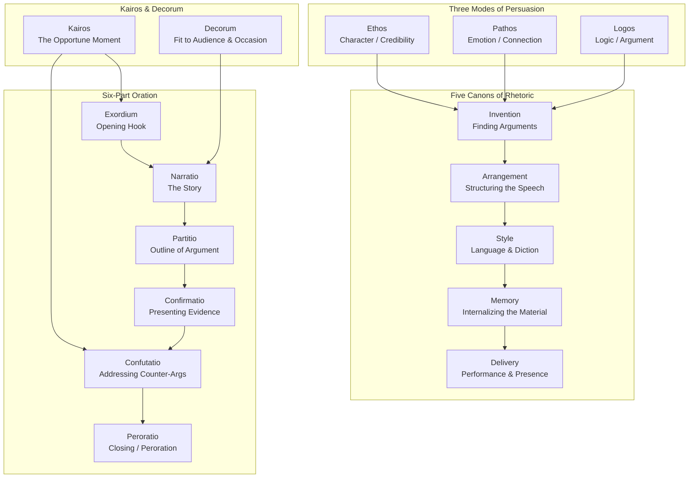
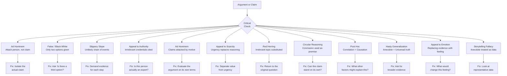
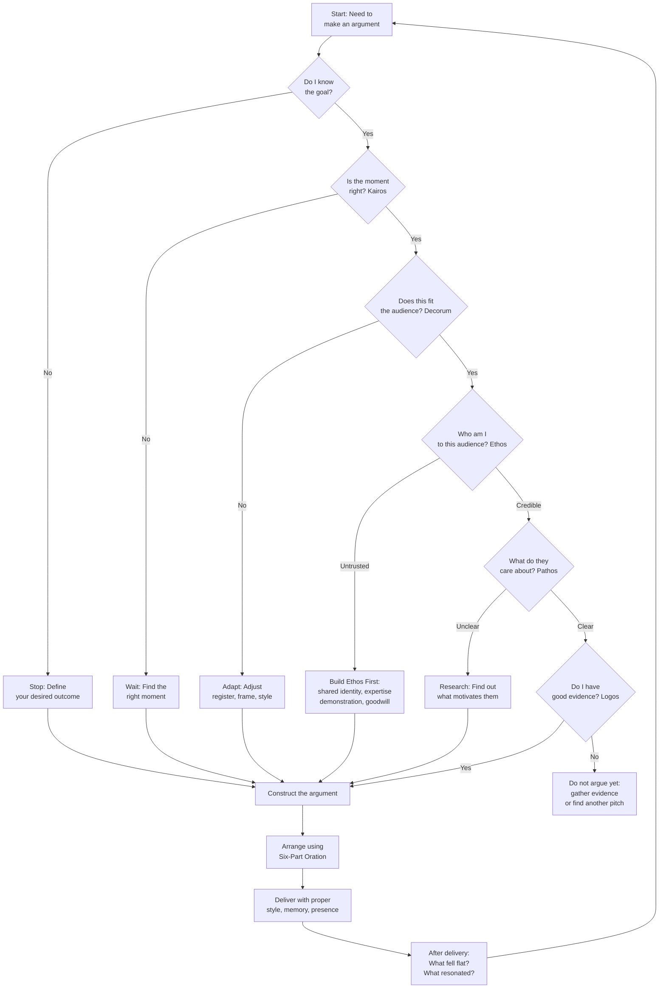

## The Three Modes of Persuasion

Aristotle's three modes form the backbone of every effective argument. Heinrichs uses them not as abstract philosophy but as a practical checklist.

### Ethos: Character Is the Argument

Ethos is the audience's perception of your credibility, virtue, and goodwill. Heinrichs argues that ethos is not established by credentials alone — it is established behaviorally, through every choice you make from the moment you enter the room.

**Three pillars of ethos:**

| Pillar | What It Means In Practice | Failure Mode |
|---|---|---|
| **Virtue (arete)** | Your values align with the audience's; you share their moral framework | Comes off as preachy or hypocritical if your actions contradict your claims |
| **Practical Wisdom (phronesis)** | You understand the real situation, the practical constraints, the people involved | Comes off as naive or naive if you ignore reality |
| **Goodwill (eunoia)** | You demonstrate that you care about the audience's interests, not your own | Comes off as self-serving the moment you make an argument that primarily benefits you |

**Building ethos before you speak:**
- Establish shared identity or values through opening references ("As someone who has also worked on this problem, I know what it's like when...")
- Use honest self-deprecation when appropriate — it signals confidence and authenticity
- Show you have done your homework by citing accurate, relevant evidence
- Ask questions that show you respect the other person's expertise

**Defending against ethos attacks:**
When someone attacks your credibility ("You're just saying that because..."), your first instinct is to defend the charge. Heinrichs recommends: **do not defend the accusation directly — redirect to the argument**. "Even if my motivation were exactly what you say it is, does that make the argument wrong?" Defending ethos while abandoning logos signals that ethos has collapsed.

### Pathos: Emotion Is Not Manipulation

Pathos is the emotional connection between arguer and audience. Heinrichs vigorously resists the common framing that pathos = manipulation. His argument: genuine pathos shows that you understand what the audience actually cares about. That is not manipulation — that is respect.

**The three genres and their emotional registers:**

| Genre | Time Orientation | Purpose | Pathos Strategy |
|---|---|---|---|
| **Deliberative** | Future | "What should we do?" | Hope, fear, ambition — emotions about possible outcomes |
| **Forensic** | Past | "What happened?" | Anger, pity, outrage — emotions about what is done |
| **Epideictic** | Present | "What do we value?" | Pride, shame, gratitude — emotions that reinforce shared identity |

**Effective pathos requires identification**: the audience must recognize themselves in the argument. Heinrichs illustrates this with a moving example: a lawyer arguing for a defendant in a robbery case not by denying the facts (logos) but by showing the jury the defendant's humanity and context (pathos), demonstrating that the act was a product of circumstance, not character — and then quietly establishing the defendant's good character anyway (ethos).

### Logos: The Logical Engine — But Weak Without the Other Two

Heinrichs's provocative claim: logos is necessary but not sufficient. An argument can be perfectly logical and still fail because the audience does not trust the arguer (weak ethos) or does not care about the conclusion (weak pathos).

**The enthymeme is logos at its rhetorical best:**

Unlike the full syllogism (major premise + minor premise + conclusion), the enthymeme leaves one premise unstated. The audience fills in the gap themselves, becoming co-author of the argument. This makes the conclusion feel like their own.

> Full syllogism: All politicians who accept campaign contributions from corporations will serve corporate interests; this politician accepted corporate contributions; therefore this politician will serve corporate interests.
>
> Enthymeme: "Is this the kind of politician who puts corporate interests first?" (The audience connects the dots.)

**Inductive vs. deductive strategy:**
- **Deductive** works when the audience *already shares your premises* — the enthymeme is most effective here
- **Inductive** (examples, analogies, stories) works when you need to *establish* the premise in the first place — use it when the audience does not yet believe what you believe

---

## The Five Canons of Rhetoric

The classical system is a process. Heinrichs treats each canon as a step rather than a concept:

### Canon 1: Invention — Finding the Arguments

Invention is where most bad arguments are born. Heinrichs covers three argument types in detail:

**Common Topics** (the topics of invention — Aristotle's and Cicero's tools for finding arguments):
- **Definition** — what is this thing? How would you describe its essential nature?
- **Cause and effect** — why did this happen / what will this cause?
- **Comparison** — is this better or worse than the alternative?
- **Circumstance** — has anything like this happened before? What is the precedent?
- **Testimony** — what do authorities say? What does the evidence show?

**The invented example:** Heinrichs walks through inventing an argument for "we should adopt a dog" using all five topics. Definition: "Responsibility is a virtue that develops through care for another being." Cause: "Adopting a dog teaches empathy in children." Comparison: "A dog costs less than a child and provides the same love without college tuition." Circumstance: "Many studies show dog ownership reduces stress and blood pressure." Testimony: "The American Humane Association reports..."

### Canon 2: Arrangement — The Structure That Persuades

Heinrichs argues that the arrangement of your argument is an argument in itself. A claim delivered *before* its supporting evidence feels less trustworthy than the same claim delivered *after*.

The **six-part canonical structure** (outlined below in full) is the most reliable arrangement for complex, controversial, or important arguments. For shorter, simpler arguments, Heinrichs recommends a minimalist arrangement:

1. **Exordium** (or hook) — get attention and establish ethos
2. **Reason** — state your claim with one strong supporting reason
3. **Evidence** — one piece of evidence that backs the reason
4. **Peroration** (close) — reinforce with a memorable ending that ties back to your opening

### Canon 3: Style — Finding the Right Words

Style is not decoration — it is meaning. The words you choose shape how your argument is received.

Heinrichs emphasizes:
- ** figures of speech** — schemes (artful arrangement: anaphora, chiasmus, antithesis) and tropes (figurative language: metaphor, synecdoche, metonymy). These are not ornaments; they are memory devices and emphasis tools.
- **Tone and register** — choosing the right level of formality is decorum in action. A passionate plea from the wrong register sounds manipulative; the same plea from the right register sounds urgent and authentic.
- **Clarity is not enough** — you need to be clear *and* vivid. Facts alone do not persuade. Stories and images make the argument real.

### Canon 4: Memory — Internalizing the Material

In the classical period, memory was a separate canon because orators did not have notes. Heinrichs updates this: **memory today means knowing your argument well enough that you are not reading it.** You are engaging with it.

Key techniques he recommends:
- **The memory palace** (method of loci) — useful for remembering complex argument structure
- **Memorable phrases** — creating or borrowing short, memorable lines (tropes and schemes make arguments stick)
- **Rehearsal** — practicing the argument until the structure feels internal, not recited
- **Anticipating objections** — the person who has thought through counterarguments will answer them fluidly, not defensively

### Canon 5: Delivery — Performance and Presence

Delivery matters enormously — research on public speaking consistently shows that how you deliver often matters more than what you say. Heinrichs covers:
- **Eye contact** — the most basic, most powerful signal of ethos
- **Voice control** — pace, volume, and inflection shape how arguments are received
- **Gestures and presence** — open posture signals confidence and honesty; defensive posture weakens ethos
- **Silence** — the most underused rhetorical device; a well-timed pause commands attention and signals confidence
- **Digital delivery** — email and social media arguments lack the nonverbal channel; compensate with careful phrasing, formatting, and explicit ethos signals

---

## The Six-Part Oration

The classical oration is the full delivery system. Heinrichs labels each part and explains its function:

### Exordium — The Opening

The exordium's job: gain the audience's attention and goodwill, and establish why they should listen to *you* (ethos). Heinrichs identifies three categories of exordia:
- **The humble approach**: "I am one of you, with your interests at heart" — the speaker who positions themselves as a peer rather than an authority
- **The attention-getting approach**: opening with something surprising, vivid, or challenging
- **The audience-flattery approach**: demonstrating familiarity with the audience's values or concerns

**Common mistake**: Beginning with "Good morning, my name is X, and today I will discuss Y." This is not an exordium; it is a self-introduction that loses the audience before you begin. Exordia should jump straight into the business of the argument.

### Narratio — The Story

The narratio provides the facts and context that the audience needs to evaluate your argument. But it is not neutral fact-reporting — every choice about *which* facts to include and *which* to omit is itself an argument.

Heinrichs's guidelines:
- Include only the facts your audience needs to make the decision you want them to make
- Select facts that support your framing (this is where redefinition begins)
- Omit facts that complicate the narrative unless omitting them would destroy your ethos
- Keep it short: in modern business presentations, five minutes is the maximum for a narratio

### Partitio — The Outline

The partitio tells the audience what you are going to argue, and in what order. It is a rhetorical courtesy: it lets the audience follow your reasoning and anticipates their questions (engaging them mentally even before the argument is fully presented).

The partitio is also where you can **redefine the debate** by re-framing the parts. Heinrichs gives the example of a sales presentation: instead of "Today I'll discuss price, features, and support," try "I'll show you why our higher price produces lower total cost, why simpler features drive better results, and why our support model is cheaper over time." The partitio sets up the reframe before the argument is made.

### Confirmatio — Presenting the Evidence

This is where the main body of the argument lives: the reasons, the evidence, the examples. Heinrichs emphasizes:
- **One reason per part** of the confirmatio — do not bury multiple arguments in one paragraph
- **Order of arguments**: lead with your strongest point, save your second-strongest for last (primacy and recency effects)
- **Match evidence to genre**: deliberative arguments need future-oriented evidence (projections, benefits); forensic arguments need past-oriented evidence (records, testimony); epideictic arguments need present-oriented evidence (shared values, identity)

### Confutatio — Addressing Counter-Arguments

Heinrichs calls the confutatio "the most underused weapon in rhetoric." The arguer who addresses the strongest version of the opponent's argument before the opponent can make it gains three advantages:
1. **Demonstrates fairness** — you show the audience you have considered alternatives, strengthening your ethos
2. **Reduces the opponent's impact** — their best argument has already been responded to
3. **Turns the counter-argument into support** — you can acknowledge a limitation of your position while showing how it is outweighed by benefits

**Strategic guidelines:**
- Pick the strongest counter-argument, not the weakest — responding to the weakest makes you look like a straw-man builder
- Be fair in your summary of the counter-argument — unfair summary destroys your ethos
- Use the "but nevertheless" structure: "My opponent argues [X]. And there is real force to this. Nevertheless, [your response]." This validates the counter-argument while maintaining your position
- In some cases, concede the point and reframe: "Yes, X is a limitation of my proposal. But X is equally a limitation of every existing approach, including the one you are proposing."

### Peroratio — The Powerful Close

The peroratio must do three things:
1. **Summarize** the argument (recapitulation)
2. **Amplify** — restate the most important point with added power, not just as a repetition
3. **Move the audience to action or judgment** (the concluding wish — Cicero's *peroratio*)

Heinrichs identifies the key closing strategies:
- **The final appeal to values** — link your conclusion to something the audience already deeply cares about
- **A vivid image or story** that makes the conclusion feel embodied rather than abstract
- **An open-ended question** that invites the audience to reach the conclusion themselves ("So what kind of community do we want to be?")
- **The reminder of shared identity** (the unity principle) — "We have always been a people who..."

---

## Logical Fallacies: The Diagnostic Tool

Heinrichs provides a practical guide to the most common logical fallacies infiltrating public debate:



### Detailed Descriptions With Real-World Examples

**Ad Hominem (attack the person)**
"You can't trust his economic policy — he's never run a business." The attack on the person's experience is irrelevant to whether the policy is sound. Defend by focusing on the policy, not the credentials.

**False Dichotomy (black-or-white)**
"Either we ban assault weapons or we accept mass shootings." A third option (targeted regulation, mental health, red-flag laws) exists but is omitted. The fix is to surface the suppressed middle option.

**Slippery Slope**
"If we legalize marijuana, next it will be heroin, and soon society collapses." This fallacy assumes each step in the chain is inevitable without providing evidence. Ask: at each proposed step, what connects one to the next?

**Appeal to Irrelevant Authority**
"A Nobel laureate in physics says this nutritional supplement works." The authority is irrelevant to nutrition; the credential is being used as a credibility shortcut. Heinrichs distinguishes this from legitimate authority — a medical doctor prescribing treatment carries relevant authority.

**Ad Hominem via Motive**
"You're just saying that because you benefit if this policy passes." This attacks motivation rather than the logical structure of the argument. The counter is Heinrichs's classic: "Even if my motivation is exactly as you describe — and it is not — does that change whether the claim is true?"

**Appeal to Scarcity**
"Only two tickets left — buy now!" The urgency is manufactured to bypass deliberation. The fix: separate the value of the thing from the manufactured urgency.

**Red Herring**
A politician accused of corruption: "The real issue is why my opponent hasn't released his tax returns." Completely off-topic. Fix: gently and publicly return to the original question.

**Circular Reasoning**
"This policy is effective because it works." The conclusion ("it's effective") is simply restated as the premise ("it works"). Fix: ask what independent standard is being used to evaluate effectiveness.

**Post Hoc Ergo Propter Hoc**
"Crime went down after we hired more police — so more police reduce crime." Correlation is not causation. Crime may have been declining for other reasons (economic growth, demographic shifts). The fix: look for controlled evidence and alternative explanations.

**Hasty Generalization**
"I met one person from Country X who was rude; people from Country X are rude." An anecdote is not a population. Fix: ask for representative data.

**Appeal to Emotion**
"If you really cared about children, you would support this bill." The emotional claim replaces the substantive evidence. Fix: ask what specific evidence supports the bill's effectiveness independent of how people feel.

**The Storytelling Fallacy**
"Heather's family was bankrupted by medical bills; we need universal healthcare." Heather's story is powerful and may well be true, but one story does not prove that universal healthcare would have saved Heather's family, nor that the costs exceed the benefits. Stories illustrate; data proves. Heinrichs does not dismiss stories — he insists they must be accompanied by evidence when used to support a policy argument.

---

## Kairos and Decorum: The Situational Layer

### Kairos — The Master Rhetorical Concept

Kairos is the most distinctive and most sophisticated element of classical rhetoric. It is not just "timing" — it is the insight that argument is always situated: embedded in a moment, an audience, a relationship, and a context.

Heinrichs identifies three levels of kairos:
1. **The macro-kairos**: the historical moment — is this a good moment for this idea in the broader culture? (For example: advocating for carbon pricing during a wave of climate concern is good macro-kairos; doing so during an energy crisis may be terrible kairos.)
2. **The meso-kairos**: the occasion — is this the right setting? (You do not launch a complex argument in an elevator; you do not introduce a new idea at the end of a three-hour meeting when everyone is exhausted.)
3. **The micro-kairos**: the moment — the emotional temperature, the specific audience dynamic, the spontaneous opportunity. (A joke that lands only when the energy is right; an argument that only opens to scrutiny when someone has just made a mistake.)

**Reading kairos**: Heinrichs recommends developing what he calls a "rhetorical sensitivity" — paying attention to:
- What the audience's current concerns are (not yours)
- What emotional state they are in (excited? exhausted? defensive?)
- What conversation has already happened that your argument must respond to
- What you stand to gain or lose if you argue now vs. waiting

### Decorum — The Most Underrated Skill

Decorum means saying the right thing, in the right way, to the right people, at the right time. Heinrichs argues that decorum is often more important than having the best arguments — because an argument that violates decorum will be rejected out of hand regardless of its merits.

**Decorum as fit across four dimensions:**

| Dimension | The Question | Violation Example |
|---|---|---|
| **Audience** | Will this audience accept what I am about to say? | Using complex data to persuade people who respond to stories |
| **Occasion** | Is this the right setting for this argument? | Launching a controversial budget proposal at a holiday party |
| **Topic** | Is this topic appropriate for this audience and moment? | Criticizing a decision in front of the person who made it in a group setting |
| **Style** | Does my language register match the situation? | Jargon and acronyms when speaking to a non-technical audience |

**Applying decorum to real conflict situations:**

Heinrichs uses the decorated table analogy: a formal dinner requires formal dress and formal table manners; a backyard barbecue requires casual dress and informal comportment. The argument you make at a formal dinner is different from the argument you make at a barbecue — not because the topic changes, but because the expectations of the participants and the setting determine what will be received as legitimate.



## Redefining: The Strategic Reframe

Heinrichs's most distinctive contribution to rhetorical practice is the concept of redefinition as a systematic tool — not spin, not lying, but the deliberate reshaping of how a problem is understood.

**The dynamics of framing**: Every debate is already embedded in a frame. "Cut taxes" frames tax policy as freedom versus government control. "Invest in public services" frames the same policy as community benefit. Both are accurate descriptions, but each leads to different conclusions.

**Redefinition as creative, not deceptive:**

> *"Rhetoric is not about inventing reality; it is about choosing which version of reality to foreground."*

The corollary of kairos: if the current frame does not serve your purpose, and it is not later in the debate where you can introduce a new frame naturally, you can reframe deliberately. Heinrichs recommends:
- Acknowledge the current frame: "I understand why people see this as [current frame]"
- Introduce the alternative frame: "But there's another way to think about this..."
- Provide evidence or analogy that makes the new frame feel natural, not forced
- Test the new frame against the audience's existing values: does this frame make them more comfortable, not less?

**When redefining is not legitimate:** Heinrichs is clear that redefining is not the same as distorting. If your redefinition requires misrepresenting facts, it has crossed the line from rhetoric into manipulation. Genuine reframing reveals ambiguity in the original framing that was always there.

## Argument by Analogy: The Most Underused Form of Logos

Heinrichs gives extended treatment to analogy, which he calls "the engine of invention." The best arguments are analogies because they let the audience see something new by seeing it as something they already understand.

**Effective analogy requires three elements:**
1. **The comparison must be apt** — the analogy must actually illuminate the issue, not just be rhetorically pleasing
2. **The audience must already believe the analogue** — you cannot use an analogy to prove a premise the audience does not already accept
3. **The mapping must be transparent** — the audience should be able to see exactly how the two things correspond

**A failed analogy** is worse than no analogy at all: it undermines your ethos by showing you do not understand the issue, and it gives your opponent ammunition to attack your credibility.

## Humor as Rhetorical Strategy

Heinrichs treats humor as a distinct rhetorical resource, not a personality trait. Its functions:
- **Ethos**: humorous people seem confident, at ease, and smarter than their humorless counterparts
- **Pathos**: humor creates an emotional bond — shared laughter is a shared identity
- **Redefinition**: a joke can reframe a conflict without concession
- **Pressure relief**: in tense situations, humor releases tension in a way that allows further argument to continue

**Aristotle's rule for humor**: the target of humor should have consented to being laughed at, or should be in a position of power (the rich, the politician, the powerful institution). Making fun of the vulnerable is not wit — it is cruelty dressed as argument.

**Practical humor techniques Heinrichs recommends:**
- **Self-deprecation** — the safest form; it signals confidence and lowers tension
- **The ironic understatement** — treating something serious as unimportant creates a friction that makes the audience laugh and think simultaneously
- **The analogy/frame shift** — "This policy sounds like what happened when..."
- **Timing** — the pause before the punchline is the rhetorical pause; it commands attention

## Summary Table: The Complete Rhetorical Toolkit

| Tool | Category | When to Use |
|---|---|---|
| Ethos building | Character | At the start of any argument |
| Pathos through identification | Emotion | When the audience is not yet engaged |
| Logos (enthymeme) | Logic | When the audience shares your premises |
| Kairos | Timing | Before you open your mouth |
| Decorum | Fit to audience | Every time you change audience or setting |
| Redefinition | Framing | When you cannot win in the current frame |
| Six-part oration | Structure | For complex, formal, or important arguments |
| Figurative language (tropes/schemes) | Style | To make arguments memorable |
| Analogies | Invention | To make abstract issues concrete |
| Humor | Ethos builder | To disarm, reframe, build identity |
| Fallacy identification (defense) | Defense | When evaluating others' arguments |
| The concession | Defense | When your counter-argument is stronger |
| Knowing when to stop | Strategic judgment | At regular intervals during any argument |

---

## Key Concept Map: How the Pieces Fit Together

```
                    ARGUMENT GOAL
                    (Convince / Act / Value)
                           |
                           v
               ┌─────────────────────────┐
               │    INVENTION            │
               │  (Find the arguments)   │
               │  - Common Topics        │
               │  - Analogies            │
               │  - Examples             │
               └──────────┬──────────────┘
                          |
                          v
               ┌─────────────────────────┐
               │  KAIROS + DECORUM       │
               │  (Is this the right     │
               │   moment and right way?)│
               └──────────┬──────────────┘
                          |
                          v
               ┌─────────────────────────┐
               │    ARRANGEMENT          │
               │  (Six-Part Oration)     │
               │  Exordium → Narratio →  │
               │  Partitio → Confirmatio →│
               │  Confutatio → Peroratio │
               └──────────┬──────────────┘
                          |
                          v
               ┌─────────────────────────┐
               │  ETHOS + PATHOS + LOGOS │
               │  Layer throughout:      │
               │  Who you are            │
               │  What they feel         │
               │  What you prove         │
               └──────────┬──────────────┘
                          |
                          v
                    SUCCESSFUL
                    PERSUASION
```
