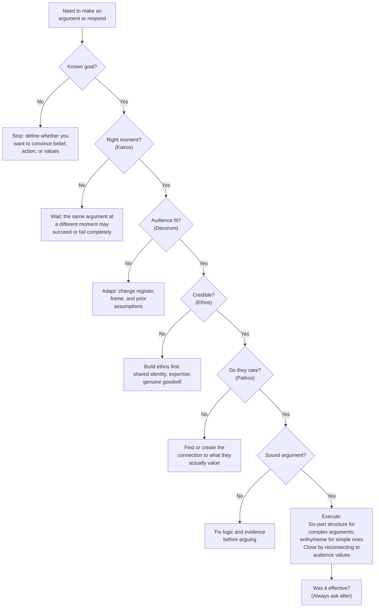

**Note**: This section builds on the rhetorical framework established in the Core Concepts document — the three modes (ethos/pathos/logos), the five canons, the six-part oration, kairos, and decorum — and does not re-explain them.

## Rhetorical Tradition vs. Behavioral Science: Two Lenses on the Same Phenomenon

Heinrichs synthesizes a 2,400-year-old classical tradition with modern practical communication needs. The two traditions describe persuasion from different angles — one prescriptive, one descriptive — and sometimes contradict. Understanding the relationship between them sharpens your use of both frameworks.

### Where They Strongly Align

| Rhetorical Concept | Classical Source | Behavioral Parallel |
|---|---|---|
| Ethos (credibility) | Aristotle, *Rhetoric* I.2 | Cialdini's Authority and Liking principles; social *halo effect* |
| Pathos (audience emotion) | Aristotle, *Rhetoric* II | Affect heuristic (Kahneman); System 1 |
| Kairos (the opportune moment) | Isocrates, Cicero | Framing and priming research (Tversky & Kahneman) |
| Attitude-behavior hierarchy | Aristotle's three genres | Ajzen's Theory of Planned Behavior; attitude-behavior consistency |
| Fallacy detection | Aristotle's *Sophistical Refutations* | Cognitive bias literature; motivated reasoning |
| Humor builds affiliation | Aristotle, *Rhetoric* II.12 | Laughter research; affiliation and trust |

Behavioral science confirms the structural claim at the heart of rhetoric: audiences make credibility assessments before they evaluate arguments, so low trust overloads even the most logical case (the backfire effect is a modern confirmation of ethos primacy).

### Where They Diverge

**Normative vs. descriptive orientation.** The classical tradition tells you *how you should* argue. Behavioral science tells you *how people actually* decide — often against their own stated interests. Heinrichs occupies the classical position: rhetoric is an art with an internal ethics, not merely a science of automatic influence.

**The ethical ground of persuasion.** For Aristotle, rhetoric is a *techne* — an art with a civic purpose. Bad rhetoric is not manipulation; it is rhetoric done badly. Behavioral science is mostly agnostic; Cialdini adds defense chapters but his primary focus is mechanistic. Heinrichs leans toward the classical view: rhetoric is civic, and the art includes its own ethics (decorum, saving face, letting opponents keep dignity).

**Assumptions about shared ground.** Classical rhetoric presumed an educated audience sharing a civic and literary vocabulary: the rhetorician and the audience read the same books, understood the same genres, and inhabited the same political community. Modern audiences are heterogeneous across class, education, culture, and ideology — and increasingly do not share a common factual or value base. Heinrichs implicitly works around this by teaching the framework first but never fully addresses the structural problem of no shared ground.

## The Strength and Limits of the Classical Framework

### What Makes the Classical System Durable

The five canons and three modes survive because they are a **complete process model with redundant failure-detection**:

- **Invention**: before you speak — what are your arguments, evidence, analogies?
- **Arrangement**: how to structure for maximum effect
- **Style**: make the content receiveable
- **Memory**: internalize so you can be present, not reciting
- **Delivery**: perform with presence so ethos and pathos transmit, not just stated

A brilliant argument (invention) poorly arranged, in the wrong register (style), from a speaker without credibility (ethos), to an unmoved audience (pathos) — prevents persuasion regardless of logical merits. Redundancy is resilience.

### Where the Framework Struggles

**The ethos ceiling in polarized environments**: A framework that depends on credibility as the foundation is fragile when audiences cannot grant ethos across ideological lines. In deeply divided societies, auto-hetero opposition (the other side is assumed to be operating in bad faith) means ethos-building has a structural ceiling — even the best-crafted rhetorical appeal may be rejected before it is heard. Heinrichs addresses this with the "shared premise" strategy but never fully engages the bound.

**The digital transformation**: The 3rd edition (2013) addresses email and social media but cannot anticipate algorithmic feeds, short-form video argument, AI-augmented messages, and attention-economy design. Digital environments systematically undermine kairos (the algorithm decides when you are seen), compress pathos to attention-triggers (measured in seconds), and erode ethos because credibility cues are noisy and fabricated. The framework's tools still work, but the playing field has changed substantially.

**The egalitarian gap**: Classical rhetoric was a democratic art in principle (taught to all free citizens in Athens) but stratified in practice (only male, landowning citizens). The modern version faces the same: rhetorical training requires education, which requires resources, and rhetorical expertise can defend unjust systems as skillfully as just ones. Heinrichs gestures at this with the "rhetoric is a skill anyone can learn" observation but does not address structural barriers to accessing that learning in the first place.

**Cultural transfer**: The framework is deeply rooted in Greco-Roman, Anglo-American, and educated-class communication norms. Some of its assumptions — the value of direct confrontation, the individual as the unit of ethos, the primacy of logical dispute — do not map identically onto cultures where argument is embedded in communal process (many East Asian, African, and Indigenous traditions). The underlying mechanisms (credibility, timing, emotion resonance) appear to be universal; the specific protocols and registers are not.

## Critical Reception and Review Summary

### Strengths Recognized by Reviewers

- **"The most accessible modern introduction to classical rhetoric"** — Harvard Communication Program course guide (2008)
- **Narrative skill**: He writes stories rather than defining terms; Aristotle and Cicero feel like characters, not textbook entries
- **Practicality**: Almost every chapter ends with numbered takeaways; the appendix of logical fallacies is frequently assigned as standalone reading in high school media literacy curricula
- **The "arguing with a teenager" chapter** receives disproportionate praise from parents — often the only section they fully absorb on first read
- **Bestseller status**: New York Times, over 200,000 copies in North America; used in university courses, law school negotiation programs, and corporate leadership training

### Criticisms from Scholars and Practitioners

**Cicero over Aristotle**: Classicists note Heinrichs builds primarily from Cicero (a Roman popularizer and politician) rather than Aristotle (a philosopher more skeptical about rhetoric's capacity to reach truth). The result is a warmer, more optimistic version of the tradition. Aristotle's *Rhetoric* is more cautious about demagoguery and more philosophical about rhetoric's limits — qualities suppressed in Heinrichs's version.

**Parenting methodology and adolescence****: Developmental psychologists have noted that the teenager chapter applies deliberative-rhetoric norms to a stage of brain development (prefrontal cortex regulation of emotion) where those norms are neurologically difficult. The advice is philosophically sound but requires a parent capable of adult-level emotional regulation, which is exactly what parent-teen conflict tends to erode.

**The political examples convey a center-left perspective**: Conservative readers have noted that redefinition — a technique Heinrichs treats as a tactical tool — is deployed across the political spectrum. His occasional dismissiveness of "simplistic" conservative framing subtly violates his own decorum principles.

**The three-year-old**digital update is showing age**: The 2013 edition's examples (Facebook arguments, Twitter threads, YouTube comment disputes) reflect a communication ecology that TikTok, algorithmic feeds, and AI-generated messaging have substantially changed. The framework itself remains valid; the embedded examples are aging fast as a structural feature of print updates.

**No engagement with power asymmetry**: Radical rhetorical critics have observed that Heinrichs's core argument — *rhetoric is a skill anyone can learn, and skill outranks structural advantage* — does not address whether a rhetorically skilled person from a structurally marginalized group can deploy these techniques with equal effectiveness against institutional power. Classical rhetoric was democratic only for a narrow class of citizens; the modern version inherits that access problem.

**Redefinition vs. spin is left underdetermined**: The ethical boundary between reframing a genuinely ambiguous frame and misrepresenting the underlying facts is genuinely contested in polarized contexts. Heinrichs implies a standard (the new frame must make more sense of the same facts) but doesn't settle it. In practice, both sides in every political argument claim to be the ones redefining honestly.

## Is the Six-Part Oration Still Valid?

The classical oration was designed for speeches of an hour or more in the assembly or the law court. Does it survive in shorter contexts?

| Modern Context | Six-Part Mapping | Primary Tension |
|---|---|---|
| 90-second elevator pitch | Exordium + Reason + Peroration | Extreme ethos compression; credibility must signal in seconds |
| 10-minute business presentation | Exordium + Narratio + Confirmatio + Peroratio | Audience attention drops at ~7 min; keep confirmatio tight |
| Email argument | Exordium (greeting + credibility) + Reason + Evidence + Peroration | Readers skip narratio; get to decision points fast |
| Family conversation | Fluid multi-turn; narratio and confutatio interweave | Relationship ethics override structure; decorum is personal, not formal |
| Social media thread | Peroratio-driven (opening and closing matter most) | Audience enters mid-thread; kairos is algorithm-determined |
| Formal negotiation | All six parts across multi-session process | Ethos is established over hours, not minutes |

The six-part structure encodes meta-principles (establish credibility, provide context, present evidence, address the counter, close powerfully) that transfer regardless of length. What changes is the ratio of time allocated to each step.

## The Hierarchy Ethos → Pathos → Logos: Empirical Assessment

Heinrichs's most counterintuitive claim — that logos is the weakest mode of persuasion — has held up well in subsequent behavioral science research, with one important refinement.

**Confirmed**: When audiences distrust the speaker, logical argument produces resistance, not persuasion (Lord, Ross, & Lepper, 1979; the backfire effect).
**Confirmed**: When audiences have no emotional stake in the conclusion, logic produces apathy, not action.
**Conditional**: Pathos can override logos even when the logical argument is correct — in crisis situations, in high-arousal states, and when the argument threatens identity.
**Challenge**: The enthymeme (audience fills in the missing premise) requires an educated audience that shares premise-grounding. In digital and diverse contexts, the enthymeme can backfire because different audiences fill in different missing premises — producing interpretations the arguer did not intend.

The hierarchy works best when the audience shares a cultural and educational framework with the speaker. It works less well with culturally heterogeneous audiences where shared premises are not assumed.

## The Practical Checklist: Applying the Framework to Any Argument

## Concession and Knowing When to Stop: Heinrichs's Most Original Contribution

Heinrichs's chapter on knowing when to stop is also his most defensible against the charge of manipulation: a framework that teaches you to walk away gracefully — to preserve relationships, to concede strategically, to recognize when rhetorical victory will cost more than it gains — is harder to abuse than a framework that simply teaches you to win.

The counter-argument tools Heinrichs provides:
- **The concession**: acknowledging a legitimate counter-argument validates your opponent's ethos while demonstrating yours
- **The graceful exit**: "Let's continue this later — I want to think about what you just said" preserves the relationship while creating space
- **The reframing exit**: introducing a new frame transforms a losing argument into a different kind of conversation — without conceding the substance
- **The seat-saver**: highlighting what your opponent got right before disagreeing with where they go wrong

These are not manipulative — they are relationship-preserving. They happen to be effective tactics, but their effectiveness derives from authenticity; fake concessions are detected quickly and destroy credibility.

## Summary: Where This Book Works and Where It Doesn't

| Context | Framework Effectiveness |
|---|---|
| Face-to-face negotiation | Very high — kairos, decorum, and ethos are fully available in shared presence |
| Educational and pedagogical settings | Very high — builds skill in audiences with shared educational framework |
| Legal and forensic argument | High — closely maps onto existing adversarial argument traditions |
| Political persuasion (symmetric audiences) | Moderate — works when there is some shared premise ground; fails in deep polarization |
| Digital argument (social media, email) | Moderate — tools work but the environment compresses kairos, distorts ethos cues, rewards extremity over precision |
| Cross-cultural high-power-distance contexts | Variable — ethos, pathos, and decorum mechanisms translate; specific registers and genres need localization |
| Argument from structurally marginalized position | Mixed — the skill is genuinely useful, but structural power limits how far it can overcome; the book underestimates this bound |

## Final Assessment

Thank You for Arguing recovers a living tradition. What makes it more than nostalgia is Heinrichs's insistence that rhetoric is a *practical art* — you can get better at it, and getting better at it makes you more capable in work, family, civic, and political life. The framework has genuine longevity because it encodes meta-principles, not just tactics: fit, timing, credibility, audience.

The book's limitations — its Cicero-heaviness, its American political frame, its aging digital examples, its under-engagement with power and access — are real but mostly endemic to the genre of practical popularization rather than failures of the author. The classical tradition from which Heinrichs borrows is more philosophically cautious, more politically aware, and more skeptical about rhetoric's power than Heinrichs's warm version. Readers who want that complexity should proceed to the primary texts: Aristotle's *Rhetoric*, Cicero's *De Oratore*, Quintilian's *Institutio Oratoria*.

For the general reader who argues daily and wants to argue better, Heinrichs's book remains the best starting point in the English language.
