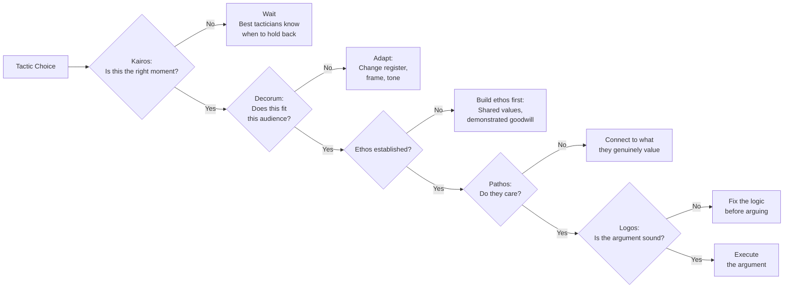
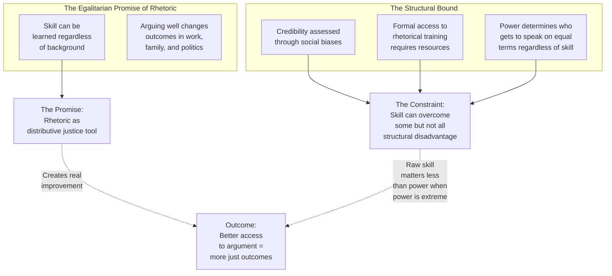

**[Host]**: Welcome to The Deep Read. I'm your host. Today's book is Jay Heinrichs's *Thank You for Arguing* — a bestselling guide to the lost art of rhetoric. To discuss it, I have three guests whose lives depend on arguing well. Linda Warren is a labor mediator who has facilitated over 200 high-stakes contract disputes. Shawn Carter is a high school debate coach whose students have won national championships. And Dr. Priya Mehta is a professor of communication who studies political polarization. Welcome to all three.

**[Shawn]**: Happy to be here. My debaters read Heinrichs in their junior year. It's the book that turns people who think arguing means yelling into people who think arguing means winning.

**[Linda]**: I've been doing exactly what Heinrichs outlines without knowing the terminology for thirty years. The book gave me names for things I already practiced. The exordium in a mediation — that first ten minutes where you establish common ground — that's kairos in action.

**[Priya]**: And I have complicated feelings. I study how Americans argue on social media, and there's a gap between the art Heinrichs describes and the reality of online argument. I'll be honest about that tension.

**[Host]**: Let's start where the book starts: the idea that argument is not about fighting, it's about persuasion. Linda, does that match your experience?

**[Linda]**: Completely. I walk into a room where both sides have been angry for months, sometimes years. New negotiators walk in and immediately present their demands. The other side hasn't granted them ethos yet. You need to establish common ground first — say something they agree with — before you ever get to the ask. That's Heinrichs's exordium in a mediation room.

**[Shawn]**: My debaters have the opposite problem. They're brilliant at spotting logical fallacies — ad hominem, false dichotomy, slippery slope — they can name them in their sleep. But they can't build ethos to save their lives. They think ethos is your credentials. It's not. Ethos is the trust you build with the judge in the ninety seconds before your speech starts.

**[Priya]**: That tension is exactly what I study. The classical rhetorician assumes an audience that wants to agree when the argument is good enough. Online, we have an audience that treats argument as identity reinforcement. If you attack their position, they feel attacked as a person. Rhetoric requires a relationship. When that relationship is absent — on social media, in polarized environments — ethos-building becomes almost impossible.



**[Host]**: Let's talk about the most controversial claim in the book: that logos is the weakest of the three modes.

**[Shawn]**: In debate, that's almost true. We score on argument, and a debater who wins on logic can lose because the judge didn't trust them. The first question is always: do I believe this person? After that, the logic matters. And even then, a debater who makes the judge *feel* something — who connects the argument to something the judge cares about — has a permanent advantage.

**[Priya]**: The exception is the internet. On Twitter and TikTok, a thread with perfect logic and no emotional hook dies. A single emotionally charged statement spreads faster than a carefully sourced argument. Pathos overwhelms logos — not just in the hierarchy Heinrichs describes but as a *competence requirement*. If you have no emotional valence, you have no reach.

**[Host]**: And ethos in digital contexts?

**[Priya**: Ethos gets compressed to a signal: is this person on my side or the other side? In deeply divided contexts, the question isn't whether the argument is good; it's whether the person making it is *us* or *them*. Heinrichs's entire framework is designed for a world where that question — *us* vs. *them* — can be answered through rhetorical work. In a world where the answer is already decided, the framework hits a wall.

**[Linda]**: I see that in negotiations. When trust has broken down completely — after a long strike, a broken contract — ethos-building has to start from near zero. It takes time, and it takes one authentic gesture that signals willingness. It's the kind of thing that doesn't translate to Twitter.

**[Host]**: Let's talk about the chapter that generates the most reader response: arguing with a teenager.

**[Shawn]**: My debaters are teenagers. The chapter works because Heinrichs gets the central insight: a teenager's resistance isn't about the topic — it's about autonomy. Arguments about curfew or homework become arguments about control. His advice: separate the issue from the relationship, give them rhetorical room, never threaten you won't follow through on. That's sound.

**[Linda]**: I've used those same principles with adults in mediation. The dynamics are not so different: the person who feels controlled is the person who resists most. The negotiator who comes in as an equal, as someone with whom they can have a real exchange, gets a fundamentally different response than the one who comes in as an authority telling them what to do.

**[Host]**: Priya, you've raised a structural critique: rhetoric is a skill, and skills are unequally distributed.



**[Priya]**: Yes, and let me be direct. Heinrichs frames rhetoric as a universal skill with a democratic promise. That promise is real. A young person who learns to argue well enters the world with more power than their untrained peers. That redistribution of argumentative power matters. But the book doesn't grapple with what happens when the person on the other side of the argument has structural power — real institutional authority — that rhetoric alone cannot overcome. A citizen who gives a perfectly structured argument to a city council that has already decided is still arguing against a closed door. Rhetoric doesn't replace collective power; it amplifies it.

**[Shawn]**: That's true. But the debaters I teach are mostly from working-class backgrounds. They would not otherwise have access to the vocabulary and tools that connect them to power. Learning to argue — to build ethos, to use kairos, to spot a fallacy — connects them to a world that otherwise wouldn't listen to them. Rhetoric isn't the whole answer. It's one answer. And it matters.

**[Host]**: Let's talk about the chapter that fascinated me most: knowing when to stop arguing.

**[Linda]**: That's the wisdom chapter. After thirty years of mediation, I can tell you: the people who win most are not the best arguers. They're the ones who know when to stop. They concede gracefully. They let the other side save face. They walk away from losing battles to preserve a relationship they need for a larger goal. That's not weakness. That's strategy.

**[Shawn]**: In competitive debate, the best debaters know when they're beaten. The amateurs double down. The professionals say "thank you" and learn from it — because the round ends, but the relationship with the judge carries to the next tournament.

```mermaid
flowchart TD
    ARG["Argument in Progress"] --> Q1{"Can I achieve<br>my actual goal<br>in this conversation?"}
    Q1 -->|No| EXIT1[Exit gracefully:<br>"Let's revisit this<br>I want to think<br>about what you said"]
    Q1 -->|Yes| Q2{"Is the moment<br>right? (Kairos)"}
    Q2 -->|No| EXIT2[Wait:<br>Find a better moment]
    Q2 -->|Yes| Q3{"Will this build<br>or damage the<br>relationship?"}
    Q3 -->|Damaging| EXIT3[Concede or reframe:<br>relationship > rhetorical victory]
    Q3 -->|Constructive| PROCEED[Proceed with<br>ethos-pathos-logos<br>in that order]
```

**[Host]**: Heinrichs says the best defense against others' arguments is recognizing when a trigger is being used against you — the unsolicited gift creating obligation, the false scarcity, the appeal to an irrelevant authority. Shawn, do your debaters enter tournaments with those defenses active?

**[Shawn]**: Absolutely. The first thing we train is spotting when the opponent is building ethos they haven't earned, or citing an authority who isn't actually authoritative on the topic. My students learn to ask: *is their argument doing the work, or is the audience just feeling something about the person making it?* That's Heinrichs's diagnostic framework. Once they can answer that question honestly about the other side, they can answer it about themselves.

**[Priya]**: The asymmetry Heinrichs doesn't fully address is that the people most vulnerable to these triggers are the people least likely to know them exist. A new voter who doesn't know what "false social proof" feels like can be manipulated by a manufactured "polling" statistic without ever knowing they were manipulated. The educational fix Heinrichs implies — *read my book and you'll be inoculated* — works for people who already read books like this. It doesn't reach the people who need it most.

**[Host]**: So what is the real defense?

**[Priya**: Structural. Regulate manufactured social proof in ads. Require disclosure of paid endorsements. Build media literacy into K-12. Create friction for manipulative tactics so that they cost the practitioner something. Cialdini says awareness is not immunity. Heinrichs says it's the best we have. The truth is somewhere in between. Awareness helps, but it's not enough.

**Practical Defense Summary**:

| Principle | Common Trigger | Heinrichs's Defense Question |
|---|---|---|
| Reciprocity | Unsolicited gift or favor | "Is this obligation one I asked for?" |
| Scarcity | "Limited time only" / "Only X left" | "Is this scarcity real, or is it manufactured?" |
| Authority | Credentials used as proof | "Is this person authoritative on *this specific topic*?" |
| Consistency | Starting with a tiny request | "Would I say yes to this if I hadn't already committed to something else?" |
| Liking | Compliments or similarity signaled | "Am I being moved by the person or by what they're offering?" |
| Social Proof | "Everyone is doing it" | "Are these people actually like me, and relevant to my situation?" |
| Unity | "We" language from a stranger | "Are we actually in the same group, or is this manufactured belonging?" |

---

## The Debate: Is Rhetoric Democratic?

**[Host]**: The classical origin story is democratic: rhetoric was taught to all Athenian citizens to enable persuasion in the assembly. Heinrichs is reviving that tradition. But Priya has asked whether it's equally accessible today.

**[Priya**: The classical promise is real: anyone can learn these skills regardless of background. That's theoretically egalitarian. But the practice isn't. Rhetorical training requires education, which requires resources. And the skill, once acquired, can defend unjust systems as easily as just ones. The ancient Athenians who taught rhetoric were free male citizens — not women, not slaves, not foreigners. That origin story matters for how we think about its modern form.

**[Shawn]**: My debaters are from working-class families. They don't have rhetorical vocabulary at home; they have street smarts and the ability to fight. I teach them to fight smarter. And they win — against private-school students, on an equal stage, with the same rules. The skill transfers even when the starting conditions don't.

**[Linda]**: In my mediations, the workers who learn to articulate their needs, build credibility, and present calm evidence get better outcomes. Rhetoric redistributes argumentative power — imperfectly, unevenly, but it does. The alternative is not perfect rhetoric; it's whoever has structural power winning by default.

**[Priya**: All three of those examples are true — and none of them contradicts my point. Rhetoric helps. But it helps within the bounds that structural power allows. The question isn't whether rhetoric is useful. It is. It's whether rhetoric, as Heinrichs presents it, can be a *substitute* for structural change. It can't. It's a complement to it.

**[Host]**: That's the clearest distinction I've heard this hour. Republic, and that's a meaningful acknowledgment from someone who has been deeply pessimistic about the state of public argument.

**[Priya**: I'm pragmatic. The world won't get less polarized through rhetorical skill alone. But it might get better designed. And if more people understood how arguments work — as syllogisms with missing premises, as timing gambits, as credibility plays — we might at least get past the worst of the dysfunction.

**[Shawn]**: My debaters go into the world understanding that an argument has a structure. That structure can be examined, questioned, rebuilt. That's a kind of intellectual pluralism — you don't have to win every point, but you do have to engage the structure. That's a skill that lowers the temperature of argument. Not because everyone agrees. But because the argument is about something, not just about you versus them.

**[Linda]**: And the teenagers listening: this is the book where your parent might finally understand that you're not being difficult. You're being a rhetorician. You're testing the premises, finding the counter, looking for the angle that works. That's not rebellion. That's argument. And argument is how democracy starts.

***

*Thank You for Arguing* by Jay Heinrichs. Three editions. A tradition being revived one well-structured argument at a time.

Let's argue better.
