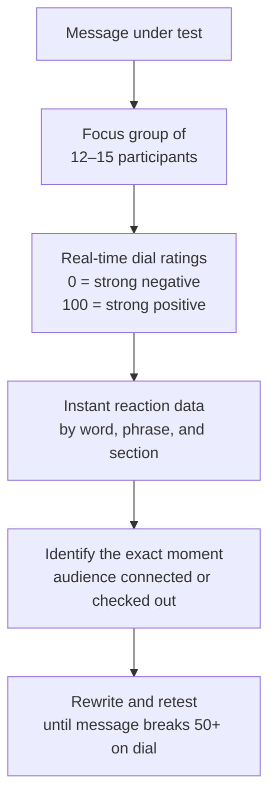
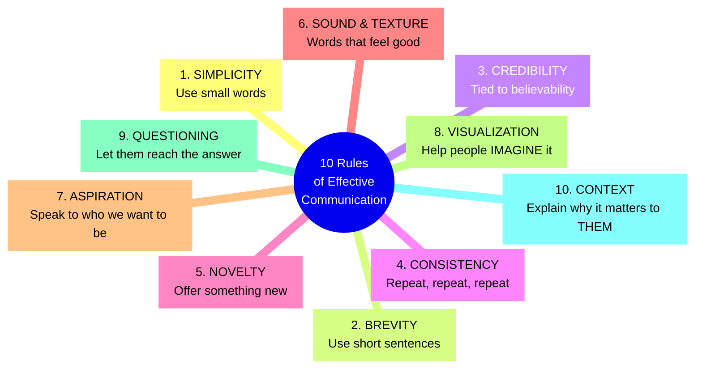
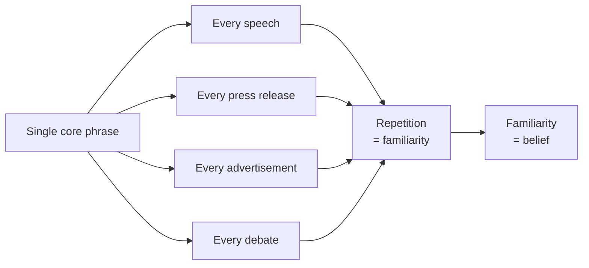
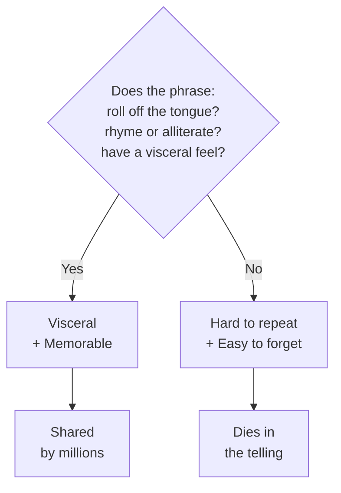
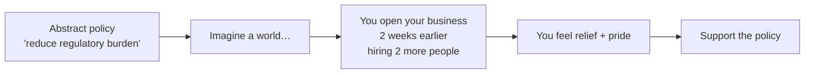

## The Luntz Dial Session Methodology

Luntz's signature technique: participants hold a dial that ranges from 0
("strongly disagree / dislike") to 100 ("strongly agree / love"). They
turn the dial continuously while listening. The result is a second-by-second
map of exactly where each sentence succeeded or failed.

---

## The 10 Rules of Effective Communication

---

## Rule 1: Simplicity

Small words travel farther and faster. "Break through" beats "penetrate."
"Change" beats "fundamental realignment." The simpler the word, the more
universally understood it is. Complexity signals distance — simplicity
signals familiarity.

---

## Rule 2: Brevity

A sentence is better than a paragraph. Eight seconds of speaking time is
the threshold for holding attention. Every extra word dilutes your message.
The masters of brevity: Martin Luther King Jr. ("I have a dream"), JFK
("Ask not"), Reagan ("Mr. Gorbachev, tear down this wall").

---

## Rule 3: Credibility

Credibility outweighs philosophy. An audience will forgive a message that
challenges their values if the messenger feels trustworthy. Conversely, a
credibility gap — when words and actions diverge — destroys messages
regardless of their content. Credibility is built over time; broken in an
instant.

---

## Rule 4: Consistency

Repeat the same phrase across every channel, every speech, every
appearance. Consistency turns a phrase into a brand. "Read my lips: no
new taxes" worked because George H.W. Bush said it consistently — until
he broke it. The moment of inconsistency becomes a defining story.

---

## Rule 5: Novelty

Humans are hardwired to notice what is new. "Read my lips: no new taxes"
was novel for 1988. "Yes We Can" was novel for 2008. Novelty does not mean
changing your message — it means packaging it in a fresh, memorable
construction. Without novelty, even the best message blends into the noise.

---

## Rule 6: Sound and Texture

Words are auditory before they are intellectual. "Peace" sounds peaceful.
"Freedom" sounds liberating. "Death tax" sounds visceral in a way "estate
tax" does not. Alliteration, rhythm, and syllable weight are not trivia —
they shape whether a phrase lives in the listener's brain or disappears.

---

## Rule 7: Aspiration

Audiences forget what you say, but not how you made them feel. Speak to
the identity people want — "renewable energy" frames the listener as
forward-looking; "alternative energy" sounds like a compromise imposed on
them. Aspiration is not about selling dreams. It is about aligning your
message with the audience's self-image.

---

## Rule 8: Visualization

The word "imagine" is Luntz's single most powerful tool. "Imagine a
world…" forces the listener to construct the vision in their own mind.
Visualization converts abstraction into personal experience. "Imagine if
your tax refund went up by $2,000" beats "tax policy reform reduces
burden by 12%" every time.

---

## Rule 9: Questioning

Asking is more powerful than telling. "What if?" questions let the
listener arrive at the conclusion themselves. People are far more
committed to conclusions they reach on their own than ones handed to
them. Leading questions shift the entire conversation without making it
feel like persuasion.

---

## Rule 10: Context

A message without context is noise. "Energy independence" works because
it provides context: you care about this because it means national
security and cheaper gas for your family. "Environmental sustainability"
fails as a standalone appeal because it signals giving things up. Context
is the answer to the listener's most important question: "Why does this
matter to *me*?"

---

## The Language of Reframing

Luntz's most famous reframings:

| Original Phrase | Problem | Reframe | Why It Works |
|-----------------|---------|---------|--------------|
| Estate tax | Sounds like taxing the wealthy | Death tax | Connects to personal loss |
| Energy conservation | Sounds like sacrifice | Energy independence | Signals strength |
| Legalizing undocumented immigrants | Sounds permissive | Pathway to citizenship | Sounds earned and fair |
| Universal health care | Sounds like government takeover | Affordable health care | Removes fear |
| Carbon offsets | Sounds bureaucratic | Carbon neutral | Sounds cleaner and aspirational |
| War on terror | Gloats and alienates | Struggle against violent extremism | Broadens coalition |

---

## The Danger of Insider Language

Jargon is honest to insiders and alienating to outsiders. "We're
optimizing our operational synergies" communicates nothing to the listener
and signals arrogance. Luntz recommends asking: "Would my mother
understand this?" If not, rewrite.

| Jargon | Plain English | Effect |
|--------|---------------|--------|
| Incentivize | Encourage | More accessible |
| Leverage | Use | Eliminates confusion |
| Paradigm shift | Big change | Honest about scale |
| Dialogue | Conversation | Direct and personal |
| Disambiguate | Clarify | Tells the listener what you'll do |

---

## What Feels Right Is Often Wrong

One of Luntz's most important lessons: your gut instinct about what
sounds good is almost certainly wrong for an audience that is not you.
Every politician, CEO, and writer has a favorite phrase. Test it — and
expect to be surprised. Words that feel clever to the speaker often feel
cold, abstract, or arrogant to the listener.
