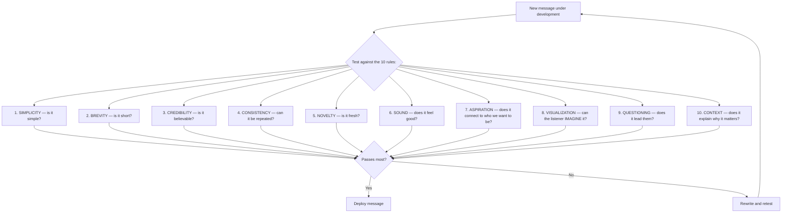

## Introduction

Welcome to BookAtlas. Today: *Words That Work: It's Not What You Say, It's What People Hear* by Frank Luntz. Published 2007. The book that exposed how language — not logic — drives public opinion, political campaigns, and corporate messaging.

Frank Luntz is a Republican pollster and strategist who tested thousands of
phrases on real Americans using dial sessions — focus groups where
participants rate messages in real time. The results upended everything
the political class thought it knew about persuasion.

**Coach:** The central claim of this book is deceptively simple: it does
not matter what you say. What matters is what people *hear*. You could
have the most logically sound argument in the world. If the words are
wrong, the message is lost.

**Skeptic:** That sounds like spin. "It's not what you say" — isn't that
an excuse for dishonesty?

**Coach:** Not exactly. Luntz isn't advocating lying. He is arguing that
even honest intentions fail when wrapped in wrong language. The phrase
"estate tax" sounds like a tax on the wealthy — fair game. "Death tax"
makes a listener think of a tax on grieving families. The *policy is
identical*. The reception is not.

---

## The 10 Rules

**Coach:** In a full political campaign, a message that scores an average
of 50–60 on the dial is mediocre. A message that hits 70+ is a hit.
Below 40? It is dead on arrival.

**Skeptic:** So the dial is the whole story?

**Coach:** No. The dial tells you *where* people react, not *why*. The
follow-up conversations in the room give you the why. "I hate that word"
is more important than the dial score. The idiolect of real human beings
is the real data. Statistics are just the map; voices are the territory.

---

## The Reframing Game

**Skeptic:** Let me challenge you. If you can turn "estate tax" into
"death tax" just by renaming it, shouldn't that encourage politicians to
avoid honest debate?

**Coach:** It should encourage *listeners* to look harder. Luntz is
describing the battlefield as it is, not as it should be. Knowing that
deaths are taxed — not just rich people's estates — actually does change
how people think about the policy. That is not manipulation. That is
making a hidden cost visible. Whether you think the tax is good or bad is
a separate question.

**Skeptic:** And "energy independence" for what used to be "drilling
rights"?

**Coach:** Same mechanic. "Drilling" sounds greedy. "Independence" sounds
patriotic. Same policy action, different emotional meaning. You can decide
whether the emotional meaning *should* override the policy content — but
you cannot pretend the emotional meaning does not exist. It always does.

---

## Simplicity, Brevity, Credibility

**Coach:** Three rules that absolutely apply beyond politics. In a world
of infinite noise, simple messages win. "Just do it." "Think different."
"Make America Great Again." These phrases are effective because they
are short, declarative, and repeatable. They pass all three tests.

**Skeptic:** "Make America Great Again" is six words and two syllables
on the first word. That is simplicity. Brevity. Repetition. Credibility?
Well — to some people, yes. To others, never.

**Coach:** Exactly. Credibility is context-dependent. A phrase can pass
brevity and simplicity and still fail if the messenger lacks credibility
with that audience. Luntz understood this. He tested Obama's "Hope" in
2008 and "Change We Can Believe In" — they tested well because Obama
passes the credibility test with the voters he needed.

---

## Questioning: The Most Underrated Rule

**Coach:** Rule 9 — questioning — is the one most communicators ignore.
"Make your case" is the instinct. But the best communicators *ask* the
audience to reach the conclusion. "What if we could…" "Imagine a world
in which…" "Can you afford to…"

**Skeptic:** Those feel manipulative.

**Coach:** They are manipulative in the sense that *all* effective
communication shapes what the listener does. But there is a difference
between forcing a conclusion and inviting one. Forcing a conclusion is:
"We must do X." Inviting a conclusion is: "What would you do if X?" The
former creates resistance. The latter creates ownership.

---

## The Verdict

**Coach:** *Words That Work* is one of the most practically useful
communication books I have encountered. The rules are specific, memorable,
and supported by decades of real audience data. Any writer, marketer,
politician, or leader who sends a message to a group of people will be
better at their craft after reading it.

**Skeptic:** And the flaws?

**Coach:** The flaws are real. Luntz is a partisan who never fully
examines the ethics of his craft. His examples are dated. His explanations
are light on why these rules work at a cognitive level — he shows you
*what* works rather than *why*. And his success record is overstated; his
candidates and campaigns have also lost.

**Skeptic:** Given that, what is the honest rating?

**Coach:** Seven out of ten. The value is in the methodology — test your
language with real people, then rewrite. That single habit, adopted,
worths the price of the book alone.

**Skeptic:** Just promise me you won't use the rules to rebrand something
terrible as something good.

**Coach:** That promise depends on you, not on me. The tools are neutral.
Intent is not. Choose well.

---

## Final Thoughts

Luntz's greatest contribution is this: language is not surface decoration.
It is the architecture of influence. Every abstraction, every jargon
sentence, every corporate polysyllable is a brick in the wall between you
and your audience. The 10 Rules give you a chisel. Use it well.

This has been a BookAtlas narration of *Words That Work* by Frank Luntz.
Thanks for listening.
