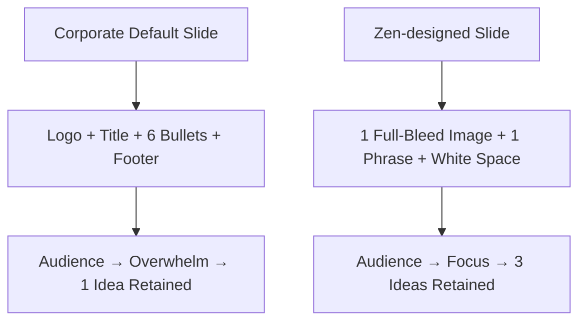
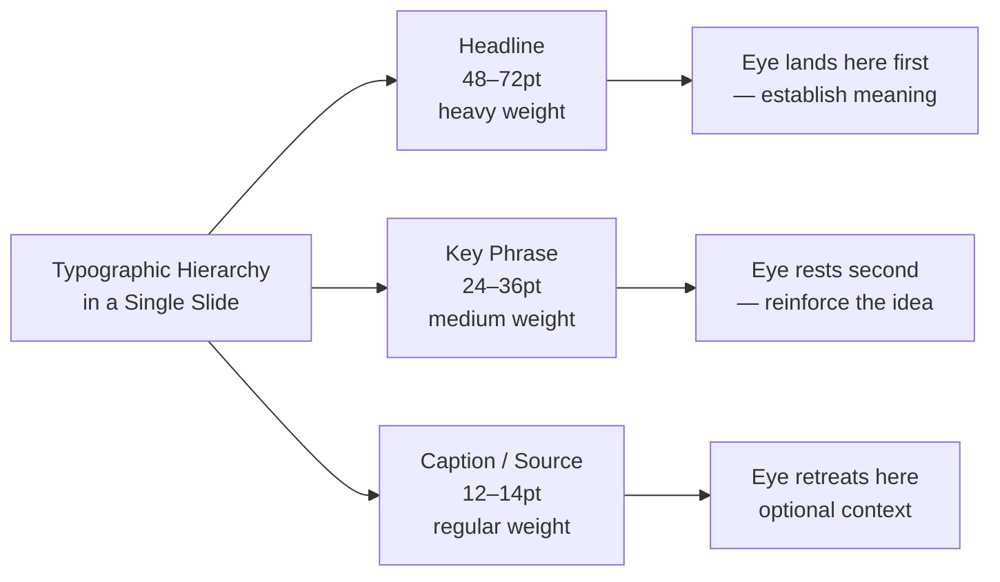
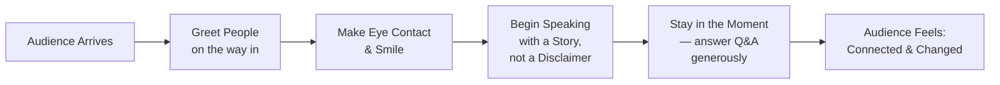

## Introduction: Beyond the Bullet Point

Garr Reynolds opens *Presentation Zen* with a diagnosis that most
readers will recognize instantly: the vast majority of presentations—
corporate decks, academic talks, TED-style keynotes—are built on a
fundamentally broken philosophy. PowerPoint defaults, bullet lists, and
template-driven layouts have trained millions of communicators to think
of presentations as information delivery mechanisms. Reynolds, a
designer and consultant based in Japan, argues that this
convention-bound mindset produces audiences who are bored, distracted,
and ultimately unmoved.

The alternative he proposes is not better slides—it is better thinking.
Slides are not a teleprompter, not a handout, and not a document to be
read silently. They are a visual canvas that supports the presenter's
message. The audience should *feel* something, grasp it at a deeper
level, and be changed in some way. That is the threshold for a
successful presentation.

---

## Part One: Preparing the Presentation

### The Zen Approach

Reynolds grounds his design philosophy in **Zen Buddhist aesthetics**,
particularly the Japanese concept of **`ma` (間)**—the intentional use
of empty space as a meaningful and active design element. In Zen art,
what you leave out gives shape to what you leave in. A slide with one
powerful image resting on a clean white field communicates more than a
slide crowded with logos, bullets, and data tables.

### Analog, Non-Linear Preparation

This section distinguishes **thinking** from **formatting**. Reynolds
insists that the most important design work happens away from the
computer. He advocates for:

- **Hand-drawn storyboards** — sketch the entire presentation as a
  panel-by-panel narrative before ever opening slide software
- **Walking and thinking** — movement activates creative cognition
- **Journaling and reading** — deeply researching the audience's
  worldview before framing your message
- **Whiteboard sessions** — collaborative or solo, physical surfaces
  support spatial thinking

The computer is the tool for *execution*. Thinking is the tool for
*design*. Reach for the computer last, not first.

### The Rule of Three

A key cognitive-science insight Reynolds applies is the **Rule of
Three**: research on working memory and information retention shows that
audiences reliably retain approximately three core ideas from any
presentation. Design your message to fit that constraint. The Rule of
Three is not simplification for its own sake; it is respect for how
human memory works.

---

## Part Two: Designing the Presentation

### Simplicity and White Space

Reynolds treats white space (`ma`) as an active design decision, not
wasted area. White space:

- Gives the eye room to rest
- Gives the mind room to process
- Signals importance through contrast
- Creates the atmosphere of attention

A slide crowded with text does not communicate more—it communicates
less, because nothing stands out. Crop images tightly. Limit text to a
handful of words. Let typography breathe.

### Typography as Design

Font choice is not a preference; it is an argument. Reynolds argues for
**type as image**: one or two typefaces, used deliberately with size
hierarchy to communicate importance rather than resorting to bullets.
Typography is the voice of the slide—choose it with the same care you
would choose your own words.

### The Death of Bullet Points

Reynolds does not claim that bullets are inherently evil, but he argues
they are almost always misused. Bulleted lists fragment a presenter's
message into discrete, digestible-but-unmemorable fragments. They turn
the presenter into a reader and the audience into scribes. His
recommendation: replace bullets with **single, declarative statements**
or with images that carry the same conceptual weight as a paragraph of
text.

### Images and Emotion

Reynolds is uncompromising on image selection. A presentation's visual
element should be:

- **Full-bleed** — no letterboxing, no cropped edges
- **High-resolution** — pixelation signals disrespect
- **Emotionally or conceptually resonant** — the image must illustrate,
  evoke, or amplify the point

Stock photographs of generic business scenes are not communication—they
are decoration, and usually cheap decoration. An image that does not
carry the same conceptual weight as a sentence should be cut. Let the
white space speak.

### The Clone Zone and Template Rebellion

Corporate templates enforce homogeneity. Reynolds calls this the
**Clone Zone**: every presentation in the organization looks identical,
because the template itself was designed by committee—a process that
guarantees competence and forecloses distinction. His prescription is
discipline through constraint:

1. Choose one typeface for the entire deck
2. Choose two colors maximum
3. Choose one photographic style
4. Within that constraint, be original

---

## Part Three: Delivering the Presentation

### Nervousness as Energy

Reynolds normalizes the anxiety most presenters feel rather than
dismissing it. Physiological arousal—racing heart, sweaty palms,
shallow breathing—is not a symptom of failure; it is the body preparing
to perform. The skill is not making it go away; the skill is channeling
it.

### Practice vs. Rehearsal

He distinguishes two modes of preparation:

| Mode | Definition |
|---|---|
| **Rehearsal** | Repeating the same content in the same way; word-for-word repetition |
| **Practice** | Exploring variations, internalizing the material so deeply you can have a conversation |

Practice means standing up, speaking out loud, recording yourself, and
simulating the conditions of the real event. It means knowing the
material so well that the slides become incidental.

### Authenticity and Presence

Authenticity cannot be faked, but it can be *invited* into the room.
Reynolds recommends:

- Making eye contact with audience members before you begin
- Greeting a few people personally as you step toward the stage
- Carrying that human connection with you as you begin speaking

Audiences are remarkably skilled at detecting when a presenter is
performing versus when a presenter is **present**. The difference is
felt in the voice, the eyes, and the breath. Being genuine is not a
technique—but being genuinely interested in the audience is a choice.

---

## Conclusion: Presentation as Mindfulness

Reynolds closes by returning to the book's philosophical root. A great
presentation is not a performance; it is an act of mindfulness—a
focused, generous attention to both your message and your audience. The
tools he offers—sketching, white space, visual hierarchy,
storyboards, practice, presence—are not tricks. They are expressions of
a single disposition: **taking the communication seriously enough to
simplify it.**

Simplicity, Reynolds reminds us, is the ultimate sophistication.

---

## Key Takeaways

- Most presentations fail because of poor design and poor thinking, not poor delivery.
- The computer is the last tool you reach for; the most important work happens in analog preparation.
- White space (`ma`) is a design element, not wasted space—use it deliberately to create focus.
- Replace bullet lists with powerful images or single, declarative statements.
- The Rule of Three: design for three core ideas; the rest is noise.
- Typography is the voice of the slide; choose with the same care as your words.
- Authenticity flows from genuine interest in the audience, not from memorized technique.
- Practice standing up and speaking out loud in conditions that simulate the real event.
- The Q&A is the real presentation—treat questions as opportunities, not threats.
- Simplicity is not minimalism for aesthetics; it is clarity for communication.
