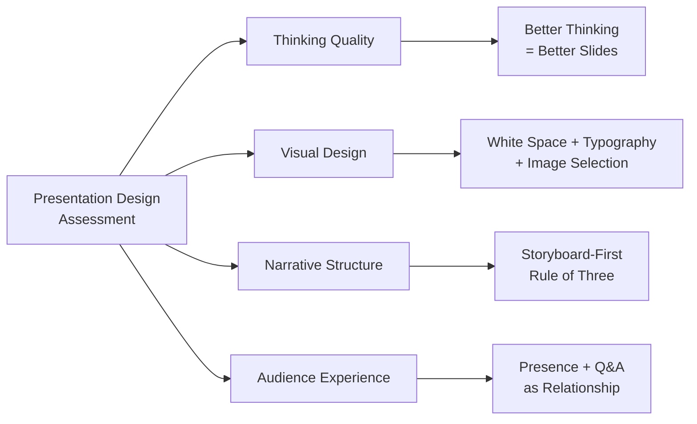

## Executive Summary

*Presentation Zen* makes a simple but sweeping argument: the default
presentation paradigm—templates, bullet lists, information dumps—is not
just aesthetically boring; it is cognitively wrong. Reynolds draws on
Zen Buddhist philosophy, Gestalt perceptual theory, and cognitive
psychology to argue that simplification, white space, visual thinking,
and analog preparation produce presentations that communicate rather
than comply. The book's most durable contribution is shifting the unit
of design from the **slide** to the **story**—and insisting that
preparation is where design actually happens.

---

## Analysis Framework

---

## Key Concepts

| Concept | Summary |
|---|---|
| **Presentation as Experience** | Slides are not handout surrogates; the presenter and slides together create a live, ephemeral event meant to be felt |
| **Simplicity as Sophistication** | Stripping away the non-essential reveals the essential; complexity is easy, clarity requires discipline |
| **The Rule of Three** | Audiences retain approximately three core ideas; design the entire message around this cognitive constraint |
| **White Space (`ma`)** | Borrowed from Japanese aesthetics; intentional emptiness creates focus, rest, and visual hierarchy |
| **Thinking Before Slides** | The most important design work happens away from the computer—through analog sketching, walking, and quiet reflection |
| **Visual Thinking** | Translating abstract concepts into images, metaphors, and spatial arrangements before they become text |
| **Storyboard-First Workflow** | Drawing the presentation as a linear sequence on paper before opening any presentation software |
| **Bullet Point Abolition** | Slides should carry one idea at full weight; bullet lists fragment the message and degrade retention |
| **Images as Emotion** | Full-bleed, high-resolution photographs that evoke feeling outperform decorative clip art and generic stock photography |
| **Typographic Hierarchy** | Font choice, size, and spacing are primary design decisions—type *is* the visual |
| **Audience as Hero** | The audience's transformation—not the presenter's knowledge display—is the measure of success |
| **Nervousness as Energy** | Physiological arousal before speaking is not a flaw to eliminate; it is fuel to be channeled |
| **Practice as Ownership** | True practice means internalizing content so deeply that you can adapt and converse |
| **Q&A as Relationship** | The question period is not a postscript—it is where trust is confirmed and the real dialogue begins |
| **The Clone Zone** | Avoiding the homogeneity of corporate templates; templates enforce mediocrity by design |
| **Analog Note-Taking** | Hand-drawn sketches and physical storyboards engage a different part of the brain than digital tools |
| **Mindfulness in Delivery** | Presence—genuine attention to the moment and the audience—outperforms any technique or trick |
| **`ma`  Respect** | White space is not laziness; it is an act of consideration for the audience's cognitive load |

---

## Chapter-Level Summary

| Section / Theme | Core Content |
|---|---|
| **Introduction: Beyond the Bullet Point** | Diagnosis of the PowerPoint culture problem; presentation as experience, not handout; why information delivery fails |
| **Part One: Preparing** | Zen philosophy applied to communication; analog preparation workflows; audience research; the Rule of Three |
| **Thinking Visually** | Translating ideas to images; sketching before slides; visual thinking as a separate cognitive skill |
| **The Art of the Storyboard** | Linear analog workflow; keeping the narrative arc visible before slide-by-slide thinking begins |
| **Part Two: Designing** | Typography; white space; image selection; bullet-point alternatives; template rejection |
| **Simplicity and the Clone Zone** | Why templates produce mediocrity; constraint as a creative force; minimalism as communication, not decoration |
| **The Power of White Space** | `ma` as a design element; how emptiness creates focus and signals importance through contrast |
| **Images and Emotion** | Selecting images that carry meaning; full-bleed photography; avoiding decorative imagery entirely |
| **Typographic Hierarchy** | Typeface selection; hierarchy through size and weight; readability as respect for the audience |
| **Part Three: Delivering** | Nervousness as energy; practice methodology; presence and authenticity; building rapport |
| **Preparation and Practice** | Distinguishing rehearsal from practice; standing practice; simulating real conditions; internalizing the material |
| **Delivery and Presence** | Authenticity as genuine interest; eye contact; the difference between performing and being present |
| **The Q&A Session** | Treating questions as gifts; listening before responding; using Q&A to deepen the relationship, not defend a position |
| **Conclusion: The Zen of Presentation** | Mindfulness, generosity, and disciplined simplicity as the foundation of great communication |

---

## Author & Publication

| Field | Value |
|---|---|
| Slug | `presentation-zen-garr-reynolds` |
| Author | Garr Reynolds |
| ISBN (1st ed, New Riders) | 9780321811981 |
| ISBN (2nd ed, New Riders 2017) | 9780134531511 |
| Publisher | New Riders (Pearson / Peachpit) |
| First Published | 2007 (1st ed); 2017 (10th Anniversary ed, updated) |
| Approx. Page Count | ~340 pages |
| Genre | Design / Business Communication / Visual Thinking / Self-Development |

---

## Critical Evaluation

### Strengths

- **Philosophical coherence.** Unusually for a business communication book, Reynolds anchors his design advice in a substantive worldview (Zen Buddhism) rather than a hodgepodge of tips. This gives the book lasting intellectual weight and makes its principles applicable far beyond slide decks.
- **Actionable analog workflow.** The storyboard-first, sketch-before-you-slide methodology is concrete, teachable, and immediately usable by any presenter regardless of design experience.
- **Written with empathy for the audience.** Reynolds consistently frames the presenter's choices as invitations to the audience rather than displays of expertise, which is uncommon in the genre.
- **Cross-cultural depth.** Drawing on Japanese aesthetics alongside Western cognitive science gives the book a richness that a purely  American business book would lack.

### Weaknesses

- **Specific design advice ages quickly.** Some of the more concrete visual examples (color palettes, typeface recommendations) feel dated fifteen years later as tools and screen formats evolve. The principles are timeless; the execution examples are not always so.
- **Limited treatment of digital-native formats.** The 10th Anniversary edition adds coverage of video and multimedia but still centers the narrative slide deck as the primary format—a model that is increasingly challenged by interactive presentations, live documentation tools, and real-time collaboration.
- **Assumes a degree of presentation autonomy.** Many organizational environments require compliance with branded templates, video-walled conference rooms, or mandatory content structures that leave little room for Reynolds's aesthetic freedom. Nuancing advice for constrained environments is not the book's strength.
- **No quantitative data retention evidence.** The Rule of Three is presented as a cognitive finding but the book does not cite peer-reviewed experiments; it is more an informed heuristic than an empirical claim.

### Overall Assessment

The book's core argument—that most presentations fail because of poor
thinking, not poor software—has been validated by nearly two decades of
practice in the field. Its design principles (white space, hierarchy,
storyboard-first) are now accepted as standard best practice. Its
limitations are matters of technological and organizational context,
not of intellectual substance. *Presentation Zen* rewards re-reading:
each time, the same principles apply to a new medium and a new kind of
audience expectation.

---

## Audience Relevance

| Audience | How the Book Applies |
|---|---|
| **Corporate presenters** | Directly confronts the template culture that constrains most professional decks |
| **Designers and marketers** | Articulates a philosophy behind visual choices; frames design as thinking, not decoration |
| **Educators and academics** | Challenges the assumption that information density equals learning quality |
| **Technical professionals** | Compelling alternative to bullet-heavy technical documentation presentations |
| **TED and keynote speakers** | The storyboard-first and Rule of Three workflows are the methodology behind many of the most-watched talks |
| **Startup founders** | Pitching to investors demands clarity under extreme time constraints; Reynolds's constraints map directly to the pitch deck format |

---

## Related Books

- **Slide:ology** — Nancy Duarte. Complementary practical design guide from a professional design studio perspective; more tool-specific, equally philosophy-informed.
- **Resonate** — Nancy Duarte. Story structure and narrative arc in presentations—the direct narrative counterpart to Reynolds's design emphasis.
- **Talk Like TED** — Carmine Gallo. Applied presentation tips distilled from TED Talks; useful for delivery specifics Reynolds touches on only briefly.
- **Visual Thinking** — Rudolf Arnheim. A deeper and more rigorous dive into the psychology of image and meaning that informs Reynolds's own thinking.
- **The Back of the Napkin** — Dan Roam. Visual problem-solving and sketch-based thinking applied to business strategy—the natural complement to Reynolds's storyboard-first method.
- **On Writing Well** — William Zinsser. A sustained case for simplicity in prose that maps cleanly onto Reynolds's argument for simplicity in slides.

---

## Final Verdict

*Presentation Zen* is the book that named and defined a revolution in
how educated professionals communicate visually. Nearly twenty years on,
its core ideas—white space as respect, slimple as sophisticated, the
storyboard as the unit of design—remain essential. The book offers a
framework, not a fad.

Its weaknesses—dated visual examples, limited treatment of
non-slide-native formats, and a sometimes-idealistic distance from
compulsory organizational templates—do not undermine its central thesis.
They just mean that the book must be applied with judgment. It is a
guide for communicators who have the freedom—or the courage—to design
with intention.

**Rating: 9/10** — The defining text on presentation design philosophy.
Read before your next important talk; keep it nearby for every talk
after that.
