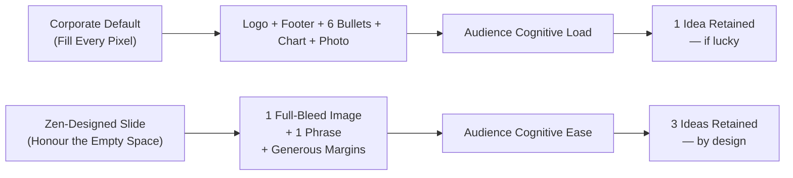
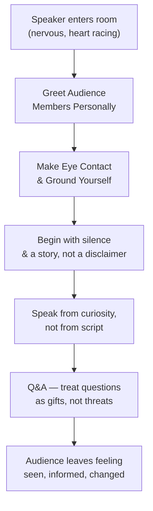

# Narration Script: *Presentation Zen* by Garr Reynolds

---

**Narrator:** Welcome to a walkthrough of *Presentation Zen: Simple Ideas
on Presentation Design and Delivery* by Garr Reynolds. This is a book
for anyone who has ever sat through a talk that bored them, and anyone
who has ever given a talk and wondered why their message—perfectly
logical, perfectly researched—didn't land.

*(pause)*

**Narrator:** Reynolds published the first edition in 2007 and updated
it substantially for a tenth-anniversary edition in 2017. He is a
presentation designer, creative director, and Zen Buddhist practitioner
based in Japan. What makes the book remarkable is that it does not
teach you to *use* a tool. It teaches you to *think differently* about
what a presentation is, who it is for, and why most of them fail before
the first slide is ever built.

---

## The Diagnosis

**Narrator:** Reynolds opens with a problem statement that most people
in corporate or academic settings will recognize immediately. The
majority of presentations today are built on a single, unexamined
assumption: that slides are the presentation. The presenter reads the
bullets aloud, the audience takes notes, and the event is judged
successful if all the data appeared on screen.

This model, Reynolds argues, is broken at its root. PowerPoint was
never designed as a communication tool—it was designed in the 1980s as
a cue card for salespeople, a way to show product feature lists while
pitching. It was never meant to carry a full argument, to replace the
speaker, or to be read as a document. And yet millions of presenters use
it exactly that way. The result is predictable. Audiences check out.
They read email. They remember nothing.

The real problem, Reynolds says, is not the tool. It is the thinking
that produced the content in the first place.

---

## The Philosophy: Zen Meets Design

**Narrator:** Reynolds's organizing metaphor is Zen Buddhism—not as a
branding device, but as a practice of mindful attention and deliberate
subtraction. The central concept he borrows is `ma` (間)—often
translated as negative space, empty space, or simply "the space
between."

In Japanese aesthetics, `ma` is not an absence. It is essential. The
white space around a calligraphy stroke is not wasted; it is what gives
the stroke meaning. A bowl of broth is not half-empty; the broth is
where the flavor lives. In a presentation, the white space around a
key word or a single image does not reduce the content—it amplifies the
content that remains.

Simplicity, Reynolds insists repeatedly, is not dumbing down. It is the
ultimate sophistication. Leonardo da Vinci said it; Reynolds applies it
to the PowerPoint industrial complex.

---

## Preparation: The Storyboard-First Workflow

**Narrator:** The part of the process most presenters skip—because it
is abstract, hard to measure, and does not involve software—is actually
the most important. Reynolds calls this the analog, non-linear phase of
preparation.

Before you open Keynote or PowerPoint, draw your presentation as a
sequence of framed panels on paper. Each panel is one slide idea,
visualized as it will appear and felt as part of the narrative arc.
This linear, analog workflow forces you to confront the *shape of the
story* before you get trapped in slide formatting, which is usually
where the thinking stops and the decoration begins.

He also introduces the **Rule of Three**: cognitive science tells us
that audiences reliably retain about three core ideas from any
presentation. The Rule of Three is not an aesthetic preference; it is a
respect for how human working memory works. More than three ideas and
everything bleeds together. Fewer than one and the audience has no
structure to hang meaning on. Three is the sweet spot.

---

## Design: White Space, Typography, and Images

**Narrator:** Part Two of the book is the design manual that made it a
cult classic among designers and communicators everywhere. Reynolds
systematically dismantles the standard PowerPoint aesthetic—logo slides,
data tables, bullet-point walls, corporate color palettes applied
without thought—and replaces each failure mode with a design principle
drawn from graphic design and cognitive science.

### White Space

Crowded slides signal confused thinking, Reynolds argues. White space
is the breath of a slide—it tells the audience's eye where to rest and
signals that what remains matters enough to stand alone. Every decision
about what to remove is equally a decision about what to emphasize.

### Typography

Font choice is not a matter of taste; it is an argument. Reynolds
advocates for **type as image**: one or two typefaces, used
deliberately with size and weight as a hierarchy system. Typography
replaced bullets as the primary instrument of emphasis. A single phrase
set in a bold, large typeface on a clean background communicates more
authority than a paragraph set in the default template font at
fourteen points.

### Images

Reynolds is firm on images: they must be full-bleed, high-resolution,
and emotionally resonant. A stock photograph of smiling people shaking
hands does not advance a message—it is wallpaper and usually cheap
wallpaper. An image should illustrate a concept, evoke a feeling, or
anchor a metaphor. If it does none of those things, cut it. Let the
white space speak.

---

## Delivery: Practice, Presence, and Authenticity

**Narrator:** Part Three is where Reynolds departs most noticeably from
conventional public-speaking guides. He addresses the anxiety most
presenters feel with honesty rather than dismissal. Nervousness before
speaking is not something to eliminate; it is energy. Your body is
preparing to perform. The skill is not making the feeling go away—it is
learning to invite it forward.

### Practice vs. Rehearsal

Reynolds distinguishes between rehearsal—repeating the same content in
exactly the same way—and practice, which is exploring variations,
internalizing the material so deeply that you could hold a conversation
around any part of it. Real practice means standing up, speaking out
loud, recording yourself, and simulating conditions that approximate the
actual event. It means the slides become incidental because you know the
material.

### Authenticity

Authenticity cannot be faked, but it can be cultivated. Before you
begin, make eye contact with audience members. Greet a few people
personally. Carry that human connection onto the stage. Audiences are
remarkably skilled at detecting the difference between a presenter who
is performing and a presenter who is present. The difference is in the
eyes, in the breath, and in the pauses between sentences.

---

## The Q&A: The Real Presentation

**Narrator:** Reynolds holds an unusual view of the question-and-answer
period: it is not a postscript, he says. It is the real presentation.
The slides were the appetizer; the Q&A is where trust is built,
objections are surfaced, and the real conversation happens.

His guidance here is deceptively simple: treat questions as gifts.
Listen fully before responding. Use the Q&A as an opportunity to deepen
the relationship with the audience rather than simply defending your
position. People who feel heard—even when they disagree—leave a
presentation differently than people who feel besieged.

---

## Conclusion

**Narrator:** Reynolds closes by returning to where he began: with
attention. A great presentation is not a performance. It is an act of
mindfulness—a focused, generous attention to both your message and your
audience. The tools he offers—sketching, white space, visual hierarchy,
storyboards, practice, presence—are not tricks. They are expressions of
a single habit: paying close attention to what matters, and having the
discipline to leave everything else out.

He leaves us with what is perhaps the book's most lasting line, borrowed
from da Vinci and amplified:

> *Simplicity is the ultimate sophistication.*

*(pause)*

**Narrator:** In this walkthrough, we covered the core ideas of
*Presentation Zen*: why the bullet-point paradigm fails, the role of
white space and typography in design, the storyboard-first workflow, the
Rule of Three, the power of images, and how authenticity in delivery
emerges from genuine attention to your audience. If you are a designer,
a speaker, an executive, or anyone who needs to communicate ideas that
matter, Garr Reynolds's *Presentation Zen* remains one of the most
essential books on the subject.

Prepare well. Design generously. Deliver with presence. And leave space
for what matters.

*(pause)*

**Narrator:** Thanks for listening. The shape of a great presentation
is the shape of a caring mind. Go design one.
