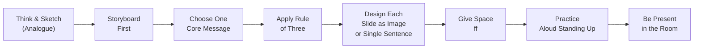

## 📚 Overview

*Presentation Zen: Simple Ideas on Presentation Design and Delivery*
(2007, 10th Anniversary Edition 2017) by Garr Reynolds is the book
that gave millions of presenters permission to stop reading their slides
out loud and start communicating. Drawing on his decades of work as a
presentation designer and creative director—along with his practice of
Zen Buddhism—Reynolds makes a case that most presentations fail for the
same reason most bad design fails: poor thinking dressed up as
information.

The book struck a chord the moment it was published because it named a
problem that audiences around the world already knew by experience:
boredom disguised as professionalism. PowerPoint defaults, bullet-point
lists, corporate template color palettes applied without thought—these
conventions do not communicate; they comply. Reynolds offers a radical
alternative: treat each presentation as an act of mindful, generous
communication rather than a data dump. The result is a book that is
part design manual, part philosophy text, and part performance guide,
readable in an afternoon and applicable for a career.

---

## 👤 About the Author

Garr Reynolds is a presentation designer, creative director, and Zen
Buddhist practitioner based in Japan. After more than a decade advising
clients across Asia, North America, and Europe—from Fortune 500
companies to TEDx speakers—he began writing the Presentation Zen blog
and then this book to share what he had learned about what separates
compelling communication from routine information delivery.

His cross-cultural lens draws equally from Japanese aesthetic traditions
and Western cognitive science. He is credited with popularizing several
ideas that have since become standard in the design community:
storyboard-first workflows, the purposeful use of white space
(`ma`), and the insistence that the story arc—not the slide deck—is the
unit of design.

---

## 🎯 The Book's Thesis

The central argument of *Presentation Zen* is both simple and radical:
**most presentations fail not because of poor delivery, but because of
poor design rooted in poor thinking.** Default slide templates are not
neutral—they are designed to encourage a specific degenerative pattern.
They invite the presenter to dump information into bulleted lists, read
them aloud to a passive audience, and regard the event as a success if
all the data appeared on screen.

Reynolds argues that a great presentation is an **experience**, not a
document. Slides are not a teleprompter, not a handout, and not a
report to be silently consumed. They are a visual canvas that
*supports*—and sometimes *leads*—the presenter's message. The shift
he proposes is from **information delivery** to **experience design**.
The audience should leave the room having *felt* something, having
*grasped* something at a deeper level, and having been changed in some
way.

---

## 🧘 Core Philosophy: Zen Meets Design

Reynolds borrows heavily from Zen Buddhist aesthetics—most centrally
the Japanese concept of **`ma` (間)**, often translated as "negative
space," "empty space," or "the space between." In Japanese art,
architecture, and cuisine, `ma` is not an absence; it is a presence.
The white space around a calligraphy stroke does not exist to be
filled—it exists to give the stroke meaning. A bowl of soup that is
half broth is not half-empty; the broth is where the flavor lives.

Applied to presentation design, `ma` means:

- A slide with one powerful image and wide margins communicates more
  than a slide cluttered with logos, bullets, and data tables.
- Typography that breathes carries more authority than typography
  packed edge-to-edge.
- A presenter who pauses between ideas gives those ideas room to land.

`ma` is a philosophy of subtraction: **what you leave out is as
important as what you leave in.** This extends to preparation. Reynolds
insists that the most creative, consequential design work happens away
from the computer—on paper, on whiteboards, in walks around the block.
The computer is the tool for execution; thinking is the tool for design.

---

## 💡 Core Concepts

| Concept | Summary |
|---|---|
| **Simplicity as Sophistication** | Stripping away the non-essential reveals what matters. Complex slides signal confused thinking; clean slides signal clarity and respect. |
| **White Space (`ma`)** | Empty space is an active design element. It gives the eye room to rest, the mind room to process, and signals importance by contrast. |
| **Thinking Before Slides** | The most important work happens away from the computer. Sketch on paper, storyboard by hand, walk before you commit pixels. |
| **Visual Thinking** | Train the mind to translate abstract ideas into images, metaphors, and spatial arrangements before opening slide software. |
| **The Rule of Three** | Audiences reliably retain approximately three core ideas. Design your entire message around this cognitive constraint. |
| **Storyboard-First Workflow** | Draw the entire presentation as a linear sequence of panels on paper before opening Keynote or PowerPoint. |
| **Bullet Point Abolition** | Slides should carry one idea at full weight. Bulleted lists fragment messages and turn the presenter into a reader. |
| **Images as Emotion** | Full-bleed, high-resolution, emotionally resonant images. Decorative stock photographs are not communication—they are wallpaper. |
| **Typographic Hierarchy** | Font choice, size hierarchy, and line spacing are architectural decisions, not formatting afterthoughts. |
| **Audience as Hero** | The audience's transformation—not the presenter's knowledge display—is the measure of a presentation's success. |
| **Nervousness as Energy** | Physiological arousal before speaking is fuel, not failure. Channel it rather than suppress it. |
| **Analog Note-Taking** | Hand-drawn sketches and physical storyboards engage creative cognition in ways that digital tools do not. |
| **Breaking PPT Culture** | Corporate template defaults enforce a "Clone Zone" of uniformity; rebelling against them is creative discipline. |
| **Q&A as Relationship** | The question period is not a postscript—it is the real presentation, where trust is built. |
| **Mindfulness in Delivery** | Presence—genuine attention to the moment and the audience—outperforms any polished technique. |

---

## 👥 Who Should Read

- Anyone who has ever sat through a boring presentation and thought,
  *there has to be a better way*
- Designers, educators, marketers, and product managers who need to
  pitch ideas to audiences regularly
- Executives and leaders who want their messages to land, not just be
  received
- Technical presenters—engineers and data professionals—who struggle to
  make complex ideas accessible and engaging
- Anyone who has ever defaulted to a PowerPoint template because they
  weren't sure where else to begin

---

## 🚫 Who Should Skip

- Presenters who are contractually required to use their organization's
  existing branded template faithfully (though the thinking framework
  still applies)
- Anyone seeking a software tutorial on how to use Keynote or
  PowerPoint—this book is not about tools
- Presenters for whom brevity is not a constraint (e.g., some academic
  or technical contexts where dense slide content is the accepted norm)
- Readers looking for a quick 10-minute hack—Reynolds demands actual
  preparation time

---

## 📖 Related Books

- *Slide:ology* — Nancy Duarte. Practical slide design from a different
  perspective; pairs well with Reynolds's philosophy.
- *Resonate* — Nancy Duarte. Story structure for presentations.
- *Talk Like TED* — Carmine Gallo. Presentation tips distilled from
  TED Talks.
- *The Elements of Voice* — Nina Hart. Complementary writing and
  speaking craft.
- *Visual Thinking* — Rudolf Arnheim. Deeper dive into the psychology of
  image and meaning.
- *On Writing Well* — William Zinsser. Simplicity as a writing
  principle applied to prose.

---

## ⭐ Final Verdict

*Presentation Zen* is the book that changed how a generation of
communicators thinks about slides. Its ideas are now so widely
adopted—from TED Talks to keynote decks at major tech companies—that
it is easy to underestimate how radical it was when first published.
Reynolds did not invent the idea that presentations should be visual and
simple; he made that idea accessible, actionable, and philosophically
coherent for a mass audience.

The book's limitations are real: some of the specific design advice
feels dated 15+ years later as design tools and formats have evolved,
and not every organizational environment will tolerate its spirit of
template rebellion. But the underlying ideas—white space as respect,
simplicity as sophistication, deliberate analog preparation—are
timeless.

**Rating: 9/10** — The book that defined modern presentation design.
Read it once every year before your most important talk.
