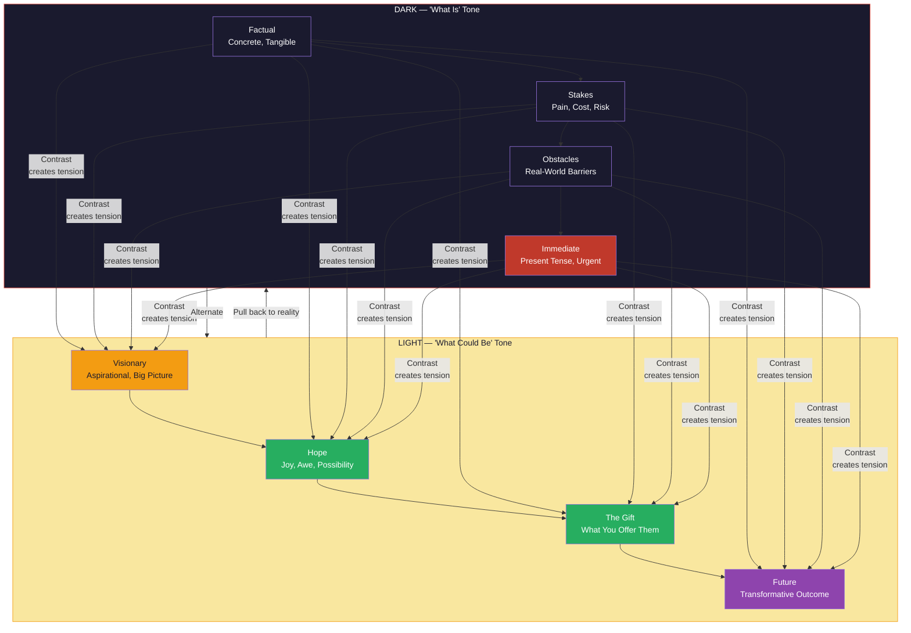
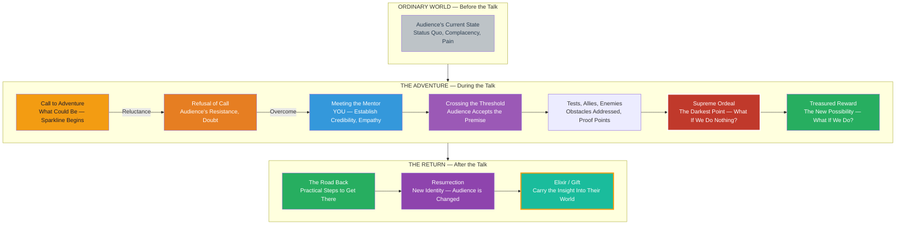
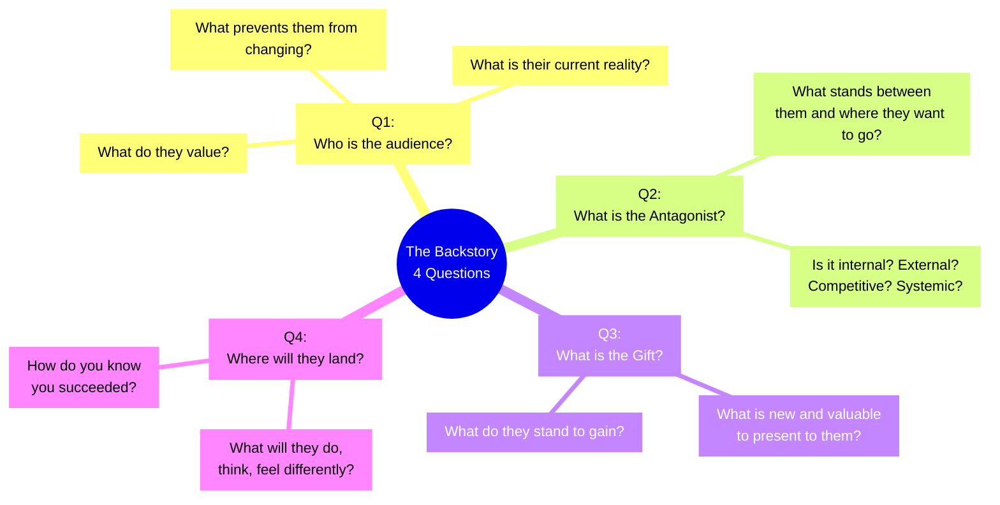
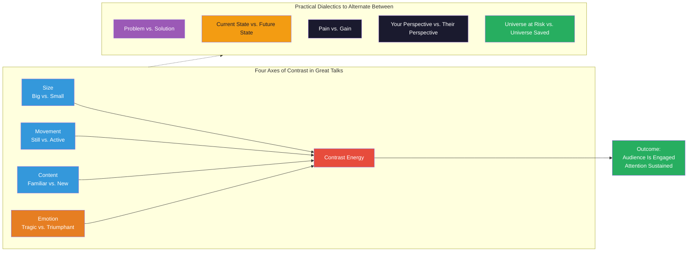
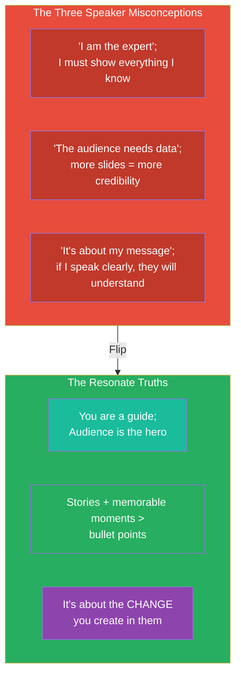
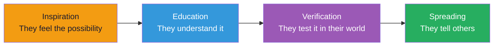

## The Presentation Form — The Sparkline Explained

At the heart of Resonate is an observation Duarte discovered through empirical analysis: every great presentation follows the same structural DNA. She calls this the **Presentation Form**, and she visualizes it as a **Sparkline** — a waveform that alternates between dark (what is) and light (what could be) throughout the talk.

```mermaid
flowchart LR
  subgraph OneCompleteCycle ["One Complete Sparkline Cycle"]
    direction LR
    WI[What Is<br/>Dark — Reality] -->|" "| WCB[What Could Be<br/>Light — Possibility]
    WCB -->|" "| WI2[Return to What Is<br/>Dark — Obstacles]
    WI2 -->|" "| NR[New Reality Formed<br/>Light — Change]
  end

  subgraph FullPresentation ["Full Presentation: Many Cycles"]
    direction LR
    C1[Cycle 1] --> C2[Cycle 2] --> C3[Cycle 3] --> C4[Cycle 4] --> C5[Final Call]
  end

  OneCompleteCycle -.-> FullPresentation

  style WI fill:#1a1a2e,color:#fff,stroke:#e74c3c,stroke-width:2px
  style C1 fill:#1a1a2e,color:#fff
  style C2 fill:#1a1a2e,color:#fff
  style C3 fill:#1a1a2e,color:#fff
  style WI2 fill:#1a1a2e,color:#fff
  style WCB fill:#f39c12,color:#1a1a2e
  style NR fill:#27ae60,color:#fff
  style C4 fill:#27ae60,color:#fff
  style C5 fill:#9b59b6,color:#fff
```

Each cycle of the Sparkline does three things simultaneously: it establishes the audience's current pain, shows them a glimpse of what is possible, and then brings them back to reality — where they must decide whether to act.

### The Emotional Energy Map

Duarte overlays the Sparkline with an **emotional energy map** so presenters can consciously shape the emotional arc of their talk. The Y-axis represents emotional intensity; the X-axis represents time.

```mermaid
graph TD
  subgraph EmotionalArc ["Emotional Energy Arc (Ideal Shape)"]
    direction LR
    E[Start: Low<br/>Stakes set] --> F[Point A:<br/>Hope — What Could Be]
    F --> G[Point B:<br/>Conflict — Dark Night]
    G --> H[Point C:<br/>Triumph — New Normal]
    H --> I[End: Sustained<br/>Inspiration]
  end

  subgraph Reality ["Reality for Most Bad Talks"]
    direction LR
    X[Start: Meh] --> Y[Meh] --> Z[Meh] --> W[Meh] --> V[Thank God It's Over]
  end

  style E fill:#3498db,color:#fff
  style F fill:#f39c12,color:#1a1a2e
  style G fill:#1a1a2e,color:#fff
  style H fill:#27ae60,color:#fff
  style I fill:#9b59b6,color:#fff
  style X fill:#bdc3c7,color:#2c3e50
  style Y fill:#bdc3c7,color:#2c3e50
  style Z fill:#bdc3c7,color:#2c3e50
  style W fill:#bdc3c7,color:#2c3e50
  style V fill:#e74c3c,color:#fff
```

The dotted line at the bottom represents most presentations: flat, forgettable, data-dumps. The real presentation form creates a visible emotional landscape through which the audience moves.

---

## Contrast Curves — Dark and Light

Duarte breaks the Podcast into two distinct tones: **Dark** (what is) and **Light** (what could be). Great speakers keep these tones sharply differentiated and intentionally alternated.

Poor speakers blend the two tones together — they stay gray. The gray zone is the land of the status report, the quarterly update, the "here's what we did" monologue. The Sparkline requires active navigation between tones. You must feel the dark before the light can have meaning.

---

## The Hero's Journey — Mapped to Presentation Structure

Duarte adapts Joseph Campbell's monomyth structure to presentation design. The audience is the hero. The presenter is the mentor. The talk is the journey.

This mapping is the single most important structural framework in the book. Every presentation element — opening, data, story, objection, call to action — finds its place within this journey. Duarte calls the opening seduction, the middle the struggle, and the end the celebration. Match your content to the hero's stage.

---

## The Backstory — Why Design Starts Before the Deck

Before you open Keynote or PowerPoint, Duarte demands that you answer four foundational questions. She calls this designing the **Backstory**, and she treats it as the most important work of the entire process.

Skipping the backstory leads to what Duarte calls the **Land of the Spin** — presentations where the presenter has a product or idea to push, but no genuine understanding of the person across the room. Audiences detect this instantly. The backstory creates empathy. Empathy creates trust. Trust creates the conditions for change.

---

## Creating Contrast — The Engine of the Sparkline

Duarte argues that **contrast is the fundamental mover of human attention**. Without contrast, there is no story, no meaning, no transformation. She identifies four primary axes of contrast worth designing purposefully:

### Misapplication of Contrast
- **Contrast without care** — using it for shock value rather than meaning
- **Too many cycles** — the Sparkline needs room to breathe; cramming 8 cycles into 15 minutes creates whiplash
- **Contrast without journey** — shifting between tones without a coherent narrative arc connecting them leaves audiences confused

---

## The Three Great Equalizers — Why Audiences Matter More Than Presenters

Duarte identifies three preconceptions most speakers carry into a room. Each is a barrier to resonance:

The audience as hero means: the talk is not about proving how smart you are. It is about giving them a mirror in which they can see themselves differently, and a map for becoming who they could be.

---

## Current Moment — The Sacred Present

One of Resonate's most underappreciated concepts is the **Current Moment**: the ineffable quality of being present in front of a group, and the way that presence travels through narrative. Duarte draws a distinction between *content* (the substance of what you say) and *presence* (the quality of attention you bring to being there). Great speakers are not just skilled at structure — they are fundamentally present, and that presence energizes the talk itself.

This also connects to her point about the *call* at the center of every great talk: a call is not a demand or a pitch — it is a genuine invitation to a new way of being. The quality of that invitation depends entirely on whether the speaker has done the internal work to mean it.

---

## The Biology of Story in Presentations

Resonate opens with a science section because Duarte does not want the book to be merely opinion or personal experience. She grounds the case for story in what we know about how brains process information:

| Mechanism | What It Does | Implication for Presentations |
|-----------|-------------|-------------------------------|
| Mirror neurons | Fire when we see others act; create simulation | Audiences who see your passion literally experience it with you |
| Cortisol | Released at moments of threat/tension | Use the Dark cycle to create urgency; hold tension purposefully |
| Oxytocin | Released at moments of empathy and care | The Light cycle creates receptivity; build moments of genuine emotional connection |
| Dopamine | Released when novelty or reward is anticipated | Each Sparkline cycle (especially the shift from Dark to Light) triggers a small dopamine hit — sustaining attention |
| Reticular activating system | Filters for what is 'new and important' | Signal changes in the Sparkline (tone shifts, color changes, a quiet moment after chaos) to re-engage wandering listeners |

Together, these biological realities mean: **story is not decoration. Story is the operating system of human persuasion.**

---

## Crafting a Message Worth Spreading

Duarte reserves her most ambitious claims for the final section. If a presentation is designed well, it becomes a *gift* — something the audience can carry into their world and use to change it. This is what separates a talk that is merely *enjoyed* from one that is *spread*. She borrows the language of epideictic rhetoric: a rhetoric of praise, of making the audience see the world differently than they did before they walked in.

The presentation's job is not to *finish* the idea — it is to *ignite* the idea so powerfully that the audience's own life becomes its next case study.

---

## Key Framework Reference Table

| Framework | Purpose | Duarte's Term | Where Used |
|-----------|---------|---------------|------------|
| Sparkline | The structural undercurrent of all great talks | What-Is ↔ What-Could-Be alternation | Entire presentation |
| Emotional Energy Map | Shape the audience's emotional journey across time | Bright vs. Dark beats | Before slide creation |
| Hero's Journey | Assign roles (you = mentor, audience = hero) | 12-stage Campbell arc mapped to talk sections | Opening and closing design |
| Backstory | Design the talk before creating any slides | 4 foundational questions (who/antagonist/gift/landing) | Ideation phase |
| Contrast Curves | Generate attention through controlled alternation | Dark/Light dialectic pairs | Throughout the talk |
| Current Moment | Cultivate genuine presence as a source of power | The sacred Now | Delivery, but rooted in preparation |
| Message Worth Spreading | Aim for social transmission, not just comprehension | The Gift / Elixir | Closing design |
