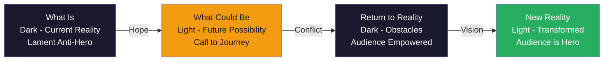
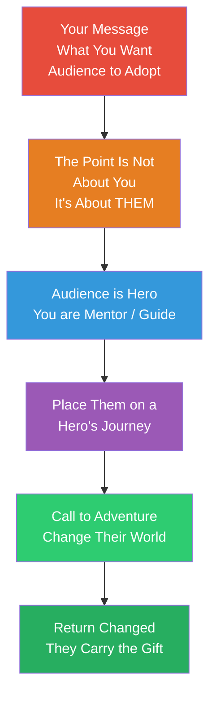

## Overview

**Resonate** is Nancy Duarte's magnum opus on presentation structure. Drawing on mythic storytelling patterns, field research across hundreds of presentations, and decades of her own work as a presentation designer for Fortune 500 companies and TED speakers, Duarte reveals the hidden narrative architecture that makes great talks move people to action. Her central claim: every transformative presentation follows the same underlying story form — an alternation between "what is" and "what could be" that drives audiences from their current reality toward a changed perspective. This alternation is the book's core visual metaphor: the **Sparkline**.

---

## Executive Summary

### The Presentation Form (Sparkline)

Duarte analyzed 40+ executive speeches and TED talks. She discovered the same structural pattern emerges in every one: a rhythmic oscillation between the present reality's limitations and the future possibility's promise. Visually, this creates a light-beats-dark waveform — the **Sparkline**.

### The Core Message Model

---

## Key Takeaways

**The audience is the hero, not you.** This reframe is the book's most durable insight. Most presenters see themselves as the protagonist — the smart one with the answers. Duarte inverts that: you are the mentor (Morpheus, Obi-Wan, Gandalf). The audience is the one who must face the ordeal, cross the threshold, and return transformed. This shift changes how you structure empathy, place obstacles, and design the payoff.

**Presentations are a vehicle for transfer of emotion, not just information.** Duarte spends the first section of the book laying out the biology of story: mirror neurons, cortisol, oxytocin, and why human beings have evolved to find meaning in narrative arcs. A well-structured talk doesn't just share ideas — it physically prepares the audience to receive them.

**Great presentations alternate Spark and Clash.** The Sparkline is not a smooth upward slope — it is a heartbeat. Each beat of "what is versus what could be" generates tension. Tension is the engine of narrative. Without it, your talk is a memo, not a story.

**The point is not what you say — it's what people do with it.** Presentations that transform audiences create a gap between the audience's current state and a new possibility. Your job is to hold them in that uncomfortable gap long enough for change to happen.

**Design the backstory before you design the deck.** Duarte argues most presenters start too far downstream — in slide software, in data, in bullet points. The real work happens before that: understanding the audience's world, the antagonist (the obstacle they face), the gift you have for them, and where they will land when the presentation ends.

**Every great talk has a hero's journey, not a hero's monologue.** The monologue — where the presenter talks at the audience — is the default mode of bad presentations. The hero's journey mode has a call to adventure, threshold crossing, tests, allies, enemies, a supreme ordeal, the treasure, and the return. Duarte maps each of these stages onto presentation structure.

**Content and form must be aligned.** This is as much a design principle as a narrative one. If your message is about aspiration, your slides should be designed to feel aspirational — airy, light, future-focused. If the passage is about crisis, the design must contract — dark, urgent, tight. Emotional energy maps guide this alignment.

---

## Who Should Read

- Executives and leaders who give keynote speeches or all-hands presentations
- Presentation designers and visual storytellers looking for a structural framework
- TED Talk aspirants who want to understand what separates great talks from good ones
- Anyone who needs to "sell" ideas internally — what Duarte calls "change management through story"
- Marketers crafting brand stories or sales narratives

## Who Should Skip

- Beginners who need practical slide-design tactics (read `slide:ology` first)
- Engineers or analysts looking for a data-driven but minimalist presentation approach
- People seeking a quick fix — Resonate requires substantial engagement with its conceptual framework
- Readers who prefer prescriptive step-by-step formats over philosophical exploration

---

## Difficulty & Commitment

- **Difficulty:** Medium — rich in concept, requires active engagement with narrative theory
- **Reading time:** ~8 hours (320 pages, design-forward with large visuals and diagrams)
- **Structure:** 3 parts + front/back matter; extensive visual appendix including the Presentation Form

---

## Final Verdict

**Resonate is the best book on presentation narrative structure ever written.** It is both a field manual and an appreciation — Duarte provides a genuinely transferable structural model (the Sparkline, the Hero's Journey mapping, contrast curves) while also making you care about why presentations matter at all. Its influence on how tech companies, design firms, and TED speakers approach narrative is hard to overstate.

The book's primary limitation is density. Its ideas are substantive, but not every chapter is equally valuable. Some sections on "the biology of story" can feel like a review of neuroscience for designers. The book is also heavily visual — the diagrams are the argument, and reading it in plain text on an e-reader loses a significant portion of its content.

For the dedicated communicator, Resonate pairs perfectly with Garr Reynolds' `Presentation Zen` (design and presence), and with `Talk Like TED` (TED-specific framing). Together, these three books form a complete library for anyone who takes the craft of showing up in front of a room seriously.

**Best for:** Anyone who wants to understand the structure of transformative talks and apply those insights to their own work. **Not ideal for:** Absolute beginners, e-reader-only readers, or those wanting practical PowerPoint tips without narrative theory.

---

## Related Books

| Book | Author | Why It Complements |
|------|--------|-------------------|
| slide:ology | Nancy Duarte | Practical slide design; read Resonate for structure, slide:ology for craft |
| Presentation Zen | Garr Reynolds | Design philosophy, minimalism, and presence in live presentation |
| Talk Like TED | Carmine Gallo | TED-specific techniques; shallower but more immediately applicable |
| The Storyteller's Secret | Carmine Gallo | Narrative techniques in business, complementary to Duarte's structural model |
| Made to Stick | Chip Heath & Dan Heath | Why ideas survive; frames many of the same problems from a different angle |
| TED Talks: The Official TED Guide | Chris Anderson | The curator's perspective on what makes TED talks work |

---

*Not affiliated with TED Conferences, LLC. Cover image via Open Library.*
