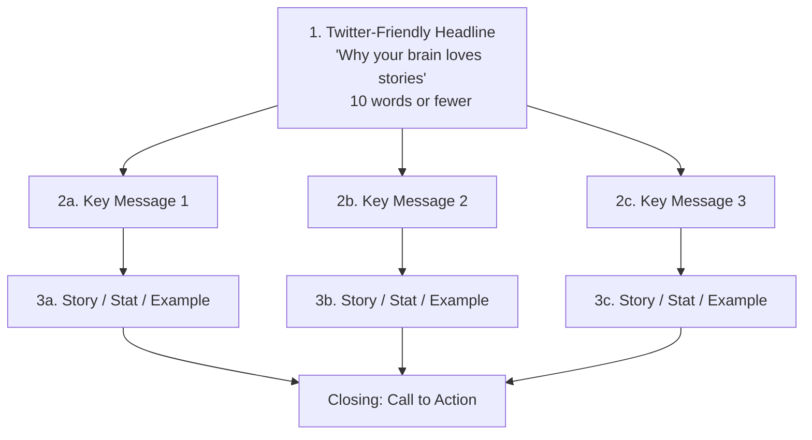

## The 9 Secrets — Complete Breakdown

Talk Like TED is built on a simple but powerful insight: every unforgettable
presentation succeeds because it is simultaneously Emotional, Novel, and
Memorable. These three pillars form the book's architecture, with three
secrets nested under each.

---

### The Three Pillars

 E2 --> E3
    N1 --> N2 --> N3
    M1 --> M2 --> M3
`}
/>

---

## The 18-Minute Rule

Gallo dedicates an entire chapter to TED's signature constraint. The 18-minute
limit is not arbitrary:

- **Information overload**: The brain has limited working memory. Beyond 18
  minutes of intense focus, "cognitive backlog" prevents new information from
  being processed.
- **The Rule of Three**: Audiences comfortably remember three things. Gallo
  advises distilling every talk to one Twitter-friendly headline supported by
  three key messages.
- **Constraint breeds creativity**: "What isn't there makes what is there even
  stronger." Short formats force discipline.

> "If you have a 45-minute presentation, break it into segments of no more
> than 10–15 minutes each, with a clear transition — a story, video, or
> demonstration — between each segment." — Carmine Gallo

---

## The Passion Pathway

 B["Connect It to
    Your Topic"]
    B --> C["Express Through
    Authentic Delivery"]
    C --> D["Mirror Neurons
    Activate in Audience"]
    D --> E["Emotional Contagion
    = Audience Cares Too"]

    style A fill:#e74c3c,color:#fff
    style E fill:#27ae60,color:#fff
`}
/>

### Secret 1: Unleash the Master Within

Gallo opens with passion because he considers it the foundation. The most
popular TED speakers share one trait: they aren't just knowledgeable—they are
genuinely obsessed with their subject.

**Key examples:**
- **Aimee Mullins** (double amputee, Paralympic runner) — not passionate about
  prosthetics, but about unleashing human potential
- **Sir Ken Robinson** — passionate about creativity in education, not about
  the education system itself
- **Jill Bolte Taylor** — a brain scientist who experienced a stroke; her
  passion was sharing what she learned about consciousness

**The science:** Mirror neurons fire both when we do something and when we
watch someone else do it. Passionate speakers literally create the same neural
activity in their audience.

---

## Storytelling Arc

 B["ACT II
        Conflict
        Adversity, Struggle, Tension"]
        B --> C["ACT III
        Resolution
        Triumph, Insight, New Normal"]
    end

    C --> D["Audience Response
    Emotional Connection
    + Message Retention"]

    style A fill:#3498db,color:#fff
    style B fill:#e67e22,color:#fff
    style C fill:#2ecc71,color:#fff
`}
/>

### Secret 2: Master the Art of Storytelling

Gallo argues stories are not decoration—they are the delivery mechanism for
ideas. He identifies three story types and five essential narrative elements.

**Three types of stories:**
1. **Personal stories** — your own experiences (most powerful)
2. **Stories about others** — people you've met or observed
3. **Brand/case-study stories** — organizational narratives

**Five essential elements** (from Gallo's analysis):
- A hero the audience cares about
- A villain or obstacle (adversity)
- A transformative journey
- Vivid sensory detail
- An emotional payoff

> "Stories are data with a soul." — Brené Brown (quoted by Gallo)

**Bryan Stevenson's TED Talk** (most-watched at the time): Gallo analyzes its
rhetorical breakdown — 65% pathos, 25% logos, 10% ethos — and shows how
Stevenson's personal stories about his grandmother and his work with death row
inmates created emotional resonance that pure statistics could never achieve.

---

## Multisensory Experience

 V["Visual
    Images, Video, Props"]
    M --> A["Auditory
    Voice, Music, Sound Effects"]
    M --> K["Kinesthetic
    Movement, Demos, Touch"]
    M --> L["Linguistic
    Vivid Language, Metaphor"]

    V --> R["Picture Superiority Effect
    Recall: 65% after 3 days
    (vs. 10% for text-only)"]

    A --> R2["Emotional Priming
    Music triggers dopamine
    Voice variety holds attention"]

    K --> R3["Embodied Cognition
    Physical props anchor
    abstract concepts"]

    L --> R4["Dual Coding
    Verbal + imagery =
    2 memory pathways"]

    R & R2 & R3 & R4 --> O["Audience remembers
    your message"]

    style O fill:#9b59b6,color:#fff
`}
/>

### Secret 8: Paint a Mental Picture with Multisensory Experiences

Gallo devotes significant attention to the sensory dimension of presentations.
The brain processes visual information 60,000 times faster than text.

**Concrete tactics:**
- Replace bullet points with a single powerful image per slide
- Use physical props (Bill Gates releasing mosquitoes; a brain in a jar)
- Incorporate demonstrations that engage sight, sound, and touch
- Use vivid, concrete language that paints mental images
- Add video clips—they trigger mirror neurons and provide mental breaks

---

## Complete Secret-by-Secret Reference

### Part I: Emotional (Secrets 1–3)

| Secret | Principle | Key Example | Science |
|--------|-----------|-------------|---------|
| 1. Unleash the Master Within | Speak from genuine passion | Aimee Mullins, Sir Ken Robinson, Jill Bolte Taylor | Mirror neurons, emotional contagion |
| 2. Master the Art of Storytelling | Use narrative to create emotional bonds | Bryan Stevenson, Brené Brown, Dan Ariely | Brain-to-brain coupling, cortisol/oxytocin release |
| 3. Have a Conversation | Rehearse until it sounds spontaneous | Every top TED speaker | Cognitive fluency, reduced listener effort |

### Part II: Novel (Secrets 4–6)

| Secret | Principle | Key Example | Science |
|--------|-----------|-------------|---------|
| 4. Teach Me Something New | Novel insights trigger attention | Hans Rosling, Elon Musk | Dopamine release from novelty |
| 5. Deliver Jaw-Dropping Moments | Create emotionally charged events | Bill Gates (mosquitoes), Jill Bolte Taylor (brain) | Emotionally charged events = better encoding |
| 6. Lighten Up | Humor lowers defenses | Ken Robinson, Mary Roach | Laughter releases endorphins, increases trust |

### Part III: Memorable (Secrets 7–9)

| Secret | Principle | Key Example | Science |
|--------|-----------|-------------|---------|
| 7. Stick to the 18-Minute Rule | Brevity forces clarity and focus | All TED Talks | Cognitive backlog theory, attention span research |
| 8. Paint a Mental Picture | Multisensory aids = better recall | Hans Rosling (data visualization), David Gallo (deep sea) | Picture superiority effect, dual coding theory |
| 9. Stay in Your Lane | Authenticity builds trust | Simon Sinek, Brené Brown | Familiarity principle, authenticity detection |

---

## The Headline–Three Messages–Stories Framework

Gallo's practical presentation template:

Gallo recommends every presentation start with this template. The headline
must be tweetable. Each of the three key messages is reinforced with a story,
a statistic, or a concrete example.

---

## Notable TED Speakers Referenced

| Speaker | Talk Topic | Secret Demonstrated |
|---------|-----------|-------------------|
| Sir Ken Robinson | Do schools kill creativity? | Passion, Storytelling, Humor |
| Jill Bolte Taylor | My stroke of insight | Passion, Jaw-Dropping Moment |
| Simon Sinek | How great leaders inspire action | Authenticity, 18-Minute Rule |
| Brené Brown | The power of vulnerability | Storytelling, Authenticity |
| Bill Gates | Mosquitoes, malaria, education | Jaw-Dropping Moment |
| Hans Rosling | The best stats you've ever seen | Teach Something New, Multisensory |
| Bryan Stevenson | We need to talk about an injustice | Storytelling, Conversation Style |
| Aimee Mullins | The opportunity of adversity | Unleash the Master Within |
| Dan Ariely | Are we in control of our own decisions? | Storytelling |
| Mary Roach | 10 things you didn't know about orgasm | Humor, Teach Something New |

---

*Full reference: Gallo, C. (2014). Talk Like TED: The 9 Public-Speaking Secrets
of the World's Top Minds. St. Martin's Press.*
