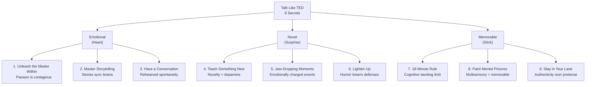

## Overview

**Talk Like TED** is a playbook for anyone who wants to communicate with the
clarity, confidence, and charisma of the world's most-watched speakers. After
analyzing over 500 TED Talks and interviewing top presenters plus researchers
in neuroscience, psychology, and communications, Carmine Gallo distills what
he found into 9 repeatable techniques organized under three pillars: Emotional,
Novel, and Memorable.

The core premise: ideas are the currency of the 21st century, and the ability
to sell them persuasively is the single most valuable skill you can develop.
Gallo argues that TED speakers are not born—they are made through deliberate
application of these nine secrets.

---

## Executive Summary

### The 9 Secrets at a Glance

| # | Secret | Category | Core Idea |
|---|--------|----------|-----------|
| 1 | Unleash the Master Within | Emotional | Speak from genuine passion; your enthusiasm is contagious |
| 2 | Master the Art of Storytelling | Emotional | Narratives create brain-to-brain coupling and emotional resonance |
| 3 | Have a Conversation | Emotional | Practice until your delivery feels like a natural dialogue |
| 4 | Teach Me Something New | Novel | Novelty triggers dopamine; present fresh insights or perspectives |
| 5 | Deliver Jaw-Dropping Moments | Novel | Create emotionally charged events audiences will remember |
| 6 | Lighten Up | Novel | Humor lowers defenses and increases receptivity |
| 7 | Stick to the 18-Minute Rule | Memorable | Cognitive backlog limits retention; brevity forces focus |
| 8 | Paint a Mental Picture | Memorable | Multisensory experiences (visuals, props, vivid language) lock in memory |
| 9 | Stay in Your Lane | Memorable | Authenticity builds trust; audiences detect phoniness instantly |

### The Three Pillars

---

## Key Takeaways

**Passion is non-negotiable.** The single biggest predictor of a successful
talk is whether the speaker genuinely cares about the topic. Gallo cites
neuroscience showing that passion activates mirror neurons—audiences literally
catch your enthusiasm.

**Stories > Data.** While data appeals to logic, stories create emotional
contagion. Gallo breaks down Aristotle's persuasion triad and shows that the
most-watched TED Talks use 65% pathos (emotion), 25% logos (logic), and 10%
ethos (credibility).

**18 minutes is optimal.** TED's signature constraint is grounded in cognitive
science: the brain's "cognitive backlog" fills after roughly 18 minutes of
intense focus. Shorter forces distillation of the core message.

**Multisensory beats monochannel.** The Picture Superiority Effect means
audiences remember visual information far longer than text. Gallo advocates
replacing bullet points with powerful images, props, and demonstrations.

**Authenticity > polish.** Audiences can detect inauthenticity in seconds.
The most effective speakers don't try to be someone else—they practice until
their natural style becomes polished.

---

## Who Should Read

- Professionals who present regularly (executives, consultants, sales teams)
- Educators, trainers, and academics who lecture
- Entrepreneurs pitching to investors or customers
- Anyone with a fear of public speaking seeking structured techniques
- TED Talk enthusiasts curious about what makes the format work

## Who Should Skip

- Experienced speakers already well-versed in presentation fundamentals
- Readers looking for deep statistical analysis of presentation effectiveness
- Those who dislike the TED format or find it formulaic
- People seeking a rigorous academic textbook on rhetoric

---

## Difficulty & Commitment

- **Difficulty:** Easy — conversational, example-driven, no jargon
- **Reading time:** ~6 hours (278 pages with wide margins and many examples)
- **Structure:** Introduction + 3 parts of 3 chapters each + appendices

---

## Final Verdict

Talk Like TED is the rare business book that delivers exactly what it promises:
a clear, actionable framework for better presentations. Its strengths are
considerable—the 9-secret structure is memorable, the examples are vivid, and
the neuroscience citations give the advice weight.

However, the book's weaknesses keep it from greatness. It is TED-cheerleading
rather than critical analysis—Gallo never seriously questions whether the TED
format is universally applicable. The advice can feel overly prescriptive, and
the book is oddly repetitive for a tome championing brevity.

As a starting point for improving public speaking, it is excellent. As the
final word, it falls short. Pair it with Chris Anderson's *TED Talks: The
Official TED Guide* for the curator's perspective, and Nancy Duarte's
*Resonate* for structural depth.

**Best for:** First-time presenters, nervous speakers, and anyone wanting a
simple checklist to level up. **Not ideal for:** seasoned speakers or those
who find the TED style derivative.

---

## Related Books

| Book | Author | Why It Complements |
|------|--------|-------------------|
| Presentation Zen | Garr Reynolds | Visual design principles for slides |
| Resonate | Nancy Duarte | Story structure for presentations |
| The Art of Public Speaking | Dale Carnegie | Timeless rhetorical fundamentals |
| Made to Stick | Chip & Dan Heath | Why ideas survive (SUCCESs framework) |
| TED Talks: The Official Guide | Chris Anderson | The curator's insider perspective |

---

*Not affiliated with TED Conferences, LLC. This book is not authorized,
endorsed, or sponsored by TED.*
