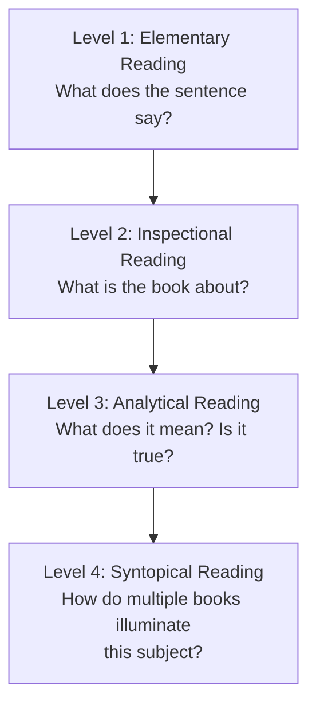

# Core Concepts

## The 4 Levels of Reading

Adler and Van Doren organize reading into four cumulative levels. Each higher level subsumes and builds on the ones below it.

### Level 1: Elementary Reading

This is the foundational literacy most people acquire in primary school. It involves:
- Recognizing words on the page
- Understanding basic vocabulary and syntax
- Grasping the literal meaning of sentences
- Following a linear narrative or exposition

Adler notes that most Americans are literate at this level but have never moved beyond it. Remedial reading courses, speed-reading programs, and most school instruction target only this level. The tragedy is that students graduate capable of decoding text but unable to extract significant understanding from a challenging book.

**Four stages of elementary reading:**
1. Reading readiness (pre-school)
2. Learning to read simple texts (grade 1)
3. Rapid vocabulary growth and contextual reading (grades 2–3)
4. Refinement and adaptation to different materials (grades 4+)

### Level 2: Inspectional Reading

Inspectional reading is the art of extracting the maximum value from a book in a limited time. It has two components:

**Systematic Skimming (Pre-reading)**
- Read the title and preface
- Study the table of contents (the skeleton of the book)
- Check the index for key terms and coverage
- Read the publisher's blurb
- Scan chapters that seem pivotal (read opening and closing paragraphs)
- Dip in and out — read a paragraph or two here and there, never more than a few pages

Time investment: 15–60 minutes. Outcome: you should know the book's subject, structure, and whether it deserves a full analytical reading.

**Superficial Reading**
- Read the entire book straight through without stopping
- Do not look up unfamiliar words, consult references, or ponder difficult passages
- Do not stop to take notes or underline
- Focus only on what you *can* understand on the first pass

This seems counterintuitive, but Adler insists it is the most important rule for tackling a difficult book. The first reading gives you the whole; subsequent readings fill in the parts. Trying to understand everything at once guarantees understanding nothing.

**Why inspectional reading matters:** Most readers open a book on page 1 and plow through linearly, trying to understand the details while simultaneously grasping the whole. This compounds difficulty. Inspectional reading separates these tasks: first get the big picture, then dig into details.

### Level 3: Analytical Reading

Analytical reading is thorough, complete reading — the best you can do with unlimited time. It is the heart of the book. The method comprises 15 rules in three stages.

#### Stage 1: Outlining the Structure (Rules 1–4)
*Answer: What is this book about as a whole?*

**Rule 1 — Classify the book.**
Know the kind and subject matter before you start. Is it theoretical (aiming to teach something that is true) or practical (aiming to guide action)? Is it history, science, philosophy, or fiction? The genre determines how you read.

**Rule 2 — State the unity in a single sentence.**
What is the one thing this book is about? If you cannot state the whole in a sentence or short paragraph, you have not grasped it.

**Rule 3 — Outline the major parts.**
Enumerate the book's main parts and show how they relate to each other and to the whole. Each part may have its own structure. A good outline reveals the book's architecture.

**Rule 4 — Define the author's problems.**
Every book answers questions. What questions does the author set out to solve? Find them.

#### Stage 2: Interpreting the Content (Rules 5–8)
*Answer: What is being said in detail, and how?*

**Rule 5 — Come to terms with the author.**
Identify the author's key words and discover the precise meanings (terms) attached to them. Words are the vehicles; terms are the cargo. If you and the author mean different things by the same word, communication fails.

**Rule 6 — Find the key propositions.**
Mark the most important sentences. Discover the propositions they contain — the judgments the author asserts. Test your understanding by restating the proposition in your own words or by giving a concrete example.

**Rule 7 — Locate the arguments.**
An argument is a sequence of propositions, some of which support others. Find the author's arguments by following the logical connections between sentences and paragraphs.

**Rule 8 — Determine the author's solutions.**
Which problems did the author solve? Which remain unsolved? Did the author recognize the failures?

#### Stage 3: Criticizing the Book (Rules 9–15)
*Answer: Is it true? What of it?*

**Rule 9 — Do not criticize until you understand.**
The general maxims of intellectual etiquette: suspend judgment until you can say "I understand" with reasonable certainty. Premature criticism is the mark of a poor reader.

**Rule 10 — Disagree reasonably, not contentiously.**
Read to learn the truth, not to win arguments. Be prepared to agree as well as disagree.

**Rule 11 — Ground criticism in knowledge, not opinion.**
Distinguish between genuine knowledge and mere personal prejudice. Give reasons for every criticism.

**Four specific criticisms (Rules 12–15):**
12. The author is **uninformed** (missing relevant facts or data)
13. The author is **misinformed** (asserting what is false)
14. The author is **illogical** (reasoning contains fallacies or contradictions)
15. The author's analysis is **incomplete** (did not solve all problems, or did not see implications)

Rules 12–14, if proved, invalidate the author's thesis. Rule 15 is a judgment of quality — the book is inadequate even if what it says is true.

### Level 4: Syntopical Reading

Syntopical reading is the most advanced and demanding level — reading multiple books on the same subject to construct a comprehensive, dialectically objective analysis. It is not mere comparison or book-reporting.

**The goal:** To understand the subject, not any single book. The syntopical reader builds an analysis that may not exist in any of the books individually.

**Two phases:**

*Phase 1: Inspectional preparation*
- Survey the field: create a bibliography through research and recommendations
- Inspect each book to determine relevance — use systematic skimming
- Narrow the bibliography to the most relevant works

*Phase 2: Syntopical reading proper — five steps*

**Step 1 — Find the relevant passages.**
You are not reading each book whole; you are mining specific passages relevant to your subject. Use the table of contents and index to locate them quickly.

**Step 2 — Bring the authors to terms.**
Different authors use different words for the same concepts. You must establish a neutral terminology that translates across authors. Without this, comparison is impossible.

**Step 3 — Define the issues.**
For each question, identify the range of answers authors give. An issue exists when authors give conflicting answers to the same question (once translated into neutral terms).

**Step 4 — Order the questions.**
Arrange the issues in a logical sequence that throws maximum light on the subject. Some questions are more fundamental than others; begin there.

**Step 5 — Analyze the discussion.**
Write the analysis. Present the different positions, the supporting arguments, and the dialectical interplay. The goal is not to produce a synthetic answer but to map the intellectual terrain with objectivity.

---

## The Four Questions for Every Book

Adler returns to these four questions throughout the book as the universal framework for active reading:

1. **What is the book about as a whole?** — Find the leading theme.
2. **What is being said in detail, and how?** — Grasp the main ideas, arguments, and propositions.
3. **Is it true?** — Judge critically, in whole or in part.
4. **What of it?** — Understand the significance and implications.

These questions apply at every level, but the depth of answer increases as you move from inspectional to analytical to syntopical reading.

---

## Marking Books

Adler is famous for his advocacy of marginalia. A book you have not marked is a book you have not read.

**What to mark:**
- Structural markers: underline key sentences, bracket key passages, number sequential arguments
- Interpretive markers: circle key words, write definitions in margins
- Critical markers: question marks for doubts, exclamation points for strong reactions, page references to other parts of the book
- Summaries: write your own outline at the end of each chapter

The physical act of marking forces active engagement. Adler recommends buying books rather than borrowing them for this reason — but if you must borrow, take separate notes.

---

## Different Genres Require Different Reading

Part Three of *How to Read a Book* adapts the analytical rules to specific genres.

**Practical books (how-to, ethics, politics):** Distinguish between what the author *proposes* and what they *prove*. The ultimate test is action — does it work in practice?

**Imaginative literature (novels, plays, poetry):** Do not apply analytical rules mechanically. Do not reduce a novel to its "message." Read for the experience. Criticism must address the work's unity and wholeness, not factual truth.

**History:** Every history is a story with a point of view. Identify the author's bias and scope. Ask: what is being included, excluded, and why? Read multiple histories of the same event.

**Science and mathematics:** Read the historical context first. Understand the problems the scientists were grappling with. For mathematics, know that the notations encode a language — learn the basic grammar.

**Philosophy:** Philosophical books grow out of questions that children ask but adults suppress. They cannot be settled by experiment. Read for the argument, not the rhetoric. Distinguish between the author's principle and their evidence.

**Social science:** Most social science is a hybrid of science, philosophy, and history. Be alert to unstated assumptions and ideological commitments.

---

## Coming to Terms with an Author

This is arguably the single most important skill in analytical reading. A *word* is a unit of language; a *term* is a unit of meaning. One word can represent many terms; one term can be expressed by many words.

**Method:**
1. Identify the key words — words that are ambiguous, technical, or used in a special sense
2. For each key word, determine from context which of several possible meanings the author intends
3. Test your understanding: does the author's usage remain consistent throughout? If not, the author is using the same word to mean different things — a flaw in the book or a misunderstanding on your part.

---

## Determining the Author's Message

Once you have established the terms, move to propositions and arguments.

**Propositions** are judgments — assertions that something is or is not the case. They are found in sentences, but not every sentence contains a proposition (questions, exclamations, and commands do not).

**Arguments** are sequences of propositions where some propositions provide reasons for others. Not every paragraph contains an argument. Not every argument is confined to a single paragraph.

**To find the message:**
1. Mark the most important sentences (usually the ones hardest to understand)
2. Restate each proposition in your own words
3. Find the connections between propositions — which ones support which
4. Summarize the argument in a paragraph of your own

---

## Criticizing Fairly

The third stage of analytical reading is governed by what Adler calls "intellectual etiquette."

**Three general maxims:**
1. **Understand first.** Do not criticize until you have completed the first two stages. You must be able to say "I understand" before you can say "I agree," "I disagree," or "I suspend judgment."
2. **Disagree reasonably.** Do not be contentious. The goal is truth, not victory.
3. **Give reasons.** Distinguish between knowledge and mere personal opinion. If you cannot give reasons for your criticism, suspend judgment.

**Four specific criticisms (in increasing severity):**
- The author is uninformed
- The author is misinformed
- The author is illogical
- The author's analysis is incomplete

The first three, if proven, show the author is wrong. The fourth is not a claim of error but of inadequacy — the book may be correct as far as it goes, but it does not go far enough.

---

## Mental Models

**Reading as conversation.** Books are not passive objects but voices in a conversation. The reader's task is to listen, understand, respond, and ultimately decide whether to accept or reject what the author offers.

**Reading as eating.** Bacon's metaphor: some books are to be tasted (inspectional), some swallowed (entertainment), and some chewed and digested (analytical). The digestive metaphor captures the idea of making the book's substance part of yourself.

**The book as skeleton.** Outlining reveals the book's structure beneath the flesh of prose. The table of contents is the spine; the main parts are the limbs.

---

## Key Lessons

1. The best readers are the most active readers. Highlighting, taking notes, asking questions — these are not optional activities but the very definition of reading.
2. You cannot understand a difficult book on the first read. Always do a superficial pass before an analytical pass.
3. Reading speed should vary. There is no single "correct" reading speed.
4. The quality of your reading is proportional to the quality of your questions.
5. To understand a subject deeply, you must read multiple authors with conflicting viewpoints on that subject.
6. The most important criticism you can make is not that an author is wrong, but that they are incomplete.
7. The ultimate goal of reading is the growth of the mind — not the accumulation of information but the expansion of understanding.

---

## Practical Applications

### How to Inspect a Book in 15 Minutes

1. Read the title page and preface (1 minute)
2. Read the table of contents (2 minutes)
3. Scan the index for key terms (2 minutes)
4. Read the publisher's blurb (1 minute)
5. Scan the key chapters — read opening and closing paragraphs (5 minutes)
6. Dip in and out — read a paragraph here and there in the remaining chapters (4 minutes)

Outcome: you now know what the book is about, its structure, the author's main thesis, and whether you want to read it analytically.

### How to Find the Argument

1. Mark sentences that express the author's judgments (not facts, examples, or digressions)
2. Restate each judgment in your own words
3. Look for logical connectors — if/then, therefore, because, thus — these signal argument structure
4. Map the flow: which claims support which conclusions
5. Write a one-paragraph summary of the argument in your own words

### How to Criticize Fairly

1. Read the entire book and complete your outline first
2. Ask: do I understand the author's main arguments? Test by explaining them to someone else
3. If yes, ask: am I emotionally or ideologically triggered by any of this? If so, examine your own biases
4. Now critique: is the author uninformed? Misinformed? Illogical? Incomplete?
5. Write your criticism with specific references and reasons. Never say "I disagree" without supporting it.

---

## Examples from the Book

Adler walks through extended examples, most notably:

**Newton's *Principia* —** How to read a classic of science. First understand the historical problem (what was known before Newton). Then grasp the fundamental concepts (mass, force, acceleration). Then follow the argument (the laws of motion, universal gravitation). Finally, assess (is it true? within what limits?).

**Aristotle's *Ethics* —** How to read philosophy. Identify the practical question (how should a person live?). Find the key terms (virtue, eudaimonia, mean). Trace the argument (the function argument, the doctrine of the mean). Criticize (is the function argument sound? does modern psychology challenge it?).

**Darwin's *Origin of Species* —** How to read a revolutionary text. Recognize the rhetorical structure (building a case against special creation). Find the key arguments (variation, natural selection, common descent). Understand what Darwin proved and what he left unresolved.

---

## Action Plan

**Month 1:** Master inspectional reading. For every book you pick up, spend 15 minutes on systematic skimming before deciding whether to read it fully. Practice superficial reading on one challenging book — read it straight through without stopping, then decide if it deserves a second analytical pass.

**Month 2:** Practice the first stage of analytical reading (Rules 1–4). For each book you commit to, write: (1) the classification, (2) the unity in one sentence, (3) an outline of major parts, (4) the author's central problems.

**Month 3:** Add the second stage (Rules 5–8). For each analytical reading project, also: (5) identify and define key terms, (6) mark key propositions, (7) locate the argument structure, (8) determine the author's solutions.

**Month 4:** Add the third stage (Rules 9–15). Criticize fairly. Write a review that includes both understanding and reasoned critique. If you disagree, cite which of the four criticisms applies and why.

**Month 5 onward:** Take on a syntopical project. Choose a subject you want to understand deeply. Create a bibliography of 10–15 books. Use inspectional reading to narrow to 5–7. Apply the five-step syntopical method. Write a synthetic analysis that maps the intellectual terrain.
