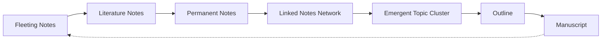

## Core Concepts

### Zettelkasten (Slip-Box)

The Zettelkasten — German for "slip-box" — is a personal knowledge management system built on a simple idea: instead of filing notes into categories, you store each idea as an independent, numbered note and link it to related notes. Luhmann used a physical box of 4x6 inch index cards. Each card got a sequential number and could reference any other card by number. The result was a hypertext network decades before the web existed.

### Atomic Notes

The fundamental unit of a Zettelkasten is the atomic note: one idea, captured in your own words, self-contained enough to be understood without context. Atomicity forces precision. You cannot usefully write a one-idea card about "World War II" — you must break it into specific claims: "The Treaty of Versailles contributed to WWII," "Stalin's non-aggression pact enabled the invasion of Poland," etc. Each becomes a node in a web.

### The Bottom-Up Approach

Traditional writing begins top-down: choose a topic, create an outline, fill in sections. The Zettelkasten works bottom-up: you collect atomic notes on what genuinely interests you, link them as you go, and when a cluster of interconnected notes reaches critical mass, a topic emerges. You then structure that cluster into an outline. The outline follows the notes, not the other way around.

### Connection Over Collection

Most note-taking is collecting: underlines, highlights, clipped articles, saved bookmarks. The Zettelkasten replaces collection with connection. The question shifts from "what have I saved?" to "how does this new idea relate to what I already know?" Every new note must be linked to at least one existing note — this constraint is the engine of understanding.

### The Slip-Box as Thinking Partner

Luhmann described his Zettelkasten as an independent interlocutor. When you link notes, you create propositions. When you follow a link chain, you encounter ideas you didn't expect. The slip-box pushes back, reveals gaps, suggests connections you hadn't considered. It externalizes the conversation we normally have only inside our heads.

### Writing as the Medium

Ahrens argues that writing is not what you do after you've finished thinking — it is the medium through which thinking happens. Every note is a piece of writing. Every link is a claim about how two ideas relate. Over time, the slip-box accumulates not just facts but arguments, questions, and nascent theories.

### Feedback Loops

A healthy Zettelkasten creates multiple feedback loops:
- **Clarity feedback**: if you can't write a note clearly, you don't understand the idea
- **Connection feedback**: if you can't link a new note to existing ones, either the note is irrelevant or you have a gap
- **Emergence feedback**: when notes cluster, they suggest topics you hadn't planned to pursue
- **Revisitation feedback**: re-reading old notes surfaces contradictions and new insights

### Luhmann's Method

Niklas Luhmann (1927–1998) developed the Zettelkasten as a graduate student and used it for his entire career. His 90,000+ cards supported the publication of 70 books and hundreds of articles across sociology, law, philosophy, and systems theory. He described the system as his "main research tool" — he did not write books and then file notes; he maintained notes and books emerged from them.

### Paradox of Choice

The more options you have, the harder it is to decide. The Zettelkasten solves this by committing ideas to a fixed form (the note) and a fixed position (among linked neighbors). Constraints — not freedom — enable creative output. By limiting each note to one idea and requiring it to connect to the existing network, you channel your thinking productively.

## Frameworks

### The Zettelkasten Workflow

### The Three Types of Notes

1. **Fleeting notes** — quick captures of ideas, quotes, or thoughts. Their purpose is to offload your working memory. They are temporary and should be processed within 1-2 days or discarded.
2. **Literature notes** — written while reading. A literature note captures a single idea from a source in your own words, always citing the source. It is not a summary of the book but a selection of what you found meaningful.
3. **Permanent notes** — the heart of the Zettelkasten. Each permanent note is an atomic idea, written as if for an audience, linked to other permanent notes. This is where thinking happens.

### The Reading-to-Writing Pipeline

1. Read with a pen in hand — capture fleeting and literature notes
2. At the end of each reading session, convert literature notes into permanent notes
3. File each permanent note behind a related existing note (or create a new entry point)
4. Add links to relevant notes you already have
5. Periodically review entry points and structure notes to survey emerging clusters
6. When a cluster grows large enough, assemble an outline and write

## Mental Models

- **External cognition**: The slip-box extends your mind — it remembers precisely, recalls associatively, and surfaces non-obvious connections. You think *with* it, not just inside your head.
- **Compounding knowledge**: Each note becomes more valuable as it accumulates links. A note with zero links is dead; a note with twenty links is a hub that generates insights.
- **Selective forgetting**: By externalizing ideas, you free your brain for higher-level synthesis. The slip-box handles storage; your mind handles integration.
- **Spaced repetition by proxy**: Revisiting old notes (when linking new ones) naturally creates spaced retrieval practice without a separate schedule.
- **The blind spot of note-taking**: Most people confuse note-taking for learning. Taking a note is not understanding — understanding requires transforming the idea into your own words and connecting it.

## Key Lessons

1. **Never write a note without a link** — if you cannot connect a new idea, you haven't understood it well enough yet
2. **Write in complete sentences** — notes should be understandable months later without additional context
3. **One note per idea** — splitting forces you to be precise; lumping lets you hide confusion
4. **Cite the source** — every claim needs provenance; the slip-box is not a place for unsourced opinion
5. **Use your own words** — paraphrasing is understanding; quoting is deferred comprehension
6. **Don't categorize; connect** — folders and tags create artificial silos; links create emergent structure
7. **Trust the process** — a Zettelkasten takes months to become useful and years to become powerful
8. **Read with intention** — every book you read should produce at least a few permanent notes
9. **Structure notes are signposts** — occasional index notes that map a cluster of ideas are fine, but they describe what is, not what should be
10. **Abandon perfectionism** — a rough note linked well is better than a polished note sitting in isolation

## Practical Applications

### Setting Up a Digital Zettelkasten

The book is intentionally tool-agnostic, but modern implementations work well:

**Obsidian** — local-first, plain-text Markdown, bidirectional links, graph view. Best for privacy and longevity. Create a `Zettelkasten/` vault, write one file per note, use `[[wiki-links]]` for connections.

**Roam Research** — block-level references, daily notes as entry point, powerful querying. Better for those who think in outlines.

**Logseq** — open-source, local-first like Obsidian but with outliner structure like Roam. Good middle ground.

**Notion** — possible but suboptimal. Relational databases are too structured for bottom-up emergence; links are less fluid.

**Analog** — index cards in a box, numbered sequentially, with handwritten links. Slower but forces deeper processing. Luhmann worked this way for 40 years.

### The Weekly Review Habit

1. Process fleeting notes into permanent notes (1x/week)
2. Scan for orphan notes (those with 0-1 links) — either link them or archive them
3. Review structure notes — do they still accurately map the cluster?
4. Identify emerging topics — which clusters are growing?

### Common Mistakes

- Taking notes that are too long (an atomic note should fit on a 4x6 card)
- Collecting without processing (fleeting notes pile up and become noise)
- Linking everything (links should be meaningful, not exhaustive)
- Perfectionism (waiting for the perfect note before linking kills momentum)
- Copying instead of thinking (direct quotes bypass understanding)

## Examples

**Luhmann's output**: Over 40 years, Luhmann maintained ~90,000 notes and produced 70+ books and 400+ articles. His Zettelkasten was not auxiliary to his writing — it *was* his writing process. He described writing as simply "following the links."

**Ahrens' own process**: Ahrens demonstrates the method by writing the book itself as a demonstration. Each chapter emerges from clusters of notes, showing rather than just telling.

**A real workflow**: A researcher reads Kahneman's *Thinking, Fast and Slow*. She creates literature notes on anchoring, availability heuristic, and confirmation bias. She links "anchoring" to an existing note on "reference dependence" from a behavioral economics paper. Three months later, when drafting a paper on pricing psychology, she finds five linked notes on her cluster and writes the literature review in an afternoon.

## Action Plan

1. **Choose your medium** — analog (index cards) or digital (Obsidian/Logseq)
2. **Set up the inbox** — a single place for fleeting notes (Drafts, physical notebook, a text file)
3. **Process one book** — read a chapter, create literature notes, convert to permanent notes with links
4. **Add one note per day** — consistency beats volume; 365 notes in a year is a substantial Zettelkasten
5. **Weekly review** — 30 minutes to process fleeting notes and review orphan notes
6. **Write from your notes** — pick one cluster and write a short article or essay using only your notes as source material
7. **Iterate for 3 months** — a Zettelkasten reveals its value only after sustained use

