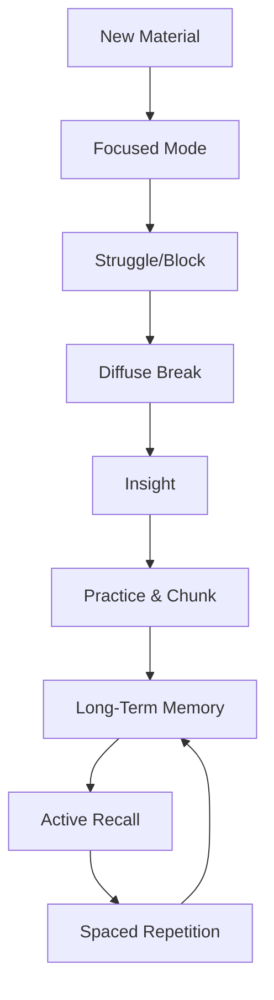

# Core Concepts

## Focused vs Diffuse Mode

The book's foundational idea is that the brain operates in two distinct modes. Oakley uses a pinball machine metaphor: focused mode is like a pinball machine with tightly spaced rubber bumpers — the ball (your attention) moves along well-worn, familiar paths. This mode is essential for problem-solving, computation, and concentrated work. It uses the prefrontal cortex and works with what you already know.

Diffuse mode, by contrast, is a pinball machine with bumpers spaced far apart. The ball travels long, arcing paths, allowing connections between distant ideas. This mode activates when you relax, daydream, exercise, or shower. It cannot solve precise problems but excels at generating insight, creative leaps, and big-picture understanding.

The critical insight: you cannot be in both modes simultaneously. When you are stuck on a problem, staying in focused mode only drives the same neural ruts deeper. The solution is to disengage — take a walk, sleep on it, do something unrelated — and allow diffuse mode to make novel connections. Learning is the art of cycling between these two states.

## Chunking

A chunk is a neural pattern — a compact package of information your brain treats as a single unit. When you learn a new concept, your brain physically builds a neural pathway. With practice and repetition, that pathway becomes more myelinated (insulated like an electrical wire), and the information can be loaded as one chunk rather than many separate pieces.

Oakley presents a four-stage chunking process:

**Stage 1 — Focused Attention:** The chunking process begins by giving your undivided attention to the material. Multitasking prevents chunk formation because the brain never enters the focused mode necessary to build the initial pattern.

**Stage 2 — Understanding:** You must grasp the basic idea. Understanding is like having a "neural hook" — without it, there is nothing for the chunk to hang on to. But understanding alone is not enough; it creates the illusion of competence.

**Stage 3 — Practice in Context:** You must practice the concept in the context of what you are learning. This means doing problems, applying the idea, seeing how it fits with other chunks you already possess. Context tells your brain when to use this particular chunk and when not to.

**Stage 4 — Repetition and Spaced Practice:** The chunk must be reinforced across multiple sessions. Information reviewed within 24 hours, then again within a few days, then a week later, creates strong neural traces. Cramming creates weak, brittle traces that fade quickly.

## Procrastination

Procrastination is not laziness. Oakley explains that when you look at something you do not want to do, your brain's insular cortex — the region that processes pain and disgust — activates. The pain is real, neurologically speaking. Your brain seeks to avoid this discomfort, and the easiest escape is to do something else (checking social media, cleaning your room, anything).

The problem compounds because avoiding the task provides relief, which reinforces the avoidance behavior. Over time, you train your brain to procrastinate more efficiently.

The solution is not to eliminate the pain but to bypass it. The 20-minute rule is key: committing to just 20 minutes of work is not enough to trigger the full pain response. Most of the time, after 20 minutes, the task no longer feels painful because your brain has built initial neural pathways and the novelty has worn off.

## Pomodoro Technique

The Pomodoro Technique is the behavioral backbone of the book. Francesco Cirillo invented it in the 1980s, but Oakley adapts it specifically for learning:

1. Set a timer for 25 minutes.
2. Work with complete focus on a single task.
3. When the timer rings, take a 5-minute break.
4. After four Pomodoros, take a longer break (15-30 minutes).

The 25-minute window is short enough to bypass procrastination pain, long enough to build meaningful focused-mode work. The 5-minute break is critical — it allows diffuse mode to activate. During the break, you should physically get up, move, look away from screens, and let your mind wander. The break is part of the learning process, not a reward.

## Active Recall

Active recall is the single most powerful learning technique in the book, backed by decades of cognitive science. It works like this: after reading a page or chapter, close the book and try to recall the main ideas in your own words. Do not look at the text. Struggle with the retrieval.

The effort of retrieval strengthens the neural pathways associated with the information. Each act of recall reinforces the chunk. Passive review (re-reading, highlighting, underlining) creates what psychologists call the "fluency illusion" — the material feels familiar, so you think you know it, but you have not built the retrieval strength necessary to access it later.

Oakley recommends the "retrieval practice" approach: recall, check your recall against the source, identify gaps, and repeat. Self-testing is not assessment — it is learning.

## Spaced Repetition

Ebbinghaus's forgetting curve shows that memory decays exponentially unless reinforced. The book teaches that repeating information across multiple days is dramatically more effective than massed practice (cramming).

The mechanism: each time you recall a piece of information just before you would have forgotten it, you strengthen the neural trace and slow the decay. Spaced repetition systems (like flashcards or Anki) automate this timing. For school subjects, Oakley suggests reviewing material within 24 hours, then again at the end of the week, then after a month.

Sleep plays a role here: during sleep, your brain replays and consolidates the day's learning. A night of sleep between study sessions strengthens memories more than the same amount of time awake.

## Interleaving

Interleaving is the practice of mixing different types of problems or topics within a single study session. The opposite is blocked practice (doing all problems of type A, then all of type B). Blocked practice feels more effective because you get more right answers during practice, but interleaving produces superior long-term learning.

The reason: interleaving forces your brain to discriminate between problem types and select the right approach. In real tests, problems are mixed. Blocked practice leaves you unprepared for this. The book recommends mixing chapter reviews, alternating subjects within study sessions, and deliberately creating varied practice sets.

## Memory Palace

The memory palace (Method of Loci) is an ancient mnemonic technique that Oakley adapts for modern learners. The idea: visualize a familiar physical space (your house, your school, a walking route) and mentally place the items you want to remember at specific locations within that space.

The technique works because spatial memory is evolutionarily ancient and powerful. By attaching abstract information to vivid, bizarre, or emotional images placed in a remembered space, you leverage the brain's natural navigation systems. Oakley emphasizes that the images should be funny, strange, or even grotesque — the brain remembers unusual things better than ordinary ones.

## Sleep and Learning

Sleep is not a break from learning — it is an active phase of the learning process. Oakley explains three roles of sleep:

First, the glymphatic system clears metabolic waste products from the brain during deep sleep. This is the brain's physical maintenance cycle. Without sufficient sleep, this cleanup is incomplete, and cognitive function degrades.

Second, sleep consolidates memories. During slow-wave sleep, the hippocampus replays the day's experiences, transferring them to the cortex for long-term storage. During REM sleep, the brain makes creative connections between stored information.

Third, sleep resets attention and focus. A tired brain cannot enter focused mode effectively. The book warns that pulling all-nighters before exams is counterproductive — the time spent sleeping would have been more beneficial than the time spent cramming.

## Metaphors as Learning Accelerators

Metaphors are not literary decoration — they are learning tools. When you learn something new, your brain has no existing neural pattern for it. A metaphor connects the new concept to something you already understand, providing a "neural hook" that makes the new information graspable.

Oakley uses metaphors throughout the book: the pinball machine for focused/diffuse modes, the octopus for working memory (limited tentacles), the "zombie" for habitual responses, and the "brain-link" for neural chunks. She encourages readers to create their own metaphors. The process of inventing a metaphor forces you to understand the underlying concept deeply.

## Deliberate Practice vs Lazy Learning

Not all practice is equal. Lazy learning means practicing what you already know — solving the same type of problem repeatedly, reviewing familiar material. It feels productive but produces minimal growth.

Deliberate practice targets the edge of your ability. It involves working on material that is just beyond your current competence, making errors, getting feedback, and adjusting. This is where chunk formation happens most efficiently. The book contrasts "learning" (building chunks through deliberate practice) with "lazy learning" (repeating what you already know and calling it studying).

# Frameworks

## Two-Mode Learning Cycle

## Chunking Formation Process
1. Focus entirely on the material (Pomodoro helps).
2. Understand the core idea deeply enough to explain it.
3. Practice in context — solve problems, apply the concept.
4. Repeat across multiple sessions with spacing.

## ZIP Learning (Zombie + Insight + Practice)
Oakley describes "zombies" as habitual neural patterns — automatic responses that run without conscious thought. ZIP Learning means: recognize when you are in a zombie (habitual, non-conscious) learning mode, break into diffuse mode for insight, then return to focused practice to install the new understanding as a chunk.

## Pomodoro Cycle
25 minutes focused work → 5 minutes diffuse break (walk, stretch, doodle) → repeat 4 times → longer 15-30 minute break. Each Pomodoro is one cycle of focused/diffuse switching.

# Mental Models

**Pinball Machine:** Focused mode = tight bumpers, narrow thinking. Diffuse mode = loose bumpers, broad connections. You need the right machine for the right task.

**Brain-Links:** Learning is building chains of neurons that fire together. Each time you practice, you strengthen the link (myelination). Chunks are bundles of brain-links.

**Attentional Octopus:** Working memory is an octopus with four tentacles. Each tentacle holds one piece of information. When you chunk information, the octopus grips the chunk as one item, freeing tentacles for more information.

**Rut Think:** Sticking with the same approach because your brain has worn a neural groove (rut). Break it by switching to diffuse mode, using metaphor, or physically moving.

**Activation Threshold:** Each chunk has an activation threshold — how much stimulation it needs before it fires. Practice lowers the threshold. Well-practiced chunks fire automatically; new ones require deliberate effort.

# Key Lessons

1. **Alternate focused and diffuse thinking.** When stuck on a problem, walk away. The answer often comes when you stop looking.
2. **Build chunks through the four-stage process.** Understanding is necessary but not sufficient. Context and repetition are what cement learning.
3. **Use Pomodoro to bypass procrastination.** Twenty-five minutes is manageable. The pain of starting is the real enemy.
4. **Close the book and recall.** Re-reading is the most common yet least effective study strategy. Retrieval practice is where real learning happens.
5. **Space your practice across days.** One hour today, one hour tomorrow, one hour next week beats three hours today.
6. **Mix topics during study.** Interleaving builds discrimination skills. Do not block-practice one chapter at a time.
7. **Create vivid metaphors and images.** Abstract ideas need concrete anchors. The weirder the image, the better you remember.
8. **Use the memory palace for lists and sequences.** Spatial memory is powerful and underutilized.
9. **Prioritize sleep.** Sleep is when memory consolidation and neural cleanup happen. All-nighters erode the learning they aim to create.
10. **Teach to learn.** Explaining a concept to someone else forces you to organize your understanding and reveals gaps in your chunk.

# Practical Applications

**Math:** Work example problems step-by-step, then close the solution and re-solve from scratch. Use Pomodoro for problem sets. Interleave chapter reviews. Create metaphors for abstract concepts (integrals as "area under the curve" visualized as stacking blocks).

**Science:** Use the memory palace for biological processes and taxonomies. Active recall for chemical reactions and formulas. Spaced repetition for vocabulary. Sketch processes from memory then check against the book.

**Languages:** Spaced repetition for vocabulary (Anki). Memory palace for gendered nouns and verb conjugations. Active recall: cover the translation, retrieve it, check. Interleave grammar topics rather than mastering one before moving to the next.

**Programming:** Work on small coding challenges. When stuck, take a walk (diffuse mode). Chunk patterns (function structures, design patterns) through repeated practice. Use metaphors for abstractions (variables as boxes, recursion as Russian dolls).

**Music:** Chunk difficult passages (practice small sections until they become automatic). Sleep between practice sessions. Use diffuse mode (shower, walk) to feel the phrasing and emotional arc.

**Test Prep:** Prepare using the checklist method: preview the chapter (picture-walk), read actively, recall after each section, do practice tests under timed conditions, review errors, sleep well before the exam.

# Examples

Oakley uses the story of Salvador Dali and Thomas Edison: both would hold an object (keys, ball bearings) while relaxing in a chair, letting their minds drift into diffuse mode. As they fell asleep, the object would drop, waking them — and they would capture the diffuse-mode insights before they were lost. This is the physical embodiment of focused-diffuse switching.

The "10 ideas for learning" list includes: use recall, test yourself, chunk problems, space your practice, alternate techniques (interleaving), take breaks, use explanatory questioning and simple analogies, focus, eat your frogs first (hardest task first), and make a mental contrast between your current state and your goal.

The book opens with Barbara flunking math and becoming convinced she was not smart enough for technical subjects. She took a break from academics, worked as a Russian translator in the Army, and later discovered learning techniques that transformed her from math-phobe to engineering professor. This narrative recurs throughout as proof that learning ability can change.

# Action Plan

**Today:**
1. Pick one difficult subject and do one Pomodoro on it.
2. After a chapter, close the book and write everything you remember.
3. Go for a 15-minute walk without your phone.

**This Week:**
1. Set up a spaced repetition schedule for one subject.
2. Create one memory palace for a list you need to memorize.
3. Interleave problems from three different chapters in one study session.

**This Month:**
1. Track procrastination triggers and plan Pomodoros around them.
2. Practice teaching a concept to someone else (or an imaginary audience).
3. Establish a consistent sleep schedule, aiming for 8+ hours.
4. Build metaphors for the three most challenging concepts in your current study.
