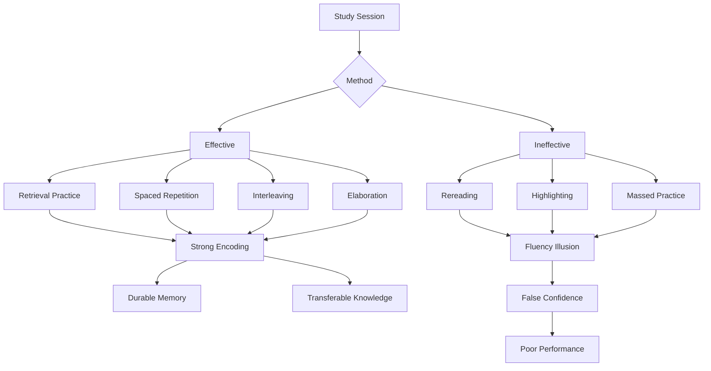
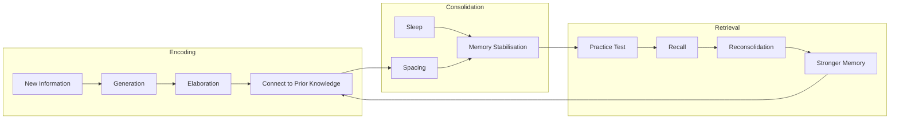

# Core Concepts

## Retrieval Practice

Retrieval practice is the single most powerful learning strategy documented in the book. It rests on the testing effect: the act of recalling information from memory does not merely measure learning — it changes the memory itself, strengthening neural pathways and making future recall more reliable. The effect has been demonstrated across hundreds of studies. Karpicke and Roediger's 2008 experiment in *Science* is the canonical example: students who practised retrieval retained 80% of material after one week, while those who simply reread retained only 36%. The gap persisted at longer delays.

The mechanism involves reconsolidation. Each time a memory is retrieved, it becomes labile and is re-stored with greater strength and more contextual connections. Failed retrieval is also valuable — it primes the brain to encode the correct answer more deeply when it is encountered. This is why low-stakes quizzing, flashcards, and free recall (closing the book and writing down everything you remember) outperform highlighting, underlining, and passive review.

Critically, retrieval practice works best when it is effortful and spaced. Easy retrieval — reviewing a flashcard the moment you have seen it — produces minimal strengthening. The optimal retrieval is just difficult enough that the answer does not come immediately, which is why spacing and interleaving amplify its effects.

## Spaced Repetition

Spaced repetition is the practice of distributing study sessions across time rather than massing them into a single block. The spacing effect is one of the most robust findings in cognitive psychology. Cepeda et al. (2006) conducted a meta-analysis of 184 studies and found that spaced practice consistently outperformed massed practice by 10–30% on delayed tests. The optimal gap between sessions depends on how long you need to retain the material — longer retention intervals benefit from longer spacing between study sessions.

The mechanism involves consolidation, the process by which short-term memories are stabilised into long-term representations. During the interval between study sessions, some forgetting naturally occurs. When you re-engage with the material, the effort of re-retrieval strengthens the memory trace far more than if you had reviewed it while it was still fresh. This is why the book emphasises that forgetting is not the enemy of learning but its partner — a little forgetting between sessions makes each re-encounter more productive.

Practical implementation follows an expanding schedule: review new material within a day, then a few days later, then a week, then a month. Digital tools like Anki automate this schedule using spaced-repetition algorithms. The key principle is to time each review just as the memory begins to fade, maximising the retrieval effort per session.

## Desirable Difficulties

The concept of desirable difficulties, coined by Robert Bjork, is the book's meta-framework. It describes learning conditions that impede performance during practice but enhance long-term retention and transfer. The paradox at the heart of the book is that the strategies students find most frustrating — testing instead of rereading, spacing instead of cramming, interleaving instead of blocking — produce the best outcomes, while the strategies that feel productive create only the illusion of mastery.

The book identifies several specific desirable difficulties: retrieval (harder than rereading, but far more effective), spacing (harder than massing, but produces durable memory), interleaving (harder than blocking, but builds discrimination skills), generation (attempting a solution before being shown the answer), and varied practice (practising in different contexts rather than repeating the same drill). Each shares a common structure: it slows observable performance while deepening underlying learning.

The difficulty must be desirable — not all difficulties help. Overwhelming confusion, excessive cognitive load, and tasks beyond the learner's current competence can impair learning. The sweet spot is effortful but achievable, where the learner must stretch but can succeed with persistence. This is closely related to Vygotsky's zone of proximal development.

## Interleaving

Interleaving means mixing different but related topics or problem types within a single study session, rather than practising one type exhaustively before moving to the next (blocked practice). Rohrer and Taylor (2007) demonstrated the effect clearly: students who interleaved practice problems on calculating the volumes of different geometric solids scored 43% higher on a delayed test than those who practised each solid type in separate blocks.

Interleaving works for two reasons. First, it forces the learner to practise discriminating between problem types and selecting the appropriate solution strategy — a skill that blocked practice never trains because the problem type is obvious from context. Second, it increases spacing between encounters with any given type, adding the benefits of spaced repetition. The result is learning that transfers more robustly to novel situations.

Interleaving feels slower and more error-prone during practice. Students in blocked conditions typically perform better during the practice session itself, which creates a powerful illusion of superior learning. The test reveals the truth: blocked practice produces short-term fluency and long-term fragility, while interleaving produces the opposite pattern.

## Elaboration

Elaboration is the process of giving new material meaning by expressing it in your own words and connecting it to knowledge you already possess. It is not the same as rereading or reviewing notes — it requires active construction of relational links. When you elaborate, you ask yourself: how does this concept relate to what I already know? Can I think of an example from my own experience? How would I explain this to someone else?

The power of elaboration lies in network-building. Memories are not isolated files; they are nodes in a web of associations. Each elaboration adds a new connection — to prior knowledge, to personal experience, to other concepts in the same domain. More connections mean more retrieval paths, which means the memory is more accessible from different starting points. Elaboration is one reason why teaching others (the Feynman Technique) is so effective: the act of translating an idea into simple language forces you to elaborate extensively.

The brain has no known limit to how much it can learn through elaboration, because each new piece of knowledge can be connected to an expanding network. This contrasts sharply with mechanical repetition, which quickly saturates short-term memory. Elaboration transforms learning from a storage problem into a meaning-making process.

## Generation Effect

The generation effect is the finding that attempting to produce an answer or solve a problem before being shown the solution leads to better learning than studying the solution directly. Even when the attempt produces an error, the learning benefit persists. The book illustrates this with classroom studies: students who tried to solve a physics problem before the lecture learned more from the lecture than students who simply listened.

Generation works by priming the brain to notice and encode the correct information. When you attempt a solution, you activate relevant prior knowledge and identify gaps in your understanding. The subsequent exposure to the correct answer fills those gaps — the error signal strengthens encoding. This is why the book recommends that instructors pose questions before delivering content and that students attempt to recall or reconstruct material before checking their notes.

Generation is closely related to retrieval practice but distinct: retrieval pulls previously encoded information from memory, while generation creates a novel response (which may be wrong) in the absence of prior encoding. Both involve productive struggle, and both outperform passive reception.

## Reflection

Reflection is a form of retrieval practice combined with elaboration. The book defines it as the habit of reviewing recent experiences, asking what worked, what did not, and what you would do differently. This act of structured retrospection strengthens the memory of the experience and extracts generalisable principles that can transfer to future situations.

Several studies cited in the book show that reflection improves learning in professional contexts. Surgeons who practised reflection performed better on subsequent procedures. Business students who kept learning journals showed deeper understanding of course concepts. Reflection combines the benefits of retrieval (you must recall the experience) and elaboration (you must connect it to broader principles and personal knowledge).

The key to effective reflection is structure. Unstructured thinking about past experience tends to reinforce existing biases. Guided reflection — asking specific questions about decisions, outcomes, and alternatives — produces reliable learning gains. The book recommends that students set aside time after each study session to summarise what they learned, identify what remains unclear, and connect new material to prior knowledge.

## Calibration

Calibration is the alignment of subjective confidence with objective performance. The book documents a pervasive metacognitive failure: people consistently overestimate how well they know material they have recently studied, especially when they have used ineffective strategies like rereading. The least competent learners overestimate their competence the most (the Dunning-Kruger effect).

The primary calibration tool is testing. Objective feedback — from quizzes, practice problems, peer comparison, or instructor evaluation — reveals the gap between perceived and actual knowledge. Without such feedback, learners continue to rely on fluency and familiarity as proxies for mastery, which produces systematic errors in self-assessment and study allocation.

Calibration requires repeated, low-stakes opportunities to test oneself. High-stakes exams provide feedback too late and too rarely. Frequent quizzing, even if it does not count toward a grade, gives learners the data they need to adjust their study strategies and focus on genuine weaknesses rather than imagined ones.

## Mnemonic Devices

Mnemonic devices are structured techniques for encoding information into memory using familiar patterns. The book discusses them as valuable supplements to retrieval practice, not replacements. The keyword method (linking a foreign word to a similar-sounding English word with a visual image), the method of loci (placing items along an imagined spatial path), and acronyms are the most common examples.

Mnemonics work by embedding new information into pre-existing mental structures, providing reliable retrieval cues. They are most useful for learning specific factual material: vocabulary, names, ordered lists, and technical terms. The book notes that mnemonics are less effective for conceptual understanding or transferable knowledge, which require elaboration and structure-building.

The authors caution against over-reliance on mnemonics. They are memory aids, not learning strategies. The goal of durable learning is not just to remember facts but to understand principles and develop mental models that generalise. Mnemonics serve the remembering component but do not build comprehension.

## Myth of Massed Practice

Massed practice — the single-minded, rapid-fire repetition of a skill or body of knowledge in a concentrated block — is the default study strategy for most learners. The book argues it is one of the least productive. Cramming for exams, practising the same piano scale for an hour, or drilling the same type of math problem until it becomes automatic all produce the same pattern: rapid short-term gains followed by rapid forgetting.

The illusion of massed practice arises from performance during practice. When you repeat the same thing over and over, your performance improves steadily and quickly. This improvement feels like learning. But the gains are largely due to short-term priming and procedural fluency, not durable memory. When tested after a delay — the condition that matters for real-world learning — massed practice consistently underperforms spaced practice.

The book traces this finding back to the earliest memory research: Ebbinghaus's forgetting curves (1885) already showed that spaced repetition dramatically outperformed massed presentation. Over a century of subsequent research has only strengthened the conclusion, yet massed practice remains dominant in educational settings because it feels productive and because its shortcomings are invisible within the typical course timeline.

## Fluency Illusion

The fluency illusion is the subjective feeling of knowing that arises from familiarity without recall. When you reread a textbook passage, the text becomes more familiar with each pass. That familiarity feels like understanding — you can follow the argument, recognise the terminology, and anticipate what comes next. But recognition is not recall. When you close the book and try to reproduce the argument from memory, you discover that the knowledge was never encoded.

The book identifies this as the most dangerous trap in learning. Students spend hours rereading and highlighting, mistaking growing familiarity for growing mastery. The feeling of fluency is seductive because it is produced by the very strategies that are least effective. Rereading generates fluency without learning; testing generates learning without fluency. The result is a systematic mismatch between perceived and actual preparation.

The antidote is to calibrate using objective measures. The book recommends that students replace the question "do I understand this?" with "can I recall and explain this without looking?" The first is answered by fluency; the second is answered only by retrieval practice.

---

# Frameworks

---

# Mental Models

1. **The Paradox of Effort**: Conditions that accelerate performance during learning (rereading, cramming, blocking) typically impair long-term retention. Conditions that slow performance (retrieval, spacing, interleaving) enhance it. Judge your learning by delayed test performance, not by how it feels.

2. **The Iceberg of Knowing**: Recognition is the tip above water — visible but shallow. Recall is the mass below — vast but invisible. Students mistake the tip for the whole. Only testing reveals the true size of the iceberg.

3. **The Scaffolding of Prior Knowledge**: New knowledge is not stored in isolation. It hangs on hooks provided by prior knowledge. The richer your existing mental models, the more new information you can integrate. Elaboration builds the scaffold; retrieval tests its strength.

4. **Forgetting as Feature, Not Bug**: Forgetting is not a failure of learning — it is a filtering mechanism that the brain uses to prioritise important information. Spaced repetition works with forgetting rather than against it, using each cycle of forgetting-and-relearning to strengthen what matters.

5. **The Calibration Loop**: Learn → Test → Compare confidence to result → Adjust strategy. Without the test, the loop breaks and you remain permanently overconfident in your weakest areas.

---

# Key Lessons

1. Close the book and recall. This single change — replacing rereading with free recall — produces the largest learning gain for the least effort.

2. Space your study sessions. Even a single-day gap between first exposure and review doubles long-term retention compared to immediate review.

3. Mix your practice. Every study session should include at least two related topics or skill types. The confusion you feel is the sound of discrimination learning.

4. Generate before you consume. Try to solve a problem, define a term, or explain a concept before looking at the answer. Errors are productive.

5. Elaborate constantly. Connect new material to personal experience, prior knowledge, and other domains. Ask "why" and "how is this like what I already know?"

6. Use objective self-assessment. Replace "do I understand this?" with "can I pass a test on this?" and then take the test.

7. Teach what you learn. The act of explaining forces elaboration, retrieval, and structure-building simultaneously.

---

# Practical Applications

**For Students**: Replace passive study sessions with active recall. Read a section, close the book, and write everything you remember. Then check. Use flashcards with spaced-repetition software (Anki, RemNote). Avoid blocking practice by topic — create mixed problem sets. Take frequent low-stakes practice tests.

**For Teachers**: Start each class with a brief retrieval warm-up (write everything you remember from last session). Interleave review questions from earlier units into current assignments. Explain to students why these methods work — the book shows that understanding the rationale improves adherence to effective strategies.

**For Self-Learners**: Learning a language? Use a spaced-repetition app for vocabulary. Learning to code? Interleave problem types rather than doing twenty of the same pattern. Learning an instrument? Practise in short, spaced sessions with varied pieces rather than repeating the same passage for an hour.

**For Organisations**: Redesign training programmes around retrieval and spacing rather than one-day workshops. Use pre-tests before training sessions (generation effect). Build spaced follow-up assessments into the learning path.

---

# Examples

**Medical Students and the Testing Effect**: A study cited in the book followed medical students studying anatomy. Those who took practice tests after each study session scored significantly higher on final exams than those who spent the same time reviewing. The gap persisted months later during clinical rotations.

**Geometry Students and Interleaving**: Students who interleaved practice problems for calculating the volumes of different geometric shapes (spheres, cones, cylinders mixed together) scored 43% higher on a delayed test than students who practised each shape type in separate blocks. During practice, the interleaving group performed worse and reported more frustration — the desirable difficulty.

**Pilot Training and Reflection**: The book describes a pilot training programme where trainees were required to reflect on each simulated flight: what went wrong, what they learned, and what they would do differently. Pilots who reflected outperformed those who simply completed the simulations, because reflection forced retrieval and elaboration of the experience.

**K-12 Classroom and Retrieval Practice**: In a multi-year study in a middle school, teachers who began each class with a short, low-stakes quiz (covering material from the previous lesson) saw students' grades rise from a C+ average to an A- average. The benefits persisted across the school year and transferred to other subjects.

---

# Action Plan

**Week 1**: Replace rereading with free recall. After every 10 pages of reading, close the book and write a summary from memory. Compare your summary to the text.

**Week 2**: Introduce spacing. Schedule three 20-minute sessions per topic per week instead of one 60-minute block. Use a calendar or Anki to track intervals.

**Week 3**: Add interleaving. For any subject with multiple sub-topics, create mixed practice sets. If you normally do 20 problems of type A then 20 of type B, do 10 mixed sets instead.

**Week 4**: Incorporate generation. Before reading a new section, spend 2 minutes trying to recall or reconstruct what you expect to learn. Before a lecture, try to solve related problems first.

**Week 5**: Build reflection into your routine. After each study session, spend 5 minutes writing: what did I learn? what was confusing? how does this connect to what I already know?

**Week 6**: Calibrate with objective testing. Create weekly practice tests for yourself. Compare your confidence ratings to your actual scores. Adjust study time toward areas where confidence exceeds competence.
