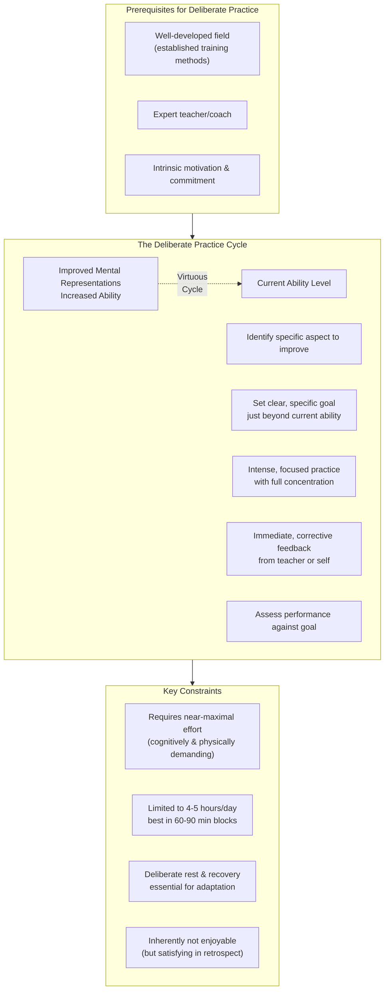
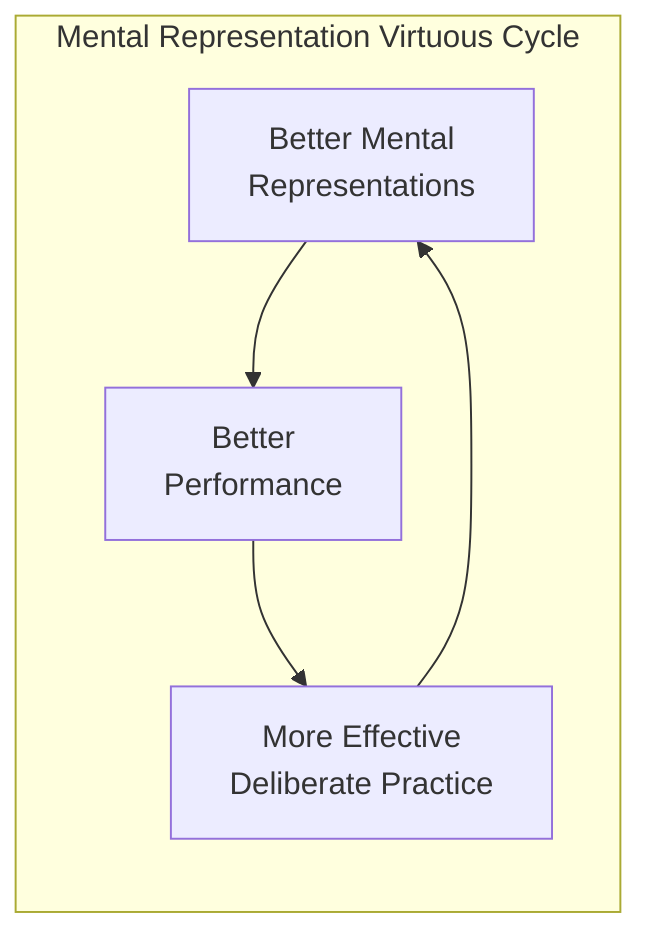

## Core Concepts

### Naive Practice vs Purposeful Practice vs Deliberate Practice

Ericsson defines three distinct levels of practice:

| | Naive Practice | Purposeful Practice | Deliberate Practice |
|---|---|---|---|
| Definition | Mindless repetition without specific goals | Focused practice with clear objectives, feedback, and steady challenge | Purposeful practice in a well-developed field with expert guidance |
| Goals | Vague ("get better") | Specific, well-defined | Specific, designed by a teacher |
| Feedback | None or delayed | Immediate and corrective | Immediate, with expert interpretation |
| Challenge Zone | Comfort zone | Just beyond comfort zone | Precisely calibrated beyond current ability |
| Mental Representations | Not developed | Develops implicitly | Explicitly designed to build |
| Teacher Required | No | No, but helpful | Yes (for pure form) |
| Example | Playing tennis twice a month for years without improving | Running a mile and trying to shave 1 second each week | A violinist working with a master teacher on a single difficult passage |

**Naive practice** is what most people do: repeat an activity and hope to
improve. It doesn't work because the brain adapts to routine and stops
pushing. **Purposeful practice** works better: it has clear, specific goals
(e.g., "memorize 10 digits per minute"), requires focused attention, pushes
you beyond your comfort zone, and includes feedback. But it has a ceiling.
**Deliberate practice** is purposeful practice with an expert teacher in
a field where effective training methods have already been developed. It
is the most effective known method for achieving expert performance.

### Mental Representations

This is the book's most important concept. A mental representation is an
internal cognitive structure that corresponds to an object, idea, pattern,
or situation. Experts have vastly more sophisticated mental representations
than novices — and these representations are what enable expert performance.

A chess grandmaster looks at a board and sees not 32 pieces but a small
number of meaningful patterns — threats, structures, tactical motifs. A
novice sees individual pieces. This was first demonstrated by de Groot in
the 1940s: grandmasters could reconstruct a game position from a 5-second
glance, while weaker players could not. But when pieces were arranged
randomly, grandmasters performed no better than novices. Their advantage was
not memory — it was pattern recognition built on mental representations.

The same applies across domains:
- A radiologist sees a scan and recognizes a subtle anomaly instantly
- A tennis player anticipates serve direction from body position
- A surgeon feels the boundary between healthy and diseased tissue
- A chess master considers only the few moves worth considering out of
  millions

The main purpose of deliberate practice is to build and refine mental
representations. Better representations enable more effective practice,
which builds better representations — a virtuous cycle.

### The 10,000-Hour Myth

The Berlin violin study (Ericsson, Krampe & Tesch-Romer, 1993) is the most
famous study in expertise research. They divided violin students into three
groups: the best, the good, and music teachers (the least accomplished).
By age 20, the best had accumulated about 10,000 hours of deliberate
practice. The good had about 8,000. The teachers had about 5,000.

Malcolm Gladwell in *Outliers* turned this into the "10,000-Hour Rule":
practice 10,000 hours and you'll be an expert. Ericsson strongly disagrees
with this interpretation for several reasons:

1. **The average was 10,000, but the range was 7,400 to 14,100.** Some
   reached expert level with far fewer hours. Some practiced more without
   reaching the top.
2. **The *type* of practice matters more than the amount.** Ten thousand
   hours of naive practice will not make you an expert. You need deliberate
   practice.
3. **Different domains require different amounts.** Expert chess players
   accumulate less deliberate practice than expert violinists by age 20
   because chess has different demands.
4. **The 10,000-hour average was at age 20, not at "mastery."** It's the
   foundation, not the finish line.

The real finding is not that expertise requires a magic number of hours,
but that even the most gifted-seeming performers put in extraordinary
amounts of deliberate practice before they achieve expert status.

### The Giftedness Myth

Ericsson claims that no case of innate talent has been demonstrated
scientifically. When you trace the histories of prodigies — Mozart,
Bobby Fischer, the Polgar sisters — you find early, intensive training,
not genetic gifts.

Mozart's father was a famous composer and teacher who trained him
intensively from age 3. Mozart's early compositions were actually written
down by his father and were likely revisions of his father's work. His
first truly original compositions came after he had been composing for
over a decade.

The Polgar sisters are among the strongest counterexamples to the talent
myth. Laszlo Polgar decided to raise his three daughters as chess
prodigies before they were born. All three became world-class players.
The youngest, Judit, is widely considered the strongest female chess
player in history. They were made, not born.

Ericsson does not deny that genetics plays a role in height, body type,
and other physical characteristics. He argues that in domains of expert
performance — chess, music, sports, medicine — the cognitive and
physiological adaptations that enable expertise are acquired through
training, not inherited.

### Brain and Body Adaptability

The brain and body respond to deliberate practice with remarkable
adaptations:

- **Myelination**: Repetition of a precise neural circuit builds myelin
  sheaths around the axons, increasing signal speed and accuracy. This
  is why practice makes actions smoother and faster.
- **Hippocampal growth**: London cab drivers who memorized the city's
  25,000 streets developed larger posterior hippocampi — the brain
  region responsible for spatial memory.
- **Cardiovascular adaptation**: Elite endurance athletes develop larger
  hearts and greater capillary density in muscles.
- **Muscle fiber adaptation**: Strength training changes the ratio of
  fast-twitch to slow-twitch muscle fibers.

Key insight: these adaptations are specific to the training. London cab
drivers' hippocampi grew only in the posterior region responsible for
navigation. Pianists' motor cortex reorganizes for finger control. You
don't get general cognitive enhancement — you get domain-specific
adaptation.

### Role of Teachers and Coaches

A teacher is essential for pure deliberate practice because:
- They know the established training methods in the field
- They can identify specific aspects to improve
- They provide immediate, accurate feedback
- They design practice activities that target weaknesses
- They push you beyond your comfort zone at exactly the right level

As you develop better mental representations, you need the teacher less.
Advanced performers can increasingly monitor and correct themselves. But
they still benefit from coaches — even Olympic athletes have coaches.

In fields without established training methods (most knowledge work), the
best substitute is to find the expert performers, figure out what they
do differently, and design activities to replicate that.

### Breaking Down Expert Performance

Ericsson's method for studying expertise:
1. Identify expert performers in a domain
2. Determine what makes their performance superior
3. Design practice activities to reproduce those components
4. Assess whether the activities improve performance

This reverse-engineering approach has been applied to develop training
programs in surgery, sports, music, and memory competition.

---

## Frameworks

### Deliberate Practice Framework

### The Hierarchy of Practice Types

### The Mental Representation Virtuous Cycle

---

## Mental Models

| Model | Explanation |
|---|---|
| The Virtuous Cycle of Expertise | Better mental representations → better performance → more effective practice → even better representations |
| Adaptation Tax | Physically demanding changes (growth, adaptation) happen only when homeostasis is disturbed — you must push beyond comfort |
| Domain Specificity | Skills and representations do not transfer across domains; expertise is narrow |
| Reverse-Engineering Experts | The most reliable path to expertise: find what experts do differently and build training for it |
| The Plateau as Signal | If you're not improving, it's not your genes — it's your practice method |
| Teacher Dependency Curve | Early stage: teacher essential; intermediate: teacher helpful; advanced: self-coaching possible |
| Qualia of Expertise | Experts literally perceive the world differently — they see patterns novices cannot see |

---

## Key Lessons

### 1. Practice type matters more than practice amount
Ten thousand hours of naive practice yields stagnation. One thousand hours
of deliberate practice produces more growth than ten thousand of naive
practice. The quality of practice is the independent variable.

### 2. You cannot improve what you cannot evaluate
Feedback is essential — and immediate, specific, corrective feedback is best.
This is why deliberate practice requires a teacher: novices lack the mental
representations to evaluate their own performance accurately.

### 3. Comfort is the enemy of growth
The moment a skill feels easy, you've stopped improving. Deliberate practice
requires constant engagement at the edge of your ability. If it doesn't feel
difficult, it isn't deliberate practice.

### 4. Expert performance is deeply specific
A chess master's mental representations transfer to chess, not to memory,
decision-making, or general intelligence. There is no such thing as a
"general expert." Domain specificity is a core finding.

### 5. Talent is a self-fulfilling prophecy
Believing in innate talent leads people to give up when skill doesn't
come easily. Believing in trainability leads people to persist through
difficulty. The latter is both more accurate and more adaptive.

### 6. Motivation is maintained, not discovered
Deliberate practice is not intrinsically enjoyable. The best performers
don't love practice — they love the feedback and improvement it produces.
Maintaining motivation requires: (a) clear goals, (b) visible progress
markers, (c) social support, and (d) genuine interest in the domain.

### 7. Representations are the bottleneck
If you're stuck, it's almost certainly because your mental representations
are insufficient. The solution is not more repetition but better
representations — often through studying experts or receiving new
instruction.

---

## Practical Applications

### How to Apply Deliberate Practice to Any Skill

1. **Find an expert teacher or coach.** This is the single highest-leverage
   investment. A good teacher can identify what you're doing wrong, design
   targeted exercises, and provide immediate feedback.

2. **Identify specific sub-skills.** Break the domain into component skills.
   In music, this might be scales, arpeggios, sight-reading, intonation. In
   programming, debugging, algorithm design, code review, architecture.

3. **Set precise, measurable goals.** "Get better at chess" is too vague.
   "Solve 50 tactical puzzles per day with 80% accuracy in under 30 minutes"
   is specific and measurable.

4. **Push beyond your comfort zone.** If you can do it easily, it's not
   deliberate practice. The activity should require full concentration and
   produce mental fatigue.

5. **Get immediate feedback.** From a teacher, from measurable results, or
   from video/audio recordings of your performance. Without feedback, you
   cannot correct errors.

6. **Build mental representations.** Study how experts think. In chess,
   study grandmaster games. In writing, study great passages. Actively
   analyze what makes expert performance superior.

7. **Practice in focused sessions of 60-90 minutes.** Maximum total
   deliberate practice per day is 4-5 hours. Push beyond that and quality
   degrades, risk of injury increases.

### When You Don't Have a Teacher (Purposeful Practice)

In most knowledge work fields, pure deliberate practice isn't possible
because there are no established training methods or certified teachers.
Apply the principles as closely as you can:

1. Identify the expert performers in your field
2. Figure out what they do differently from average performers
3. Design training activities that let you practice those differences
4. Create your own feedback loops (metrics, peer review, before/after
   comparisons)

### Building Mental Representations for Knowledge Work

- **Study expert output**: Analyze great examples in your field. What
  makes them work?
- **Replicate then innovate**: Copy expert work to understand its structure,
  then create original work using similar patterns
- **Seek specific feedback**: Not "is this good?" but "what specifically
  should I improve?"
- **Teach others**: Teaching forces you to organize your own mental
  representations

---

## Examples

### Berlin Violinists (Ericsson et al., 1993)

The foundational study. Researchers at the Berlin University of the Arts
divided violin students into three groups based on faculty ratings:
- **Best** (potential international soloists)
- **Good** (likely professional orchestra members)
- **Teachers** (unlikely to perform professionally, likely to teach)

By age 20, the best students had accumulated ~10,000 hours of solitary
practice (range: 7,400-14,100). The good had ~8,000. The teachers had
~5,000. They all had the same number of total hours spent playing violin —
the difference was in solitary, deliberate practice. The best violinists
also slept more and reported deliberate practice as the most exhausting
part of their day.

### London Cab Drivers (Maguire et al., 2000)

London cab drivers must memorize "The Knowledge" — 25,000 streets,
20,000 landmarks, 320 routes. MRI scans showed their posterior hippocampi
(critical for spatial memory) were significantly larger than controls.
The growth correlated with time on the job — drivers with decades of
experience had the largest hippocampi. This demonstrated neuroplasticity
in response to intensive, domain-specific training. When drivers retired,
the effect partially reversed.

### Memory Champions

The US Memory Championship winners are not born with extraordinary
memories. They use techniques like the method of loci (memory palace)
and chunking, combined with thousands of hours of deliberate practice.
Ericsson trained a student with average memory to memorize 100-digit
sequences — something considered impossible before deliberate practice
was applied. The student developed mental representations for encoding
digits as running times, using a memorized list of 1,000 benchmark
times.

### Chess Masters

Simon and Chase (1973) showed that chess grandmasters can reconstruct
game positions from 5-second glances — but only when pieces are arranged
legally. Random arrangements produce novice-level recall. This proves
their skill is not raw memory but pattern recognition: mental
representations built from thousands of hours of study. Grandmasters
have 50,000-100,000 board patterns stored in long-term memory.

### Surgeons

Surgical training increasingly uses deliberate practice principles.
Simulation-based training with structured feedback outperforms the
traditional "see one, do one, teach one" model. Surgeons who practice
specific procedures on simulators with expert feedback achieve higher
performance in fewer repetitions than those who train on patients.
This applies across domains: laparoscopic surgery, endoscopy,
anesthesia.

---

## Action Plan

1. **Pick one skill** you want to improve significantly. Be specific:
   not "play guitar better" but "learn to sight-read sheet music at
   grade 5 level."

2. **Find a teacher or expert reference.** This is non-negotiable for
   the first phase. Even a few hours with a coach sets the foundation.

3. **Assess your current level honestly.** Record your performance.
   Get baseline metrics. Without measurement, you can't track progress.

4. **Identify the gap between you and the expert.** What specifically
   do experts do that you don't? Study their output carefully.

5. **Design practice activities** that target the gap. Focus on the
   20% of sub-skills that produce 80% of the performance difference.

6. **Schedule deliberate practice sessions** — 60-90 minutes daily,
   at your peak energy time. Protect these blocks from all
   interruptions.

7. **Create feedback loops.** Record yourself, use a coach, use
   objective metrics, or find peers who will give honest feedback.

8. **Push beyond comfort every session.** If it's not mentally
   exhausting, you're not doing it right. The feeling of "this is
   hard and I'm not sure I can do it" is the signal you're in the
   right zone.

9. **Rest deliberately.** Sleep 7-9 hours. Take breaks between
   practice blocks. Growth happens during recovery, not during
   practice.

10. **Reassess every 2-4 weeks.** Are you improving? If not, change
    the practice method, not the amount. The plateau is a signal
    that your current approach has stopped working.

11. **Continue until it's no longer challenging**, then find the
    next level. Expertise is not a destination — it's a continuous
    process of pushing beyond your current ability.
