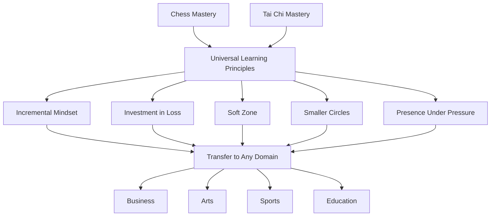
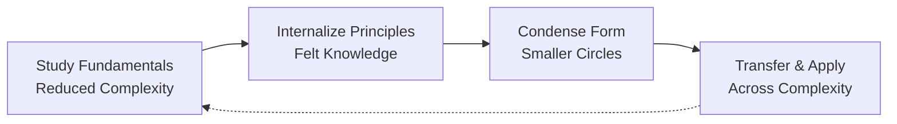

## Core Concepts

### The Soft Zone

Waitzkin distinguishes two states of concentration. The **Hard Zone** is rigid focus that shatters under distraction — a chess player who needs absolute silence, an athlete undone by crowd noise. The **Soft Zone** is fluid awareness that absorbs disruption and integrates it into performance. An ancient Indian parable frames it: a man walking across thorn-covered earth can either pave the entire road (control the world) or make sandals (control himself). The soft zone is making sandals.

Three steps to cultivate it:
1. **Be at peace with imperfection** — stop fighting the environment
2. **Use imperfection to your advantage** — let disruption sharpen your senses
3. **Internalize the advantage** — recreate the state without the external trigger

### Making Smaller Circles

Waitzkin's signature concept. Instead of learning dozens of techniques superficially, master one until you feel its essence at a somatic level — then gradually condense the movement while retaining full potency. This is how world-class boxers throw knockout punches that travel six inches, and how grandmasters spot winning combinations in seconds.

The progression:
1. Study a position or technique of **reduced complexity** (e.g., king + pawn vs. king in chess)
2. Internalize its principles until they become **felt knowledge**
3. **Condense** the external form while preserving the internal power
4. Transfer that quality to increasingly complex scenarios

Depth beats breadth because it opens a channel to the unconscious, creative components of potential.

### Investment in Loss

Deliberately putting yourself in positions where you will fail — because failure is where the deepest learning lives. In Tai Chi Push Hands, beginners must let themselves be thrown repeatedly to learn softness over resistance. In chess, studying lost positions teaches more than winning ones. The principle applies universally: drill what you are worst at, seek opponents who outmatch you, practice the problems you cannot solve.

> "Investment in loss is giving yourself to the learning process."

The willingness to look bad, lose publicly, and feel incompetent is the price of rapid growth. Great ones are willing to get burned time and again as they sharpen their swords in the fire.

### The Downward Spiral

When a competitor makes an error under pressure, the psychological consequence often compounds the technical mistake. One bad move leads to self-doubt, which leads to a worse move, which leads to panic. Waitzkin teaches the opposite: treat errors as data. The moment you recognize a downward spiral, **reset your presence** — take a breath, shift your physical state, return to process rather than outcome. The ability to interrupt a downward spiral is what separates elite performers from those who unravel.

### Number One Move

In high-level competition, the decisive advantage is rarely a brilliant novelty. It is the quiet refusal to settle for anything less than the best move in every position. This is not perfectionism — it is a **disciplined rejection of "good enough."** Waitzkin learned this from his chess teacher Mark Dvoretsky, who drilled him to find the single strongest continuation in every position, even when an adequate move was obvious.

### Slow It Down / Learn It Well

Through deep practice, experts perceive more information per unit of time. A Tai Chi master feels the opponent's weight shift before it happens. A chess grandmaster sees the consequences of a move fifteen steps ahead. This is not magic — it is the result of building complex "chunks" that the unconscious can process instantly. The conscious mind, freed from micromanagement, can focus on nuance.

The method: practice a technique slowly and correctly until the body learns it, then gradually increase speed while maintaining form. Speed without foundation is wasted effort.

### Beginner's Mind

The hardest lesson for experts: remain a beginner. When Waitzkin transitioned from chess to Tai Chi at 21, he had to accept being awful at something he was accustomed to dominating. The ego resists this — especially when people are watching and expecting performance. But beginner's mind is the gateway to investment in loss, softness, and true adaptability. Once you close yourself off from being a novice, you close yourself off from growth.

### Breaking Walls

Waitzkin argues that the walls we erect between different life pursuits — "this is my career," "this is my hobby," "this is mental," "this is physical" — are false constructs. Excellence transfers across domains when we recognize the **thematic connections** at the level of principle rather than technique. His deepest insight: what he is best at is not chess or Tai Chi, but the art of learning itself. Breaking down the mental barriers between disciplines allows growth in one area to fertilize all others.

### Presence Under Pressure

Presence — deep, focused, relaxed awareness — is the common thread between chess mastery and martial arts mastery. Under pressure, most people tighten. Their thinking narrows, they react instead of respond, they fight the moment. The elite performer does the opposite: pressure becomes a focusing agent, not a stressor. Presence must be cultivated as a **lifestyle**, not switched on only in competition. If deep presence becomes second nature, then life, art, and learning take on a richness that continually surprises.

### Choking vs. Panic

Waitzkin makes a critical distinction:
- **Choking** is a failure of **overthinking** — the conscious mind interferes with well-learned unconscious processes. A pianist who has played a piece a thousand times suddenly thinks about where to place their fingers.
- **Panic** is a failure of **underthinking** — the mind goes blank, reverting to primitive survival responses.

Both are failures of presence, but they require different remedies. Choking needs **trust** in the unconscious — let go, stop controlling. Panic needs **structure** — a simple anchor (breath, a single focus point) to rebuild a platform from which to operate.

---

## Frameworks

### Waitzkin's Learning Architecture

### The Four Stages of Skill Compression

---

## Mental Models

| Model | Description |
|-------|-------------|
| **Numbers to Leave Numbers** | Study discrete elements so thoroughly they become unconscious; then the conscious mind can focus on creative insight |
| **Making Sandals** | Internal solution — build resilience rather than demanding the world accommodate you |
| **The Hermit Crab** | Growth requires leaving your current shell. You are vulnerable while the new one hardens |
| **The Blade of Grass** | Bend with the hurricane, do not resist it. Resilience is flexibility, not rigidity |
| **The Brick** | Start with one brick on the opera house. Depth in the micro unlocks the macro |

---

## Key Lessons

1. **Process over results.** Love the learning journey, not the trophy. Results follow.
2. **Losing is tuition.** Each loss that you fully process is a permanent upgrade to your capability.
3. **One thing deeply is worth ten things shallowly.** Master the fundamentals until they are bone-deep.
4. **Create your own earthquakes.** Do not depend on external circumstances for inspiration. Build triggers.
5. **Interrupt the spiral.** When you feel yourself unraveling under pressure, stop. Breathe. Reset presence.
6. **Emotions are fuel.** Anger, fear, excitement — channel them into focus rather than suppressing them.
7. **Injuries teach.** A limitation forces creative adaptation. Waitzkin's broken hand led him to develop his left side.
8. **Stillness is productive.** Rest periods are not wasted time — they are when integration happens.
9. **Know what "good" feels like.** Once you experience quality in one domain, you can recognize it anywhere.
10. **There is no "off" switch.** Presence must be a way of life, not a competition mode.

---

## Practical Applications

| Domain | Application |
|--------|-------------|
| **Learning a new skill** | Pick one sub-skill. Practice it slooowly. Master the feeling. Then expand. |
| **High-pressure work** | Build a pre-performance trigger routine. Test it. Condense it. Use it before every big moment. |
| **Recovering from failure** | Reframe as "investment in loss." Ask: what did this teach me that winning could not? |
| **Managing distraction** | Practice the soft zone: deliberately work in noisy environments until noise becomes neutral. |
| **Physical training** | Use interval rest to train recovery. The ability to recover quickly IS performance. |
| **Creative blocks** | Start with the smallest unit (one brick) instead of the whole cathedral. Depth unlocks flow. |
| **Teaching/coaching** | Listen first. Every student has a unique disposition. Fit the method to the person. |

---

## Examples

**Chess — 1993 Under-17 World Championship (Brazil):** Waitzkin arrived exhausted, playing uninspired chess. Instead of fighting the fatigue, he accepted it — the soft zone. He stopped trying to force brilliance and simply made solid moves. His opponents, expecting the aggressive prodigy, were confused by his patience. He won the tournament.

**Tai Chi — 2004 World Championship (Taiwan):** Waitzkin injured his right hand before the final. Rather than withdrawing, he treated the injury as a training constraint — he developed his left-side technique to compensate. In the final, he defeated a heavily favored Taiwanese opponent by using the softness and adaptability the injury had forced him to cultivate.

**Investment in Loss — Push Hands Training:** Early in his Tai Chi training, Waitzkin's teacher William Chen paired him with stronger partners who threw him repeatedly. The lesson: stop resisting force with force. Learn to yield, blend, and redirect. The willingness to get thrown over and over was the foundation of his championship technique.

---

## Action Plan

1. **Identify your brick.** What is the single most fundamental skill in your chosen field? Spend 30 minutes daily on just that, for one month.
2. **Find a stronger opponent.** Seek out someone who will reliably beat you. Meet them weekly. Process each loss in writing.
3. **Build your trigger.** Create a 5-minute pre-performance routine. Use it before every practice session. After one month, test using it before high-stakes situations.
4. **Practice the soft zone.** For one week, deliberately expose yourself to distraction while working. Do not fight it. Notice how your focus can coexist with noise.
5. **Log your downward spirals.** Each time you feel yourself tilting under pressure, note the trigger. Over time, learn to recognize the pattern before it escalates.
6. **Do nothing — intentionally.** Schedule 15 minutes of deliberate stillness daily. Let your mind wander. This is when unconscious integration happens.
