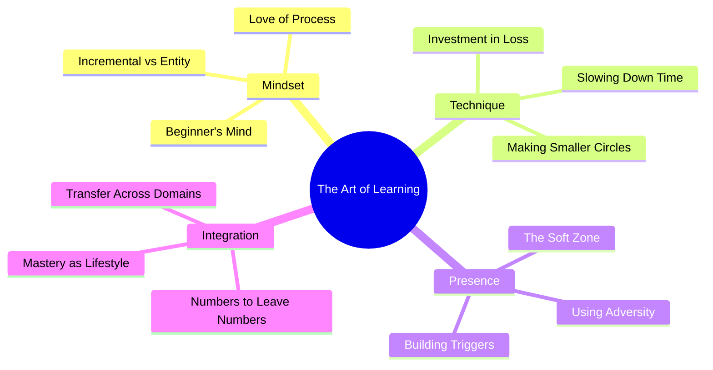

## 📖 Overview

Josh Waitzkin — eight-time US National Chess Champion and two-time World Tai Chi Push Hands Champion — didn't master two different fields by accident. *The Art of Learning* is the story of his method: a unified philosophy of learning, performance, and presence that transcends any single discipline. Part memoir, part performance psychology manual, the book traces his journey from child chess prodigy (immortalized in the film *Searching for Bobby Fischer*) through burnout and rediscovery, to world-class martial artist. Along the way, Waitzkin distills the principles that let him transfer excellence across radically different domains.

## 🧠 Executive Summary

Waitzkin's core thesis: mastery is not about talent or technique accumulation — it is about building a deep, principled relationship with the learning process itself. He argues that **depth beats breadth**, **presence beats intensity**, and **the ability to turn adversity into fuel** separates the great from the merely good. The book moves from foundational mindset (incremental vs. entity theory) through intermediate techniques (investment in loss, the soft zone, making smaller circles) to advanced competitive strategies (presence under pressure, building triggers, slowing down time).

## 🎯 Key Takeaways

| # | Principle | Essence |
|---
{}
-----------|---------|
| 1 | **Incremental Mindset** | Ability grows through effort. Never label yourself as "good" or "bad" at something. |
| 2 | **Investment in Loss** | Deliberately seek failure. Growth lives at the edge of your competence. |
| 3 | **The Soft Zone** | Don't build a rigid fortress of concentration — build resilience that bends with disruption. |
| 4 | **Making Smaller Circles** | Master one small thing so deeply you feel its essence, then condense it without losing power. |
| 5 | **Beginner's Mind** | Maintain openness and humility even after achieving mastery. |
| 6 | **Slowing Down Time** | Deep internalization lets you perceive more frames per second — the world appears to slow. |
| 7 | **Building Your Trigger** | Use classical conditioning to create reliable on-switches for peak performance states. |
| 8 | **Using Adversity** | Injuries, losses, and disruptions are not setbacks — they are constraints that force creative adaptation. |

## 👥 Who Should Read

- **Lifelong learners** who want a framework for accelerated skill acquisition
- **Competitors** (athletes, gamers, performers) seeking psychological edge
- **Coaches and teachers** looking for a holistic model of student development
- **Entrepreneurs and creators** navigating high-pressure, high-stakes environments
- **Anyone stuck in a plateau** who needs a new approach to growth

## 🚫 Who Should Skip

- **Readers seeking a step-by-step curriculum** — this is philosophy, not a playbook
- **Those who prefer systematic scientific reviews** — the evidence is anecdotal
- **People looking for traditional self-help formulas** — Waitzkin rejects cookie-cutter solutions

## 📊 Core Themes

## 💡 Why This Book Matters

In an age of distraction, surface-level skimming, and metric-chasing, Waitzkin's message is countercultural: go deeper, embrace vulnerability, and treat the learning process itself as the reward. His dual-mastery story provides rare credibility — these are not untested theories but principles forged in national championships and world-title matches. The book bridges Eastern contemplative traditions (Taoism, meditation) with Western competitive rigor, offering a genuinely integrated model of human potential.

## 🔗 Related Books

| Book | Connection |
|------|------------|
| *Peak* by Anders Ericsson | Deliberate practice — the science behind Waitzkin's intuition |
| *Ultralearning* by Scott Young | Modern, project-based take on accelerated skill acquisition |
| *The Inner Game of Tennis* by Tim Gallwey | The mental side of performance — Waitzkin's spiritual predecessor |
| *Mindset* by Carol Dweck | The formal research behind incremental vs. entity theory |
| *Zen and the Art of Motorcycle Maintenance* by Robert Pirsig | Quality as a felt experience — directly inspired Waitzkin |
| *Flow* by Mihaly Csikszentmihalyi | The psychology of optimal experience |

## ⭐ Final Verdict

**9/10** — A genuinely original contribution to the learning and performance literature. Waitzkin's credibility as a dual-world-class competitor is unmatched. The book's main limitation is its reliance on personal anecdote over empirical data, but this is also its greatest strength: the stories are vivid, the principles are memorable, and the philosophy is lived rather than borrowed. Essential reading for anyone serious about mastery.
