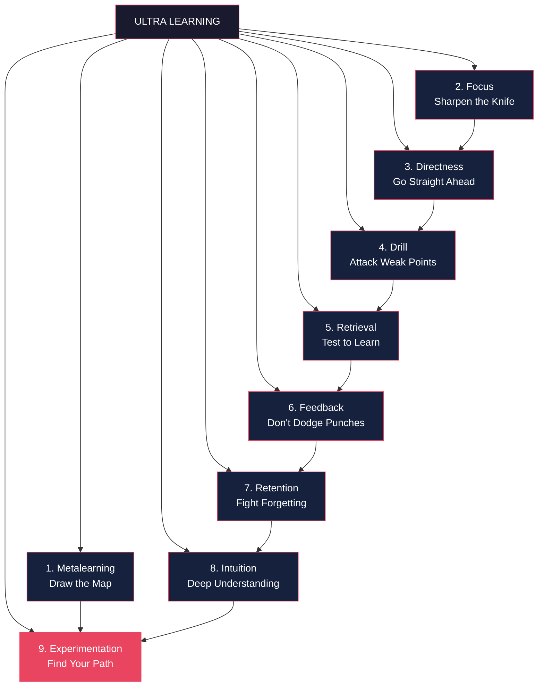

# Core Concepts — The 9 Principles of Ultralearning

## Principle 1: Metalearning — First Draw a Map

Spend ~10% of your total project time researching how to learn the subject before you dive in. Young breaks metalearning into three questions:

**Why** are you learning? (Instrumental — to get a job, pass a test — or intrinsic — for its own sake)
**What** do you need to learn? Break the subject into Concepts (what to understand), Facts (what to remember), and Procedures (what to practice).
**How** will you learn? Benchmark existing resources, curricula, and experts. Emphasize high-value areas and exclude irrelevant ones.

Metalearning is the map. Without it, you wander. With it, you navigate directly to your goal.

---

## Principle 2: Focus — Sharpen Your Knife

Three problems plague concentration:

| Problem | Cause | Solution |
|---------|-------|----------|
| Can't start | Procrastination | Pomodoro Technique, 5-minute rule |
| Can't sustain | Distraction | Remove phones, close tabs, use physical spaces |
| Wrong direction | Misdirection | Periodically check: is this task moving me toward my goal? |

The Yerkes-Dodson law reminds us that optimal arousal varies by task. A basketball free throw needs high arousal; a difficult math proof needs low arousal, sometimes even letting the subconscious work.

---

## Principle 3: Directness — Go Straight Ahead

The transfer problem: skills learned in one context (classroom, textbook) rarely transfer to another (real life). Directness solves this by learning in the context where you'll use the skill.

**Tactics**: Project-based learning (build something), immersion (live in the language), flight simulators (recreate the environment), overkill approach (set a harder challenge than needed).

If you want to speak French, speak French — don't do Duolingo for a year first.

---

## Principle 4: Drill — Attack Your Weakest Point

Identify the rate-determining step in your performance and drill it aggressively.

**The drill cycle**: Direct practice → analyze weaknesses → isolate a subskill → drill → return to direct practice to integrate.

**Techniques**: Time slicing (practice one component), cognitive component analysis (break down mental steps), copycat method (copy what you don't want to practice so you can focus on what you do), magnifying glass method (disproportionate time on one subskill), prerequisite chaining (start too hard, backfill gaps).

---

## Principle 5: Retrieval — Test to Learn

Active recall strengthens memory more than passive review. The harder the retrieval, the stronger the memory — as long as you ultimately succeed.

**Techniques**: Flashcards (Anki), free recall (close the book and write what you remember), question-book method (take notes as questions to answer later), self-generated challenges, closed-book learning.

Karpicke & Roediger (2008): retrieval practice produced 80% retention after a week vs. 36% for re-studying.

---

## Principle 6: Feedback — Don't Dodge the Punches

Not all feedback is equal. Three types:

| Type | What It Tells You | Example |
|------|------------------|---------|
| Outcome | Overall result | Pass/fail, score |
| Informational | What went wrong | "You misapplied this formula" |
| Corrective | What to do instead | "Try deriving from first principles" |

Corrective feedback is gold. Outcome feedback is better than nothing. Praise as ego-feedback ("you're so smart") often harms learning.

**Noise cancellation**: Extract signal from feedback — not every critique is valid. **Metafeedback**: Track your learning rate and strategy effectiveness to see if your approach is working.

---

## Principle 7: Retention — Don't Fill a Leaky Bucket

Ebbinghaus's forgetting curve: we lose ~70% of new information within 24 hours without review. Four countermeasures:

1. **Spacing**: Spread practice over time. Don't cram.
2. **Proceduralization**: Practice until the skill becomes automatic (like typing or riding a bike).
3. **Overlearning**: Continue practicing beyond initial mastery to cement knowledge.
4. **Mnemonics**: Memory palaces, keyword method — useful as a bridge for hard-to-remember facts, though not a replacement for deep understanding.

---

## Principle 8: Intuition — Dig Deep Before Building Up

Intuition is pattern recognition built on deep understanding, not magic. Young draws on Richard Feynman's approach:

**Rules for building intuition**:
1. Always start with a concrete example
2. Don't just memorize steps — understand why each follows the last
3. Explain concepts in plain language (the Feynman Technique)
4. Don't fool yourself: test your understanding with hard problems

The Feynman Technique: pick a concept, explain it simply as if teaching a child, identify gaps in your explanation, go back and fill those gaps. Repeat until your explanation is complete and simple.

---

## Principle 9: Experimentation — Explore Outside Your Comfort Zone

As you move from novice toward mastery, following others' paths stops working. You must experiment.

**Three types of experimentation**:
- **Method experiments**: Try different learning approaches
- **Style experiments**: Develop your personal technique
- **Domain experiments**: Combine skills from different fields

Learning becomes an act of unlearning — discarding stale approaches and discovering better ones.

---

---

# Frameworks — Designing an Ultralearning Project

**Phase 1: Research** (10% of total time)
- Do metalearning: why, what, how
- Benchmark existing curricula and experts
- Gather materials (textbooks, courses, tools)

**Phase 2: Schedule**
- Decide intensity (hours per week) and duration
- Pilot for one week before committing
- Create feedback mechanisms from day one

**Phase 3: Execute**
- Apply principles 1-9 simultaneously
- Cycle between direct practice and drills
- Collect metafeedback (are you improving fast enough?)

**Phase 4: Review & Consolidate**
- What worked? What didn't?
- Plan retention strategy (spaced repetition, orbit projects)
- Decide: maintain, relearn, or push toward mastery

---

# Mental Models

| Model | Application |
|-------|-------------|
| **Rate-determining step** | Identify the bottleneck subskill that limits overall performance; drill there |
| **Transfer problem** | Skills don't transfer across contexts; learn in the target context |
| **Forgetting curve** | Without active review, memory decays exponentially; use spaced repetition |
| **Desirable difficulty** | Harder retrieval produces stronger long-term memory |
| **Proceduralization** | Practice until the skill becomes automatic, freeing cognitive resources |
| **Feynman Technique** | Explaining simply reveals understanding gaps |
| **Comfort zone expansion** | Mastery requires deliberate discomfort |

---

# Key Lessons

1. **You can learn anything in less time than you think**, but only if you're willing to be uncomfortable and take full responsibility
2. **Passive learning is almost useless.** Reading, listening, and watching build familiarity, not competence. Only active practice builds skill
3. **Your weak points are your leverage points.** The skills you avoid are exactly the ones that will unlock the next level
4. **Feedback is a gift, but only if you can filter the noise.** Learn to tell the difference between useful criticism and ego attacks
5. **Follow-through beats brilliance.** Most ultralearning success comes from sustained effort over weeks and months, not talent
6. **The map is not the territory.** Metalearning helps you plan, but you must adjust as you learn what actually works

---

# Practical Applications

**Career Change**: Use directness — build a portfolio project in your target field rather than taking courses. Run the drill cycle on the specific skills employers ask for.

**Language Learning**: Metalearning first (which languages are similar to ones you know?), then immersion-based directness. Use retrieval via conversation from day one.

**Academic Study**: The Feynman Technique transforms passive reading into active understanding. Drills on weak topics. Spaced repetition for factual subjects.

**Creative Skills**: Experimentation is key. Copy masters (the copycat method), then diverge. Use overlearning to make techniques automatic.

---

# Examples

**The MIT Challenge (Scott Young)**: Completed 33 MIT CS courses in 12 months using self-designed curriculum, final exams, and the drilldown method (coverage → practice → insight).

**Roger Craig (Jeopardy! champion)**: Used data mining to map Jeopardy topics, visualized his knowledge gaps as colored circles, and drilled systematically. Won $77,000 in a single game plus $250,000 in the Tournament of Champions.

**Tristan de Montebello (public speaking)**: Went from near-zero experience to World Championship of Public Speaking finalist in 6 months. Practiced speeches dozens of times in different styles (angry, monotone, rap), studied with a Hollywood director, and learned to read audiences before going on stage.

**Benny Lewis (polyglot)**: Speaks ~10 languages using immersion-based directness. Speaks from day one, even if badly. His "missionary approach" to language learning is a blueprint for direct practice.

**Judit Polgár (chess prodigy)**: Her father's educational experiment — intense, early specialization with deliberate practice — produced a player who beat Garry Kasparov at age 15.

---

# Action Plan

1. **Pick one skill** you want to learn in the next 3 months
2. **Spend 2-3 hours on metalearning**: research curricula, talk to experts, find resources
3. **Design a directness strategy**: What will you actually build, do, or create?
4. **Identify your top 2 weak points** and design drills for each
5. **Create a retrieval system**: Flashcards, free recall sessions, or practice tests
6. **Set up feedback loops**: Answer keys, coaches, communities, or real-world tests
7. **Plan retention**: Schedule refresher sessions 1 week, 1 month, and 3 months out
8. **Start before you're ready** — the pilot phase reveals what you couldn't plan for
