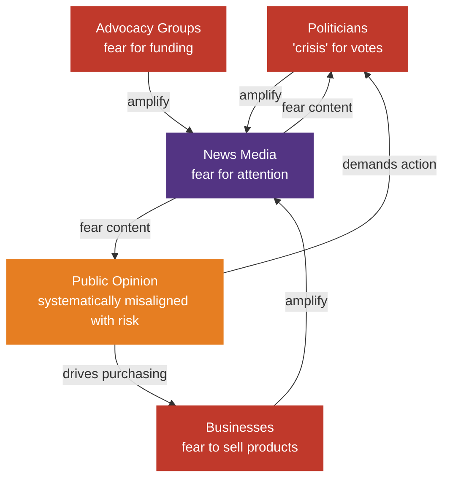
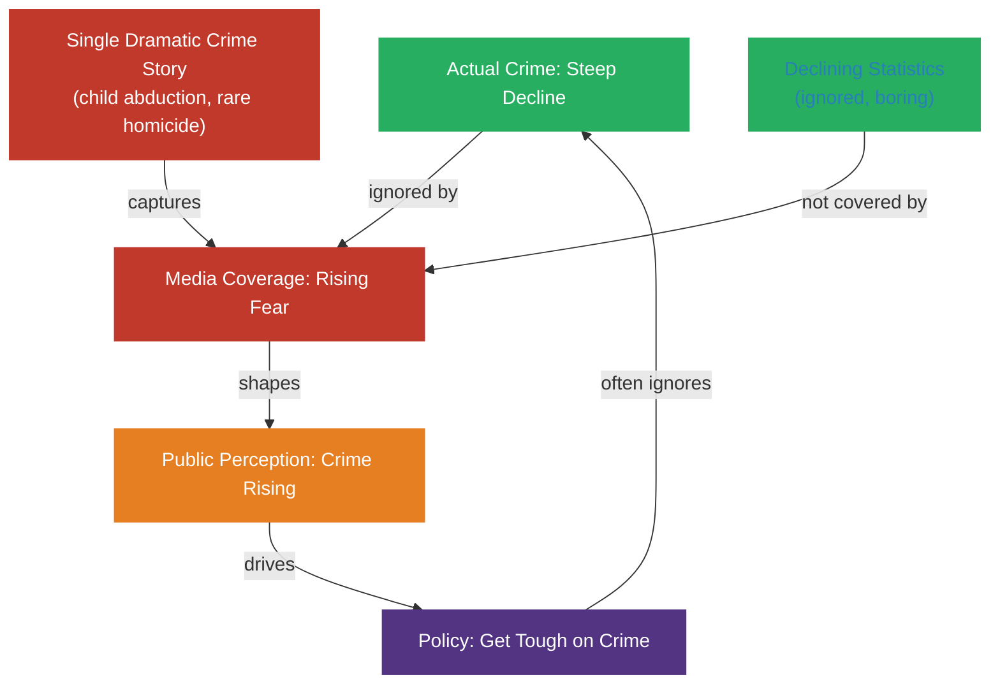
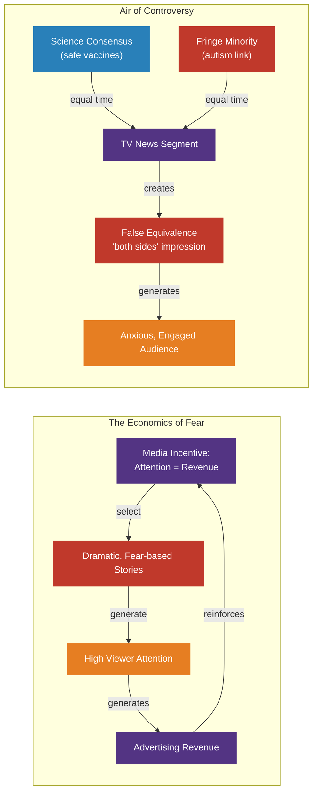
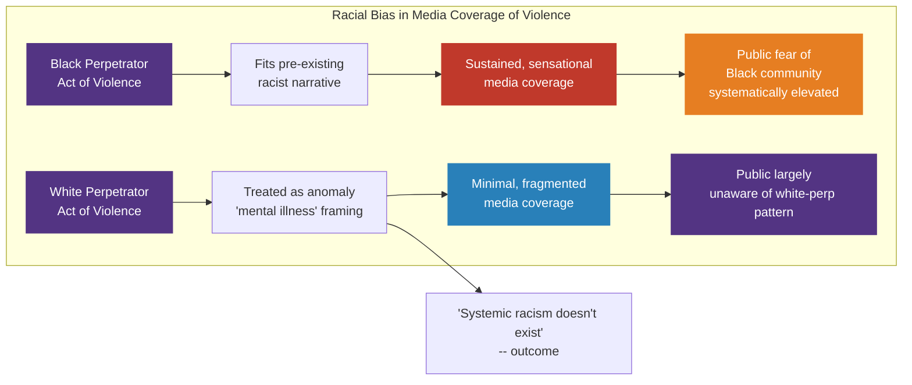
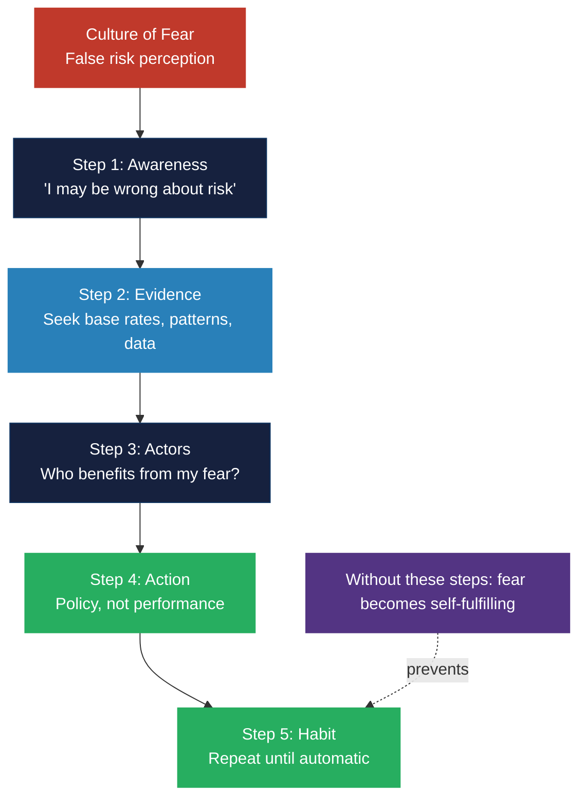

# Introduction: The Culture of Fear

## What This Book Argues

Glassner's thesis is straightforward but disorienting: Americans live in a
culture of fear that is largely manufactured. The things Americans worry about
most -- school shootings, vaccines, terrorism, city crime -- are not the
things that are most likely to harm them. Conversely, the things that are most
likely to harm Americans -- car accidents, heart disease, diabetes, falls --
elicit almost no public anxiety.

This divergence is not accidental. It is produced by a system. Politicians
generate fear to mobilize voters. News organizations generate fear to capture
attention. Advocacy groups generate fear to raise money. Corporations generate
fear to sell products -- antivirus software, home security systems, dietary
supplements. These actors amplify each other in a feedback loop that
continually raises the national anxiety temperature. Glassner calls this
feedback loop the "culture of fear."

The culture of fear is self-reinforcing. Each actor has incentives to increase
fear rather than decrease it. No one profits from calm.

---

# Part I: The Manufacture of Risk

## City Crime and the Decline Nobody Noticed

In the 1990s, America experienced one of the steepest declines in violent crime
in its history. In city after city -- New York, Los Angeles, Chicago -- crime
rates plummeted throughout the decade. Yet public perception of crime ran
precisely opposite to the data. Americans became more afraid of city crime as
it actually became less common.

Glassner traces this divergence to specific mechanisms. News coverage of crime
increased throughout the 1990s even as crime itself decreased. Why? Because
crime stories attract viewers. A graph showing declining crime over time does
not get click-throughs. A dramatic individual crime story does.

Politicians also amplified crime fears. Both parties competed to appear tough
on crime. The result was policy -- longer sentences, more prisons, more
policing -- that bore little relationship to the actual crime landscape.
Glassner notes this was not a deliberate conspiracy, but a rational response
to incentives: each individual actor did what maximized their own self-interest,
and the collective result was systematically misleading.

The mechanism at work here is the **dramatic case study**: one vivid story
overwrites thousands of invisible data points. One child abduction captivates
the nation while hundreds of mundane safety improvements go completely
unreported.

---

## School Safety: The Safe Place That Isn't Believed

Perhaps the most striking case study in the book is school safety. Glassner
documents that American schools in the 1990s were safer than they had been at
any point since the 1970s. Homicides in schools had declined significantly.
Serious violent crime at school was rare. The odds of a child being killed at
school were roughly equivalent to the odds of being struck by lightning.

And yet a Gallup poll showed that by 1999 -- after the Columbine shooting --
more than half of parents reported fearing for their child's physical safety
at school. Parents were more afraid in 1999 than they had been in the safer
1970s.

This is the culture of fear in operation. Highly publicized, low-frequency
events -- school shootings -- systematically overwrite long-term downward
trends in the human mind. The media's saturation coverage of each event
creates a vivid, emotionally charged impression that persists long after the
statistical reality has changed. Columbine was an atrocity. But it was an
outlier in a trend of declining school violence. Treating it as representative
requires ignoring 30 years of data.

Glassner also documents how school safety programs -- Zero Tolerance policies,
metal detectors, surveillance cameras, lockdown drills -- expanded rapidly in
response to public fear. Many of these programs were implemented without any
evidence that they reduced actual risk. Some, like zero tolerance, may have
increased it by pushing vulnerable students out of schools and into situations
more dangerous than the ones they were meant to address.

---

# Part II: The Economics of Fear

## How Media Profits from Anxious Viewers

A recurring theme throughout *The Culture of Fear* is the economic logic that
drives media coverage. Television news and national magazines operate in a
highly competitive attention economy. Stories that generate fear generate
attention, and attention is their product. This creates a structural incentive
-- not a conspiracy, but a structural incentive -- for journalists to select
for dramatic, anxiety-producing content.

Glassner does not accuse journalists of deliberate dishonesty. He accuses them
of operating within a system whose incentives are poorly aligned with accuracy.
A investigative reporter who demonstrates that a feared risk is declining will
get no attention. A reporter who amplifies an ongoing moral panic will get
prime placement, career advancement, and Oprah appearances.

He identifies a specific journalistic routine he calls "the air of
controversy." To maintain the appearance of balance, news programs habitually
give equal weight to opposing claims -- even when one side represents the
scientific consensus and the other represents a fringe minority. This practice,
he argues, does not produce balanced journalism. It produces false equivalence
that amplizes minority views on risk: vaccine skeptics get equal time with
immunologists, climate deniers with climate scientists, anti-vaccine activists
with the CDC.

---

## Vaccine Scares: The Most Dangerous False Alarm

Media-amplified vaccine scares have a body count. Glassner documents the
history of vaccine fear in America -- from the DPT controversy in the 1970s
and 1980s (which caused immunization rates to drop and pertussis deaths to
rise) to the MMR vaccine controversy in the UK and US in the late 1990s, when
a discredited study falsely linked the MMR vaccine to autism, triggering years
of declining immunization rates and measles resurgences.

The pattern is consistent each time:

1. A small, poorly designed study or anecdotal claim is published (or publicized)
2. Media covers the controversy as a genuine scientific debate
3. Public fear rises; immunization rates fall
4. Diseases previously controlled by vaccination begin to resurface
5. The original claim is eventually debunked -- but the public health damage has been done

Glassner's critique is particularly pointed: by the time the scientific
consensus catches up and the false claim is debunked, thousands of children
have already been left unprotected. The "journalistic balance" that granted
equal time to vaccine skeptics was not neutral. It was a multiplier for danger.

---

# Part III: Race and Fear

## Racial Bias in the Fear Algorithm

One of Glassner's most original and uncomfortable contributions is his analysis
of how race shapes the production of fear in American media. He documents a
consistent asymmetry: white perpetrators of violence receive less sustained
media attention than Black perpetrators -- even when the underlying acts are
similar or more severe.

The mechanism works as follows: Black criminality fits a pre-existing racist
narrative that has circulated in American culture for centuries. White
criminality does not. Therefore, when a Black person commits an act of
violence, it confirms a narrative that the media and audience already carry.
The story generates clicks, views, and outrage. When a white person commits
an act of violence, it requires a different framing -- mental illness,
political extremism, lone wolf. These stories, Glassner argues, are treated
as anomalies rather than as confirmations of a dangerous pattern.

The consequence is that Americans develop systematically distorted views of the
relative dangerousness of racial groups. White Americans vastly overestimate
the percentage of crime committed by Black people, and underestimate the
percentage committed by white people. They are more afraid of Black people
than statistics justify, and less aware of danger from white people than
statistics warrant. The culture of fear, in other words, is built on existing
cultural racisms -- and it reinforces them.

---

# Part IV: Prognostic Fear and Tragedy Criticism

## The Art of Prognostic Fear

Most fear is reactive: something happened, now we are afraid. But Glassner
identifies a more insidious form: **prognostic fear** -- the art of predicting
danger without evidence, and using that prediction to generate anxiety in
advance of any event.

Prognostic fear is the domain of "risk experts" -- Talk show hosts, advocacy
organizations, political consultants -- who identify potential dangers and
amplify them before any harm has occurred. The advantage for the fear-monger is
substantial: reactive fear requires an actual event. Prognostic fear requires
nothing. The feared outcome never has to occur for the fear to have served its
purpose: attention was captured, political capital was accumulated, a product
was sold.

Glassner traces prognostic fear through a series of案例: warnings about
"stranger danger" that vastly overestimated the risk of abduction by strangers
(most kidnapping victims know their abductors), bioterrorism preparedness that
never managed to connect to an actual threat event, and food safety scares
that alternated between fat, carbs, pesticides, and processed ingredients as
the next deadly enemy.

The key problem with prognostic fear: every prediction of "risk" that does not
materialize generates no negative consequence for the fear-monger. The
anchorman who warned of a non-existent threat never apologizes. The politician
who campaigned on an unrealized risk never loses the election. The result is
an asymmetry: fear-generating claims are cheap to make and expensive in social
costs, while calm-generating corrections are expensive to make and generate
virtually no reward.

---

## Tragedy Criticism: Fear That Substitutes for Action

Another of Glassner's distinctive concepts is **tragedy criticism** -- the
practice of generating and consuming narratives of disaster as a substitute for
actual political engagement.

After every major event -- a school shooting, a terrorist attack, a natural
disaster -- Americans engage in an enormous outpouring of collective emotional
processing. Cable news fills with commentary. Talk show hosts debate meaning.
Calls for "doing something" escalate before anyone has diagnosed the problem.
And then, almost without exception, nothing substantial happens.

Glassner argues that this outpour does serve a psychological function: it
allows Americans to feel that they are responding to crisis when they are not
actually changing the structural conditions that produced the crisis. The ritual
of tragedy criticism thus performs the function of authentic political action
without its substance. It costs nothing. It demands no sacrifice. It sends no
taxes. But it generates enormous affect and a sense of collective solidarity.

Real policy change -- investing in mental health infrastructure, reforming gun
laws, addressing poverty, building community -- is slow, difficult, and rarely
covered by 24-hour news cycles. Tragedy criticism is immediate, dramatic, and
daily. The system strongly biases toward the latter.

---

# Part V: Why the System Persists

## Crime Drove Less Driving

One of the book's most counterintuitive findings concerns the relationship
between fear and behavior. Following major crime scares, Americans did things
that empirically increased their risk: they drove to avoid public spaces,
delaying or canceling urban land use, increasing suburban sprawl, extending
commutes, and incidentally increasing car accident deaths.

Glassner documents the data: as fear of city crime rose (despite decreasing
actual crime), Americans drove more miles. More miles means more accidents.
In effect, the manufactured fear of crime caused more traffic deaths than crime
itself would have. Fear was killing people more effectively than the feared
risk.

This insight generalizes: whenever fear diverges systematically from risk, the
fear itself becomes a secondary risk. Overreactions to perceived threats --
avoiding vaccination, refusing air travel, avoiding public spaces -- carry
their own mortality and morbidity consequences. The culture of fear does not
just misdirect anxiety. It creates new harms that no individual actor intended.

---

# Part VI: Escaping the Culture of Fear

## How to Think About Risk

Glassner does not end in despair. He provides a practical framework for
escaping the culture of fear. The core advice consists of several disciplines:

**1. Demand the base rate.** Before panicking, ask: what is the actual
frequency of this risk? What proportion of the population is affected? How
does it compare to risks you already accept routinely?

**2. Distinguish event from pattern.** One vivid, dramatic event (a school
shooting, a plane crash) tells you almost nothing about long-term trends.
Patterns told by data over time are a far better guide to risk than single
stories.

**3. Notice who benefits from your fear.** Who generates the fear? Who
publishes it? Who profits from it? Who gains political capital? The answer to
these questions is almost never "the public."

**4. Resist prognostic fear.** When experts predict future dangers, demand
evidence. Ask: what is their track record? Have their past predictions
materialized? If not, why should you believe this one?

**5. Beware false equivalence.** When two sides of a controversy are presented
as equally valid, check whether one side has the weight of evidence. Very
often, the media's "both sides" framing gives a platform to the side that is
factually wrong.

**6. Replace tragedy criticism with policy action.** Emotional responses to
news events are not wrong. But they should not substitute for organizing,
civic engagement, and political action. Glassner's implicit challenge: if you
really care about the problem, what are you willing to do about it beyond
watching cable news?

---

## The Politics of Fear

Glassner's ultimate diagnosis is political: the culture of fear is a tool of
social control. An anxious population is more compliant, more willing to accept
restrictions on liberty, more willing to endorse aggressive foreign and domestic
policy, more willing to purchase security products they do not need.

He does not argue that safety is dispensable. He argues that American safety
has been remarkably high for decades, and that most "new" safety initiatives
address statistically insignificant risks while ignoring the causes -- poverty,
community isolation, inequality -- that produce genuine harm.

The book's most enduring contribution may be the concept of the culture of fear
itself. Once you have seen the mechanism operate -- once you can identify the
politician generating fear for votes, the journalist generating fear for
ratings, the business generating fear for sales -- you cannot unsee it. The
culture of fear is a lens. After reading this book, you will see it everywhere.

---

# Key Lessons

1. **Fear is manufactured.** American anxiety is not organic. It is produced by
   identifiable actors with identifiable incentives.

2. **Perception and risk diverge systematically.** Americans fear rare dramatic
   risks and ignore common mundane ones. The gap is not a coincidence.

3. **Dramatic cases overwrite statistics.** One vivid story carries more
   emotional weight than a thousand data points. This is a cognitive bias that
   the culture of fear exploits intentionally.

4. **Race shapes fear.** Black perpetrators receive more fear-amplifying media
   attention than white perpetrators. Americans' fears are racially structured
   in ways that are both measurable and racially unjust.

5. **Note that school safety programs are inversely correlated with actual school
   danger.** As schools become safer, fear-driven safety infrastructure expands.

6. **Crime fear changed behavior, then changed risk.** Fear of city crime drove
   more driving, which drove more traffic deaths. The fear was the harm.

7. **Prognostic fear needs no event to succeed.** It only needs attention. Every
   unfulfilled prediction generates no consequences for the fear producer.

8. **Tragedy criticism substitutes for action.** Emotional response to news
   feels like civic engagement. It is not. It costs nothing and changes nothing.

9. **Vaccines are the clearest case study.** Media balance killed by generation
   of false equilibria between established science and debunked claims.

10. Escaping is possible. It requires habits of mind: base rates, actors,
    evidence, and a willingness to replace performance with policy.