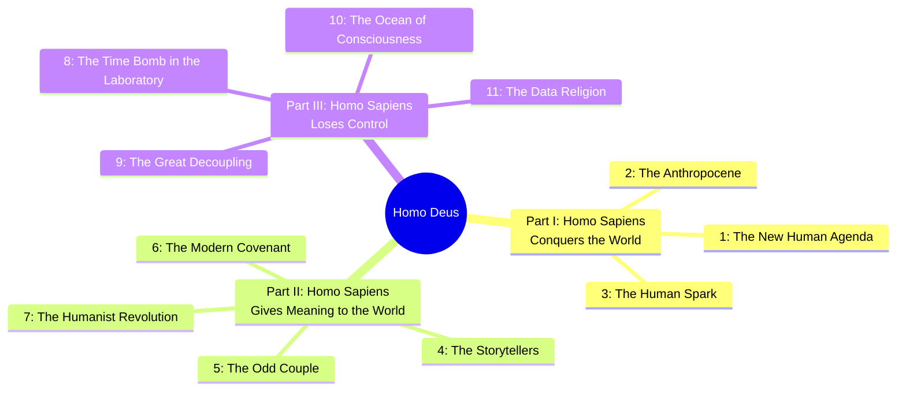
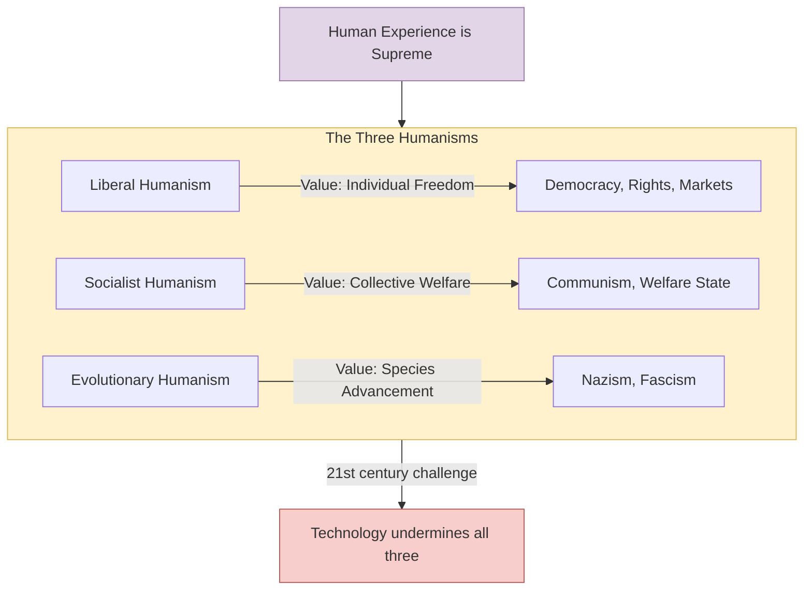
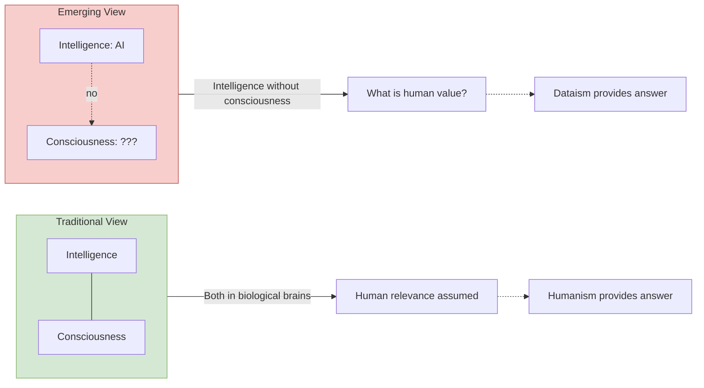
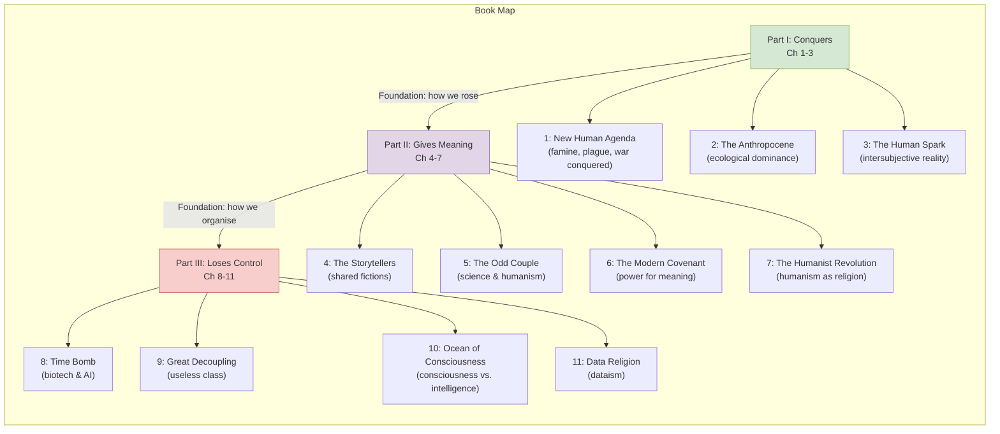

## Book Structure

The book is organised into three parts and eleven chapters:

---

## Part I — Homo Sapiens Conquers the World

### Chapter 1: The New Human Agenda

Harari opens by declaring that for the first time in history, humanity's oldest
enemies are essentially defeated. Famine, plague, and war — the three horsemen
that haunted every previous generation — have been downgraded from
cosmic/existential forces to technical problems.

**Famine:** Historically a recurring catastrophe. Today, most deaths from
starvation are caused by political failure or war, not food shortage. The real
global problem is obesity, not hunger — more people die from eating too much
than too little.

**Plague:** Diseases that once wiped out entire populations (the Black Death
killed a third of Europe) are now managed through medicine, sanitation, and
rapid scientific response. Smallpox is eradicated. New pandemics emerge but are
contained within months or years. The worst biological threats now come from
our own labs.

**War:** The most startling claim. Harari argues that the era of large-scale
interstate war may be over. Nuclear weapons make superpower conflict suicidal.
The global economy is too interconnected to sustain war between major powers.
The majority of conflict today is civil or regional. For the first time, more
people die from suicide than from violent conflict.

With these problems managed, the new human agenda becomes: **immortality**
(overcoming death through biotechnology), **bliss** (engineering happiness
biochemically), and **divinity** (upgrading humans into god-like beings).

### Chapter 2: The Anthropocene

Harari traces the ecological impact of _Homo sapiens_ from the first wave of
megafauna extinctions (Australia 45kya, Americas 15kya) to the present. Humans
have reshaped the planet more than any other species — the Anthropocene epoch
is our doing. This capacity for destruction and creation is the foundation of
our god-like power. The chapter explores what makes humans different from other
animals, setting up the argument that we are unique in our ability to
cooperate flexibly through shared beliefs.

### Chapter 3: The Human Spark

What separates humans from other animals? Harari rejects the soul, free will,
and consciousness as definitive (other animals likely have some form of all
three). The real difference is our ability to create and believe in
**intersubjective realities** — fictions like money, nations, laws, and gods
that exist only in shared imagination but enable large-scale flexible
cooperation. A chimpanzee band cannot organise a thousand individuals; a
human corporation can employ a million. This is "the human spark."

---

## Part II — Homo Sapiens Gives Meaning to the World

### Chapter 4: The Storytellers

Harari argues that the entire edifice of human civilisation rests on shared
stories. These intersubjective realities — from the code of Hammurabi to the
Declaration of Independence — are not lies or delusions. They are the
operating systems of human society. They coordinate behaviour, assign rights,
create obligations, and give meaning to existence. The chapter examines how
different cultures built different meaning-systems and how those systems
legitimised hierarchies (caste, class, gender, race).

### Chapter 5: The Odd Couple

The modern world is built by an uneasy partnership between science (which seeks
truth) and humanism (which seeks meaning). Science systematically undermines
traditional sources of meaning — it shows that the cosmos has no purpose,
that free will is an illusion, that humans are just biochemical algorithms.
Yet we cling to humanist values. Harari calls this the fundamental tension of
modernity: we have traded meaning for power.

### Chapter 6: The Modern Covenant

The modern deal is explicit: humanity agrees to give up cosmic meaning in
exchange for power and progress. Pre-modern cultures believed in a cosmic plan
that gave life meaning but restricted human power. Modern culture believes in
no cosmic plan but grants humans unprecedented power to shape their world. The
price is existential anxiety — a universe devoid of transcendent purpose.
Modern culture is the most creative and dynamic in history, but also the most
existentially anxious.

### Chapter 7: The Humanist Revolution

Humanism is the religion of modernity. It places human experience — especially
individual feeling — at the centre of moral and political authority. Harari
breaks humanism into three branches:

- **Liberal humanism:** The individual's inner experience is sovereign.
  Freedom of choice is sacred. Democracy, human rights, and free markets flow
  from this.

- **Socialist humanism:** Humans are defined by their social relations.
  Collective welfare, not individual choice, is the measure of value. Shared
  institutions replace individual conscience.

- **Evolutionary humanism:** Humans are defined by their species potential.
  The goal is to advance the species (or the race/nation), even at the cost of
  individual freedom. Nazism is the extreme case.

---

## Part III — Homo Sapiens Loses Control

### Chapter 8: The Time Bomb in the Laboratory

Biotechnology and AI are developing exponentially. Harari surveys the key
technologies: gene editing (CRISPR), brain-computer interfaces, organ
regeneration, life extension research, and artificial intelligence. Each
promises immense benefits — and each threatens to destabilise the humanist
framework. When humans can be redesigned, the assumption of equal human dignity
breaks down. The "time bomb" is not a single technology but the cumulative
effect of technologies that challenge every foundational assumption of modern
society.

### Chapter 9: The Great Decoupling

The most discussed chapter. Harari argues that AI will not just replace
individual jobs — it will create a class of humans who are **economically
useless**. Previous technological revolutions destroyed jobs but created new
ones. AI might create no new jobs because it can outperform humans at
virtually all cognitive and physical tasks. The result: a "useless class" with
no economic value, no political power, and no social purpose.

This "decoupling" has two dimensions:
- **Intelligence from consciousness:** AI achieves superhuman performance
  without any subjective awareness.
- **Power from meaning:** The algorithms that run the world do not need to
  understand it in human terms.

The elite may upgrade themselves into superhumans (cyborgs, genetically
enhanced, uploaded minds), creating biological divergence — a new species
splitting from the useless mass.

### Chapter 10: The Ocean of Consciousness

A philosophical chapter exploring what consciousness is and why it matters.
Harari examines the hard problem of consciousness — why subjective experience
exists at all. His position is that science has no explanation for
consciousness and may never have one. What science _can_ show is that
consciousness is not the same as intelligence, and that non-conscious
algorithms can make better decisions than conscious humans.

The implication: if you value human relevance on the basis of intelligence,
you lose — machines win. If you value it on the basis of consciousness, you
have a philosophical problem — nobody can prove that consciousness matters for
decision-making or value. The humanist commitment to the primacy of conscious
experience is a faith, not a scientifically established fact.

### Chapter 11: The Data Religion

The final chapter introduces **Dataism** — the emerging worldview that treats
the universe as a system of data flows and regards maximising information
processing as the highest good. Its precursors: information theory,
cybernetics, the internet, machine learning. Its implicit doctrines:

1. Every organism and institution is a data-processing system.
2. The value of any system is its contribution to the total data flow.
3. The "Internet of All Things" — connecting all data processors into one
   network — is the ultimate good.
4. Humans are obsolete as data processors — algorithms do it better.

Dataism's practical implications:
- Free-market capitalism and centralised communism were both data-processing
  systems. The efficient ones survive.
- Liberal democracy is a distributed data-processing system. In a world of
  trillion-node networks, it may be too slow to compete with algorithmic
  centralisation.
- Individual privacy becomes a bug, not a feature — data wants to be free and
  connected.
- Human experience becomes irrelevant if it does not contribute to the total
  data flow.

The book closes with a question addressed to the reader: "What will happen to
society, politics and daily life when non-conscious but highly intelligent
algorithms know us better than we know ourselves?"

---

## Structural Diagram

