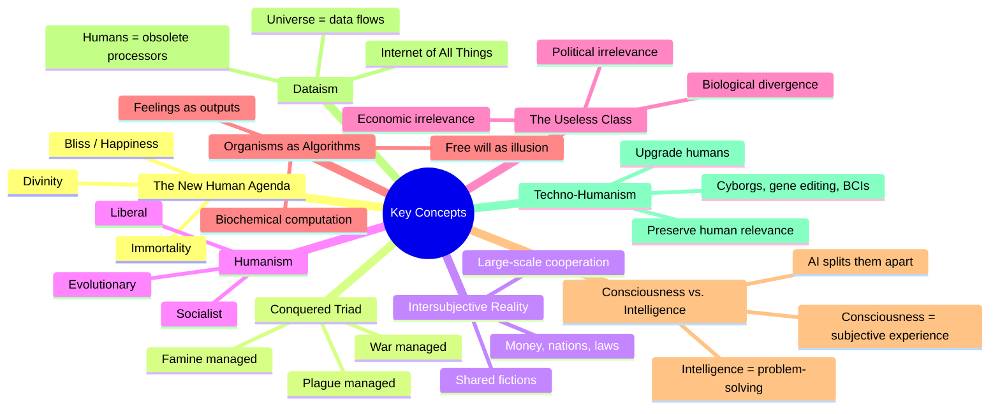
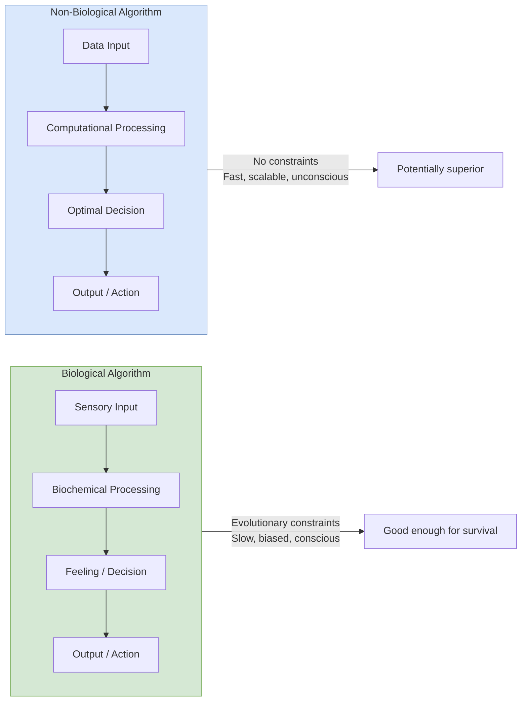
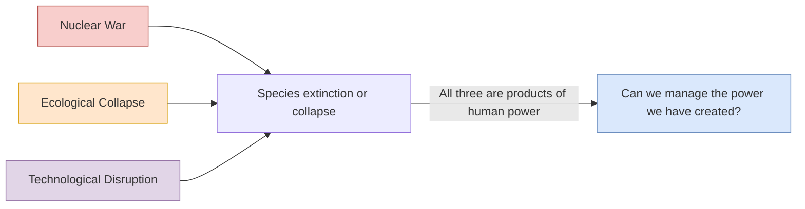

---

## 1. The New Human Agenda

Harari's central thesis: humanity's historical project has shifted from
survival to self-transcendence. The traditional drivers — famine, plague, war
— are no longer existential threats but technical problems. The new goals are:

| Goal | Current Status | Pathway |
|---|---|---|
| **Immortality** | Aging increasingly understood as a biological process, not an inevitability | Gene editing, organ regeneration, cryonics, anti-aging therapies |
| **Bliss** | Happiness understood as biochemistry, not spiritual condition | Neurochemistry, brain stimulation, pharmaceuticals |
| **Divinity** | Humans gaining god-like powers of creation and destruction | AI, genetic engineering, brain-computer interfaces |

---

## 2. Intersubjective Reality

The foundational concept borrowed and extended from _Sapiens_. An
intersubjective reality is something that exists only because enough people
believe in it — money, nations, laws, corporations, gods. It is distinct from:

- **Objective reality:** exists independent of belief (gravity, trees, DNA)
- **Subjective reality:** exists only for one individual (pain, dreams)

Intersubjective realities are the operating system of human civilisation. They
enable flexible large-scale cooperation between strangers who share the same
beliefs but have no personal relationship.

---

## 3. The Three Humanisms

Harari categorises humanism — the belief that humans are the ultimate source
of meaning and value — into three branches:

| Branch | Core Belief | Political Form | Weakness |
|---|---|---|---|
| **Liberal** | Each individual has a unique inner voice. Freedom is highest good. | Democracy, human rights, free markets | Undermined by neuroscience showing no free will or unified self |
| **Socialist** | Humans are defined by collective relations. Equality is highest good. | Communism, welfare states | Undermined by AI replacing collective labour |
| **Evolutionary** | Humanity must advance the species. Power is highest good. | Nazism, fascism, imperialism | Discredited by history but may return in new forms |

---

## 4. The Useless Class

Perhaps Harari's most-discussed concept. Unlike previous technological
transitions, AI may create a class of people who are **not just unemployed
but unemployable** — no economic value in a system where algorithms outperform
humans at all tasks.

Key dimensions:
- **Economic:** No market value for human labour
- **Political:** No economic power means no political voice
- **Social:** No purpose in a society structured around work
- **Biological:** Elite upgrades create species-level divergence

Counter-argument: "Useless" presumes that economic value is the only relevant
measure. New forms of value, meaning, and contribution may emerge. Harari
acknowledges this possibility but does not explore it deeply.

---

## 5. Organisms as Algorithms

A central scientific premise: living organisms are biochemical data-processing
systems. Feelings, desires, and decisions emerge from computational processes
in the brain, not from an immaterial soul or free will.

Implications:
- If humans are algorithms, there is no metaphysical basis for human dignity
- Non-organic algorithms can, in principle, match or exceed organic ones
- The boundary between human and machine becomes a matter of degree, not kind

---

## 6. Consciousness vs. Intelligence

Harari's most philosophically important distinction:

| | Intelligence | Consciousness |
|---|---|---|
| **What it is** | Ability to solve problems, achieve goals | Subjective experience, feeling, suffering |
| **Biological seat** | Distributed across brain regions | Unlocalised — the "hard problem" |
| **Computable** | Yes — algorithms can be intelligent | Unclear — no known theory of how subjective experience arises from computation |
| **Trade-off** | Scales with computation | Limited by biological bandwidth |

For most of history, intelligence and consciousness were fused in biological
brains. AI is splitting them. The result: intelligence without consciousness
can outperform conscious intelligence at most tasks — raising the question of
what, if anything, humans still contribute.

---

## 7. Dataism

The book's final and most speculative concept. Dataism is the emerging
worldview that treats the universe as a flow of data and assigns highest value
to maximising information processing.

| Doctrine | Meaning |
|---|---|
| **Cosmology** | The universe consists of data flows |
| **Ethics** | Good = what increases information processing and connectivity |
| **Politics** | Efficient data processors should govern inefficient ones |
| **Humanity's role** | A transitional stage toward a fully connected planetary algorithm |

Dataism is not a formal religion — it is an implicit ideology embedded in the
tech industry, networked society, and the culture of quantification. Its
practical expression: share everything, optimise everything, trust the
algorithm.

---

## 8. Techno-Humanism

The alternative to Dataism: rather than surrendering to non-conscious
algorithms, upgrade humans to compete with them. Techno-humanism (roughly
equivalent to transhumanism) argues that humans should use biotechnology,
brain-computer interfaces, and AI augmentation to create _Homo deus_ — a
superior human model capable of holding its own against machines.

Techno-humanism preserves the humanist commitment to human relevance, but at
the cost of abandoning what is historically human. The upgraded _Homo deus_
may be unrecognisable to us — as unrecognisable as we are to Neanderthals.

---

## 9. The Modern Covenant

Harari's framing of the foundational bargain of modernity:

> "Humans agree to give up meaning in exchange for power."

| Pre-modern | Modern |
|---|---|
| Life has cosmic meaning given by God or nature | Life has no inherent meaning — we create it |
| Human power is limited by divine law or natural order | Human power is unlimited — science and technology can solve any problem |
| Meaning gives purpose but restricts action | Power enables action but creates existential anxiety |
| Suffering is part of a cosmic plan | Suffering is a technical problem to be solved |

The modern covenant is the source of both our unprecedented power and our
unprecedented anxiety.

---

## 10. Three Existential Threats

Harari identifies three great threats that emerge from our technological power:

Unlike the old triad (famine, plague, war), these threats are created by our
own success — they are the price of our power.
