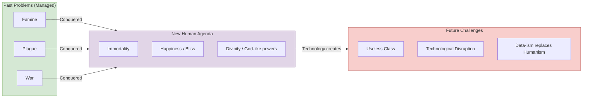

## Overview

_Homo Deus: A Brief History of Tomorrow_ is the sequel to _Sapiens: A Brief
History of Humankind_. Where _Sapiens_ looked backward at how _Homo sapiens_
came to dominate the planet, _Homo Deus_ looks forward — asking what happens
when humanity turns its extraordinary powers inward. Harari's thesis: having
largely conquered famine, plague, and war, the human species now pursues a new
agenda — immortality, bliss, and divinity. But this pursuit, powered by
biotechnology and artificial intelligence, threatens to render the humanist
framework obsolete and create a world where most humans are economically
irrelevant and algorithms know us better than we know ourselves.

---

## Executive Summary: From Sapiens to Deus

---

## Key Takeaways

**The old triad is conquered.** For the first time in history, the three great
killers — famine, plague, and war — are manageable rather than existential
threats. More people die from obesity than starvation, from old age than
infectious disease, from suicide than violent conflict. This unprecedented
success creates a new problem: what do we do now?

**The new agenda: immortality, bliss, divinity.** Having solved (mostly) the
problem of survival, humanity redirects its energies upward. Death becomes a
technical problem to be solved. Happiness becomes a biochemical state to be
engineered. Humanity seeks to upgrade itself into _Homo deus_ — a god-like
being with powers of creation and self-transformation.

**Humanism is the dominant religion of the modern world.** Harari argues that
humanism — the belief that human experience and individual feeling are the
ultimate source of meaning and authority — is the religion that replaced
traditional faiths. Liberal humanism values individual freedom. Socialist
humanism values collective human welfare. Evolutionary humanism (Nazism,
Fascism) values the advancement of the master race. All are forms of
human-worship.

**Organisms are algorithms.** A core scientific premise of the book: living
organisms, including humans, are biochemical data-processing systems. Feelings
and desires are computational outputs shaped by evolution. There is no
metaphysical soul or free-floating consciousness — just information processing.

**Consciousness vs. intelligence.** Harari distinguishes between consciousness
(subjective experience, feeling, suffering) and intelligence (the ability to
solve problems and achieve goals). For most of history, they were fused in
biological brains. AI is splitting them apart — creating intelligence without
consciousness. If non-conscious algorithms outperform humans at every task,
what becomes of human value?

**The useless class.** As AI and automation eliminate jobs across every sector,
a new class of "useless" humans may emerge — people who are not just
unemployed but unemployable, with no economic value and thus no political
power. The gap between upgraded superhumans and the useless mass becomes the
central axis of inequality.

**Dataism as emerging religion.** The book's final and most speculative
chapter introduces Dataism — the belief that the universe consists of data
flows, that value lies in optimising information processing, and that
humanity's cosmic task is to build the "Internet of All Things" and then step
aside for superior non-conscious algorithms.

---

## Who Should Read This

- Readers of _Sapiens_ who want the sequel's vision of where we are heading
- Anyone interested in AI, transhumanism, biotechnology, and the future of work
- Students of philosophy, technology ethics, and political theory
- Tech-industry professionals who want the big-picture context for their work

## Who Shouldn't

- Readers seeking rigorous academic predictions — this is speculative
  historical philosophy, not futurology
- Those who want specific policy prescriptions rather than broad frameworks
- Anyone unsettled by arguments that challenge free will and human exceptionalism

---

## Difficulty: Easy–Medium

Harari writes in the same conversational, aphoristic style that made _Sapiens_
accessible to millions. No technical background is needed. The difficulty comes
from the weight of the ideas, not the density of the prose.

---

## Reading Time

~9 hours at average pace (~130,000 words English text).

---

## Historical Context

_Homo Deus_ belongs to the wave of big-picture thinking that _Sapiens_
ignited. It was published at a moment when AI was making headlines (AlphaGo
defeated Lee Sedol in 2016, the same year the English edition appeared),
when CRISPR gene editing was becoming practical, and when Silicon Valley's
longevity and transhumanist projects were moving from fringe to mainstream.
The book is both a product of and a commentary on the tech boom's
self-narrative.

---

## Related Books

| Book | Author | Relation |
|---|---|---|
| _Sapiens_ | Yuval Noah Harari | Prequel — how we got here |
| _21 Lessons for the 21st Century_ | Yuval Noah Harari | Thematic follow-up on present crises |
| _The Singularity Is Near_ | Ray Kurzweil | Tech-optimist counterpart to Harari's caution |
| _Superintelligence_ | Nick Bostrom | Rigorous academic treatment of AI risk |
| _Life 3.0_ | Max Tegmark | AI futures from a physicist's perspective |
| _Enlightenment Now_ | Steven Pinker | Optimist counterpoint to Harari's pessimism |
| _The Age of Surveillance Capitalism_ | Shoshana Zuboff | Data-as-power in the corporate context |

---

## Final Verdict

_Homo Deus_ is a provocative, elegantly written thought-experiment about
technology, meaning, and the human future. Its strength is its willingness to
follow ideas to uncomfortable conclusions — that humanism may be a phase, that
individual free will is an illusion, that most people may become economically
irrelevant. Its weakness is the same: the arguments are sweeping, often
unsupported by detailed evidence, and occasionally self-contradictory.
Critics have called it glib, overly pessimistic, and prone to dressing up
speculation as science. Nonetheless, the questions it raises — about the value
of consciousness, the future of work, and the meaning of progress — are the
central questions of the twenty-first century. Read it as a conversation
starter, not a prophecy.
