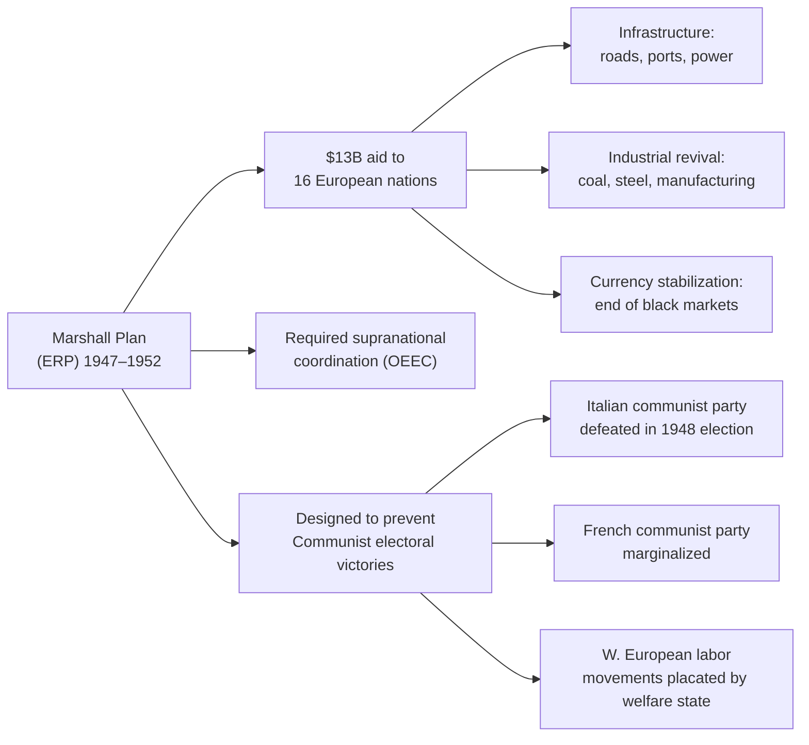

```mermaid
graph TB
  subgraph EUROPE["Europe, 1945–2000s"]
    direction TB
    ROOT["The European Project"] --> D1["Geographic Division:<br/>East vs West"]
    ROOT --> D2["Economic Model:<br/>Welfare Capitalism vs Command Economy"]
    ROOT --> D3["Intellectual Culture:<br/>Existentialism to Postmodernism"]
    ROOT --> D4["Memory Politics:<br/>Remembering and Forgetting WWII"]
  end

  D1 --> E1["Western Bloc:<br/>US-aligned, market economies"]
  D1 --> E2["Eastern Bloc:<br/>Soviet satellite states, one-party rule"]
  D1 --> E3["Neutral States:<br/>Sweden, Austria, Finland, Yugoslavia"]

  E2 --> F1["Stalinist totalitarianism<br/>1945–1953"]
  E2 --> F2["Post-Stalin reform<br/>and stagnation"]
  E2 --> F3["Gorbachev and<br/>controlled collapse 1989"]

  D1 --> G["German Question:<br/>division and reunification"]
  G --> G1["FRG (West):<br/>Wirtschaftswunder anchored in West"]
  G --> G2["GDR (East):<br/>Soviet-sponsored socialist state"]
  G --> G3["Berlin Wall 1961<br/>symbol and instrument of division"]
  G --> G4["Fall 1989:<br/>reunification 1990"]

  D2 --> H["The Welfare<br/>State Consensus"]
  H --> H1["National insurance<br/>and public provision"]
  H --> H2["Full employment<br/>as policy goal"]
  H --> H3["Social partnership:<br/>capital + labor + state"]
  H --> H4["Trente Glorieuses:<br/>30 years of growth 1945–73"]

  D4 --> I["Memory as<br/>Political Weapon"]
  I --> I1["Collaboration vs Resistance:<br/>the French myth"]
  I --> I2["German Vergangenheitsbewältigung:<br/>coming to terms with Nazism"]
  I --> I3["Eastern Europe:<br/>double occupation, double victimhood"]
  I --> I4["Yugoslav Wars:<br/>history weaponized in the 1990s"]
```

---

## The State of Europe in 1945

The book opens not with victory celebrations but with devastation. In 1945, Europe was physically destroyed, morally exhausted, and economically bankrupt. Judt's opening chapters establish a central insight that reverberates through the entire book: Europe's postwar history cannot be understood as a triumphalist narrative of recovery and integration. It must be understood as a response to catastrophe — a continent that had destroyed itself twice in thirty years trying to construct a usable future from the ruins of its own history.

| Dimension of Ruin | Scale | Effect on Postwar Choices |
|-------------------|-------|--------------------------|
| **Physical** | 30 million dead; cities destroyed; infrastructure obliterated | Made national economic self-sufficiency impossible; required external aid |
| **Moral** | Holocaust, collaboration, wartime atrocities everywhere | Suppressed or mythologized; memory became a political battlefield |
| **Economic** | Currencies worthless; trade disrupted; productive capacity destroyed | Marshall Plan made European recovery geopolitically contingent |
| **Political** | Old elites discredited (some justly, some not); democracy itself questioned | Created space for new political coalitions; social democratic consensus |
| **Demographic** | Millions displaced; Jewish communities effectively destroyed | Redrew ethnic maps; manufactured homogeneity in Eastern Europe |

---

## The Marshall Plan: Aid as Geopolitical Strategy

The European Recovery Program — the Marshall Plan — provided $13 billion (approximately $180 billion in today's money) from 1947 to 1952. Judt treats it not as American generosity but as the strategic foundation of Western European reconstruction and containment. The money came with conditions: recipient governments had to cooperate in supranational planning (the OEEC), open their markets to each other, and align with the United States in the emerging Cold War.

The Soviet Union and its satellite states were invited to participate but refused on Stalin's orders. This was the formal beginning of the European split.

---

## The Division of Europe: Iron Curtain and Ideological Blocs

By 1953 at Stalin's death, Europe was formally divided into two distinct political and economic orders:

### Western Bloc — The American Camp

- **West Germany**: Founded as the Federal Republic in 1949; Wirtschaftswunder (economic miracle) anchored in the Deutschmark and the social market economy
- **France**: Rebuilt under the dirigiste model of the Plan Monnet; colonial wars in Indochina and Algeria draining the state
- **Italy**: Christian Democrats dominated; communist vote suppressed through Cold War political alignment
- **Britain**: Lingering imperial commitments; austerity at home; delayed recovery; a welfare state created piecemeal

### Eastern Bloc — The Soviet Camp

- **Poland**: Communist takeover 1947; collectivization and purges; Church as alternative institutional center
- **East Germany**: Founded 1949; Berlin Wall erected 1961; Ossis lived under surveillance and shortage
- **Czechoslovakia**: Stalinist show trials (Slánský) 1952; Prague Spring crushed 1968
- **Hungary**: 1956 revolution crushed by Soviet tanks; reform communism under Kádár
- **Romania**: Gheorghe Gheorghiu-Dej, then Ceaușescu; independent foreign policy, domestic repression
- **Bulgaria, Albania**: Stalinist to varying degrees; Todor Zhivkov in power until 1989

### The Neutral Position

- **Sweden, Finland, Austria**: Neutral but not equidistant. Austria declared neutrality in 1955 as part of the State Treaty; Finland managed a delicate "Finlandization" under Soviet pressure; Sweden maintained Western alignment without NATO membership.
- **Yugoslavia**: Expelled from the Cominform in 1948; pursued a nominally socialist path independent of Moscow; dissolved violently 1991–2001.

---

## The German Economic Miracle

Judt devotes careful attention to the Wirtschaftswunder — West Germany's extraordinary postwar economic growth. The miracle was not magic. It rested on three structural conditions:

1. **Currency reform of 1948**: The introduction of the Deutschmark ended the black-market chaos of Reichsmark inflation and restored price signals.
2. **The Social Market Economy**: Ludwig Erhard's model combined free-market competition with a social safety net, breaking from both laissez-faire capitalism and Soviet planning.
3. **European integration**: West Germany's economic sovereignty was tied to European institutions — the ECSC, then the EEC — making German prosperity structurally dependent on European peace.

The economic miracle was not, Judt emphasizes, a model that should be romanticized. It was built on imported labor (Gastarbeiter), maintained suppressed consumption (high savings rates), and left unresolved the moral question of German responsibility.

---

## The Rise of the European Welfare State

From 1945 to 1973, the European settlement was the welfare state. In country after country — Britain's Beveridge Report, France's Sécurité Sociale, the Scandinavian model, German Sozialstaat — the agreement was roughly the same: the state would guarantee a minimum standard of living, unemployment insurance, universal health care, and public education, in exchange for working-class political peace and productivity gains shared broadly.

| Country | Model | distinctive Feature |
|---------|-------|---------------------|
| **United Kingdom** | Beveridgean | National insurance; NHS (1948); comprehensive but fiscally strained |
| **Sweden** | Social Democratic | High-tax, high-investment model; full employment as constitutional commitment |
| **France** | Dirigiste | State-led planning; expansion of public sector; worker participation in management |
| **West Germany** | Social Market | Market economy with generous social safety net; corporatist wage-setting |
| **Italy** | Clientelist | Southern underdevelopment; fragmented welfare coverage; political patronage |

The Trente Glorieuses — the thirty glorious years of full employment and growth — created the material conditions for welfare but also generated expectations that could not survive the economic shocks of the 1970s.

---

## The 1960s: Culture Wars and Intellectual Ferment

The 1960s represent Judt's most important intellectual-history section. He shows how the political upheavals of the decade were inseparable from the philosophical climate shaped by existentialism, structuralism, and their political consequences:

**The Existentialist Legacy**

Jean-Paul Sartre dominated European intellectual life in the two decades after WWII. His version of existentialism — that existence precedes essence, that individuals are condemned to be free, that authenticity requires political engagement — made him the reluctant philosopher of the resistance, the reluctant supporter of communism, the reluctant critic of Soviet totalitarianism. Judt is merciless on Sartre's failure: for decades, Sartre refused to criticize the Soviet Union, preferring to see anti-communism as the enemy of human liberation. This moral failure, Judt argues, damaged the credibility of the European left.

**May 1968 and Intellectual Exhaustion**

The events of May 1968 in Paris — student uprising, factory occupations, general strike — created the illusion of revolutionary possibility. Judt argues, persuasively and controversially, that 1968 was not a revolution that failed but a signal of deeper exhaustion. The generation that came of age under de Gaulle was less interested in seizing state power than in transforming everyday life. The failure of 1968 hardened into intellectual disillusionment — structuralism, postmodernism, and the turn inward toward personal identity as the only remaining site of political action.

**The Rise of Structuralism**

Michel Foucault, Claude Lévi-Strauss, and Jacques Derrida displaced Sartrean humanism. Where Sartre sought individual agency, structuralism located meaning in systems — language, power, discourse. The political import was ambiguous: structuralism was radical in its anti-humanism but conservative in its assertion that individual resistance was epistemologically impossible. Judt treats the structuralist turn as the moment when European intellectual life lost its political nerve.

---

## Decolonization: Europe Loses Its Empire

Judt handles decolonization as a central narrative of the postwar period — not as a sideshow to European history but as an event that redefined European political identity. The loss of empire was psychologically devastating to France and Britain in particular:

- **Britain**: The loss of India in 1947 (followed by rapid decolonization of Africa and Asia) undermined the foundational myth of British imperial power and forced a reluctant reorientation toward Europe.
- **France**: Defeat in Indochina (1954) and the Algerian War (1954–1962) destabilized the Fourth Republic, brought de Gaulle to power, and created a generation of pied-noir resentment.
- **The Netherlands, Belgium, Portugal**: Smaller but equally consequential losses that reopened old wounds between European neighbors.

Judt emphasizes that decolonization was never a process European powers chose freely. It was forced by military defeat, economic impossibility, and the rise of indigenous nationalist movements backed — sometimes — by Cold War superpower competition. The European response was, characteristically, to forget: to suppress the memory of colonial violence and retreat into the narrative of European victimhood rather than European culpability.

---

## The Soviet Bloc: Stalinism, Stagnation, Collapse

Judt's treatment of the Eastern Bloc is more sympathetic to Eastern European perspectives than most Western historians of the period. He emphasizes:

- The depth of Stalinist terror: show trials, mass deportations, political purges as a system, not an aberration.
- The ways in which communism failed to deliver on its promises: shortages, surveillance, restricted movement, the elimination of civil society.
- The surprising resilience of resistance institutions: the Polish Catholic Church, the Hungarian Writers' Union, Czech intellectual networks.

The collapse of 1989 is treated not as inevitable but as a series of contingent political choices: Gorbachev's refusal to use Soviet military force to preserve Eastern European regimes, the decision of Eastern European elites to negotiate rather than fight, the decision of Western Europeans to accept unification without exploiting Soviet weakness.

---

## The Fall of the Berlin Wall and German Unification

November 9, 1989 — when the Berlin Wall fell — is the hinge event of Judt's narrative. He reconstructs it not as triumph but as a moment of extraordinary improvisation requiring enormous political courage on all sides. German unification was not pre-planned; it happened because East German citizens simply walked out, because the Hungarian leadership opened the border, because no one had the will to stop them.

The unification itself was, Judt argues, ultimately a Western victory dressed as European integration — Germany paid a high price (the Ostmark converted 1:1 with the Deutschmark) to buy acceptance from its neighbors.

---

## The Emergence of the European Union

The Maastricht Treaty of 1992, establishing the European Union, represented the transformation of the European Community from an economic project into a political one. Judt is cautiously positive about the EU but insists on its limitations:

- The EU is not a nation-state and cannot replace one.
- Its legitimacy rests on economic performance, not democratic engagement.
- Its expansion to the East was driven partly by the desire to export post-1989 instability to institutions rather than to the streets of Western European cities.
- The euro created monetary union without political union — a structural instability Judt warned would produce future crises.

---

## Nationalism's Return and the Yugoslav Wars

For many European observers in 1989, the lesson seemed to be that nationalism was dead — that the era of ethnic conflict in Europe was over. The Yugoslav wars of 1991–2001 proved them catastrophically wrong. Judt's chapters on Yugoslavia are among the most powerful in the book:

- Bosnia (1992–95): Ethnic cleansing, the Srebrenica massacre, European military incapacity, the Dayton Accords.
- Kosovo (1998–99): NATO intervention, the return of European war.
- The broader lesson: nationalism is not a force that disappears under modernization. It is a constructed political identity that can be activated by elites when other sources of legitimacy collapse.

Judt argues that European institutions' inability to prevent or manage the Yugoslav wars was not an accident but a structural feature: the EU had been built on the assumption that nationalism was a problem of the past, and it had no mechanisms for responding to it when it returned.

---

## The Velvet Revolutions: Peaceful Transition in Central Europe

The peaceful transitions of 1989 in Poland, Hungary, East Germany, and Czechoslovakia — the Velvet Revolution in Prague — stand in extraordinary contrast to both the 1956 and 1968 uprisings. Judt treats them as genuine popular revolutions, not the cynical elite deals that replaced communism in most of the former Soviet Union.

The key difference: in Central Europe, communism had run out of legitimacy among virtually the entire population, including the nomenklatura. When the opportunity arose, even communist party members chose to negotiate. The result was not perfect — economic shock therapy produced hardship — but it avoided the violence that engulfed Yugoslavia and the former Soviet Union.
