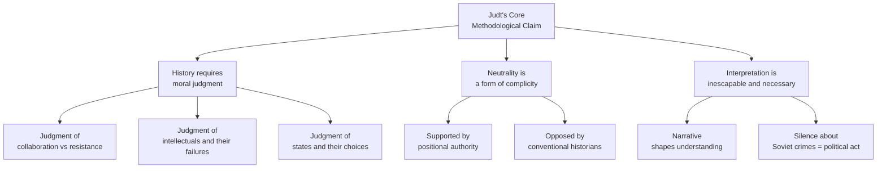
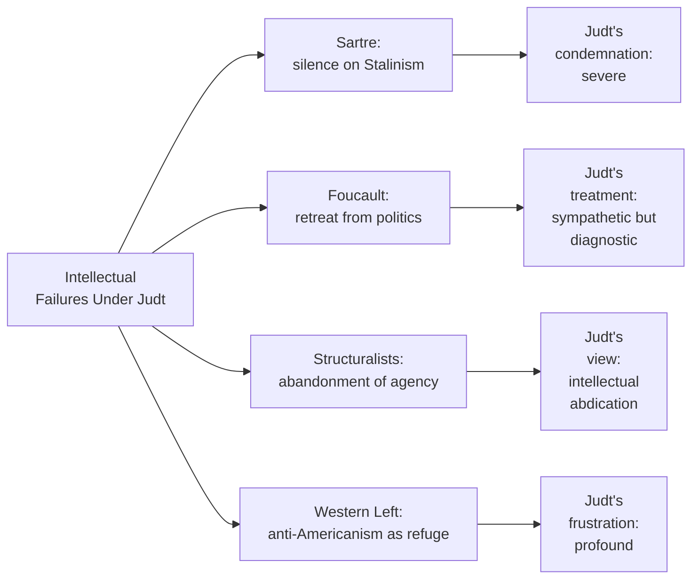
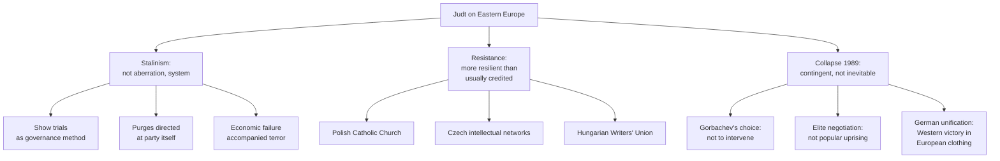
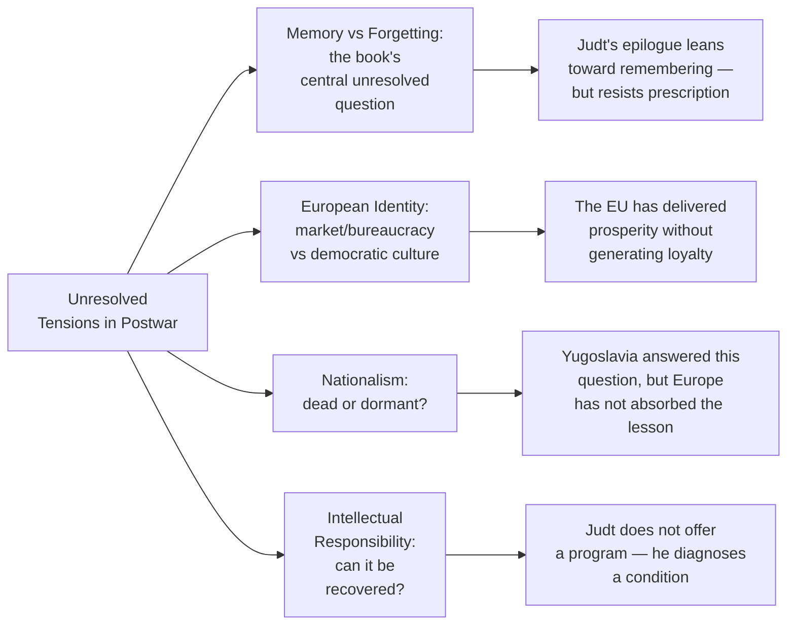

## Judt's Historiographical Stakes

Tony Judt's central challenge to his readers is methodological: he insists that history without moral judgment is not history at all, but a form of passive complicity. This stance places him in deliberate opposition to a generation of European historians — influenced by the Annales School, by social history, and by the professionalization of historiography — who treated neutrality as the mark of scholarly legitimacy. Judt saw neutrality not as objectivity but as evasion, and *Postwar* is structured as a sustained argument against that evasion.

## The Irony of Eurocentrism

One of the book's most revealing tensions is its simultaneous expansion of European history's scope and its persistentEurocentrism. Judt rightly insists that decolonization is central to the postwar story — not peripheral — and that Europe's turn inward toward the welfare state was partly a psychological compensation for the loss of empire. Yet the book devotes relatively little space to the colonial experience itself, treating decolonization primarily as it affected European domestic politics. The Algerian War, for instance, receives substantial treatment as a factor in French political history; the Algerian experience of French colonialism receives far less attention. This is not a failure Judt ignores — he acknowledges it — but it reflects the tension between his aspiration to write a genuinely European history and the limits of a frame centered on European nation-states.

## Intellectual History as Moral Tribunal

Of all Judt's targets, none receives as sustained and as unsparing treatment as Jean-Paul Sartre. The existentialist philosopher's refusal to condemn the Soviet Union — his insistence that anti-communism was the greater evil, his willingness to excuse the Moscow show trials, his silence over the Hungarian uprising — is, for Judt, not merely a personal failing but a catastrophe for European intellectual culture. Sartre's moral abdication, Judt argues, poisoned honest political debate for a generation: it made it impossible for the European left to speak clearly about totalitarianism, and it left the terrain of political argument open to cynicism and bad faith.

The critique is powerful but not unassailable. Sartre's defenders argue that Judt reads Sartre's silences through the retrospective lens of 1989, when the moral failure of Soviet communism was unmistakable. In the 1950s, the choice was not as obvious, and Sartre's commitment to human dignity was not merely rhetorical. Judt acknowledges this complexity without conceding the point, and the tension between his historical imagination and his moral verdict on Sartre defines one of the book's most productive unresolved conflicts.

## The Welfare State as Ideological Formation

Judt's treatment of the welfare state consensus is analytically richer than most celebratory accounts of social democracy, but also more ambiguous than his critics often acknowledge. He shows that the Trente Glorieuses — the three decades of growth from 1945 to 1973 — were historically contingent, dependent on specific structural conditions: devastated industrial capacity needing reconstruction, American capital inflow via the Marshall Plan, cheap energy, favorable demographics, and the political legitimacy purchased by wartime sacrifice. When those conditions eroded in the 1970s, the welfare state consensus could not survive intact — not because voters rejected it, but because the material base that had made it possible disappeared.

This analysis is persuasive, but it leads to a curious ambivalence in Judt's position. He clearly admires the welfare state consensus and mourns its passing; at the same time, he insists that it was historically specific and cannot simply be revived through political will. The result is a lament for a lost world that Judt simultaneously refuses to treat as either purely tragic or purely triumphant.

## The German Problem: Engine and Threat

Judt returns repeatedly to what he calls "the German problem" — the fact that Germany was simultaneously the source of Europe's greatest catastrophe and its most powerful engine of postwar reconstruction. This duality cannot be resolved, Judt argues, only managed. The European integration project — from the ECSC to the Maastricht Treaty — was, at its deepest level, a strategy for managing the German problem by embedding German power in supranational institutions.

The insight is important, but it raises questions about agency and direction. Was European integration primarily a response to German power, or did it represent a genuinely shared European aspiration? Judt leans toward the former reading, which is consistent with his skepticism about grand narratives of European progress. But this skepticism can lead to a residual cynicism about the EU project that not all readers will share.

## Soviet Totalitarianism Reassessed

Judt's treatment of the Eastern Bloc distinguishes *Postwar* from most Western European histories of the period. He writes about Eastern Europe with a sympathy and a granular attention to local detail that most historians writing in English have avoided. His insistence that Stalinism was not an aberration but a systematic feature of Soviet governance — that the purges were directed at the party itself, that terror was a method of governance, not an excess — places him in continuity with the historiography of Robert Conquest and Anne Applebaum, while his treatment of resistance institutions adds nuance that they tend to omit.

His account of 1989 as a series of contingent choices rather than an inevitable outcome of systemic decay is also distinctive. The collapse of communism happened not because the system could not sustain itself but because specific actors — Gorbachev, Havel, Wałęsa, the East German protesters — chose not to defend it. This reading has been challenged by historians who argue that Judt underestimates the economic and social pressures that made those choices inevitable, but his argument remains a necessary corrective to Whig narratives of liberal triumphalism.

## Structural Weaknesses

The book has identifiable limitations that Judt himself recognizes. The Baltic states receive substantially less attention than Poland, Czechoslovakia, and Hungary. The Balkans — apart from the Yugoslav wars — are largely absent from the narrative until they erupt violently in the 1990s. The cultural and intellectual history in Part IV (covering the 1950s through 1970s) is overwhelmingly French and German; British, Italian, and Spanish intellectual culture is barely present.

More fundamentally, the book's structure privileges Western European political history and intellectual history in ways that marginalize social history — the history of ordinary life, of working-class experience, of women, of minority communities. Judt writes as if the welfare state were a set of policies and institutions, not a lived experience shaped by gender, race, and class in ways that his narrative tends to smooth over.

## What Remains Unresolved

The unresolved quality of the ending is intentional and philosophically serious. Judt does not believe that the historian's role is to prescribe solutions — it is to diagnose the character of the present by understanding how it was made. The question he leaves hanging — whether a Europe of markets and bureaucrats can sustain the democratic culture that made its values worth defending — is the question Europe itself has been trying to answer since 1989, with results that remain ambiguous and contested.
