## Overview

*Postwar: A History of Europe Since 1945* is Tony Judt's magnum opus — a 900-page synthesis of six decades of European history that redefined how historians, policymakers, and general readers understand the continent's modern journey. First published in 2005 (with a major updated paperback edition in 2010), the book arrived with immediate and overwhelming critical acclaim: it won the Duff Cooper Prize, was shortlisted for the Samuel Johnson Prize, and was named one of the *New York Times* Ten Best Books of 2005.

What distinguishes *Postwar* from earlier European histories is not just its temporal reach — from the rubble of 1945 through the Yugoslav wars and the first years of a reunited Europe — but its method and its moral conviction. Judt is not a dispassionate chronicler. He makes judgments. He tells readers, in blunt and often uncomfortable prose, which historical choices were courageous and which were cowardly, which states were complicit and which were principled. This commitment to moral clarity is the book's defining feature and the source of its greatest controversies.

---

## Executive Summary

```mermaid
graph TD
  A["Postwar: Europe Since 1945"] --> B1["Destruction and<br/>Reconstruction (1945–1953)"]
  A --> B2["The Golden Age<br/>(1953–1973)"]
  A --> B3["The Age of Uncertainty<br/>(1973–1989)"]
  A --> B4["After the Fall<br/>(1989–2000s)"]

  B1 --> C1["Physical and moral<br/>ruin of WWII"]
  B1 --> C2["Marshall Plan and<br/>American aid"]
  B1 --> C3["Soviet consolidation<br/>of Eastern Europe"]
  B1 --> C4["Nuremberg Trials and<br/>the politics of memory"]
  B1 --> C5["West Germany's<br/>Wirtschaftswunder"]

  B2 --> C6["The European<br/>welfare state built"]
  B2 --> C7["The Trente Glorieuses<br/>— 30 years of growth"]
  B2 --> C8["Decolonization:<br/>end of European empires"]
  B2 --> C9["Soviet Hungary 1956,<br/>Prague 1968"]
  B2 --> C10["Cultural revolutions<br/>of the 1960s"]

  B3 --> C11["Stagnation in<br/>both blocs"]
  B3 --> C12["Intellectual exhaustion:<br/>end of '68 generation"]
  B3 --> C13["Solidarity and<br/>the Polish church"]
  B3 --> C14["Thatcher, Reagan,<br/>and neoliberal turn"]
  B3 --> C15["Yugoslavia's<br/>slow-motion breakup"]

  B4 --> C16["Fall of Berlin Wall<br/>1989"]
  B4 --> C17["German<br/>unification"]
  B4 --> C18["Velvet Revolutions<br/>peaceful transition"]
  B4 --> C19["Maastricht and<br/>European Union"]
  B4 --> C20["Yugoslav wars<br/>1991–2001"]
  B4 --> C21["EU enlargement<br/>and identity crisis"]
```

---

## Book Structure

| Part | Chapters | Core Argument |
|------|----------|---------------|
| **I: The Legacy of War** | 1–5 | Physical ruin; moral reckoning; the politics of collaboration and resistance; displaced populations |
| **II: The Post-War Reconstruction** | 6–12 | Marshall Plan; the German question; the formation of NATO and the Warsaw Pact; the Italian settlement |
| **III: The Golden Age** | 13–20 | Economic miracle and its discontents; the welfare state model; the silent revolution of welfare capitalism |
| **IV: The Culture of Hope** | 21–26 | Intellectual and cultural life from Camus to Sartre; existentialism, structuralism, and the politics of the intellect |
| **V: The Retreat of the State** | 27–33 | End of postwar consensus; Thatcher and Reagan; the neoliberal turn; the rise of market ideology |
| **VI: The End of the Old Order** | 34–38 | The collapse of communism 1989; reunification of Germany; the velvet revolutions |
| **VII: After 1989** | 39–43 | The Yugoslav wars; the making of the European Union; identity, immigration, and the new Europe |
| **VIII: The New Europe** | 44–Epilogue | European integration; the problem of Russian identity; memory and the unfinished twentieth century |

---

## Key Takeaways

1. **Europe was remade by outsiders**. The Marshall Plan was not charity — it was strategic containment dressed in humanitarian language. American capital rebuilt Western Europe to prevent it from falling to communism. Europe's postwar prosperity was a geopolitical project.

2. **The Cold War was as much cultural as military**. Judt shows that the Iron Curtain was sustained not only by tanks and nuclear weapons but by ideas — by the competing claims of Marxism-Leninism and liberal capitalism, by the seductive power of the American model, and by the moral failure of many European intellectuals who refused to confront Soviet crimes.

3. **The welfare state was a European invention, not a British or Scandinavian one**. The consensus around state planning, social insurance, and public provision was pan-European from 1945 to 1973. Its erosion was a continental story, driven not by voters rejecting welfare but by economic stagnation and political fatigue.

4. **Decolonization was the unspoken trauma of postwar Europe**. The loss of empire — India, Algeria, Indochina, Africa — was devastating to French and British national identity, but it was rarely processed publicly. Judt argues that Europe's turn inward, toward the social welfare project, was partially a response to imperial humiliation.

5. **The intellectual class betrayed Europe in the East**. European leftist intellectuals — Sartre most prominently — refused to condemn Soviet totalitarianism for decades, preferring to see anti-communism as the greater evil. This moral failure shaped the intellectual culture of the Cold War and poisoned honest debate.

6. **The "Trente Glorieuses" (1945–1973) were a unique historical moment**. Three decades of full employment, rising living standards, and expanding social provision were made possible by specific postwar conditions — a destroyed industrial base that needed rebuilding, American capital inflow, cheap energy, and demographic growth. That moment cannot be reproduced.

7. **Yugoslavia's breakup exposed Europe's unfinished Cold War history**. The wars of the 1990s in Croatia, Bosnia, and Kosovo revealed that European institutions were not equipped to manage Balkan nationalism — and that Western European leaders had spent decades refusing to look at the ethnic tensions that had been papered over under Tito.

8. **Memory is a political instrument, and forgetting is a political choice**. Throughout the book, Judt returns to how Europe chose to remember — or not remember — its own culpability: collaboration in France, the deliberate suppression of wartime violence in Italy, the revisionist myths of Eastern European anti-communism. How you remember history determines how you construct the future.

9. **The European Union is a response to failure, not a triumph**. The EU was built not on the triumphant assertion of European values but on the desperate attempt to prevent German-French rivalry from destroying Europe again — and later, to prevent the Balkan scenario from recurring anywhere else in Europe.

10. **Tony Judt leaves readers with an unresolved Europe**. The book's epilogue is neither celebration nor lament. Judt argues that Europe has become more united, more comfortable, and more prosperous — but has lost something important in the process: a sense of political purpose and a shared public life. The question he leaves hanging is whether a Europe of markets and bureaucrats can sustain the democratic culture that made its values worth defending.

---

## Who Should Read

| Reader Type | Why |
|---|---|
| Historians and history students | The most comprehensive single-volume history of modern Europe available; essential framework for any European history coursework |
| Political scientists and IR scholars | Judt's treatment of the Cold War, the welfare state, and European integration is analytically rigorous |
| Anyone interested in the origins of the EU | The clearest narrative of how supranational governance emerged from the ashes of nationalism |
| Students of intellectual history | The chapters on European thinkers — Camus, Sartre, Koestler, Orwell, Arendt — are unmatched as intellectual biography woven into political narrative |
| Europeans seeking self-understanding | Judt's unflinching willingness to criticize complacency and shatter national myths makes this uncomfortable but essential |
| Policy professionals | The book's analysis of social policy convergence, welfare reform, and market ideology informed actual EU policy debates |
| General readers of big-idea nonfiction | A rare book that is both scholarly and accessible — Judt writes for educated citizens, not just for academics |

---

## Who Should Skip

- Readers looking for a military history of WWII — this book begins where WWII ends
- Anyone seeking a celebratory account of European integration — Judt is skeptical throughout
- Readers who prefer history-neutral narratives — Judt makes moral judgments and expects readers to engage with them
- Those with limited time — at 968 pages, this is a multi-week commitment requiring sustained concentration
- Students who have not read at least a basic general history of twentieth-century Europe — Judt assumes prior familiarity with key events

---

## Historical Context

| Date | Event |
|------|-------|
| 1948 | Tony Judt born in London |
| 1969 | Completes BA at King's College, Cambridge |
| 1972 | PhD at École Normale Supérieure, Paris |
| 1976–87 | Teaches at University of California, Berkeley |
| 1987 | Joins NYU; founds Remarque Institute for European Studies |
| 2005 | *Postwar* published by Penguin Press (UK); Immediate critical success |
| 2005 | Wins Duff Cooper Prize for History |
| 2006 | Shortlisted for Samuel Johnson Prize |
| 2008 | Diagnosed with ALS (motor neuron disease) |
| 2009 | Publishes *Ill Fares the Land*, his final political treatise |
| 2010 | Dies in New York, age 62; *Postwar* updated edition reissued |

Judt wrote *Postwar* over more than a decade, drawing on mastery of eight or nine European languages, archival research in a dozen countries, and decades of teaching and writing about modern European intellectual history. His ability to move fluently between politics, economics, culture, and philosophy is the book's defining intellectual achievement: no one before him had attempted — let alone succeeded in — such a sweeping synthesis of the European postwar experience.

---

## Core Themes

| Theme | Description |
|--------|-------------|
| Reconstruction and American Hegemony | Europe rebuilt under American strategic and economic leadership; Marshall Plan as geopolitical investment |
| The Moral Weight of Memory | How Europe processed, suppressed, or mythologized its wartime experiences — collaboration, resistance, complicity |
| The Cold War as Culture War | Competing ideologies as expressed in literature, philosophy, and everyday life, not just in military strategy |
| The Welfare State Consensus | The three decades of broadly shared social provision across Western Europe from 1945 to the oil shocks of 1973 |
| The Failure of the European Left | The moral abdication of socialist intellectuals who refused to confront Stalinism; the collapse of left credibility |
| Decolonization and Imperial Loss | The psychological and political impact of empire's end on European self-understanding |
| The German Problem Unresolved | Germany as simultaneously the source of European catastrophe and its engine of postwar reconstruction |
| The European Union as Experiment | Supranationalism as a new political form, emerging from necessity rather than ideological conviction |
| Nationalism's Ineradicable Persistence | Despite every prediction of its decline, nationalism re-emerged — violently — in the former Yugoslavia |
| Memory and the Unfinished Twentieth Century | Judt's central argument: Europe's identity remains trapped between memory of catastrophe and desire to forget |
| Philosophy as Public Force | How French and German thinkers — from existentialists to structuralists — shaped and were shaped by political events |
| The Perils of Market Fundamentalism | The shift from social democratic consensus to neoliberal individualism from the 1980s onward |

---

## Why This Book Matters

*Postwar* is the most ambitious and authoritative single-volume history of Europe since 1945 ever written in the English language. It accomplished something very rare in contemporary historical writing: it shaped *both* scholarly debate *and* public understanding simultaneously. The book's central argument — that Europe's postwar identity is built on the unresolved tension between remembering and forgetting — has become the standard framework through which educators, journalists, and analysts discuss modern European history.

Judt's willingness to take sides — to condemn French collaborationist mythology, to criticize Sartre's moral failures, to challenge the delusions of both left and right — made the book controversial and made it necessary. In a historical culture that increasingly prizes neutrality over conviction, Judt insisted that history without moral judgment is not history at all, but a form of passive complicity.

The book also holds an unusual position in the literature of history: it is both a scholarly work and a book of engaged political commentary. Judt was one of the most prominent public intellectuals of his generation. *Postwar* grew out of his disappointment with what he saw as Europe's abdication of political engagement in favor of comfortable consensus. It is, in some sense, not only a history but an argument for a more politically engaged Europe — a case Judt made with increasing urgency after 2003, when he became one of Europe's most prominent critics of the Iraq War.

---

## Related Books

| Book | Author | Connection |
|------|--------|------------|
| **The Origins of Totalitarianism** | Hannah Arendt | Judt greatly admired Arendt; her analysis of totalitarianism informs his treatment of Stalinism |
| **The Age of Extremes** | Eric Hobsbawm | Hobsbawm's panoramic history of the short twentieth century; Judt engages with and challenges Hobsbawm's Marxist framework |
| **The Inheritance of Rome** | Chris Wickham | An earlier historical companion; together they bracket the thousand-year arc from late antiquity to the present |
| **Fin-de-Siècle Vienna** | Carl Schorske | The intellectual history model Judt emulates for his treatment of European ideas |
| **The Stripping of the Bones** | Julien Gracq | Not directly, but Judt shares Gracq's commitment to prose as moral instrument |
| **The Road to Serfdom** | F.A. Hayek | Judt analyzes the neoliberal turn partly through engagement with Hayek's intellectual program |
| **Black Sea** | Neal Ascherson | The most powerful literary treatment of Eastern European memory that Judt would have endorsed |
| **The Great Transformation** | Karl Polanyi | Judt's treatment of the welfare state draws extensively on Polanyi's analysis of market society |
| **Ordinary Men** | Christopher Browning | The moral history of ordinary Germans under Nazism; informs Judt's treatment of collaboration and complicity |
| **The Rattle of Pebbles** | George G. M. James | More relevant to decolonization narrative — Judt's treatment of imperial loss invites comparison with postcolonial theory |

---

## Final Verdict

*Postwar* is not a perfect history. It is long, occasionally repetitive, and deliberately opinionated in ways that will frustrate readers who prefer neutral historiography. The chapters on Eastern Europe, while substantial, lean heavily on Polish, Czech, and Hungarian sources — the Baltic states and the Balkans receive comparatively thin treatment, a limitation Judt acknowledges. The final chapters have been overtaken by events (Brexit, the Ukraine War, and the rise of a new authoritarian right) that Judt did not live to see.

And yet: it is the best single-volume history of modern Europe available. Judt's command of the primary sources in seven or more languages, his ability to weave political, economic, social, and intellectual history into a single narrative, and his unwavering commitment to moral clarity make *Postwar* genuinely indispensable. It is not the kind of book that leaves you comfortable — it is the kind of book that changes how you think about the world you live in.

**Rating: 10/10** — A landmark of modern historical writing. Required reading for any serious student of Europe, the Cold War, or the twentieth century.
