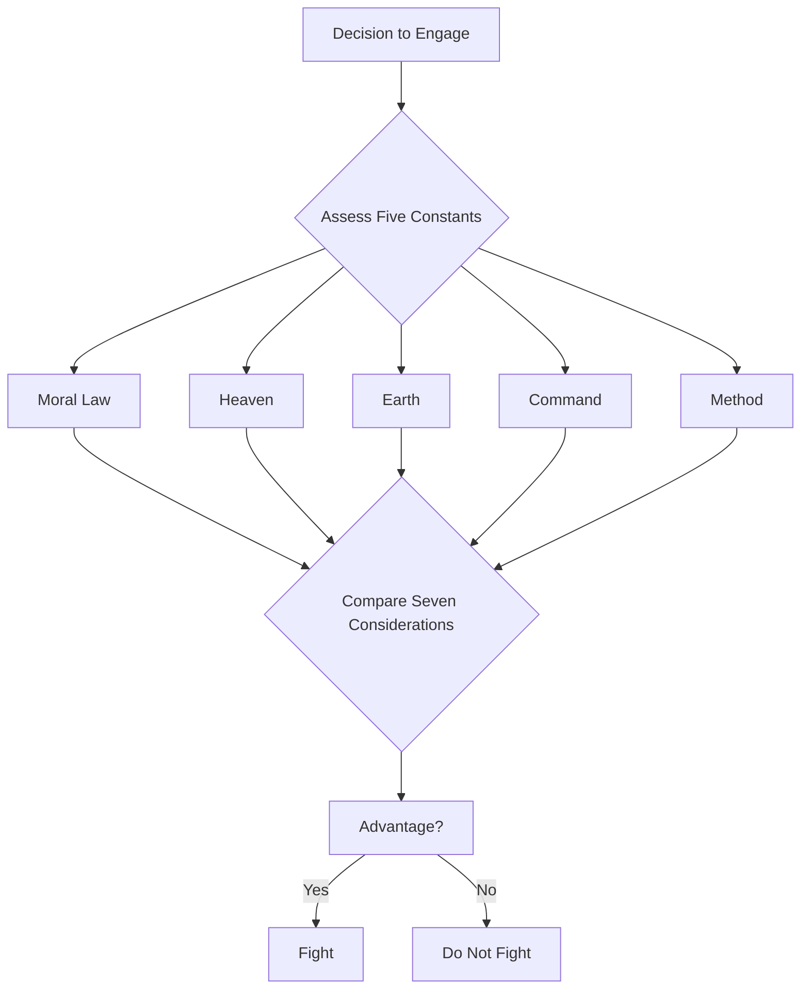
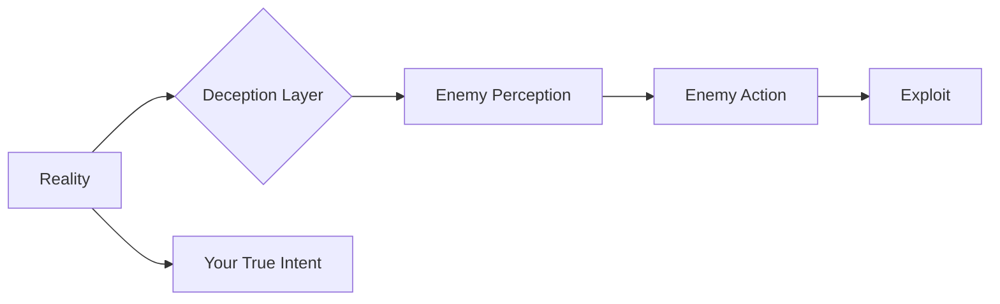
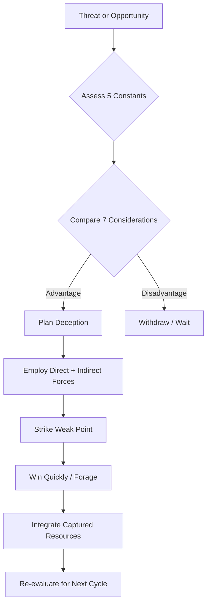

## Core Concepts

### The Five Constants (五事)

Sun Tzu opens by identifying five fundamental factors that determine
military success. Every decision — whether to fight, where to deploy,
how to supply — flows from assessing these five elements.

| Constant | Chinese | Meaning |
|----------|---------|---------|
| Moral Law | 道 (Dào) | Alignment between ruler and people; shared purpose that makes troops fearless |
| Heaven | 天 (Tiān) | Weather, seasons, natural conditions — the uncontrollable environment |
| Earth | 地 (Dì) | Terrain, distance, danger — the physical battlefield geometry |
| Command | 將 (Jiàng) | Leadership: wisdom, sincerity, benevolence, courage, and strictness |
| Method | 法 (Fǎ) | Organization, logistics, training, discipline, chain of command |

A general who thoroughly assesses these five before battle will win;
one who neglects them will lose.

### The Seven Considerations (七計)

These are the comparative questions a commander must ask before
engagement:

1. Which ruler inspires more loyalty and alignment?
2. Which commander is more capable?
3. Which side holds environmental/terrain advantage?
4. Which army enforces stricter discipline?
5. Which force is stronger (spirit + numbers)?
6. Which troops are better trained?
7. Which side is more consistent in reward and punishment?

### The Central Doctrine: Winning Without Fighting

> "Supreme excellence consists in breaking the enemy's resistance
> without fighting."

Sun Tzu's most radical idea: the best victory is the one that costs
nothing. Attack the enemy's strategy before you attack his army. Use
diplomacy, alliances, and psychological pressure to make opposition
irrelevant. If you must fight, make it short.

### All Warfare Is Based on Deception

This is the most quoted line from the book, and the foundation of Sun
Tzu's tactical thinking:

- When able to attack, seem unable
- When near, make the enemy believe you are far
- When far, make him believe you are near
- Offer a bait to lure him
- Feign disorder to crush him
- If he is secure, prepare for him
- If he is strong, evade him
- Pretend inferiority to encourage his arrogance

## Mental Models from the Text

### The Siege Aversion Model

> "The worst strategy of all is to besiege walled cities."

Sieges are expensive, slow, and unpredictable. Sun Tzu's hierarchy of
preference: attack the enemy's **plan** first, then his **alliances**,
then his **army**, and only last his **cities**. This maps directly to
modern competition: disrupt the business model, not the price war.

### The Water Model

> "Military tactics are like water. Water shapes its course according to
> the ground."

Be formless. Rigid strategies fail because enemies anticipate them.
Adaptability — changing your approach based on circumstances — is the
highest strategic virtue.

### The Crossbow Model

> "Energy may be likened to the bending of a crossbow; decision, to the
> releasing of a trigger."

Build up potential energy (resources, positioning, intelligence), then
release it in a single decisive strike. Don't dribble force; concentrate
and unleash.

### The Five Essentials for Victory

1. Know when to fight and when not to
2. Handle both superior and inferior forces
3. Unified spirit throughout your ranks
4. Be prepared and wait for the enemy's unpreparedness
5. Have military capacity free from sovereign interference

## Chapter-by-Chapter Insights

### I. Laying Plans (始計)

The overview. War is a matter of life and death — never enter it
without exhaustive calculation. The five constants and seven
considerations are introduced. Deception as a core principle.

### II. Waging War (作戰)

Economics of conflict. War consumes resources at a terrifying rate.
Prolonged campaigns bankrupt the state. Win fast. Forage on enemy
territory. Integrate captured soldiers into your own ranks.

### III. Attack by Stratagem (謀攻)

The pinnacle of strategy: subdue the enemy without fighting. Break
resistance at the planning stage. Know yourself and your enemy. The
five essentials for victory.

### IV. Tactical Dispositions (軍形)

First make yourself invincible, then wait for the enemy's moment of
vulnerability. Victory is not something you achieve — it is something
you recognize and seize when the conditions are right.

### V. Energy (兵勢)

The interplay of direct and indirect forces (正奇, *zheng* and *qi*).
Use the main force to fix the enemy, the surprise force to strike.
Orchestrate momentum like a rolling boulder.

### VI. Weak Points and Strong (虛實)

Attack emptiness; avoid solidity. Make the enemy reveal his
dispositions while keeping yours hidden. Concentrate your force where
he is weakest. Control the battlefield by controlling his decisions.

### VII. Maneuvering (軍爭)

The difficulties of moving armies into advantageous position.
Maneuver is dangerous — armies can be strung out, exhausted, or
ambushed. Know the terrain. Use signals. The indirect route is often
the fastest.

### VIII. Variation in Tactics (九變)

Flexibility. Adapt to changing circumstances. Five dangerous faults
of a general: recklessness, cowardice, quick temper, excessive
sensitivity to honor, over-solicitude for his men.

### IX. The Army on the March (行軍)

Practical field craft: how to read terrain (mountains, rivers,
marshes, plains), how to interpret enemy behavior (dust clouds, bird
flights, campfires), and how to position forces.

### X. Terrain (地形)

Six types of terrain — accessible, entangling, temporizing, narrow,
precipitous, distant — and each demands different tactics. Also
covers six calamities that arise from command failures.

### XI. The Nine Situations (九地)

Nine distinct strategic grounds — from dispersive ground (on home
territory) to deadly ground (where only desperate fight can save you).
Each requires a different psychological and tactical approach.

### XII. Attack by Fire (火攻)

Five methods of fire attack (burning personnel, stores, equipment,
supply lines, and using fire as a signal). A warning: do not go to war
in anger — only when it serves the state's long-term interest.

### XIII. The Use of Spies (用間)

The most important chapter. Intelligence determines everything. Five
categories of spies: local, internal, converted, doomed, and surviving.
Foreknowledge cannot come from gods or ghosts — it must come from
people who know the enemy's situation.

::callout
**Notable:** Chapter XIII on espionage is considered by many scholars
the emotional and philosophical core of the text. Sun Tzu argues that
spending vast sums on war while skimping on intelligence is inhumane —
the mark of an unkind ruler.
::

## Practical Frameworks

### The S.T.R.A.T.E.G.Y. Framework (derived from Sun Tzu)

| Step | Sun Tzu Principle |
|------|-------------------|
| **S**ituational Assessment | Evaluate the five constants |
| **T**arget Selection | Choose the enemy's weak point |
| **R**esource Allocation | Forage and economize |
| **A**lignment | Unify moral purpose |
| **T**actical Deception | Feign and misdirect |
| **E**xecution Speed | Strike like a thunderbolt |
| **G**round Exploitation | Use terrain to your advantage |
| **Y**ield and Adapt | Be formless like water |

### The Decision Ladder

## Legacy Concepts That Transcend the Original

Several ideas from *The Art of War* have been adapted and expanded
beyond what Sun Tzu originally wrote:

- **The Six Calamities of Command:** flight, insubordination, collapse,
  ruin, disorganization, and rout — each traced to a specific failure
  by the general
- **The Five Faults of a General:** recklessness (death), cowardice
  (capture), quick temper (insults), honor-sensitivity (shame),
  over-solicitude (worry)
- **The Desperate Fight Principle:** troops surrounded on all sides
  will fight with ten times their normal strength — use this, or avoid
  cornering an enemy who has nowhere to flee

> "Throw your soldiers into a position from which there is no escape,
> and they will prefer death to flight. If they will face death, there
> is nothing they will not achieve."
