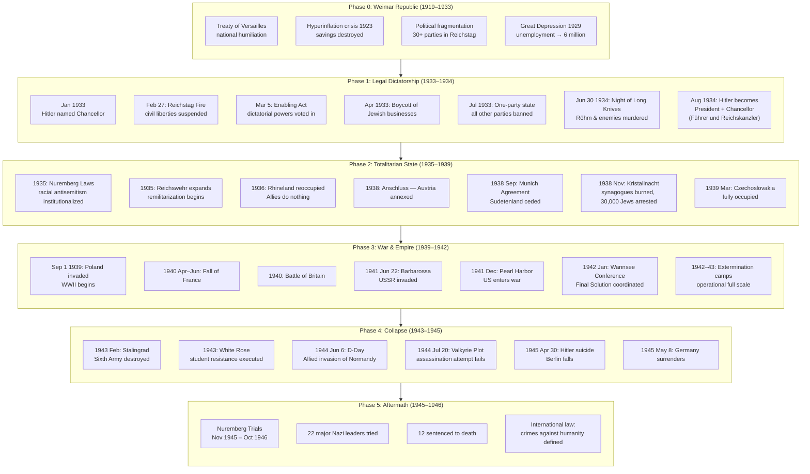
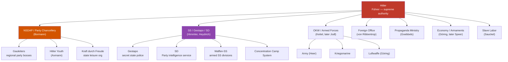
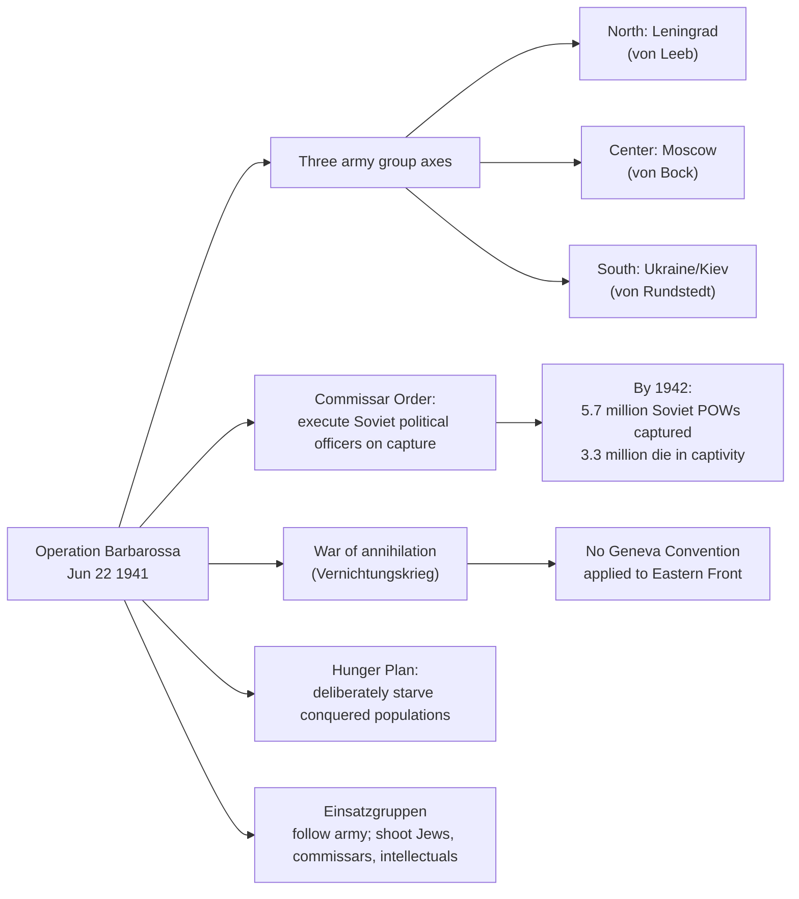

---

## Phase 0: Weimar Republic — The Democracy That Destroyed Itself

The Weimar Republic (1919–1933) was not a failed state when Hitler arrived. It was a legitimate, progressive democracy with one of the world's most advanced constitutions — the Weimar Constitution granted proportional representation, universal suffrage (including women, from 1918), extensive civil rights, and a strong framework for parliamentary governance.

What Weimar had was legitimacy without loyalty. The constitution was widely respected by political insiders, but it commanded little affection from the public. The problem was not structural fragility so much as sustained political assault from both extremes:

| Challenge | Right-Wing Source | Left-Wing Source |
|-----------|------------------|-----------------|
| Treaty of Versailles humiliation | Accepted as national wound | Rejected as imperialist imposition |
| Hyperinflation 1923 | Capital flight, speculation | Passive resistance policy (Ruhr) |
| Political fragmentation | DNVP hostility to republic | KPD treating SPD as "social fascists" |
| Great Depression | Business-backed deflation policies | Communist insurrectionism |

The crucial failure came in 1930–1932. Chancellor Heinrich Brüning governed by presidential emergency decree (Article 48) rather than parliamentary majority, normalizing the suspension of democratic process. The Reichstag became a theater of dysfunction. By July 1932, the Nazis were the largest party (37.3% of the vote) without a governing coalition partner willing to work with them.

The conservative establishment's fatal calculation: Franz von Papen, Alfred Hugenberg, and President Paul von Hindenburg believed they could appoint Hitler as Chancellor while controlling him from behind the scenes. On January 30, 1933, they got their "legally" installed dictator. Within months, he was their executioner.

---

## Phase 1: The Legal Destruction of Democracy (1933–1934)

### The Reichstag Fire and the Suspension of Rights (February 27, 1933)

A Dutch communist, Marinus van der Lubbe, was found inside the Reichstag building with matches and incendiary materials. The Nazis immediately blamed a Communist Party uprising and used the incident to push through the *Reichstag Fire Decree* (Presidential Decree for the Protection of People and State), issued February 28:

- Suspended habeas corpus
- Abolished freedom of speech, assembly, and the press
- Legalized arbitrary arrest without charge
- Authorized state surveillance of mail and telephone

The decree was issued under Article 48 (presidential emergency powers) and was technically temporary. It was never revoked. It remained the legal basis for Gestapo detention for the entire duration of the Nazi regime.

### The Enabling Act (March 23, 1933)

The *Law to Remedy the Distress of People and Reich* — known formally as the Enabling Act — was the constitutional masterpiece of the Nazi takeover:

- Gave the cabinet (Hitler) the right to enact laws *without Reichstag approval*
- Allowed deviation from the constitution
- Required a two-thirds majority to pass (to amend the constitution)
- Was passed with 441 votes in favor, 94 against (all Social Democrats — the Communists had already been arrested or were in hiding)
- Was initially set for four years; renewed indefinitely

The Enabling Act effectively made the Reichstag irrelevant. All subsequent Nazi legislation — the Nuremberg Laws, the Kristallnacht ordering, the conscription laws — was enacted under this authority. Hitler had dismantled democracy constitutionally. The courts never seriously challenged it.

### Gleichschaltung — "Coordination" (April 1933 Onward)

*Gleichschaltung* was the systematic takeover of every institution not already controlled by the Nazi Party:

| Institution | Method of Takeover |
|------------|-------------------|
| State governments | Forced resignations of non-Nazi ministers; dissolution of state parliaments |
| Civil service | Law for the Restoration of the Professional Civil Service (April 7, 1933): Jews and political opponents dismissed |
| Trade unions | Occupied union offices (May 2, 1933); dissolved; replaced by German Labor Front |
| Political parties | One-party law (July 14, 1933): all parties except NSDAP banned |
| Judiciary | Judges required to swear oath to Hitler; People's Court established for political cases |
| Education | Curriculum rewritten; teachers' oath to Hitler; Hitler Youth made compulsory |
| Churches | Reich Church movement under German Christians; Confessing Church suppressed (Bonhoeffer) |
| Cultural institutions | Reich Chamber of Culture under Goebbels; "degenerate art" purges |

### The Night of the Long Knives (June 30 – July 2, 1934)

The purge that eliminated internal opposition and consolidated Hitler's absolute authority:

- **Ernst Röhm**: SA chief whose independence and sexual orientation Hitler used as pretext; Röhm murdered at Stadelheim Prison
- **Gregor Strasser**: former Nazi organizer ideologically opposed to Hitler's path; killed
- **Kurt von Schleicher**: former Chancellor and conservative rival; killed in his home
- **Edgar Julius Jung**: conservative Catholic writer; killed
- Estimated 85–200 killed across Germany
- The Reichswehr (army) swore an oath of personal loyalty to Hitler on August 2 (coinciding with Hindenburg's death): "I swear unconditional obedience to Adolf Hitler, the Führer of the German Reich and people."

After June/July 1934, no organized internal opposition existed. Hitler was unchallenged dictator.

### Hitler Becomes Führer (August 2, 1934)

With Hindenburg's death, Hitler merged the offices of Chancellor and President, assuming the title Führer und Reichskanzler. A plebiscite confirmed the arrangement with 88% approval (against a background of total intimidation and propaganda saturation). The office was now personal, hereditary in intent, and answered to no superior.

---

## Phase 2: The Totalitarian State (1935–1939)

### The Nuremberg Laws (September 15, 1935)

Two laws enacted at the Nuremberg Party Rally:

1. **Law for the Protection of German Blood and German Honour**: Prohibited marriage and extramarital relations between Jews and "citizens of German or kindred blood"; forbade Jews from employing German female servants under 45; forbade Jews from displaying the Reich flag.

2. **Reich Citizenship Law**: Stripped Jews of German citizenship; defined citizenship by blood ("subject to the state" without political rights); formalized racial definition of Jewishness (three or four Jewish grandparents = Jew; two = Mischling — "mixed race").

The Nuremberg Laws provided the legal foundation for incremental persecution: property confiscation (Aryanization), professional exclusion, forced ghettoization, and ultimately deportation.

### Kristallnacht — The Night of Broken Glass (November 9–10, 1938)

Triggered by the assassination of German diplomat Ernst vom Rath in Paris by Herschel Grynszpan (a Polish Jew whose family had been deported):

- 267 synagogues destroyed across Germany and Austria
- 7,000 Jewish businesses vandalized or looted
- 30,000 Jewish men arrested and sent to concentration camps (Dachau, Buchenwald, Sachsenhausen)
- At least 91 Jews murdered
- 1 billion Reichsmarks in "reparations" levied on the Jewish community for the damage
- The state organized and supervised the pogrom while pretending it was a spontaneous outburst of public anger

Kristallnacht marked the transition from legal persecution to organized physical violence. Most of the world expressed outrage and conducted symbolic protests, then tightened immigration restrictions — making flight the only option for German Jews.

### The Nazi State Apparatus — A Polycratic Machine

The Nazi regime was not a monolithic hierarchy with Hitler at the top giving unified orders. It was a system of overlapping and competing power centers:

The system's chaos was not a bug but a feature: Hitler used overlapping jurisdictions, deliberate ambiguity about authority, and personal favor to keep subordinates perpetually competing for his favor. This "cumulative radicalization" meant that each agency tried to outbid the others in ideological commitment, producing escalating violence without a single written extermination order.

---

## Phase 3: War, Empire, and the Holocaust (1939–1943)

### The Invasion of Poland and the Beginning of WWII (September 1, 1939)

Hitler ordered the invasion of Poland for September 1, having secretly arranged with Stalin (Molotov–Ribbentrop Pact, August 23) that the USSR would occupy eastern Poland simultaneously. Britain and France declared war on September 3, honoring their treaty with Poland. The Phoney War (Sitzkrieg) followed — a period of military inactivity on the Western Front until spring 1940.

### The "Phoney War" to Blitzkrieg (April–June 1940)

The invasion of Denmark and Norway (April 1940) secured iron ore shipments. Then the Low Countries (May 10) and France (May 15) — the *Sichelschnitt* (sickle cut) plan through the Ardennes — produced total victory in six weeks. France surrendered June 22, 1940. Germany now controlled Western Europe.

### Operation Barbarossa (June 22, 1941)

The invasion of the Soviet Union — the largest military operation in history — opened the Eastern Front:

Barbarossa failed for multiple reasons: the German army was not equipped for winter warfare; supply lines extended beyond logistics capacity; Hitler diverted Army Group Center to Ukraine (July 1941) instead of pressing on Moscow; Soviet resistance was far stiffer than intelligence predicted; and the Soviet Union's vast interior allowed it to absorb losses no other country could have survived.

### The Wannsee Conference and the Final Solution (January 20, 1942)

Heinrich Himmler's SS organized the Wannsee Conference, chaired by Reinhard Heydrich, to coordinate the participation of all government ministries in the "Final Solution to the Jewish Question." Key facts:

- The protocol record uses bureaucratic euphemism: "evacuation," "resettlement," "natural reduction through labor"
- The proposed solution was systematically industrialized murder, primarily by gassing, at extermination camps in occupied Poland: Auschwitz-Birkenau, Treblinka, Sobibor, Chelmno, Belzec, Majdanek
- By the end of the war: approximately 6 million Jews systematically murdered, alongside millions more — Roma, disabled persons, Soviet POWs, Polish intelligentsia, homosexuals, political prisoners, Jehovah's Witnesses
- The decision process is debated: some historians argue the extermination decision emerged gradually from competing SS initiatives ("cumulative radicalization"); others argue Hitler gave verbal authorization in 1941 before Barbarossa; there is no single written Führer order for the Final Solution

---

## Phase 4: The Turning Point and Collapse (1943–1945)

### Stalingrad (August 1942 – February 2, 1943)

The Sixth Army, commanded by Friedrich Paulus, was encircled in the ruins of Stalingrad. Hitler forbade breakout or surrender. When Paulus finally capitulated on February 2, 1943, approximately 91,000 Germans surrendered; fewer than 6,000 would ever return. Stalingrad was the psychological turning point. After it, German morale never recovered, and the Eastern Front became a continuous retreat.

### The Resistance: White Rose and Valkyrie

The German resistance was fragmented, small, and largely confined to elite circles:

**The White Rose (1942–1943)**: A non-violent resistance group led by siblings Hans and Sophie Scholl, students at the University of Munich. They distributed leaflets calling for passive opposition to Nazism and exposing Nazi crimes. The Scholls and fellow member Christoph Probst were arrested, tried before the People's Court (Roland Freisler), and guillotined on February 22, 1943. The group's fourth leaflet was smuggled to the UK and distributed by Allied planes.

**The July 20, 1944 Valkyrie Plot**: Colonel Claus von Stauffenberg placed a bomb at the Wolf's Lair (Hitler's eastern command headquarters) on July 20, 1944. The bomb injured Hitler but failed to kill him. The coup that was supposed to follow — the Valkyrie plan to seize the Interior Ministry, arrest Nazi leaders, and negotiate an armistice — collapsed within hours. Approximately 7,000 people were arrested in the subsequent purge; 4,980 were executed, including von Stauffenberg and many of Germany's most senior military and civilian elites.

### D-Day and the Soviet Advance (June 1944 – May 1945)

The Allied invasion of Normandy (June 6, 1944) opened the Western Front. Simultaneously, the Soviet summer offensive (Operation Bagration, June 1944) destroyed Army Group Center. By January 1945, the Red Army was 35 miles from Berlin. Hitler retreated to his Führerbunker beneath the Reich Chancellery garden on January 16.

### The Last Days and Suicide (April–May 1945)

Berlin became a battlefield. Civilian casualties were extreme. On April 30, 1945, Hitler married Eva Braun and the two committed suicide in the bunker; their bodies were burned in the garden. Joseph Goebbels followed on May 1. Grand Admiral Karl Dönitz formed a government, then signed unconditional surrender on May 7 (effective May 8), ending the war in Europe.

---

## Phase 5: The Aftermath — Nuremberg and Beyond

### The Nuremberg Trials (November 20, 1945 – October 1, 1946)

22 major Nazi leaders tried by the International Military Tribunal (IMT) before judges from the US, UK, USSR, and France:

| Defendant | Role | Verdict | Sentence |
|-----------|------|---------|---------|
| Hermann Göring | Luftwaffe chief, Hitler's designated successor | Guilty | Death (suicide before execution) |
| Rudolf Hess | Deputy Führer (flew solo to Scotland 1941) | Guilty | Life imprisonment |
| Joachim von Ribbentrop | Foreign Minister | Guilty | Death |
| Wilhelm Keitel | Chief of OKW (Armed Forces High Command) | Guilty | Death |
| Ernst Kaltenbrunner | Head of RSHA (SS intelligence) | Guilty | Death |
| Alfred Rosenberg | Nazi ideologue, Reich Minister for Eastern Territories | Guilty | Death |
| Martin Bormann | Party Chancellery head (tried in absentia) | Guilty | Death |
| 16 others | Various roles | Various | Various |

12 sentenced to death: Göring (suicide before execution), Ribbentrop, Keitel, Kaltenbrunner, Rosenberg, Bormann (tried in absentia), Frick, Seyss-Inquart, Speer (20 years — sole defendant to accept responsibility), Neurath, Schirach, Fritzsche.

The Nuremberg Principles established four categories of crimes:
1. **Crimes against peace**: Planning and waging aggressive war
2. **War crimes**: Violations of the laws and customs of war
3. **Crimes against humanity**: Murder, extermination, enslavement, deportation, persecution on political, racial, or religious grounds
4. **Conspiracy to commit the above**

---

## Shirer's Source Methodology

The book's authority rests on a unique body of source material largely unavailable to previous historians:

| Source Category | Examples |
|---|---|
| Captured German Foreign Ministry archives | Red Series documents, seized by US Army at the end of the war |
| German Armed Forces High Command war diaries | OKW records, daily situation reports |
| Goebbels's published diaries | *Tagebücher*, available in part to Shirer |
| Nuremberg trial exhibits | Thousands of documents entered as evidence |
| Personal Nazi papers | Speer memoirs (contemporaneous notes, not post-war reflection), captured diaries of Halder, Hoss |
| Shirer's own contemporaneous reporting | Diaries and CBS broadcasts from 1934–1940 |
| Allied intelligence intercepts | Some Ultra material was available |

The result was a history that could not be credibly dismissed as Allied propaganda: the Nazis told their own story, and Shirer made them tell it.
