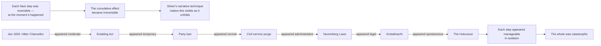

**Note**: This section assumes familiarity with the core concepts in 01-content. It does not re-explain the Weimar Republic, the Enabling Act, or the Holocaust machinery in detail. It examines how Shirer constructed his argument, where he has been challenged, and why the book continues to matter 65+ years after publication.

---

## Shirer's Literary Craft: The Journalist as Historian

### Narrative Architecture

Shirer's greatest structural decision was to write a continuous narrative rather than a thematic analysis. The book unfolds as a single drama with a clear arc — rise, empire, collapse — rather than as a series of topic chapters. This means the reader experiences the consequences of each enabling act as it compounds over time, which mirrors how contemporaries might have experienced it: the Reichstag Fire was shocking at the time, but its full significance only became visible when the Enabling Act followed, and the full horror of the Nuremberg Laws became apparent only years later, when they were followed by Kristallnacht.



Shirer understood this theatrical quality of Nazi escalation — the theater of normality masking the architecture of destruction — and his prose structure replicates it. By the time the reader reaches Kristallnacht, it has become obvious that the appointment of Hitler was not a conservative victory but the opening of a door. The device is not analytical; it is narrative, and it is devastating.

### Perspective: Insider to Exile

Shirer's voice throughout is that of a witness who left. The opening chapters — covering the 1920s and early 1930s — carry the authority of direct observation. He was in Berlin for the Reichstag fire; he reported on the Enabling Act from the press gallery; he left Germany in December 1940, worn down by Gestapo surveillance and the realization that he was reporting on a system that had eliminated the public space in which reporting was possible.

This gives the book a quality rare in history writing: personal moral stakes. Shirer is not describing the Third Reich as an object at a distance. He is describing a system he watched come into being, attempted to warn the world about, and ultimately had to flee. This is particularly visible in passages about the behavior of the international press corps in Berlin, the reactions of foreign diplomats, and the rationalizations offered by visiting dignitaries (including the Duke and Duchess of Windsor, who visited Germany in 1937 on a tour arranged by Goebbels).

---

## The Central Argument: Hitler as the Axis of Evil

### Shirer's Intentionalism

Shirer's most consequential interpretive choice was to center Hitler as the primary cause of Nazi Germany's crimes. This is the "intentionalist" position in the historiography debate:

```
Structuralist Argument                    Intentionalist Argument
(locked in by circumstances)              (driven by Hitler's will)
─────────────────────────────             ─────────────────────────────
Economic crisis → dictatorship            Hitler's ideology → Final Solution
Parliamentary deadlock → emergency        Hitler's personality → radicalism
Elite accommodation → regime survival     Hitler's decisions → each escalation
Bureaucratic competition → radical        Hitler's "provisional" statements
outcomes keep accelerating                 as long-term program
```

**Contemporary historians' consensus**: Both are true. Hitler's ideology provided the goal; structural pressures (war, occupation, bureaucratic competition, resource constraints) shaped the methods and pace. Ian Kershaw's formulation — "working towards the Führer" — captures the dynamic: subordinates competed to anticipate and exceed Hitler's wishes, creating radicalization without written orders.

Shirer's error, by current standards, is not that he overstates Hitler's role — no one disputes that Hitler was central — but that he tends to read every bureaucratic innovation as flowing from Hitler's direct intention, when often they were the initiative of lower-level officials (Heydrich, Himmler, Eichmann) acting without specific orders. The "cumulative radicalization" model of Hans Mommsen and others adds nuance that Shirer's deliberately readable narrative necessarily simplifies.

### The German Question: National Continuity or Catastrophic Deviation?

The most contested aspect of Shirer's argument is his treatment of Nazism as a German national phenomenon — that Prussian history, Lutheranism, and German political culture had prepared the ground specifically, making Nazism a characteristically German outcome rather than a universal risk of modern industrial society.

This framing served a Cold War purpose: West Germany's reintegration required showing continuity between pre-Nazi Germany and post-Nazi democracy, which meant minimizing the depth of German national complicity. Shirer's book was uncomfortable for that effort because it documented — with Nazi sources — how thoroughly German institutions, from the universities to the army to the judiciary, participated in and enabled the regime.

Contemporary scholarship rejects the "special path" thesis as too deterministic but acknowledges that Nazi antisemitism drew on deep traditions in German Protestantism, bureaucracy, and political culture. The modern consensus: Nazism was not inevitable from Luther to Hitler, but it drew on traditions that were specifically German in their particular virulence and administrative sophistication.

---

## Literary Craft and Thematic Analysis

### The Irony of Bureaucratic Language

One of the book's most powerful literary devices is Shirer's use of Nazi bureaucratic language — official memos, meeting minutes, program statements, and trial testimonies — as direct quotation. The effect of reading Himmler's Posen speech (October 4, 1943) in the SS leader's own clinical words, or Goebbels's diary entry scribbled in the Führerbunker during the final days, is a kind of documentary horror that no third-person paraphrase can achieve.

Shirer lets the perpetrators speak in their own vocabulary. The result is the bureaucratic banality Hannah Arendt would later theorize at Eichmann's trial — not in argument, but in documented fact. The Ordensburgen training films for the SS, the report on the T4 euthanasia program drafted in ministerial prose, the transport schedules to Auschwitz rendered as rail logistics tables — all of these appear as primary source material in Shirer's text.

### The Führer Myth as Political Technology

Shirer was among the first historians to take seriously the psychological dimension of Nazi rule — the way Hitler's persona, cultivated through propaganda and state ritual, generated loyalty independent of institutional office or policy result. This is central to his argument:

```mermaid
graph LR
    A["Propaganda Machinery"] --> B["Führer Myth"]
    B --> C["Personal loyalty to Hitler<br/>above all institutions"]
    C --> D["People 'believe' in Hitler<br/>even when goods are scarce<br/>and war is lost"]
    
    E["Goebbels"] -->|runs| A
    F["Riefenstahl films<br/>(Triumph of the Will)"] -->|amplify| A
    G["Mass rallies"] -->|perpetuate| A
    H["Radiated Hitler speeches<br/>every Sunday] -->|saturate| A
    
    D --> I["Military officers swear<br/>oath to Hitler personally"]
    D --> J["Party members seek<br/>only Hitler's approval"]
    D --> K["Ordinary Germans<br/>continued to believe<br/>even as Berlin fell"]
```

This analysis anticipated the field of political psychology by decades. The Führer myth was not irrational enthusiasm — it was a cultivated substitute for religious and institutional authority in a secularized, institutionally destabilized population. Shirer saw it clearly.

---

## Critical Debates Since Publication

### The "Clean Wehrmacht" Myth

Shirer deliberately confronted a narrative actively promoted by the US military in the 1950s: that the Wehrmacht was an honorable professional army dragged into war crimes by the SS. His documentation of Wehrmacht complicity — the Commissar Order (authorizing execution of Soviet political officers), the starvation order for Soviet POWs, participation in anti-partisan massacres, logistical support for the Einsatzgruppen, and the army's own war crimes in Poland and the USSR — made this book, in the 1950s, politically inconvenient.

The "clean Wehrmacht" myth persisted in popular culture (epitomized in George Patton's memoirs and the 1960s television series *Combat!*) until the work of historian Omer Bartov and the Wehrmacht exhibition in Hamburg in the 1990s definitively demolished it. Shirer had already done the archival demolition; it took decades for it to reach general consciousness.

### Intentionalism vs. Functionalism/Structuralism

This remains the core debate in Holocaust and Nazi historiography:

- **Intentionalists** (Shirer, Lucy Dawidowicz): The Holocaust was Hitler's long-held intention, realized when circumstances permitted. The Wannsee Conference was the formalization of a plan Hitler had conceived by the 1920s.
- **Functionalists/Structuralists** (Hans Mommsen, Martin Broszat): The Holocaust emerged from the polycratic competition of Nazi institutions, radicalizing without a central written order. Hitler was important, but the system could have produced genocide without him, through an internal logic of escalating coercion.

**Current consensus**: Hitler was a necessary condition but not a sufficient one. The Holocaust required his ideological impetus and his general authorization, but its specific shape and timing were produced by institutional dynamics, wartime contingency, and the cumulative logic of bureaucratic competition under an ideologically committed dictatorship.

### Shirer's Germanic-National Thesis

Shirer argued that Nazism was the logical endpoint of German national history — from Luther's anti-Semitism to Prussian militarism to the authoritarian character of the German bourgeoisie. This "Sonderweg" (special path) thesis has been rejected in its strong form by most historians, who note:

- Nazism was not inevitable from Luther; the Enlightenment, 1848, Weimar democracy, and the German labor movement suggested alternative paths
- Comparing pre-Nazi Germany to other European nations suggests they shared many of the conditions Shirer attributes specifically to German "national character"
- The Sonderweg approach is methodologically problematic: it reads history backward from 1933, treating every prior development as a necessary cause

Shirer's contribution, though, was not primarily academic. He wrote for general readers who needed to understand that something identifiable as "German" — not just "totalitarian" generally — had produced this catastrophe. For German readers in the 1960s, this was the argument that broke the silence.

---

## Comparison to Other Comprehensive Nazi Histories

| Book | Author | Approach | Relationship to Shirer |
|------|--------|----------|------------------------|
| *Hitler: A Study in Tyranny* | Alan Bullock (1952) | Intellectual biography of Hitler | Predecessor; more biographical, less archival |
| *The Rise and Fall of the Third Reich* | William Shirer (1960) | Journalist-narrative, primary documents | Foundational popular history |
| *The Third Reich Trilogy* | Richard J. Evans (2003–2008) | Academic structural history | Corrects intentionalism; extends with new archives |
| *Hitler Vols. 1–2* | Ian Kershaw (1998, 2000) | Biographical + political analysis | Most significant historiographical revision |
| *The Origins of Totalitarianism* | Hannah Arendt (1951) | Philosophical/sociological | Theoretical complement; Eichmann in Jerusalem |
| *Ordinary Men* | Christopher Browning (1992) | Social history of a police battalion | Micro-case study contradicting "Germans were uniquely evil" thesis |
| *The Destruction of the European Jews* | Raul Hilberg (1961, revised 1985) | Unsurpassed academic study of the Holocaust | Necessary companion to Shirer's chapters on genocide |

---

## Reception and Legacy

### Critical Reception (1960)

- Unprecedented commercial success: over 600,000 copies sold in the first year
- Praised for readability and moral clarity
- Criticized by academics (Hans Rothfels, Fritz Fischer) for the Germanic-national thesis, insufficient engagement with structural economics, and lack of German-language secondary historiography
- The *New York Times* called it "a monumental work" and "the most important book on Nazi Germany yet written"
- Émigré historian Felix Gilbert challenged it as "too journalistic" in the *American Historical Review*

### Influence on Public Understanding

The book fundamentally shaped how non-specialists understand Nazi Germany. Key concepts it popularized that became standard vocabulary: the Enabling Act as the legal mechanism of dictatorship, Kristallnacht as a turning point, Stalingrad as the war's turning point, Nuremberg as the beginning of international law. Academic historians have revised Shirer's interpretations, but almost none have produced as complete or as accessible a narrative for the general reader.

### Adaptations and Cultural Presence

- The book was adapted into an NBC television documentary series in 1968 (won a Peabody Award)
- Considered required reading at US military academies (West Point, Naval War College)
- Cited extensively in Holocaust education curricula worldwide
- Its publication coincided with — and complicated — West Germany's relationship to its Nazi past during the Adenauer era

---

## Final Verdict on the Book as a Historical Work

The *Rise and Fall of the Third Reich* is a work of journalist-history that reads like a novel and was assembled like a prosecution brief. Its strengths are remarkable: archival depth accessible to general readers, moral clarity without sentimentality, and the authority of primary Nazi sources used against the regime that produced them. Its weaknesses are now well-established: an over-deterministic framing of Hitler's agency, a thesis of German national continuity that has not survived subsequent scholarship, limited engagement with economic explanation, and a relative underdevelopment of the Holocaust's internal mechanics (a gap Hilberg's work filled).

What the book achieves above all is the rare thing in history writing: it makes the catastrophic *legible*. Shirer does not allow the reader to think of Nazi Germany as an alien event detached from modern political currents. He shows how quickly a democracy's safeguards can dissolve, how thin the membrane is between legal authority and lawless power, how the language of emergency and patriotism is used to suspend constitutional protection, and how ordinary institutions — courts, universities, churches, the military — accommodate rather than resist when the cost of resistance becomes personal.

This is why the book remains essential reading even where its specific interpretations have been revised. The book is not a scholarly citation of record; it is a door into understanding. After reading it, no serious reader will ever again believe that democracy is something that survives by default. It survives by vigilance, by institutions, by people willing to defend it when it is still possible — before the Reichstag Fire.

**Primary site of lasting value**: The narrative reconstruction of how the Nazi state actually operated on a day-to-day basis. No subsequent history has surpassed Shirer's chapter-level detail on the process of Gleichschaltung, the Nazi party structure, the functioning of the justice system under terror, and the mechanics of the wartime economy.

**Primary limitation**: Shirer's Germanic-national thesis is historically untenable in its strong form and should be read with contemporary scholarship (Evans, Kershaw) alongside it.
