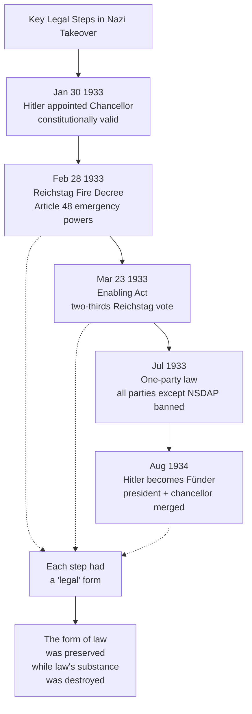
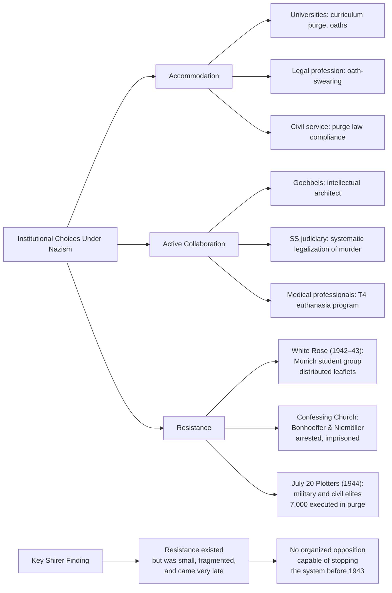
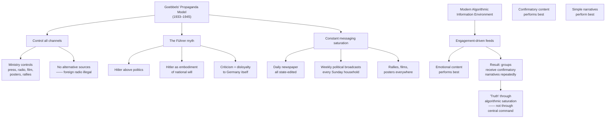
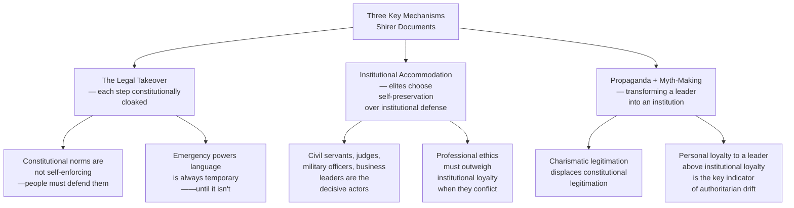

**[Host]**: Welcome to BookLab. Today we're reading *The Rise and Fall of the Third Reich* — 1,250 pages, 42 hours of reading, 85 years of history, and a book that maybe more than any other single volume defines what we mean when we say "this cannot happen here." Our guests are in the room with us. Dr. Lena Hartmann is a historian at the Free University of Berlin, specializing in the Weimar Republic and the social history of the Nazi seizure of power. And from Washington, joining us by remote, is David Kamau, a constitutional lawyer who litigates emergency powers and democratic backsliding cases at the International Center for Transitional Justice. Welcome both.

**[Lena]**: Thank you. I assign this book to my students every semester. Not because Shirer is the last word on the subject — because he is not — but because he makes you feel the urgency of the moment when democratic safeguards were dismantled. Not in retrospect, but as it was happening to people who did not believe it was happening.

**[David]**: I first read this book as a law student, and I've read it three times since. Each reading becomes more disturbing because more of what Shirer describes has analogues in systems we're seeing around the world right now — not in the specifics, not in genocide, but in the *process*. The slow, legal erosion of checks. The rhetorical frameworks that normalize emergency. The role of institutional actors who choose accommodation over resistance.

---

## Opening: Why Shirer Still Matters in 2026

**[Host]**: Let me start with a specific claim, because it's the one people most often cite from Shirer: "The tragedy of Germany was that Hitler came to power legally." I want to hear from both of you whether that framing — legally — is accurate, and whether it's the right frame for 2026.

**[Lena]**: It's accurate as a description of form, but the framing can be *misleading*. The appointment of Hitler was constitutional. The Enabling Act required a two-thirds majority and was achieved through terror — the Communist deputies were already arrested or in hiding, the SA and SS lined the corridors of the Reichstag, and Social Democratic deputies voted under armed observation. It was a democratic vote conducted under duress. So when we say "legally," we should say: *the forms of legality were preserved while the substance of law was systematically destroyed.* That's not just a historian's distinction — it's the distinction between democracy and authoritarianism in 2026.

**[David]**: Exactly. And this is where I come back to this book again and again in my work. Every emergency powers case I've litigated in the past five years has involved a government asserting crisis authority — public health, national security, economic emergency — and using it to change the permanent structure of governance while the crisis is still "temporary." The Reichstag Fire Decree was described as temporary. The Enabling Act was described as a four-year emergency measure. Four years became twelve years.

**[Host]**: So the pattern is: declare emergency → suspend normal procedures → normalize the emergency indefinitely.

**[David]**: That's the operational pattern. And the institutional actors — courts, legislatures, professional associations — typically say: "This is temporary, the courts will restore order later, we need to cooperate now." But the mechanism Shirer describes is that cooperation *is* normalization.

---

## On the Role of the Intellectual and Cultural Establishment

**[Host]**: Shirer is particularly scathing about the German intelligentsia — the universities, the churches, the legal profession, the literary establishment. He documents how many of them accommodated Nazism, often enthusiastically. How much of that was belief, and how much was rationalized self-preservation?

**[Lena]**: This is the question I debate most with my students. The evidence is mixed and varies by institution. The universities were probably the most enthusiastic — more than a third of German academics joined the Nazi Party before 1933, many more by 1935. Martin Heidegger gave the inaugural address as Rector of Freiburg in 1933 under the Nazi flag, and his philosophical rationale for "the Führer's will" is still a stain on German intellectual history.

But the churches — particularly the Confessing Church, led by Dietrich Bonhoeffer — did resist, and many pastors died or were imprisoned. The legal profession was highly compliant — the judiciary oath-swearing to Hitler personally, the People's Court (Volksgerichtshof) under Roland Freisler, who screamed at defendants and handed down predetermined death sentences. It was less a corruption of the legal system than a reorientation — judges genuinely believed they were serving the law as Hitler had redefined it.

Shirer's anger is directed at the fact that the German intellectual elite, on the whole, chose integration over opposition. That's not a specifically German story. You can find it in most authoritarian transitions.

**[David]**: For my purposes as a lawyer, the church and legal profession cases are the most instructive, because those are the institutions we most rely on as constitutional backstops in a crisis. When the *courts* — the institution whose job it is to say what the law is — reorient themselves to serve executive power, the legal framework for resistance evaporates. And that's what the German bar did, with very few exceptions.

---

## On Propaganda and the Architecture of Consent

**[Host]**: Let's go to Goebbels and Shirer's portrait of the propaganda machinery. Shirer quotes Goebbels extensively — including the famous line that a lie told once remains a lie, but a lie told a thousand times becomes the truth. How does that translate into the modern media environment?

**[David]**: Shirer's chapter on propaganda is actually more relevant than most people think when they picture Goebbels at Nuremberg rallies. The real propaganda operation was not the rallies — it was the constant background radiation. Every radio broadcast. Every newspaper. The elimination of alternative information sources. What Goebbels understood was that *frequency* of messaging matters more than the message itself. Repetition creates familiarity; familiarity creates perceived legitimacy.

**[Lena]**: And that's exactly the mechanism we see in social media. Not a single charismatic broadcaster like Goebbels, but thousands of algorithmic feeds serving the same content to millions of people repeatedly. The lie-told-a-thousand-times dynamic is automated now. Goebbels had to choose which messages to amplify; the algorithm amplifies whatever gets engagement, which means highly emotional, highly confirming, highly repetitive content.

**[Host]**: The difference, though, is structural. Goebbels had authority but was constrained by a party hierarchy and Hitler's attention. The algorithmic model has no center and therefore no constraint.

**[David]**: That's actually a worse problem, not a better one. A single propagandist can be countered, exposed, discredited. You cannot discredit an algorithm, because the algorithm has no face, and because it is not trying to persuade you — it is trying to engage you. Persuasion and engagement require different contents. Persuasion requires coherence. Engagement requires arousal.

---

## On the Holocaust: How Ordinary Bureaucrats Built an Industrial Killing Machine

**[Host]**: I want to ask the hardest question, because Shirer is unflinching on it, and the literature that followed only reinforced what he documented. How did millions of Germans — not SS fanatics, not high officials — *participate* in genocide through bureaucratic routine?

**[Lena]**: The answer, as Christopher Browning documented in *Ordinary Men* and Shirer's own sources document in a different register, is: not primarily through ideological fanaticism, but through careerism, conformity, social pressure, gradual radicalization, and the erosion of individual moral judgment under institutional frameworks. The policemen of Reserve Police Battalion 101 — middle-aged men from Hamburg, not SS volunteers — executed 38,000 Jews and deported 45,000 more, most doing it because their commander asked who would step forward, and social pressure filled the ranks.

Shirer documents this in his chapters on the occupied East: the Einsatzgruppen (mobile killing squads) reporting back to Himmler that their men were suffering psychological stress from shooting women and children at close range, and the SS response being to industrialize the process — gassing vans, then gas chambers, then extermination camps. The bureaucratic response to moral difficulty was not to stop — it was to make killing psychologically easier for the killers.

**[David]**: This is where Shirer's account, for all its strengths, really requires Hilberg's *Destruction of the European Jews* as a companion read. Shirer covers the Holocaust at the level of policy decision and major event. Hilberg covers the administrative infrastructure: the logistics of rail timetables, bank account transfers, property seizures, the paperwork of deportation. What emerges is that genocide was executed not by ideological fanatics operating outside the system, but by clerks. The death camps were as much an accounting problem as a military one.

**[Host]**: You described something in your opening about reading this differently each time. What changed between your first reading as a law student and now?

**[David]**: The first time I read it, I read it as a warning about a foreign past. Now I read it as a manual for constitutional defense in the present. Every chapter is describing an institutional failure — a point at which a constitutional norm could have been defended but wasn't. The Reichstag Fire was not then, and is not now, an automatic passport to dictatorship. *The decision to treat it as one* was made by people — politicians, judges, civil servants — who could have decided differently.

---

## On Lessons for Contemporary Democracy

**[Host]**: We opened with whether this book is relevant in 2026. I want to give both of you the last word on that question. What is the single most important lesson from Shirer's account that readers should take into their political lives today?

**[Lena]**: My lesson is the one Shirer himself came to, after living through it: the moment you recognize the pattern — emergency powers claimed, opposition criminalized, independent institutions coerced or dissolved — the moment to act is *before* the pattern is complete. Once the Enabling Act passes, it's too late. Not because it's legally irreversible — it was not, technically still valid law could have been reclaimed — but because by then, the personnel who would have reclaimed it had already been purged or intimidated into silence. The critical moment is not when the final step is taken. It's the first step.

**[David]**: Mine is from the concluding chapters of Shirer — not the book's end, but his own 1980 afterword: "The rise of Adolf Hitler was the most terrible conquest the German people ever experienced." Notice: he does not say "the most terrible thing the Germans did." He says "the most terrible thing the Germans experienced." There's a moral distinction there that matters: it places responsibility on the system and the choices, not on the German national character. For my work in transitional justice, that framing is what makes Shirer useful rather than just condemnatory. The question is always: given circumstances, what choices were available and not taken?

**[Host]**: That's a good note on which to end. *The Rise and Fall of the Third Reich* is not comfortable reading — it never was, and it is less comfortable now than when it was published in 1960. But Shirer's central claim is the one no democratic society can safely forget: constitutional order is preserved by living people making choices, not by institutions that enforce themselves. When the institutions stop choosing, it's over. Read the book. Then decide what you will choose.

**[Lena]**: Thank you.

**[David]**: Thank you.

---

## Narration Notes for Production

**Estimated duration**: 22–25 minutes

**Tone**: Serious, conversation-driven, morally grounded but not hectoring. Shirer's own voice should be present — quote him directly when possible, in particular the opening passage of each chapter-where-he-describes-what-it-felt-like-to-be-there, and his 1980 foreword where he looks back on the project.

**Key quotation choices** (Shirer's own words for the narrator to deliver):
- "The most terrifying single chapter in modern history" — [Shirer describing the early Nazi takeover]
- "No one who did not live in Germany in those years can possibly understand the feeling that slowly crept over the land" — [Shirer on daily life under Nazism]
- From his foreword: "I believe that the Third Reich will be looked upon in future years as the most terrible demonstration in history of the capacity of modern man for organized mass cruelty, destruction, and murder."

**Music bed Suggestion**: Under the opening and closing, something that evokes the Weimar period — jazz-age intervals distorted into something slightly off-key, not explicitly programmatic. Avoid overtly ominous scoring during the historical discussion; the facts carry their own weight.

**Sound design note**: When the July 20 Plot is discussed, a single clock-tick sound effect may be appropriate (the plot unfolded in hours, not days). When discussing the Holocaust sections, no effects — the silence is part of the horror.
