## Overview

*The Rise and Fall of the Third Reich* is the landmark popular history that defined how generations of readers understand Nazi Germany. Published in 1960 by CBS war correspondent William L. Shirer — who lived in Berlin from 1925 to 1940 and watched the Nazi rise unfold from inside — the book combines a journalist's eyewitness testimony, a historian's archival rigor, and a moralist's outrage into a single 1,250-page narrative arc.

The scope is total: from the final years of the Weimar Republic through the Reichstag fire, the Enabling Act, the Night of the Long Knives, the Nuremberg Laws, Kristallnacht, the Anschluss, the dismemberment of Czechoslovakia, the invasions of Poland and the Soviet Union, Stalingrad, D-Day, the Holocaust, the resistance movements (White Rose, July 20 Plot), the fall of Berlin, and the Nuremberg Trials. Shirer's central thesis is that the Third Reich was not an aberration but a logical culmination of German history, European imperialism, modern propaganda techniques, and the democratic world's failure of will.

---

## Executive Summary

```mermaid
graph TD
    A["The Rise and Fall of the Third Reich"] --> B["Part I: The Roots<br/>(Weimar Republic collapse)"]
    A --> C["Part II: The Rise<br/>(1933–1938)"]
    A --> D["Part III: The Empire<br/>(1938–1943)"]
    A --> E["Part IV: The Fall<br/>(1943–1945)"]
    A --> F["Aftermath & Legacy"]

    B --> B1["Post-WWI Germany:<br/>humiliation, hyperinflation"]
    B --> B2["Weimar's fragility:<br/>political fragmentation"]
    B --> B3["Hitler's entry:<br/>Beer Hall Putsch → legal path"]

    C --> C1["Hitler named Chancellor: Jan 30 1933"]
    C --> C2["Reichstag Fire & Enabling Act"]
    C --> C3["Gleichschaltung:<br/>coordination of all institutions"]
    C --> C4["Night of the Long Knives: Jun 1934"]
    C --> C5["Nuremberg Laws: Sep 1935"]
    C --> C6["Kristallnacht: Nov 1938"]
    C --> C7["Anschluss & Munich: 1938"]

    D --> D1["Invasion of Poland: Sep 1939"]
    D --> D2["Fall of France: Jun 1940"]
    D --> D3["Battle of Britain: 1940"]
    D --> D4["Operation Barbarossa: Jun 1941"]
    D --> D5["Stalingrad: Aug 1942 – Feb 1943"]
    D --> D6["The Wannsee Conference & Holocaust machinery"]
    D --> D7["The Nazi state apparatus<br/>(SS, Gestapo, ministries, propaganda)"]

    E --> E1["D-Day: Jun 1944"]
    E --> E2["July 20 Plot: Valkyrie assassination attempt"]
    E --> E3["White Rose student resistance"]
    E --> E4["Soviet advance on Berlin"]
    E --> E5["Hitler's last days & suicide: Apr 1945"]
    E --> E6["German surrender: May 1945"]

    F --> F1["Nuremberg Trials: 1945–1946"]
    F --> F2["Denazification process"]
    F --> F3["Historical lessons & legacy"]
    F --> F4["Shirer's archival sources:<br/>Nazi internal records, Nuremberg documents"]
```

### Book Structure

| Part | Chapters | Focus |
|------|----------|-------|
| I: Foundations | 1–4 | Germany and the Weimar Republic; origins of National Socialism |
| II: The Seizure of Power | 5–11 | Hitler becomes Chancellor; legal destruction of democracy; Night of the Long Knives |
| III: The Consolidation of Power | 12–18 | Nazi state apparatus; Nuremberg Laws; the church struggle; persecution of Jews |
| IV: Foreign Policy & War | 19–25 | Anschluss, Munich, Czechoslovakia, Poland; fall of France; Battle of Britain |
| V: The War & Empire | 26–31 | Barbarossa; Stalingrad; North Africa; the Holocaust machinery; resistance |
| VI: The Collapse | 32–36 | D-Day; Valkyrie; White Rose; fall of Berlin; German surrender |
| VII: The Aftermath | 37–45 | Nuremberg Trials; denazification; reckoning and legacy |

---

## Key Takeaways

1. **The Weimar Republic was not doomed — it was destroyed**. Germany's first experiment with democracy was functional and progressive. Its collapse was not inevitable: it was engineered by political miscalculation, elite treachery, paramilitary intimidation, and the failure of mainstream conservatives who thought they could "tame" Hitler.

2. **Hitler came to power legally — and then destroyed legality**. The Enabling Act of March 1933 was passed democratically. The Reichstag Fire Decree had already suspended civil liberties, but the enabling legislation itself was a vote in the Reichstag. Shirer's point: democracy can vote away its own foundations in a single afternoon.

3. **The Enabling Act was the single most important law of the 20th century**. It gave Hitler dictatorial powers for four years, was renewed indefinitely, and made every subsequent Nazi action "legal" under the new constitutional order. The machinery of tyranny was installed through statute, not coup.

4. **The Night of the Long Knives (June 30, 1934) was the definitive moment of consolidation.** Hitler murdered Ernst Röhm and other SA leaders, conservative rivals, and anyone whose name appeared on a list. The army swore an oath of personal loyalty to Hitler the next day. After this, there was no organized domestic opposition left.

5. **Propaganda and the Führer myth were not sideshows — they were the primary governing tools.** Goebbels understood what later behavioral science would confirm: a mythic leader image creates unshakeable loyalty in a population that has been desensitized to truth. The *Führermyth* gave Hitler authority independent of institutional office.

6. **The Nazi state was not monolithic — it was polycratic and chaotic.** Multiple competing power centers (the Party, the SS, the army, the ministries, Gauleiters) created overlapping, redundant, and often contradictory authority. This "cumulative radicalization" made the Holocaust possible without a single written order from Hitler for the Final Solution.

7. **The military's complicity was thorough and voluntary.** The Wehrmacht was not a clean army corrupted by a criminal regime. It participated in war crimes, the Commissar Order, the starvation of Soviet POWs, and the logistics of mass murder. The "clean Wehrmacht" myth, Shirer demonstrated, was战后 propaganda.

8. **Appeasement was not naivety — it was a deliberate choice.** Chamberlain and Daladier knew what Hitler was. They chose to rearm rather than fight in 1938. The Munich Agreement was not a mistake; it was a calculated delay that guaranteed a larger war on worse terms.

9. **The resistance was real, small, and heroic.** The White Rose university students (executed 1943) and the July 20, 1944 Valkyrie plotters (executed after the failed assassination) showed that opposition existed — but it was confined to elites, was fragmented, and came too late to prevent defeat.

10. **Nuremberg established the legal framework for crimes against humanity.** The trials were imperfect, victors' justice in some respects, but they established that "following orders" is not a defense, that aggressive war is a crime, and that states can be held accountable. The Nuremberg Principles remain the foundation of international criminal law.

11. **The German people were neither unanimously complicit nor uniformly passive.** Shirer documents widespread knowledge of persecution, some active resistance, millions of passive beneficiaries — and a population that, by 1945, had traded its Führer for survival. Collective guilt and individual innocence coexisted in the same country.

12. **The archival method — using Nazi's own records against them — was revolutionary.** Shirer gained access to captured Nazi government documents (the Foreign Ministry files, Supreme Command records, Goebbels's published diary, captured personal papers) and used them systematically. The Nuremberg trial exhibits provided thousands of documents. The result was a history that could not be dismissed as Allied propaganda.

---

## Who Should Read

| Reader Type | Why |
|---|---|
| Students of 20th-century history | The most accessible comprehensive single-volume history of Nazi Germany |
| Anyone interested in how democracies die | The Weimar Republic's collapse is a case study still cited in political science |
| Students of propaganda and media manipulation | Goebbels's systematic use of radio, film, mass rallies, and myth shows how totalitarian communication works |
| People interested in moral philosophy under extreme conditions | How do individuals choose between survival, complicity, and resistance? |
| Military history enthusiasts | The war chapters provide strategic context without reducing to pure tactics |
| Lawyers and human rights advocates | Nuremberg's legal significance endures; this is the most readable narrative account |
| Anyone trying to understand the roots of modern Europe | The post-1945 European order — the EU, NATO, German democracy — was a direct response to this history |
| Jewish heritage readers | The Holocaust chapters are comprehensive, sourced, and morally unflinching |

---

## Who Should Skip

- Readers seeking a purely academic, footnote-heavy German history — Shirer is a journalist-historian; academic specialists will want Ian Kershaw's two-volume biography of Hitler or Richard J. Evans's *The Third Reich* trilogy for more rigorous historiography
- Readers uncomfortable with sustained depictions of mass atrocities, torture, and industrialized murder — these sections are unflinching and clinically detailed
- Anyone looking for a quick overview — at 1,250 pages this is a serious time commitment
- Readers who want a strictly structural/marxist or strictly intentionalist analysis — Shirer leans heavily toward intentionalism (Hitler as central driver), and contemporary scholarship has complicated this view

---

## Historical Context

| Date | Event |
|------|-------|
| 1904 | William L. Shirer born in Chicago, Illinois |
| 1925 | Shirer begins covering Germany as a foreign correspondent; joins Berlin bureau |
| 1929 | Stock market crash worsens German economic crisis |
| 1930 | Nazis become second-largest party in Reichstag |
| 1933 Jan 30 | Hitler appointed Chancellor of Germany |
| 1933 Feb 27 | Reichstag fire; civil liberties suspended |
| 1933 Mar 5 | Enabling Act passed; Hitler gets dictatorial powers |
| 1934 Jun 30 | Night of the Long Knives; Röhm and rivals murdered |
| 1934 Aug 2 | President Hindenburg dies; Hitler merges offices, becomes Führer |
| 1935 Sep 15 | Nuremberg Laws enacted; Jews stripped of citizenship |
| 1938 Nov 9–10 | Kristallnacht (Night of Broken Glass) |
| 1938 Mar 12 | Anschluss — Austria annexed |
| 1938 Sep 30 | Munich Agreement — Sudetenland ceded to Germany |
| 1939 Mar 15 | Rest of Czechoslovakia occupied |
| 1939 Sep 1 | Germany invades Poland; WWII begins |
| 1940 Apr–Jun | Fall of France; Low Countries invaded |
| 1941 Jun 22 | Operation Barbarossa — invasion of the Soviet Union |
| 1942–43 | Wannsee Conference (Jan 1942); Holocaust accelerates |
| 1943 Feb 2 | Stalingrad — Sixth Army surrenders; turning point |
| 1944 Jun 6 | D-Day — Allied invasion of Normandy |
| 1944 Jul 20 | Valkyrie Plot — assassination attempt on Hitler fails |
| 1945 Apr 30 | Hitler commits suicide in Berlin bunker |
| 1945 May 8 | Germany surrenders unconditionally |
| 1945 Nov 20 | Nuremberg Trials begin |
| 1946 Oct 1 | Nuremberg verdicts delivered |
| 1960 | *The Rise and Fall of the Third Reich* published |
| 1981 | Simon & Schuster reprint with new foreword by Shirer |
| 1993 | Shirer dies, age 89 |

---

## Core Themes

| Theme | Description |
|------|---|
| The Fragility of Democracy | Weimar shows how constitutional systems can be dismantled from within by legal means |
| The Führer Principle | How personal loyalty to a charismatic leader replaces institutional authority |
| Propaganda as Governing Technology | Systematic manipulation of mass psychology as primary tool of rule |
| Bureaucracy and Complicity | How ordinary officials and professionals enabled mass murder through administrative routine |
| The Path from Discrimination to Genocide | Nuremberg Laws → Kristallnacht → Ghettoization → Extermination camps |
| The Wehrmacht's Moral Collapse | How a professional army participated in war crimes and genocide |
| Resistance and Its Limits | The White Rose, Kreisau Circle, July 20 Plotters — courage, fragmentation, and the cost of belated opposition |
| The Failure of the International Community | Appeasement as deliberate delay; the world chose rearmament over early intervention |
| Nuremberg and the Birth of International Law | How victors' justice became the groundwork for universal accountability |
| The German National Trauma | How a literate, cultured nation produced the most systematic genocide in European history |

---

## Why This Book Matters

When Shirer's book appeared in 1960, it sold over 600,000 copies in its first year and remained on the New York Times bestseller list for over a year. It was not the first comprehensive history of Nazi Germany — Alan Bullock's *Hitler: A Study in Tyranny* (1952) had already set a scholarly standard. But Shirer's book was different: it told the story as a continuous narrative from beginning to end, accessible to general readers, unflinching in its moral conclusions, and grounded in documents that the Nazi regime itself had created.

The book's methodology was novel too: Shirer spent years reading the captured German Foreign Ministry records (known as the "Red Series" documents at Nuremberg), the high command war diaries, Goebbels's published diaries, and the full Nuremberg trial transcripts. He embedded direct quotations from Nazi officials speaking in their own words. The effect was devastating: the reader hears the perpetrators explain themselves, often with bureaucratic banality, and constructs the system from their own testimony.

Critically, Shirer placed Hitler at the center of the narrative — not as an inexplicable aberration, but as the intellectual and operational author of the regime. This intentionalist framing has been debated by historians (structuralists argue Nazism had its own momentum beyond Hitler's direct orders), but the image of Hitler that Shirer presented — a man of driving ideological obsession, not a bureaucratic accident — remains the dominant public understanding.

The book's publication was itself a Cold War event. It appeared at a moment when West Germany was being integrated into NATO and the Western alliance was actively promoting the "clean Wehrmacht" myth. Shirer's documentation of Wehrmacht complicity was deliberately uncomfortable for policymakers who needed a rearmed West Germany as a Cold War ally. He did not flinch.

Today, *The Rise and Fall of the Third Reich* is both foundational and contested. Academic historians have revised some of his interpretations — particularly his Germanic-national-continuity thesis (the idea that Nazism was the logical endpoint of Prussian/German history) and his relative downplaying of antisemitism as a driver in the Nazi movement's early years. But as a single-volume narrative that remains readable, comprehensive, and morally uncompromising, it has never been surpassed in the popular history space. Every subsequent comprehensive history of Nazi Germany exists in conversation with it.

---

## Related Books

| Book | Author | Connection |
|------|--------|------------|
| **Hitler: A Biography, 1889–1936** | Ian Kershaw | The most significant scholarly revision of Shirer's Hitler-centered narrative; two-volume biography with more archival depth |
| **The Third Reich Trilogy** | Richard J. Evans | Contemporary academic standard; three-volume structural history that corrects and extends Shirer |
| **The Origins of Totalitarianism** | Hannah Arendt | Philosophical framework for understanding Nazism and Stalinism; the intellectual companion to Shirer's narrative |
| **Ordinary Men: Reserve Police Battalion 101** | Christopher Browning | Micro-history showing how ordinary Germans became genocidal killers through social pressure, not ideological fanaticism |
| **Inside the Third Reich** | Albert Speer | Memoir of Hitler's architect and armaments minister; complementary insider perspective, though self-serving |
| **The Destruction of the European Jews** | Raul Hilberg | The foundational academic study of the Holocaust; provides the methodological depth Shirer's popular scope cannot |
| **Hitler's Willing Executioners** | Daniel Jonah Goldhagen | Argues eliminationist antisemitism was rooted in German culture; directly confronts the "bureaucratic functionary" model |
| **Berlin Diary** | William L. Shirer | Shirer's own contemporaneous journal from 1934–1940 — read alongside the history for first-person immediacy |
| **The Wages of Destruction** | Adam Tooze | Economic history of the Nazi war economy; explains why Germany's military strategy was structurally self-defeating |
| **Stalingrad** | Antony Beevor | The definitive military and social history of the turning-point battle |
| **The Coming of the Third Reich** | Richard J. Evans | First volume of the Evans trilogy; strongest on the Weimar collapse |
| **Defying Hitler** | Sebastian Haffner | Memoir by a young German jurist who left Germany in 1938; real-time experience of Nazism's social effects |

---

## Final Verdict

*The Rise and Fall of the Third Reich* is not a perfect book. Shirer's intentionalist bias places Hitler at the center of every decision in ways that contemporary scholarship has nuanced. His Germanic-national thesis — the idea that Nazism was Germany's inevitable national expression — has been challenged and largely rejected by historians who emphasize contingency, economic crisis, and the particular radicalism of the Nazi movement rather than a deep German national character. His coverage of the Holocaust, while courageous for its time, has been deepened by decades of subsequent scholarship.

And yet: no single-volume history of Nazi Germany has ever matched its narrative power, its moral clarity, or its accessibility. Shirer wrote as a witness with the tools of a historian. The prose is never dry; the moral argument is never timid. What emerges is a coherent, devastating story of how a modern European state dismantled its own democracy and turned half the continent into a graveyard. It explains not just what happened, but how it felt to be there as it happened.

Like all great history, it is ultimately a warning. The conditions that produced Nazism — economic collapse, political fragmentation, a delegitimized center, charismatic authoritarianism, elite accommodation with extremism, deliberate misinformation — are not unique to Weimar Germany. They are recurring symptoms of democratic stress worldwide. Shirer's book is a manual for recognizing them.

**Rating: 9.5/10** — The single most readable and comprehensive narrative history of Nazi Germany written for a general audience. Essential reading for any citizen of a democracy, and a sobering reminder that constitutional order is more fragile than it feels.
