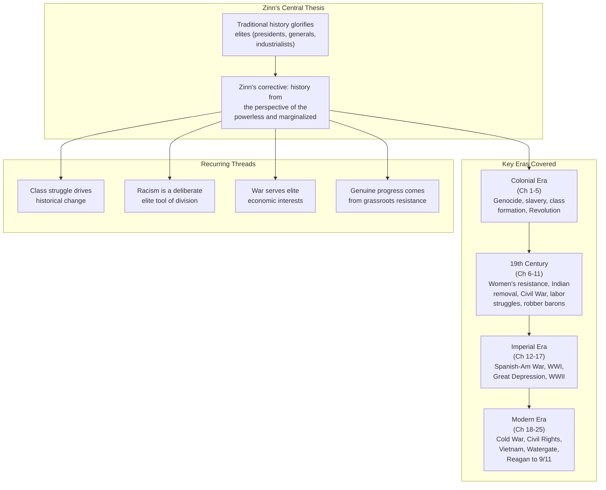

## The Central Argument

Zinn states his thesis in the first paragraph: he will not write history as
an objective observer but as an advocate for those he believes have been
silenced — Indigenous peoples, enslaved Africans, factory workers, women,
dissenters, and the poor. His guiding premise:

> The mountain of history books... concentrate on a `tiny minority of
> people` — the `white, male, upper-class` — who hold power... The
> `history of the country` can be told as `the story of the `people`'
> struggles against the `elite`.

Each chapter examines a period or theme from this angle, drawing on
primary documents — letters, court records, speeches, songs — that
conventional histories had ignored.

---

## Part I: Colonial Origins (Chapters 1–5)

### Chapter 1 — Columbus, the Indians, and Human Progress

Zinn opens with the Arawak people of the Bahamas and the brutality of
Columbus's expedition. He cites Bartolomé de las Casas's estimates of
native death tolls — hundreds of thousands killed by violence, forced
labor, and disease. The chapter frames European colonization not as
discovery or civilization but as genocide. The "human progress" of the
title is ironic: what was progress for Europe was annihilation for the
Americas.

### Chapter 2 — Drawing the Color Line

Zinn traces the origins of American racism to the 17th-century Virginia
colony. He argues that racial hierarchy was deliberately constructed by
planter elites to divide poor whites and enslaved Blacks who had
previously cooperated in revolts. The "color line" was not natural or
inevitable — it was a tool of class control.

### Chapter 3 — Persons of Mean and Vile Condition

This chapter covers Bacon's Rebellion (1676), where poor whites and
enslaved Blacks united briefly against the planter elite. After the
rebellion was crushed, the elite responded by hardening racial
distinctions — giving poor whites just enough privilege (access to
land, legal rights denied to Blacks) to prevent further cross-racial
alliances.

### Chapter 4 — Tyranny Is Tyranny

Zinn argues that the American Revolution was not a popular uprising
against tyranny but an elite-driven war to consolidate economic power.
The Founders, he claims, were motivated by fear of British restrictions
on their commercial ambitions and by the need to divert colonial unrest
— Shays' Rebellion was around the corner — into a war that would not
threaten the class structure.

### Chapter 5 — A Kind of Revolution

After independence, the new Constitution was crafted to protect property
and limit democracy. Zinn cites Charles Beard's economic interpretation:
the framers were wealthy men who wrote a document that insulated the
state from popular will. Women, enslaved people, and the poor gained
little. The Revolution, Zinn concludes, was "a kind of revolution" —
enough change to pacify the masses, not enough to threaten the elite.

---

---

## Part II: The 19th Century (Chapters 6–11)

### Chapter 6 — The Intimately Oppressed

Zinn examines women's history, from Anne Hutchinson to Sojourner Truth.
He argues that the patriarchy was not a side feature of American history
but central to its economic and political structure. The chapter covers
the early women's rights movement and its intersection with abolitionism.

### Chapter 7 — As Long As Grass Grows or Water Runs

This chapter covers the Indian Removal Act, the Trail of Tears, the
Seminole Wars, and the systematic dispossession of Native peoples
throughout the 19th century. Zinn presents Andrew Jackson not as a
populist hero but as a genocidal land speculator.

### Chapter 8 — We Take Nothing by Conquest, Thank God

The Mexican-American War (1846–1848) is presented as naked imperialism
driven by the slave-holding elite's desire for western territory. Zinn
quotes Ulysses S. Grant calling it "one of the most unjust wars ever
waged."

### Chapter 9 — Slavery Without Submission, Emancipation Without Freedom

Zinn argues that the Civil War ended slavery but did not end white
supremacy. He emphasizes the agency of enslaved people in their own
liberation (running away, rebelling) and criticizes Reconstruction's
betrayal — the North abandoned Black Southerners to Jim Crow once the
economic interests of Northern capital were secure.

### Chapter 10 — The Other Civil War

This chapter shifts from the war between North and South to the class
war between labor and capital. Zinn covers the New York draft riots,
the Molly Maguires, the Great Railroad Strike of 1877, and the rise of
the Knights of Labor. The "other" civil war, he argues, was the
real war — a war of workers against their exploiters.

### Chapter 11 — Robber Barons and Rebels

The Gilded Age: Rockefeller, Carnegie, Morgan. Zinn pairs each
industrialist with a counter-narrative of resistance — the Haymarket
affair, Homestead strike, Pullman strike, and the rise of the Populists
and socialists. The wealth of the few and the suffering of the many are
shown as two sides of the same coin.

---

## Part III: Empire and War (Chapters 12–17)

### Chapters 12–13 — Empire and the Socialist Challenge

The Spanish-American War and Philippine-American War are presented as
imperial adventures sold to the public as humanitarian missions. Zinn
covers the anti-imperialist movement (Mark Twain, the Anti-Imperialist
League) and the suppression of socialist dissent during World War I,
including the Espionage Act prosecutions of Eugene V. Debs.

### Chapters 14–15 — The Great Depression and World War II

The Depression is presented as a crisis of capitalism that produced
genuine grassroots resistance (the Bonus Army, the Flint sit-down
strike). Zinn is skeptical of the New Deal, which he sees as saving
capitalism rather than replacing it. World War II is framed as a war
fought by ordinary people for reasons that had little to do with their
own interests, with attention to the internment of Japanese Americans,
the bombing of civilians, and the suppression of the anti-war movement.

### Chapters 16–17 — The Cold War

Zinn argues that the Cold War was manufactured by elites to justify
military spending and foreign intervention. He covers Korea, the
Iranian coup (1953), Guatemala (1954), and the beginning of the Vietnam
escalation. The book emphasizes that anti-war and anti-nuclear
movements were larger and more persistent than conventional histories
acknowledge.

---

## Part IV: The Modern Era (Chapters 18–25)

### Chapters 18–20 — Civil Rights and Vietnam

The Black freedom struggle is narrated through grassroots activism
(Montgomery bus boycott, sit-ins, Freedom Rides, Black Panther Party)
rather than through presidential actions. Zinn criticizes Martin Luther
King Jr.'s "I Have a Dream" speech as magnificent oratory without
anger — a concession to respectability politics. The Vietnam War is
covered in depth, with extensive quotes from soldiers, protesters, and
Vietnamese civilians.

### Chapters 21–23 — The 1970s and the Reagan Era

Watergate is presented not as an aberration but as mainstream elite
behavior that happened to get caught. The 1970s saw the rise of the
prisoners' rights movement, the women's liberation movement, and
environmentalism. The Reagan era is framed as a counter-revolution:
deregulation, union-busting, and the restoration of elite power after
the gains of the 1960s and 1970s.

### Chapters 24–25 — The End of the Century and After 9/11

The final chapters cover the 1991 Gulf War, the Clinton years (NAFTA,
welfare reform, the bombing of Yugoslavia), and the aftermath of 9/11.
Zinn sees the War on Terror as a continuation of the same pattern: a
manufactured crisis used to expand executive power, suppress dissent,
and advance corporate interests. The book ends, characteristically, not
with a conclusion but with a call to action.

---

## Key Takeaways

1. American history is best understood as a conflict between elites and
   ordinary people, not as a shared national story of progress.
2. Racism was not an inevitable feature of American society but was
   deliberately created and maintained to divide the working class.
3. Wartime has consistently been used by elites to suppress dissent and
   expand executive power.
4. The Constitution was designed to protect property and limit popular
   democracy — the Bill of Rights was an afterthought extracted by
   anti-Federalists.
5. Most genuine social progress in American history came from grassroots
   movements, not from politicians or courts.
6. The New Deal saved capitalism; it did not transform it.
7. The United States has been an imperial power since the Mexican-American
   War, not just since 1898 or 1945.
8. Traditional textbooks systematically omit the violence, exploitation,
   and resistance that constitute most of American history.
9. Historical education is itself a site of political struggle — what we
   choose to remember shapes what we choose to do.
10. There is no such thing as neutral history; every historian writes from
    a perspective.
