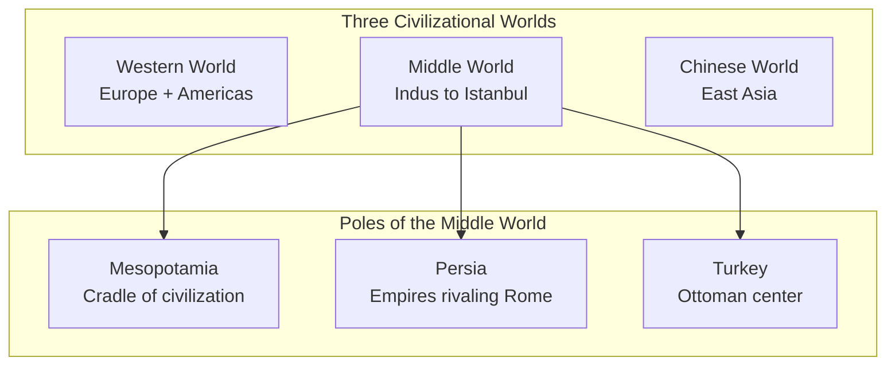
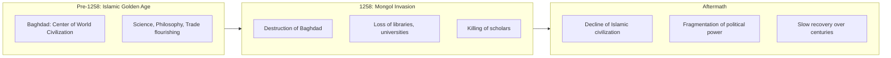
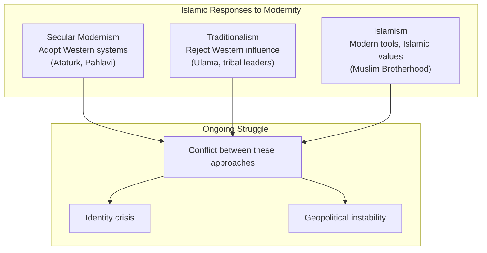

## The Middle World

Ansary's central geographical concept: the region between the
Mediterranean and China is not "the Middle East" (a European-centric
term) but the "Middle World" — a distinct civilizational sphere.

---

## The Rise of Islam (610-750 CE)

Islam emerged in 7th-century Arabia and exploded outward. Within a
century, the Islamic empire stretched from Spain to India.

Key factors in its rapid expansion:
- A unifying religious message that transcended tribal divisions
- Military effectiveness and strategic acumen
- The existing trade networks of Arabia
- Weakened Byzantine and Persian empires

---

## The Islamic Golden Age (750-1258)

While Europe experienced the Dark Ages, the Islamic world was the
center of global civilization:

| Field | Achievements |
|-------|-------------|
| Science | Algebra, optics, astronomy, medicine |
| Philosophy | Preservation and expansion of Greek philosophy |
| Commerce | Global trade networks from China to Africa |
| Culture | Poetry, art, architecture |
| Technology | Papermaking, irrigation, navigation |

This period ended catastrophically with the Mongol sack of Baghdad
in 1258.

---

## The Mongol Catastrophe

The Mongol invasion is the pivotal event in Islamic history that
Western narratives barely mention. It shattered the confidence and
continuity of Islamic civilization.

---

## Three Islamic Empires (1300-1700)

After the Mongol collapse, three great empires emerged:

| Empire | Region | Peak | Legacy |
|--------|--------|------|--------|
| Ottoman | Turkey, Balkans, Middle East | 16th-17th c. | Lasted until 1922 |
| Safavid | Persia (Iran) | 16th-17th c. | Shia identity |
| Mughal | India | 16th-17th c. | Taj Mahal, architecture |

These empires were sophisticated, powerful, and culturally rich. They
were not "declining" when Europe began its rise — they were simply
developing on a different trajectory.

---

## The European Challenge

The collision between the Islamic world and the West is not ancient
history. It intensified in the 18th-19th centuries:

| Period | Western Action | Islamic Response |
|--------|---------------|-----------------|
| 1500-1700 | Maritime exploration, trade | Initial disinterest |
| 1700-1800 | Industrial revolution, military superiority | Defensiveness |
| 1800-1900 | Colonial domination | Shock, reform efforts |
| 1900-1950 | Post-WWII decolonization | Nationalism, secularism |
| 1950-present | Global hegemony | Identity crisis, resurgence |

---

## The Modernity Crisis

Ansary's most important analytical contribution: the central challenge
for the Islamic world is how to respond to modernity.

No society has resolved this tension. Turkey oscillates between
secularism and religious identity. Iran experimented with Western
modernization then revolution. The Arab world is caught between
autocracy and Islamism.

---

## Key Lessons

- **History depends on vantage point.** Events that are minor in one
  narrative are central in another.
- **Civilizations are not isolated.** They constantly interact,
  borrow, and collide.
- **The "Middle World" is not a passive backdrop.** It has been a
  dynamic center of civilization.
- **Modernity created a crisis that remains unresolved.** Islamic
  societies are still navigating the tension between tradition and
  modernization.
- **Understanding history helps understand headlines.** Current
  conflicts have deep roots that Western media often miss.

---

## Action Plan

1. **Read history from multiple perspectives.** Seek out non-Western
   narratives of world events.

2. **Question geographical labels.** "Middle East" reflects a
   European perspective. Consider "Middle World" or "Southwest Asia."

3. **Understand the modernity crisis.** The Islamic world's struggle
   with modernization is the key to understanding contemporary
   geopolitics.

4. **Look for civilizational narratives.** Every culture tells its
   own story about where it came from and where it is going.
