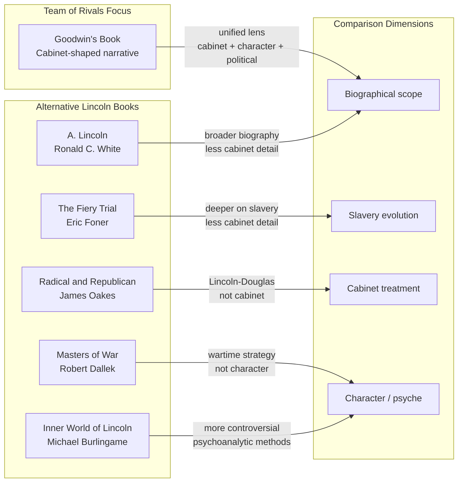
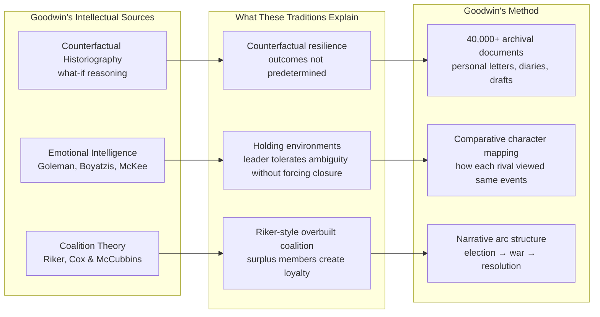

## Strengths

**Narrative as historical argument.** Goodwin's most distinctive contribution is her use of narrative structure to make a political argument — without ever stating an explicit thesis sentence. The book shows its thesis through story: each cabinet conflict, each political maneuver, each moment of private conflict and public compromise accumulates into the argument that Lincoln's genius was relational and political, not purely intellectual or moral. This is the anti-tract — it persuades by immersion, not by persuasion.

**Archival depth used at scale.** Goodwin read through more than 40,000 pieces of archival material across the Lincoln, Seward, Chase, Bates, Stanton, and Cameron collections. The payoff is thick, specific detail that makes scenes vivid: Lincoln reading Seward's diplomatic papers late into the night, Stanton weeping at Lincoln's deathbed, Chase lobbying cabinet members through intermediaries. The specificity prevents the narrative from feeling like hagiography.

**The rival framework is genuinely illuminating.** Most Lincoln biographies treat his cabinet as a detail or a symbol — something he did that was unusual. Goodwin makes the *cabinet composition itself* the central analytic lens. By holding the cabinet's composition constant throughout the narrative, every decision and negotiation is read continuously through the same lens. This turns a biographical book into an extended case study in coalition management.

**Political timing made tangible.** The Emancipation Proclamation sequence — Lincoln drafting, Seward counseling delay, Union defeat at Fredericksburg, Antietam providing military cover — is one of the best-documented episodes in Civil War historiography, and Goodwin's retelling is vivid, detailed, and analytically clear about *why* the timing matters in ways that go far beyond military efficiency.

**Accessibility without sacrifice.** The book is 936 pages long and a New York Times bestseller. That combination is rare. Goodwin achieves it by structuring each chapter around a narrative question — "Why did Seward offer his resignation?" "Why did Lincoln wait?" — rather than around abstract themes. Readers who do not care about political theory still want to know what happens next.

## Weaknesses

**Narrative warmth can flatten criticism.** Goodwin clearly admires Lincoln enormously. The admiration is not uncritical — she does note Lincoln's early timidity on emancipation, his poor initial judgment of military commanders, and his occasional frustration with Chase. But the portrait consistently places Lincoln one psychological insight ahead of everyone else. Critics on the left, including historian Lerone Bennett, have argued that Goodwin's generous portrait of Lincoln's racial attitudes elides his early opposition to racial equality and his support for colonization schemes. Her treatment of these positions, while not silent, tends to contextualize rather than examine them as moral failures.

**Over-reliance on character over structure.** Goodwin's explanatory framework is deeply psychological. When Lincoln succeeds, it is because of character: empathy, patience, narrative intelligence, emotional maturity. When his rivals fail, it is because of character: ego, ambition, ideological rigidity. This consistently individualizes what may be structural explanations. For example, Seward's miscalculations about his own dominance in the cabinet were not purely ego — they were also a rational assessment of political capital and institutional position that turned out to be wrong. The structural forces of wartime crisis, which forced Lincoln and Seward toward convergence regardless of personal dynamics, are underplayed.

**Comparative framework is narrow.** The book's focus is almost entirely on Lincoln, Seward, Chase, Bates, and Stanton. The broader context of the Republican Party, Northern public opinion, state-level politics, and the economy is present only as backdrop. Readers coming from political science may find that Goodwin's "genius" framework underweights the institutional, economic, and demographic forces that constrained every actor in the cabinet.

**Speech analysis is impressionistic.** Goodwin treats Lincoln's speeches as evidence of rare narrative and rhetorical skill — which they are — but her analysis is largely impressionistic in tone rather than grounded in close textual analysis. Linguists and rhetorical scholars have noted that Lincoln's actual deployment of rhetoric at the level of sentence structure, grammatical parallelism, and argument form is more complex than Goodwin's warmth-and-vision reading suggests.

**Length as discipline.** The 936-page length is a feature, archival abundance, and a bug, narrative drift. Extended personal backstory for each rival, multiple sub-plots, and detailed cabinet meeting reconstructions sometimes slow the analytical momentum. A more tightly edited version could have made Goodwin's argument with fewer pages and more structural clarity.

## Criticism from Historians and Political Scientists

Several lines of scholarly criticism have been directed at Team of Rivals:

- **The "genius" framing is not operational.** Political scientists have noted that Goodwin's central claim — Lincoln was a political genius — is intuitive but not falsifiable. What would *count* as evidence against it? What would a non-genius Lincoln have done differently in the same circumstances? The framework is more literary than analytical, which limits its use in comparative historical argument.

- **Early Lincoln scholars question the moral-psychological portrait.** Historians including David Donald, Lincoln's Pulitzer-winning biographer, and more recently Eric Foner, have argued that Lincoln's racial attitudes and his views on colonization were more deeply held and more problematic than Goodwin's narrative implies. Her Lincoln is a moral grower, but the growth happens largely because of character rather than political education or sustained engagement with Radical Republicans like Chase.

- **The cabinet-wars reading flattens Seward.** Seward is Goodwin's most interesting rival precisely because he *did* grow, adapt, and flourish in Lincoln's cabinet — becoming, by 1862–1863, Lincoln's most loyal and effective cabinet member and architect of anti-slavery diplomacy. But Goodwin's thesis makes it harder to explore Seward's own political evolution on its own terms; he is always Lincoln's foil, never fully his own subject.

- **Omissions in the economic narrative.** The book says surprising little about the wartime economy, the banking system, the Homestead Act, the Pacific Railway Act, and the broader economic policy of the Lincoln administration. Chase's role as Treasury Secretary is portrayed almost entirely through his personality and his conflicts with Lincoln, not through his actual fiscal policy — which was historically significant.

- **Parallels to contemporary politics go unexamined.** Reviewers noted the book's resonance after 9/11 and during the Iraq War, and the comparison was made frequently in press coverage. Goodwin herself, however, declines to draw explicit contemporary implications. She leaves the reader to make connections, but the refusal to engage the contemporary resonance explicitly means the book's strategic lessons for modern coalition building remain implicit rather than explored.

## Alternative Books

| Book | Author(s) | How It Differs |
|------|-----------|----------------|
| *A. Lincoln: A Biography* | Ronald C. White | More comprehensive single-volume Lincoln biography; less cabinet-focus |
| *The Fiery Trial* | Eric Foner | Deeper on Lincoln's evolution on slavery; less on cabinet dynamics |
| *The Radical and the Republican* | James Oakes | Focuses specifically on the Lincoln-Douglas relationship and abolitionist strategy |
| *Lincoln* (film screenplay and source) | Doris Kearns Goodwin / Tony Kushner | Dramatic adaptation selecting a narrow slice; the book is far broader |
| *Leadership in Turbulent Times* | Doris Kearns Goodwin | Compares Lincoln to other presidents; more prescriptive but thinner |
| *The Inner World of Abraham Lincoln* | Michael Burlingame | Psychological emphasis more explicit; more controversial in its methods |
| *Masters of War* | Robert Dallek | Focuses on Lincoln's wartime political strategy; less on character |

Each alternative book reaches a deeper place on one axis. Goodwin's achievement is refusing to specialize: the cabinet frame carries all three dimensions simultaneously.

## Scientific and Empirical Basis

Goodwin's methodology is primarily archival and narrative, but her analytical framework draws on three intellectual traditions:

**1. Coalition theory in political science.** Goodwin was a professor of government at Harvard before becoming a full-time writer and presidential scholar. Her work engages, without explicit citation, the coalition-formation literature in political science, including work by **William Riker on minimal winning coalitions** and **Gary W. Cox and Mathew D. McCubbins on legislative institutions**. The argument that Lincoln deliberately overbuilt his coalition — choosing a cabinet that represented every major Republican faction — is a Riker-style strategy: surplus coalition members create loyalty through inclusion, even if they privately resent it.

**2. Leadership and emotional intelligence research.** Goodwin's portrait of Lincoln's empathy, active listening, and capacity to reframe positions is consistent with modern EI scholarship — Goleman, Boyatzis, and McKee — though she never invokes it explicitly. Her emphasis on Lincoln's capacity to "contain" rather than "resolve" cabinet tensions aligns with what organizational psychologists call "holding environments" — the ability of a leader to tolerate prolonged ambiguity without forcing premature closure.

**3. Counterfactual reasoning in historiography.** One of the book's implicit methodological strengths is its attention to counterfactuals: what if Lincoln *had* demoted Chase at the first indication of intrigue? What if he had not appointed Stanton? Goodwin uses these questions implicitly — the narrative keeps alive the sense that different choices were available and that the outcomes were not predetermined. This gives the book a quality of political analysis that many biographies lack.

Team of Rivals does not offer falsifiable hypotheses in the social-scientific sense. It is, instead, a work of *thick description* and narrative political analysis — the kind of work that establishes interpretive frameworks historians debate and political scientists reformulate into testable propositions.

## Scientific and Empirical Basis

Goodwin's methodology is primarily archival and narrative, but her analytical framework draws on three intellectual traditions:

**1. Coalition theory in political science.** Goodwin was a professor of government at Harvard before becoming a full-time writer and presidential scholar. Her work engages, without explicit citation, the coalition-formation literature in political science, including work by **William Riker on minimal winning coalitions** and **Gary W. Cox and Mathew D. McCubbins on legislative institutions**. The argument that Lincoln deliberately overbuilt his coalition — choosing a cabinet that represented every major Republican faction — is a Riker-style strategy: surplus coalition members create loyalty through inclusion, even if they privately resent it.

**2. Leadership and emotional intelligence research.** Goodwin's portrait of Lincoln's empathy, active listening, and capacity to reframe positions is consistent with modern EI scholarship — Goleman, Boyatzis, and McKee — though she never invokes it explicitly. Her emphasis on Lincoln's capacity to "contain" rather than "resolve" cabinet tensions aligns with what organizational psychologists call "holding environments" — the ability of a leader to tolerate prolonged ambiguity without forcing premature closure.

**3. Counterfactual reasoning in historiography.** One of the book's implicit methodological strengths is its attention to counterfactuals: what if Lincoln *had* demoted Chase at the first indication of intrigue? What if he had not appointed Stanton? Goodwin uses these questions implicitly — the narrative keeps alive the sense that different choices were available and that the outcomes were not predetermined. This gives the book a quality of political analysis that many biographies lack.

Team of Rivals does not offer falsifiable hypotheses in the social-scientific sense. It is, instead, a work of *thick description* and narrative political analysis — the kind of work that establishes interpretive frameworks historians debate and political scientists reformulate into testable propositions.
