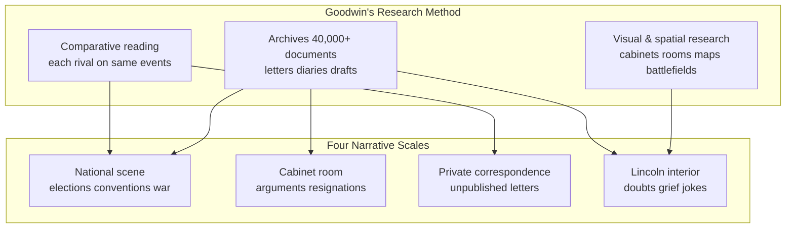
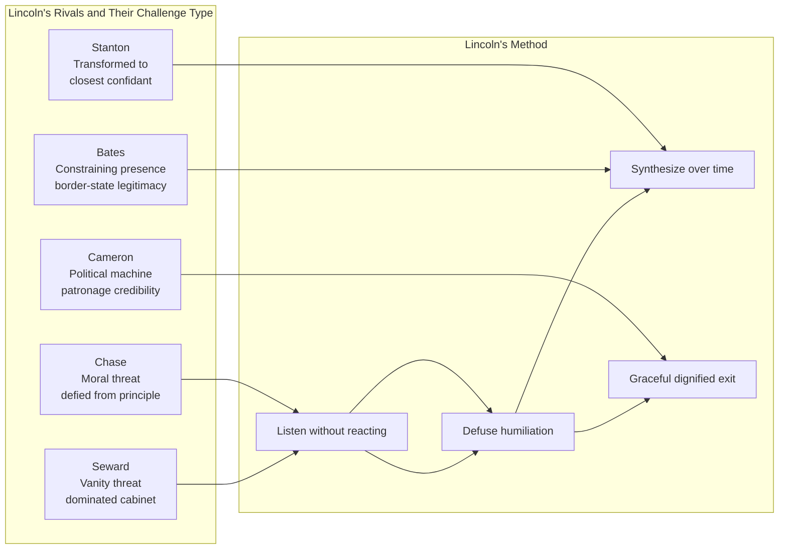

Team of Rivals by Doris Kearns Goodwin is a book about how Abraham Lincoln, in the greatest crisis the United States has ever faced, governed by absorbing rather than defeating his most capable adversaries. Goodwin is a Pulitzer Prize–winning historian who has taught at Harvard and written on the American presidency for more than four decades. For this book she read through more than forty thousand letters, diaries, and archival documents tracing not just Lincoln but each of his cabinet rivals.

Goodwin's research discipline is worth stepping back to appreciate. She worked on this book for more than a decade. She read through the collected papers of Lincoln, Seward, Chase, Stanton, Bates, and Cameron — tens of thousands of letters, diary entries, working drafts, and reports. She visited the Lincoln sites in Springfield, Washington, and Gettysburg. She interviewed descendants, walked the rooms, traced the timeline of the Trent Affair in original diplomatic cables, and analyzed cabinet meeting calendars against military campaign maps.

The result is a narrative that moves at four different scales at once: the national political scene (elections, conventions, congressional battles), the cabinet room (arguments, resignations, reconciliations), the private correspondence (what men wrote in letters they never intended to be published), and Lincoln's own interior life (what fragments we have of his private thoughts, his doubts, his jokes, his grief).

This multi-layered scholarship is what makes Team of Rivals feel different from other Lincoln books. You are not reading a single-author interpretation of Lincoln. You are reading a composite reconstruction — built from the testimony of rivals, allies, friends, enemies, and the man himself, each filtered through Goodwin's judgment about how to assemble their voices into a coherent story.

The book begins in 1860, with a Republican Party desperately trying to choose a presidential nominee. William Seward, the senior senator from New York, is expected to win handily. Salmon Chase, the anti-slavery crusader from Ohio, runs to shape the platform. Edward Bates, the elder Missouri Whig, represents the conservative border states. And Simon Cameron, the Pennsylvania political boss, represents the machine Republicans.

Abraham Lincoln wins.

And then he does something that shocks and confounds even his closest advisors. He offers the secretary of state post to Seward, the treasury to Chase, the attorney general post to Bates, and initially the war ministry to Cameron. The men who had competed with him for the nomination — men who believed they were best suited to be president — would now report to him.

Goodwin traces Lincoln's political genius not in dramatic victories but in the slow, patient work of managing a cabinet of rivals. Seward arrived confident he would dominate, expecting Lincoln to be a country lawyer out of his depth. Instead, Seward found a president who listened more than he spoke, who asked questions rather than issuing directives, who absorbed ideas from others and then, weeks later, offered a synthesis that felt like everyone's contribution.

When Seward proposed a radical foreign policy gambit — essentially provoking Britain into war to create a domestic distraction — Lincoln listened, considered, and quietly set it aside without humiliating Seward in the process. When the Trent Affair created an international crisis and Seward's authority was damaged, Lincoln's response to Seward's resignation letter was one of genuine affection: "I cannot let you go."

Salmon Chase presented a different kind of challenge. Where Seward's threat was vanity, Chase's was integrity. Chase believed, with reason, that Lincoln was moving too slowly on emancipation and that the war should be fought as a moral crusade from the start. He was right, and Lincoln knew it. But Lincoln also knew that premature action would lose the border states and the moderate North. He waited for the military moment — Antietam — and then moved. Chase's response was not gratitude but continued intrigue, back-channel complaints to senators, and private letters undermining the administration.

Lincoln handled Chase with the same patient strategy he applied to Seward: hold him, use him, honor him, and when he could no longer be contained, let him exit with dignity — and then appoint him to the Supreme Court, where his contribution was enormous.

The central insight of Team of Rivals is that Lincoln's political genius was not intellectual brilliance, though he was intelligent. It was not moral purity, though he was deeply principled. It was a quality that combined empathy with timing: the capacity to imagine where his rivals stood, the patience to wait for the moment when action would appear as strength rather than desperation, and the discipline to channel ambition rather than suppress it.

Goodwin shows this most clearly in the story of the Emancipation Proclamation. Lincoln drafted it in July 1862, after the Union's Peninsula Campaign had failed and the country was demoralized. Seward argued against releasing it then — it would look like a last measure of a defeated government. Lincoln listened. He waited through further defeats, through the near-disaster of the 1862 elections, through the bloody failure at Fredericksburg. He released it after Antietam, the first significant Union victory. The proclamation was then a measure of strength, not desperation. The timing was everything.

The book's longer arc traces Lincoln's own journey. Before 1860, he had lost five elections, failed in the Senate, and spent a decade out of public life. These defeats stripped him of the fragile ego that makes men defensive. By the time he became president, he had nothing left to protect — which meant he had nothing to hide behind. He could listen, absorb criticism, change his mind, and grow, in ways that men with more pristine political records could not.

At its deepest level, Team of Rivals is not primarily a book about strategy or tactics. It is a book about character — about the kind of inner development that makes democratic leadership possible at moments when it seems impossible. Lincoln grew in office. His cabinet helped him grow, even when they were trying to undermine him. And that growth is the story that Goodwin tells with such care and conviction.
