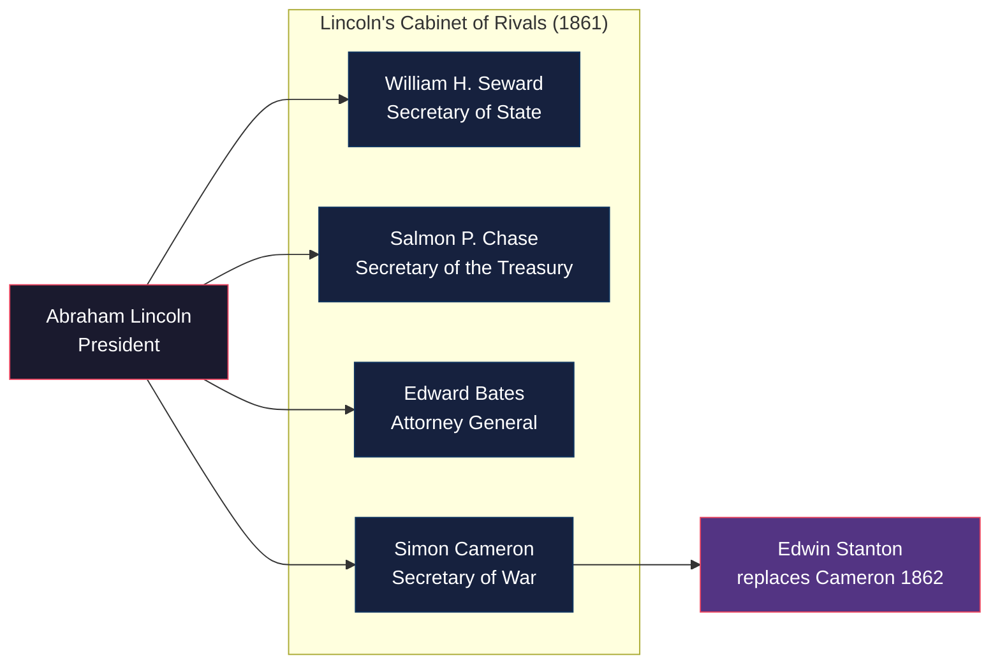
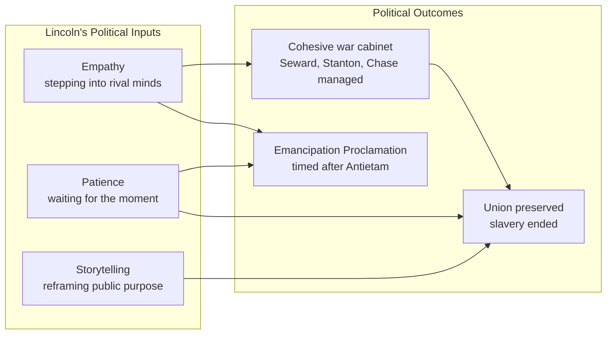
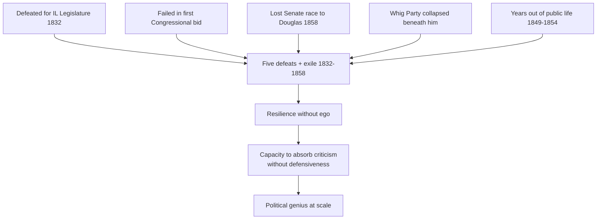
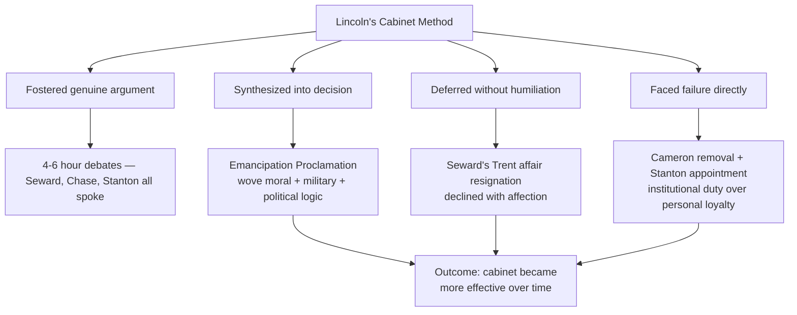
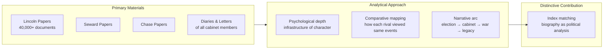

<BookOverview title="Team of Rivals: The Political Genius of Abraham Lincoln" author="Doris Kearns Goodwin">

Doris Kearns Goodwin, a Pulitzer Prize–winning historian and presidential scholar, spent more than a decade researching Team of Rivals before its 2005 publication. The book traces Abraham Lincoln's improbable rise from a one-term Illinois congressman to the presidency in 1860 — and examines how he assembled a cabinet composed of the very men who had run against him for the Republican nomination: William Seward, Salmon P. Chase, Edward Bates, and Simon Cameron. Goodwin's central thesis: Lincoln's political genius lay not in dominating his rivals, but in absorbing, managing, and ultimately winning over men of proven ability and outsized ego — turning opposition into collective purpose.

</BookOverview>

## Executive Summary

### The Team of Rivals Cabinet

Each cabinet member had previously competed with Lincoln for the Republican nomination. Goodwin argues this deliberate over-representation of factions was Lincoln's structural genius — embedding loyalty to the institution within the ambitions of rivals.

### Political Genius: Empathy + Timing

Empathy allowed Lincoln to anticipate Seward's pride and Chase's moral urgency. Timing allowed him to release the Emancipation Proclamation after Antietam rather than after Fredericksburg. Storytelling allowed him to transform a constitutional dispute into a moral crusade without losing the border states.

### Lincoln's Own Failures as Preparation

Goodwin's central biographical argument: each public failure stripped away a layer of Lincoln's fragile ego. By 1860, he had no vanity left to wound — which meant he had no vanity left to defend. A leader with nothing to protect can listen, absorb, and grow in ways that a leader with a polished record cannot.

### Managing the Civil War Cabinet

The cabinet method was not delegation — it was collective deliberation. Lincoln did not average positions; he absorbed arguments, found the tension within them, and produced a synthesis that rival arguments could not disown because they had been part of the process.

### Coalition at Scale vs. Rival Egotism

| Dimension | Team of Rivals (Lincoln) | Conventional Coalition |
|-----------|--------------------------|------------------------|
| Selection | Best talent — even opponents | Loyalists — ideological alignment |
| Loyalty source | Shared institution, not shared leader | Shared leader, not shared institution |
| Conflict | Argument within the process | Suppressed or managed privately |
| Decision quality | Synthesized — multiple perspectives | Often filtered — single viewpoint |
| Resilience | Survives leadership transition | Fragile — depends on one person |
| Risk | Rivals can leak, intrigue, undermine | Risk of groupthink, yes-men, blind spots |

Lincoln's logic: a coalition held together by loyalty to a person breaks when the person fails. A coalition held together by loyalty to an idea — the Union — can survive the leader's death.

### Goodwin's Method: Biography as Political Analysis

## Key Takeaways

1. **Political genius is the art of managing egos.** Lincoln's cabinet was the most contentious in American history because it contained the most ambitious, capable men of the era. His genius was not in making them loyal, but in making them *effective* together.

2. **Empathy is a political superpower.** Lincoln's ability to imagine himself inside the mind of a political opponent — Senator Stephen Douglas, his own cabinet rivals — was not softness. It was a tactical instrument that allowed him to anticipate reactions, frame arguments persuasively, and strike compromises without appearing defeated.

3. **Timing is as important as principle.** Lincoln moved on the Emancipation Proclamation when he did because he read the political moment with rare precision. Move too soon and the border states defect; move too late and slavery becomes permanently enshrined. His patience was not passivity.

4. **Failure is not the opposite of greatness — it is a prerequisite.** Before 1860, Lincoln lost five elections, failed in the Senate, and was mocked for his gawky appearance. Each defeat gave him something his polished rivals lacked: a deep reservoir of resilience and a diminished ego that made him less threatened by criticism.

5. **Coalition is built through storytelling, not coercion.** Lincoln's cabinet meetings were not dictatorial briefings; they were arguments. He invited dissent, welcomed strong viewpoints, and used narrative — stories about the Union, shared sacrifice, and national purpose — to knit rivals into a collective cause.

6. **The power of rivals is their capability, not their loyalty.** By choosing Seward, Chase, Bates, and Stanton — men who believed they *should* be president — Lincoln secured the most talented cabinet available. A team of yes-men would have failed the crisis. Rivals brought what loyalists could not: competence under pressure.

7. **Ambition and integrity are not opposites — they are a paradox Lincoln understood.** Each rival pursued his own ambition deeply. Lincoln understood that channeling that ambition toward a public purpose was more powerful than asking men to suppress it. The Emancipation Proclamation itself was shaped by Chase's Treasury ambitions and Stanton's military pragmatism.

8. **Narrative frames reality.** Lincoln knew that public opinion was not moved by dry policy alone. He anchored emancipation in the language of the Declaration of Independence, turned the war into a moral crusade rather than a constitutional dispute, and told the same stories repeatedly until they became shared national belief.

9. **A leader's first loyalty is to the institution, not to friends.** Lincoln knew Seward, Chase, and Bates personally and politically. But when they failed the institution, he moved against them — demoting Cameron, reprimanding Chase, accepting Seward's resignation only to decline it with grace. Personal affection did not override institutional duty.

10. **The longest arc in the book is not the war — it is Lincoln's inner life.** Goodwin's subject is not strategy but character, not tactics but temperament. The political genius she describes is ultimately a quality of soul: the capacity to grow in office, to listen, to speak with others' words before making them his own.

## Who Should Read This Book

| Read | Skip |
|------|------|
| Students of leadership and political history | Readers seeking a pure military account of the Civil War |
| Leaders managing talented but conflicting team members | Casual biography readers wanting a quick portrait of Lincoln |
| Anyone interested in how democratic coalitions form and fracture | Readers primarily interested in battlefield tactics |
| Historians and scholars of the Civil War era | Those looking for revisionist Lincoln criticism |
| Managers of complex, multi-stakeholder organizations | |

## Historical Context

Team of Rivals was published in September 2005, during the Bush administration's deepening involvement in Iraq and at a moment of intense public debate about presidential leadership, cabinet management, and the conduct of war. Goodwin's unspoken contemporary resonance was not lost on reviewers, who drew parallels between Lincoln's deeply divided cabinet and the foreign-policy team of George W. Bush.

Goodwin drew on more than 40,000 archival documents, personal papers, diaries, and letters — including private correspondence between the cabinet members and Lincoln's own drafts and working notes. The subtitle's "Political Genius" was deliberate: it was a direct response to a long tradition of Lincoln scholarship that framed him either as a saintly martyr or a shrewd politician, but rarely as both simultaneously.

Critically, Goodwin also drew on the late 1990s and early 2000s wave of behavioral science research on leadership, emotional intelligence, and coalition dynamics — though she filters it entirely through narrative rather than naming it explicitly. The book won the **Lincoln Prize** (2006), the **Abraham Lincoln Book Prize**, and was a **New York Times bestseller**. It served as a primary historical source for Steven Spielberg's 2012 film *Lincoln*.

## Related Books

| Book | Connection |
|------|-----------|
| *The Radical and the Republican* by James Oakes | Explores the Lincoln-Douglas relationship in parallel |
| *A. Lincoln: A Biography* by Ronald C. White | Complementary full-length Lincoln biography |
| *The Fiery Trial* by Eric Foner | Deeper analysis of Lincoln's evolution on slavery |
| *Masters of War* by Robert Dallek | Analysis of Lincoln's wartime political strategy |
| *The Inner World of Abraham Lincoln* by Michael Burlingame | Psychological portrait; complements Goodwin's character focus |
| *Leadership in Turbulent Times* by Doris Kearns Goodwin | Goodwin's follow-up; compares Lincoln to other presidents |
| *Team of Rivals* film (Spielberg, 2012) | Direct adaptation; confirms Goodwin's narrative as influential |

## Final Verdict

Team of Rivals is not a book about the Civil War that happens to feature Lincoln. It is a book about Lincoln's *mind* — specifically, about how the habits of empathy, the discipline of listening, and the courage to surround oneself with excellence rather than agreement constitute the deepest form of political intelligence. Goodwin's achievement is making a 19th-century story feel urgent and alive. Her weakness is the reverse risk: the narrative can feel so intimate and novelist-like that readers occasionally lose the analytical distance.

**Rating: 9.5/10** — A landmark work of narrative history that doubles as a leadership manual. The finest political biography of the 20th century's closing decades.
