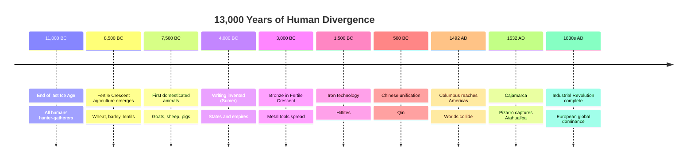
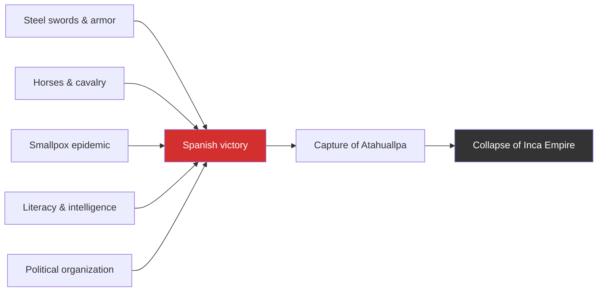
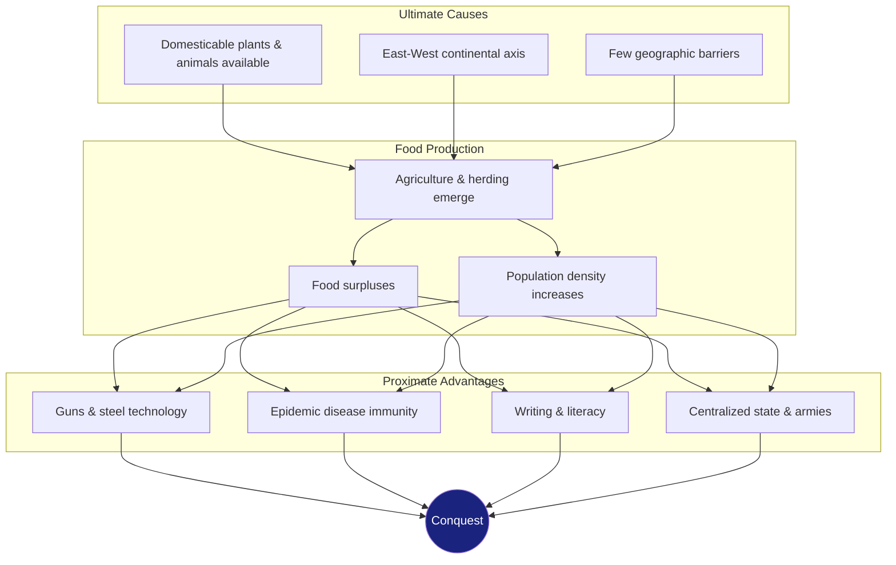
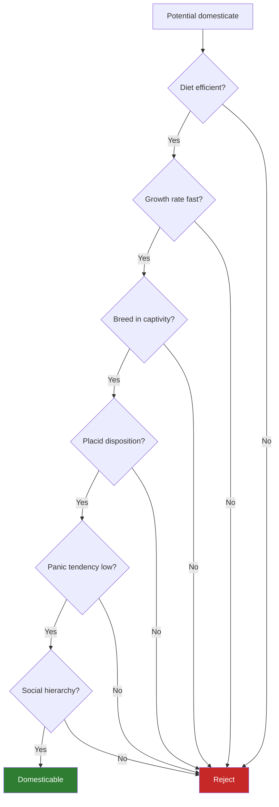

---

## Prologue: Yali's Question

The book's framing question was posed in 1972 by Yali, a New Guinean
politician, while Diamond was walking on a beach studying bird
evolution: "Why is it that you white people developed so much cargo and
brought it to New Guinea, but we black people had little cargo of our
own?"

Diamond reformulates this as: **Why did human development proceed at
such different rates on different continents?**

He rejects two answers at the outset:
- **Racial explanations** — "loathsome and wrong"; he argues New
  Guineans may be *more* intelligent on average than Europeans due to
  selective pressure from their harsh environment.
- **Cold-climate theories** — that cold winters forced technological
  ingenuity. Northern Europeans contributed almost nothing to Eurasian
  technology until the last 1,000 years; they received it from warmer
  regions.

Diamond's one-sentence summary: "History followed different courses
for different peoples because of differences among peoples'
environments, not because of biological differences among peoples
themselves."

---

## Part 1: From Eden to Cajamarca

### Chapter 1 — Up to the Starting Line

A whirlwind tour from human origins (~7 million years ago) to the end of
the last Ice Age (~11,000 BC). All continents were populated; all humans
were hunter-gatherers. Some continents had a head start — Africa as the
cradle of humanity — but by 11,000 BC, the starting line was roughly
level.

### Chapter 2 — A Natural Experiment of History

The Polynesian islands are a controlled experiment: one people
(Austronesians), one culture, one language — but radically different
environments. On large fertile islands (Tonga, Hawaii), complex
chiefdoms and states emerged with intensive agriculture, social
stratification, and standing armies. On small resource-poor islands
(Chatham Islands), the Moriori remained hunter-gatherers. Same people,
different geography — different outcomes.

### Chapter 3 — Collision at Cajamarca

The dramatic centerpiece: in 1532, Francisco Pizarro and 168 Spanish
soldiers captured the Inca Emperor Atahuallpa in the presence of 80,000
Inca warriors. Diamond dissects the proximate causes:

| Factor | Spanish advantage |
|--------|-------------------|
| **Steel** | Swords and armor vs quilted cotton and wood clubs |
| **Horses** | Cavalry shock value; Inca had never seen horses |
| **Guns** | Harquebuses (slow to reload but terrifying) |
| **Disease** | Smallpox arrived ahead of Pizarro, killing the previous Inca and triggering civil war |
| **Writing** | Spanish had detailed intelligence; Atahuallpa knew almost nothing about them |
| **Political** | Spain was a centralized state; Inca theocracy disintegrated on capture of the god-emperor |

The key insight: these are **proximate** causes. The rest of the book
traces the **ultimate** causes that produced them.

---

## Part 2: The Rise and Spread of Food Production

### The Causal Chain

### Chapter 4 — Farmer Power

Food production is the prerequisite for everything else. Why?
- More calories per acre supports denser populations
- Food surpluses support specialists (soldiers, scribes, priests, kings)
- Domesticated animals provide protein, fertilizer, leather, transport,
  and — crucially — germs
- Sedentary life enables accumulation of possessions and technology

### Chapter 5 — History's Haves and Have-Nots

Only a few areas independently developed agriculture:

| Center | Crops | Animals | Date |
|--------|-------|---------|------|
| **Fertile Crescent** | Wheat, barley, peas, lentils, olives | Goat, sheep, cow, pig, horse | ~8500 BC |
| **China** | Rice, millet, soybeans | Pig, chicken, water buffalo | ~7500 BC |
| **Mesoamerica** | Maize, beans, squash, tomatoes | Turkey, dog | ~3500 BC |
| **Andes/Amazon** | Potato, quinoa, manioc | Llama, guinea pig, duck | ~3500 BC |
| **Sahel** | Sorghum, millet | Guinea fowl | ~3000 BC |
| **New Guinea** | Taro, banana, sugarcane | — | ~3000 BC |

### Chapter 7 — How to Make an Almond

Domestication was an unconscious process. Early farmers selected for
traits like larger seeds, non-shattering stalks (grains that didn't fall
off when touched), and reduced toxins. An almond tree that produces
bitter (cyanide-laced) nuts could mutate to produce sweet nuts —
someone noticed and replanted. Over generations, wild plants became
crops.

### Chapter 9 — Anna Karenina Principle

"Happy families are all alike; every unhappy family is unhappy in its
own way." Domesticable animals are all domesticable in the same way:
they must meet a checklist of criteria.

Eurasia had 13 of the world's 14 large domesticable mammals. The
Americas had only 1 (llama/alpaca). Africa had zebras (unbitable,
unbreakable), rhinos, hippos, and buffalo — all failed the checklist.
Sub-Saharan Africa's lack of domesticable animals was a catastrophic
biogeographic disadvantage.

### Chapter 10 — Spacious Skies and Tilted Axes

The most famous argument in the book:

| Continent | Axis | Latitude span | Diffusion speed |
|-----------|------|---------------|-----------------|
| Eurasia | East-West | ~1,000 miles | Fast (~0.7 mi/yr) |
| Americas | North-South | ~6,000 miles | Slow (~0.3 mi/yr) |
| Africa | North-South | ~4,000 miles | Slowed by climate zones |

Crops adapted to one latitude do not grow well at very different
latitudes (day length, temperature, rainfall). Eurasia's shared
latitudes meant Fertile Crescent wheat grew in France, Germany, and
China. American corn from Mexico could not spread to the Andes or
Canada without centuries of adaptation.

---

## Part 3: From Food to Guns, Germs, and Steel

### Chapter 11 — Lethal Gift of Livestock

Crowd infectious diseases — smallpox, measles, influenza, tuberculosis,
whooping cough — are evolved from livestock diseases. Smallpox came
from cowpox or related cattle diseases. Measles evolved from rinderpest
(cattle). Influenza came from pigs and ducks.

Eurasians, living in dense populations with domesticated herds for
thousands of years, developed partial immunity through natural selection.
When Europeans reached the Americas, their germs killed an estimated
90-95% of indigenous populations — the greatest demographic catastrophe
in history. More Native Americans died from Eurasian germs than from
Eurasian weapons.

### Chapter 12 — Blueprints and Borrowed Letters

Writing evolved independently only a few times: Sumer (~3200 BC), Mexico
(~600 BC), China (~1300 BC), and perhaps Egypt. All other literate
societies acquired writing by diffusion. Writing enabled:
- Precise administration of states and taxes
- Transmission of knowledge across generations without loss
- Coordination of long-distance expeditions
- Accumulation of scientific and technical knowledge

### Chapter 13 — Necessity's Mother

Technology is **autocatalytic** — the rate of invention accelerates
because inventions beget more inventions. Eurasia's larger population
and interconnected geography meant more inventors and faster diffusion.
Key inventions (wheel, metallurgy, ships, gunpowder) emerged in Eurasia
and spread across the continent.

### Chapter 14 — From Egalitarianism to Kleptocracy

Food production enabled population densities that made centralized
political organization inevitable. Bands became tribes, tribes became
chiefdoms, chiefdoms became states. Diamond defines the state as a
kleptocracy — the transfer of resources from commoners to the elite —
legitimized through religion, ideology, and public goods (roads,
irrigation, courts).

---

## Part 4: Around the World in Five Chapters

Diamond applies his framework to five regions:

| Region | Key argument |
|--------|--------------|
| **Australia & New Guinea** | Same original people; New Guinea developed agriculture and pigs; Australia did not — because New Guinea had domesticable crops and was ecologically suitable for agriculture |
| **China** | Early food production, large homogeneous area, east-west axis — became the first unified state; political unity later became a disadvantage when a single decision (stopping overseas exploration) halted progress |
| **Polynesia** | Environmental determinism on islands; Hawaii developed a state; Chatham Islands' Moriori remained hunter-gatherers — same ancestry, different geography |
| **Americas** | Late settlement, north-south axis, extinction of large mammals, limited domesticable animals (only llama/alpaca), difficult geography — everything was slower |
| **Africa** | North-south axis; spread of agriculture slowed by climate zones and tsetse fly (trypanosomes); lack of domesticable animals; but Bantu expansion shows the same pattern of food-producing peoples displacing hunter-gatherers |

---

## The Epilogue

Diamond addresses the most common criticism — Why Europe rather than
China? — and offers five geographical factors:

1. **China's unity** — a single decision-maker (the emperor) could
   stop innovation; Europe's fragmentation meant many competing states.
2. **Ecological suicide** — the Fertile Crescent deforested and
   salinized itself, shifting the center of power northward.
3. **Europe's coastline** — many natural harbors and indented
   coastlines fostered maritime trade.
4. **Competitive states** — constant warfare drove technological
   arms races in Europe.
5. **Marginal location** — Europe was the periphery, not the center,
   giving it incentive to explore outward.

He also reiterates that his analysis is about *probabilities*, not
certainties, and acknowledges the charge of geographic determinism
while defending it as a useful framework — not a claim that human
choices don't matter.
