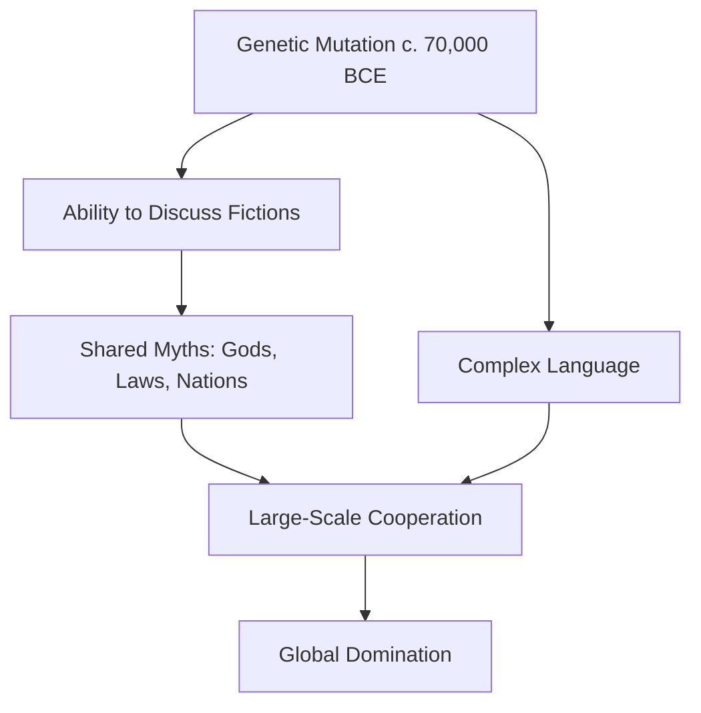
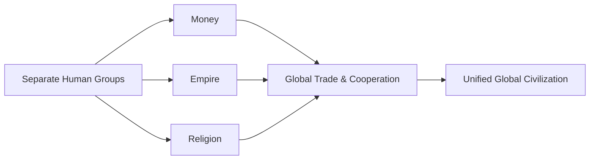
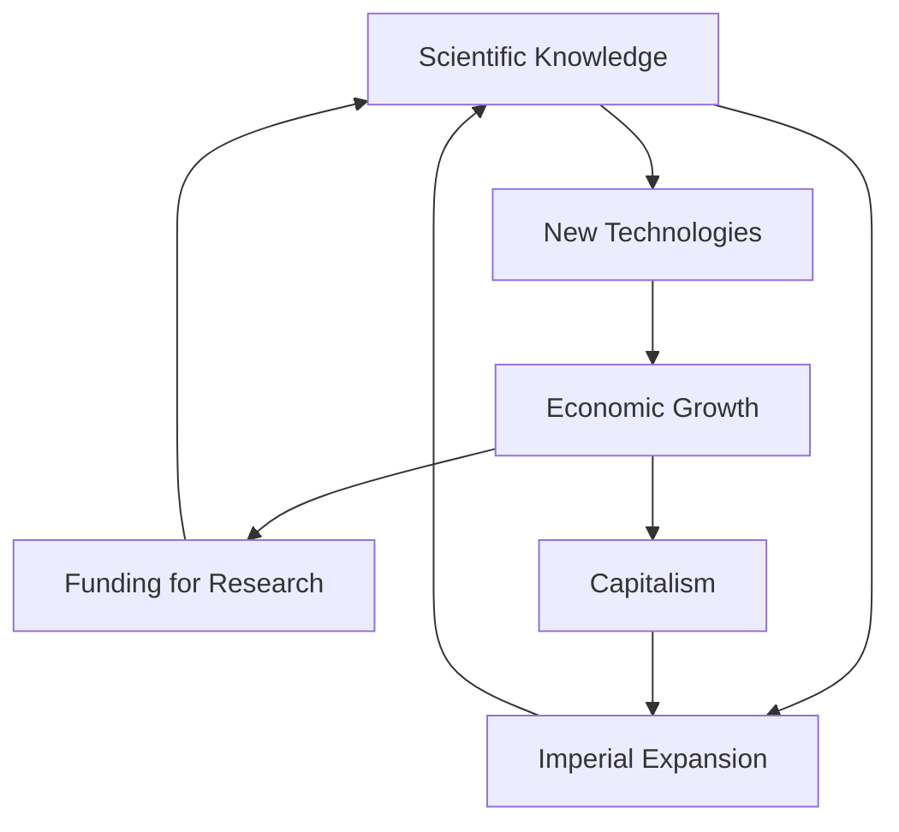
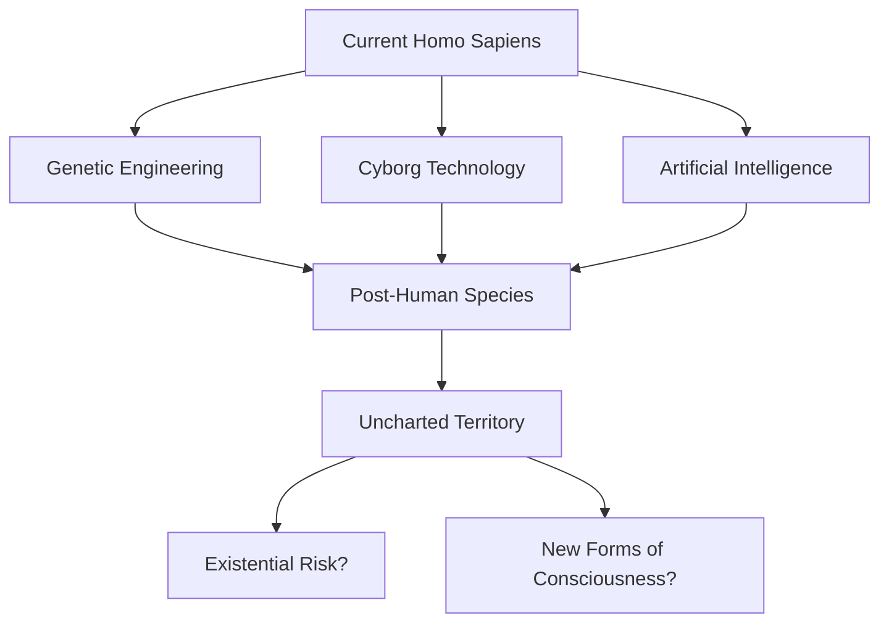

# Key Concepts in *Sapiens*

## 1. The Cognitive Revolution (c. 70,000 BCE)

The Cognitive Revolution marks the moment when Homo sapiens developed the ability to think, communicate, and cooperate in ways no other species could. Harari argues that a chance genetic mutation rewired the Sapiens brain, enabling complex language and, crucially, the ability to discuss things that do not exist in objective reality—gods, spirits, national identities, laws, and corporate entities.

This "fiction-making" capacity is the foundation of all large-scale human cooperation. A chimpanzee troop maxes out at roughly 150 individuals because each member must know every other personally. Sapiens, by contrast, can cooperate in groups of thousands or millions because they share common beliefs in imagined orders.

### Key Points

- For 2.5 million years, Homo sapiens were unremarkable animals on the African savanna
- The Cognitive Revolution enabled cultural evolution to outpace genetic evolution
- Shared fictions allow millions of strangers to cooperate toward common goals
- Competing human species (Neanderthals, Homo erectus) could not cooperate at this scale and went extinct

> **Callout:** Harari's central thesis is that Homo sapiens rules the world "because it is the only animal that can believe in things that exist purely in its own imagination."

## 2. The Agricultural Revolution (c. 10,000 BCE)

The transition from foraging to farming is one of the most discussed events in *Sapiens*. Harari provocatively calls it "history's biggest fraud." While agriculture dramatically increased the total human population and enabled the rise of cities, empires, and complex societies, it made individual lives measurably worse.

Foragers worked fewer hours, ate more varied diets, suffered fewer infectious diseases, and had more social freedom. Farmers worked longer, ate repetitive grain-based diets, suffered from epidemics, and were trapped in rigid social hierarchies. The revolution was good for genes (more humans survived to reproduce) but bad for the individual organisms who were those genes.

| Metric | Foragers | Farmers |
|---|---|---|
| Work hours | ~4–6 hours/day | ~8–10 hours/day |
| Diet diversity | High (wild plants, meat, fish) | Low (wheat, rice, maize) |
| Disease burden | Low | High (epidemics, zoonoses) |
| Social hierarchy | Relatively egalitarian | Rigid class systems |
| Individual freedom | High | Low |

### The Luxury Trap

Harari introduces the concept of the "luxury trap": each generation of farmers works slightly harder to maintain a standard of living that was effortless for foragers. Once a community adopts agriculture, it cannot go back without starving because the population has grown to depend on the surplus that farming provides. Wheat and rice effectively "domesticated" humans as much as humans domesticated them.

## 3. The Unification of Humankind

Over thousands of years, three great unifying forces—money, empire, and religion—gradually merged separate human groups into a single global civilization.

### Money

Money is the most universal and efficient system of mutual trust ever devised. It is a fiction that everyone believes in: a dollar bill has no intrinsic value, yet it can be exchanged for anything. Money replaced barter and local gift economies, allowing strangers who do not trust each other to cooperate in economic exchange.

> **Callout:** "You could never convince a monkey to give you a banana by promising him limitless bananas after death in monkey heaven."

### Empire

Empires have been the most successful political form in human history. They homogenized diverse populations under a single political structure, spread shared languages and cultures, and created the infrastructure for trade and knowledge exchange. Most humans today live in societies shaped by imperial legacies.

### Religion

Religion provided the cosmic legitimacy for social orders. From ancient polytheism to modern ideologies (including liberalism, communism, and nationalism), belief systems gave meaning to imperial expansion and economic structures. Harari argues that even secular ideologies function as religions in this sense.

## 4. The Scientific Revolution (c. 1500 CE)

The Scientific Revolution began when Europeans admitted their ignorance and began systematically investigating the natural world. This "marriage of science and empire" gave European powers a decisive advantage: knowledge was power.

Harari identifies three key features of the scientific revolution:

1. **The admission of ignorance** — Scientists accepted that they did not know everything, which motivated exploration and experimentation.
2. **The centrality of observation and mathematics** — Empirical evidence and mathematical models replaced theological reasoning.
3. **The pursuit of new technologies** — Scientific knowledge was directed toward practical applications that generated economic value.

### The Feedback Loop of Science, Empire, and Capitalism

This self-reinforcing cycle powered the dramatic expansion of European power from 1500 onward. The discovery of the Americas, the industrial revolution, and the colonization of Africa and Asia were all products of this feedback loop.

## 5. Imaginary Orders

Perhaps the most important concept in *Sapiens* is the idea of "imaginary orders"—the shared beliefs, norms, and institutions that exist only because large groups of people collectively believe in them. Money, human rights, nations, corporations, and laws are all imaginary orders. They have no objective existence in the physical world, yet they shape human behavior more powerfully than any material force.

| Imaginary Order | What It Is | Why It Matters |
|---|---|---|
| Money | A shared fiction of value | Enables economic cooperation among strangers |
| Human Rights | A shared fiction of moral equality | Provides legal protections and political legitimacy |
| Corporations | A legal fiction of personhood | Enables large-scale economic organization |
| Nations | A shared fiction of belonging | Organizes billions of people into political communities |
| Religions | Shared fictions of cosmic meaning | Legitimizes social hierarchies and moral codes |

### The Paradox of Imaginary Orders

Imaginary orders are simultaneously indispensable and fragile. They require constant reinforcement through institutions, education, and shared culture. When belief in an imaginary order collapses—as when a currency loses value or a government loses legitimacy—the social structures it supports can disintegrate rapidly.

> **Callout:** The distinction between "objective reality" (things that exist independently of human belief, like rocks and rivers) and "intersubjective reality" (things that exist because many humans believe in them, like money and nations) is central to Harari's framework.

## 6. The Happiness Paradox

Throughout *Sapiens*, Harari asks a question that most historians ignore: has all this progress made humans happier? His answer is candidly uncertain. He examines biological, psychological, and philosophical perspectives on happiness and concludes that we have very little idea whether modern humans are happier than ancient foragers.

### Three Perspectives on Happiness

1. **Biological:** Happiness is determined by biochemicals like serotonin and dopamine. From this perspective, happiness has not changed much because the brain's reward system has remained constant for thousands of years.
2. **Psychological:** Happiness depends on expectations. As living standards rise, expectations rise with them, canceling out any gains in satisfaction.
3. **Philosophical:** Happiness may be a matter of finding meaning, not pleasure. But different belief systems define meaning differently, making objective comparison impossible.

> **Callout:** Harari suggests that Buddhist meditation may offer the most honest answer to the happiness paradox: rather than changing external conditions, one can change how the mind processes experience.

## 7. The Future of Homo sapiens

In the final section, Harari looks ahead. He argues that humans are on the verge of overcoming natural selection entirely. Through genetic engineering, cyborg technology, and artificial intelligence, Sapiens may soon be able to redesign its own biology and create entirely new forms of consciousness.

Harari frames this as the most consequential question in human history: once we gain the power to control our own evolution, what will we choose to become? He warns that Sapiens' track record of wielding power wisely is not encouraging.

### Key Takeaway

The story of Sapiens is not finished. The same capacity for fiction-making that enabled humans to build pyramids, empires, and corporations now gives us the power to rewrite our own biology. Whether this power will be used wisely is an open question—and one that *Sapiens* leaves deliberately unresolved.
