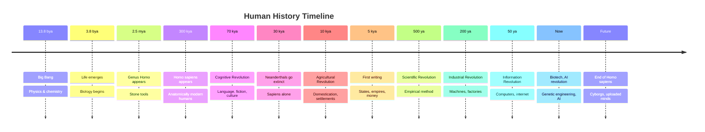
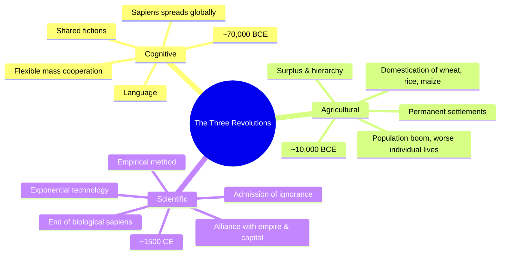
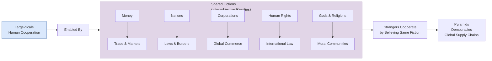
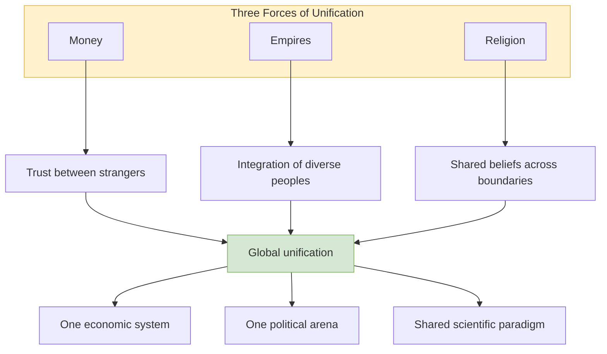
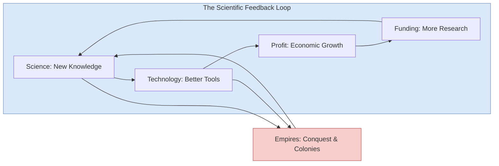
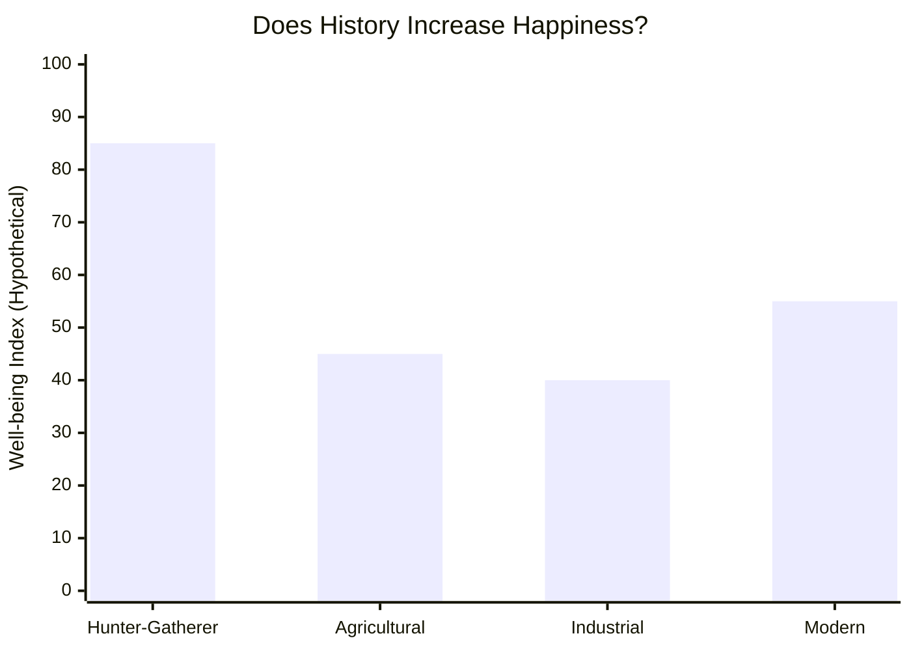
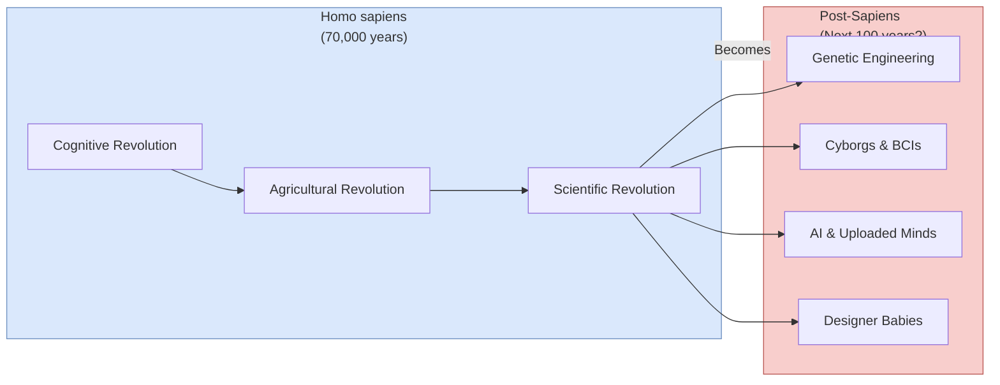

---

## The Cognitive Revolution

### The Tree of Knowledge

Around 70,000 years ago, a random genetic mutation in the brains of _Homo
sapiens_ enabled a new kind of thinking and communication. Harari calls this
the Cognitive Revolution. The exact cause is unknown — it may have been a minor
change in brain wiring — but its effects were transformative.

### Language as Gossip

For Harari, the primary function of language in early sapiens bands was not
describing the world but **social grooming at scale**. A forager band of ~150
individuals could hold together because language let people gossip — share
information about who could be trusted, who was cheating, who was a good
alliance partner. Gossip, in this view, is the original social glue, allowing
groups to grow beyond the ~50-150 limit of primate grooming circles.

### Fiction as Glue

The truly revolutionary step was the ability to speak about things that do not
exist at all. A chimpanzee cannot be convinced to sacrifice a banana for a
"dominant position in a chimpanzee nation" — but a human will die for a
nation, a god, or a corporation. Harari calls these **intersubjective
realities**: they exist only in the shared imagination of enough people.

> "There are no gods in the universe, no nations, no money and no human rights
> — except in the collective imagination of human beings."

This capacity for mass collaboration through shared belief is what made sapiens
unstoppable. A thousand sapiens can coordinate to build a pyramid; a thousand
chimpanzees cannot coordinate to build anything.

### The First Wave of Extinction

Armed with language, fiction, and superior cooperation, sapiens expanded out of
Africa around 70,000 years ago. Wherever they went, large animals vanished:
Australian megafauna (45,000 years ago), American mammoths and giant sloths
(15,000 years ago). Harari suggests this was not climate change but sapiens'
hunting pressure — the first and most destructive wave of human ecological
impact.

---

---

## The Agricultural Revolution

### History's Biggest Fraud

Harari's most provocative claim: the Agricultural Revolution was not a
liberating advance but a trap. Hunter-gatherers worked fewer hours, ate a more
varied diet, suffered less from famine and disease, and lived in more egalitarian
bands. Farming locked people into monotonous labour, grain-based malnutrition,
epidemic diseases (from proximity to livestock), back-breaking toil, and rigid
social hierarchies.

Who trapped whom? Harari inverts the narrative: "It's not that we domesticated
wheat. It's that wheat domesticated us." The plant that evolved to thrive by
being planted, watered, and protected by humans spread across the globe — a
success story from the wheat's perspective, but a loss for the humans who
became its servants.

### The Birth of Hierarchy

Agriculture created surplus, and surplus required management. Small egalitarian
bands gave way to chiefdoms, kingdoms, and eventually empires. With hierarchy
came patriarchy, slavery, taxation, and war — all rooted in the need to control
land, food, and labour. Writing was invented to keep track of grain and taxes.
Laws were codified to protect property. The imagined order of kings and gods
replaced the face-to-face trust of the forager band.

### What the Agricultural Revolution Gave Us

Despite the costs, agriculture enabled everything that followed: cities,
writing, art, philosophy, science, complex technology. The question Harari
leaves open is whether the trade-off was worth it — and whether the people who
made the choice had any real agency in the matter.

---

---

## The Unification of Humankind

### The Arrow of History

Harari argues that history has a direction: toward ever-larger units of
cooperation. The long arc runs from bands→tribes→chiefdoms→kingdoms→
empires→global civilisation. Three forces drove this unification.

### The Scent of Money

Money is the ultimate intersubjective reality. It has no objective value — a
dollar bill is just coloured paper. But because everyone believes everyone else
believes in it, money circulates freely across all cultural, religious, and
political boundaries. Money is the great universaliser, the basis of trust
between strangers who share nothing else.

### Imperial Visions

Empires have a terrible reputation — and deserve it. But Harari notes they also
spread ideas, languages, laws, and technology across vast areas. The Roman
Empire unified the Mediterranean. The Chinese empire unified East Asia.
European colonial empires created the first truly global networks. Imperial
violence was real, but so was imperial unification — and the modern globalised
world is, in Harari's telling, a single empire without an emperor.

### The Law of Religion

Harari distinguishes animism (local spirits, no conversion) from universal
religions (Buddhism, Christianity, Islam) that claim truth for all humans
everywhere. Universal religions, especially when allied with empires, became
powerful vehicles for cultural unification. The belief that "all humans are
brothers and sisters under God" is, like money, a fiction that enables
cooperation at planetary scale.

---

---

## The Scientific Revolution

### The Discovery of Ignorance

The Scientific Revolution's defining innovation was not a particular discovery
but an attitude: the admission of ignorance. Pre-modern societies believed
they already knew everything important — the Bible, the Vedas, or Aristotle
contained all truth worth knowing. Modern science began when people admitted
they did not know the answers and developed systematic methods for finding
them out.

### The Marriage of Science, Empire, and Capitalism

Harari describes a feedback loop. Science provided new knowledge (navigation,
weapons, medicine). Empires funded scientific expeditions (Cook, Darwin,
Humboldt) and used the knowledge to conquer. Capitalism provided the financing
for both. The profits from colonies fuelled more research, which produced
better technology, which enabled more conquest. This three-way alliance drove
five centuries of exponential change.

### The Wheels of Industry

The Industrial Revolution turned this feedback loop into a juggernaut. Steam,
electricity, and fossil fuels decoupled human power from muscle and animal
power. The resulting growth in production, consumption, and population
transformed every aspect of life — and set the stage for the ecological crisis
that now threatens the whole enterprise.

---

## The Happiness Question

Historians rarely ask whether people were happier in the past. Harari does, and
the evidence is not comforting. Hunter-gatherers likely experienced meaning,
community, and physical vitality. Farmers worked harder for worse nutrition.
Industrial workers faced unprecedented monotony. Modern consumers have comfort
but also anxiety, alienation, and stress. Biochemical happiness research
suggests our emotional range is genetically constrained: winning the lottery
and becoming paraplegic produce similar happiness levels after one year.

Harari's conclusion is characteristically provocative: we have no good evidence
that history has increased human well-being. We may be more powerful than our
ancestors, but not happier.

---

## The End of Homo Sapiens

The book closes with a look forward. The Scientific Revolution is bringing us
to the threshold of **biological liberation**: genetic engineering, brain-computer
interfaces, artificial intelligence, cryonics, uploaded consciousness. The same
tools that let us understand history now let us rewrite it — literally, in our
DNA.

Harari's note is ambivalent. We have god-like powers but no god-like wisdom.
We are capable of creating superhuman cyborgs or annihilating ourselves. The
next century will likely see the end of _Homo sapiens_ as we know it — not
through extinction but through transformation into something else.

---

---

## Comparison: Sapiens vs Neanderthals

| Trait | Homo sapiens | Homo neanderthalensis |
|---|---|---|
| Brain size | ~1300 cm³ | ~1600 cm³ (larger) |
| Tool complexity | Advanced blades, microliths, art | Mousterian tools |
| Social networks | Long-distance trade, large groups | Smaller, more isolated bands |
| Symbolic behaviour | Cave paintings, figurines, burials | Limited symbolic evidence |
| Adaptation | Flexible, generalist | Cold-adapted specialist |
| Outcome | Survived, spread globally | Extinct ~30,000 years ago |

Harari's argument: it was not intelligence or strength that gave sapiens the
edge, but the ability to cooperate flexibly in large numbers through shared
fictions. Neanderthals may have been individually smarter, but they could not
coordinate at scale.
