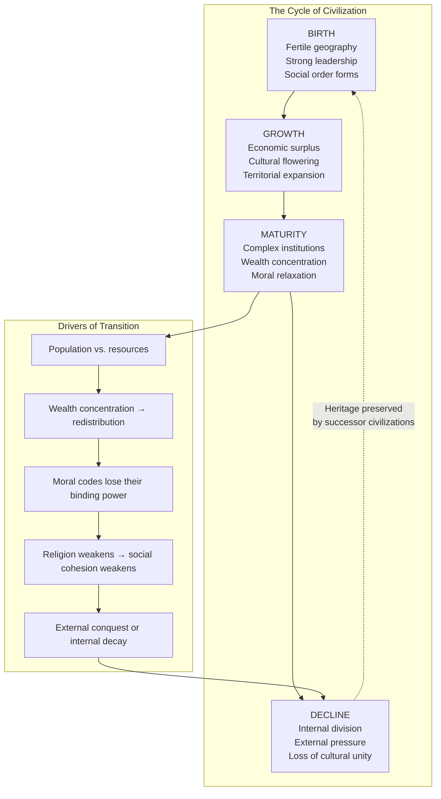
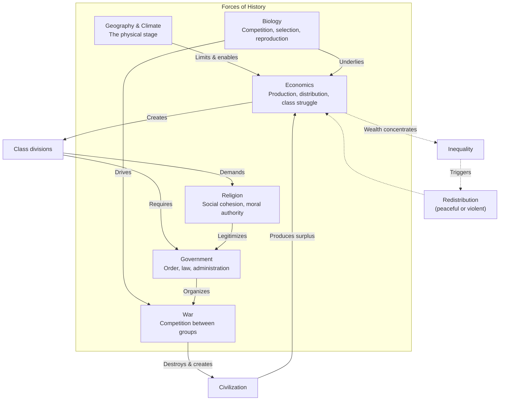
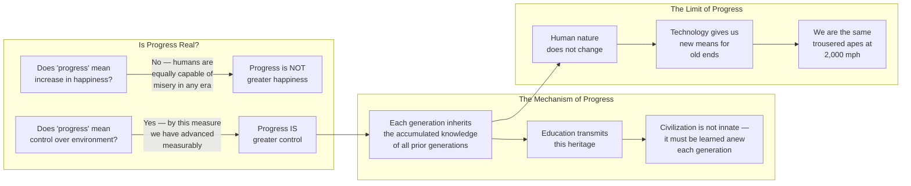
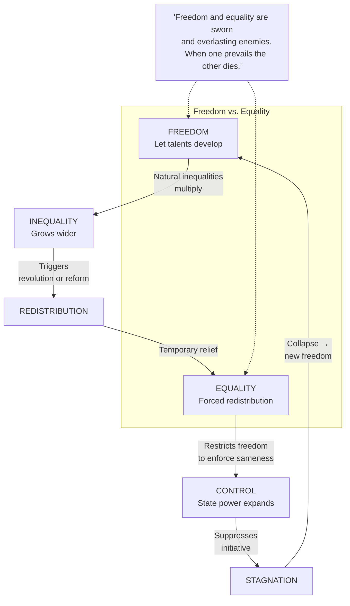

## The Cycle of Civilization

The Durants argue that all civilizations follow a recurring arc —
birth, growth, maturity, decline — driven by internal tensions and
external pressures.

## Interplay of Historical Forces

No single force determines history. Geography, biology, economics,
religion, government, and war interact in shifting combinations.

## Durant's View of Progress

Progress is not linear improvement in happiness or morals. It is the
accumulation and transmission of heritage — knowledge, art, technology —
across generations.

## Freedom vs. Equality

The Durants' most famous thesis: freedom and equality are sworn enemies.

---

## Chapter-by-Chapter Deep Dive

### Chapter II: History and the Earth

Geography is the matrix of history. Rivers, seas, and fertile valleys
drew settlers and enabled trade. Egypt was "the gift of the Nile."
Mesopotamia flourished "between the rivers." Mediterranean dominance
lasted two millennia — from Salamis (480 BCE) to the Spanish Armada
(1588) — until Atlantic exploration shifted the center of power.

The Durants' key insight: technology progressively diminishes geographic
determinism. The airplane will redraw the map of civilization. Landlocked
nations like Russia, China, and Brazil will overcome their geographic
handicaps. Coastal cities will lose their commercial advantage. "Man, not
the earth, makes civilization."

### Chapter III: Biology and History

Three biological lessons underlie all history:

1. **Life is competition.** Competition is "the trade of life — peaceful
   when food abounds, violent when the mouths outrun the food." Cooperation
   is a form of competition: groups cooperate internally to compete
   externally.

2. **Life is selection.** Some individuals and groups are better equipped
   for survival. Inequality is not an accident of social systems — it is
   a biological given. Nature loves difference as the raw material of
   evolution.

3. **Life must breed.** Nature cares more about the species than the
   individual. When population exceeds food supply, nature restores balance
   through famine, pestilence, and war.

### Chapter IV: Race and History

The Durants are unequivocal: race is not a cause of civilization. "History
is color-blind." Civilizations are made by cultures, not races. The
apparent superiority of European civilization was a product of geography,
chance, and accumulated advantage — not innate racial characteristics.
"White people were able to make more early advancements because of where
they were located in Europe, not because their race had more inherent
intelligence." Any group, given comparable circumstances, will develop
comparable civilization.

### Chapter V: Character of Man

Human nature is the fundamental constant of history. The basic instincts —
hunger, sex, competition, fear, ambition — are unchanged across recorded
time. "Means and instrumentalities change; motives and ends remain the
same." Evolution in man has been social, not biological. A baby from
ancient Rome raised in modern New York would be indistinguishable from
any other New Yorker.

The tension between conservatism and innovation is creative. "It is good
that the old should resist the young, and that the young should prod
the old; out of this tension comes a creative tensile strength."

### Chapter VI: Morality and History

Moral codes are universal in function but variable in form. Every society
needs rules that subordinate individual impulses to social order. But
what those rules are depends on economic conditions.

The Durants trace three economic phases — hunting, agriculture, industry —
each with its own moral code. Hunting required aggression and sexual
competition. Agriculture demanded industriousness, fidelity, and respect
for parental authority. Industry rewards individualism, mobility, and
delayed marriage. Moral change is not decay; it is adaptation.

### Chapter VII: Religion and History

Religion did not originally concern morality. It arose from fear of
natural forces and the mystery of death. Only later did it become the
enforcer of moral codes — and in that role, it became the indispensable
foundation of social order.

The Durants note that religion and puritanism prevail when law is weak
and cannot maintain order alone. Skepticism and moral relaxation advance
as law and government grow strong enough to replace religion's binding
function. But when law weakens — as in periods of upheaval — religion
revives. It has "many lives and a habit of resurrection."

### Chapter VIII: Economics and History

"History is economics in action." The Durants argue that beneath the
surface of political and cultural history, economic forces are the slow,
powerful tide. The concentration of wealth is natural and inevitable,
"periodically alleviated by violent or peaceable partial redistribution."
All economic history is "a vast systole and diastole of concentrating
wealth and compulsive recirculation."

Peaceful redistribution (taxation, welfare) works better than violent
(revolution). Revolutions usually destroy more wealth than they
redistribute. The only real revolution is the gradual enlightenment of
the mind.

### Chapter IX: Socialism and History

Socialism recurs throughout history as a corrective to inequality —
from Spartan communism to Jesuit Paraguay to the modern welfare state.
But every pure socialist system has failed because: (1) government
bureaucracy grows too large and corrupt, (2) taxes become burdensome,
(3) the profit motive is indispensable for productivity.

The Durants predict that capitalism and socialism will converge. "The
fear of capitalism has compelled socialism to widen freedom, and the
fear of socialism has compelled capitalism to increase equality." The
result will be a mixed economy — neither pure market nor pure plan.

### Chapter X: Government and History

Minority rule is natural — power concentrates as inevitably as wealth.
Monarchy offers order but risks tyranny. Aristocracy offers competence
but risks oligarchy. Democracy offers freedom but requires education.

"Democracy is the most difficult of all forms of government, since it
requires the widest spread of intelligence, and we forgot to make
ourselves intelligent when we made ourselves sovereign." Democracy is
historically rare and fragile. It has done more good than any alternative,
but its survival depends on an educated citizenry.

### Chapter XI: History and War

War is one of the constants of history. In 3,421 years of recorded
history, only 268 have seen no war. Peace is an unstable equilibrium —
maintained only by acknowledged supremacy or equal power. States behave
like individuals but without a superior power to restrain them.

The only prospect for world peace, the Durants wryly suggest, is "so
decisive a victory by one of the great powers that it will be able to
dictate and enforce international law" — or, more fancifully, an
interplanetary war that would unite Earth against a common enemy.

### Chapter XII: Growth and Decay

Civilizations are not immortal. They follow the same arc as organisms:
birth, growth, maturity, decline. The causes of decay are internal more
often than external — loss of cultural unity, exhaustion of the creative
impulse, moral relaxation that undermines social discipline.

But a great civilization does not entirely die. Its achievements —
language, law, art, science, philosophy — survive to nourish successor
civilizations. The heritage is never lost; it is transferred, transformed,
and built upon.

### Chapter XIII: Is Progress Real?

The final chapter is the Durants' most personal and most moving. They
define progress not as happiness (which is subjective and elusive) but
as "the increasing control of the environment by life." By this standard,
progress is real: life expectancy has tripled, famine has been eliminated
in modern states, education has spread, science has diminished
superstition.

"Civilization is not inherited; it has to be learned and earned by each
generation anew. If the transmission should be interrupted for one
century, civilization would die, and we should be savages again."

The book ends with a vision of history as "a celestial city, a spacious
country of the mind, wherein a thousand saints, statesmen, inventors,
scientists, poets, artists, musicians, lovers, and philosophers still
live and speak, teach and carve and sing."
