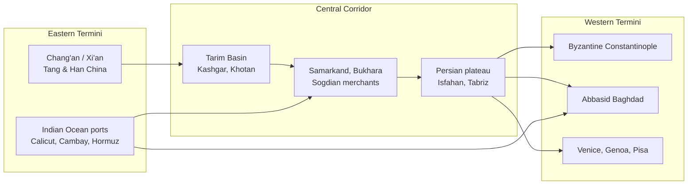
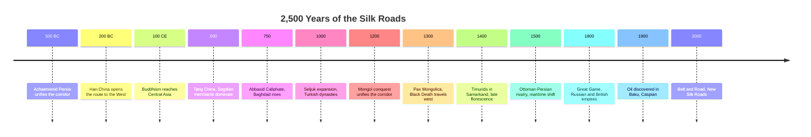
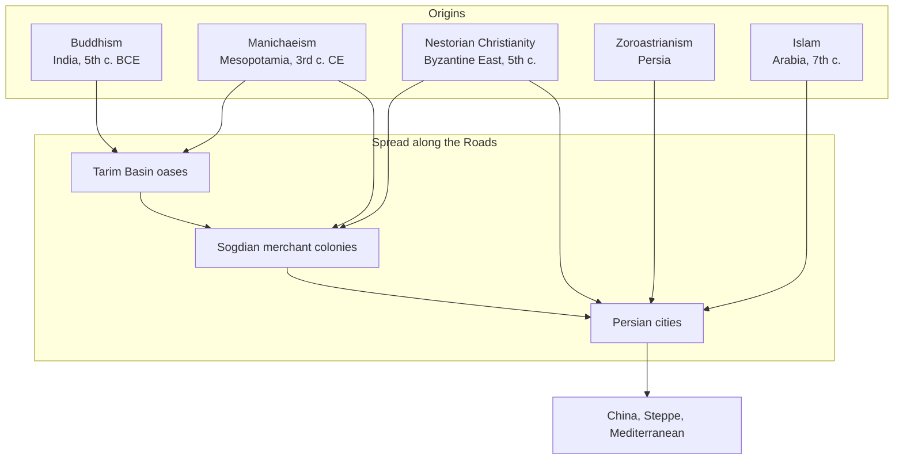
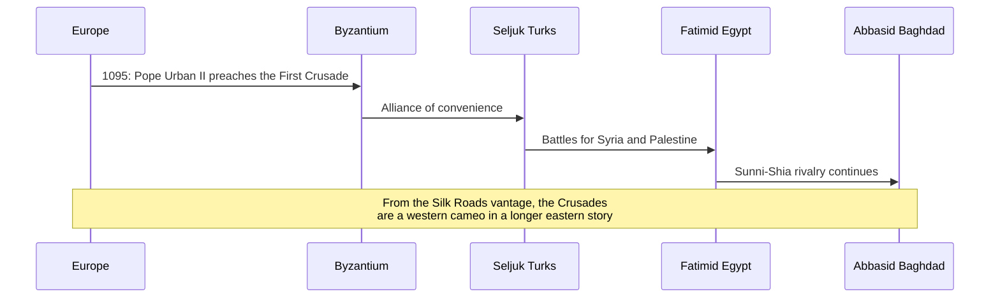
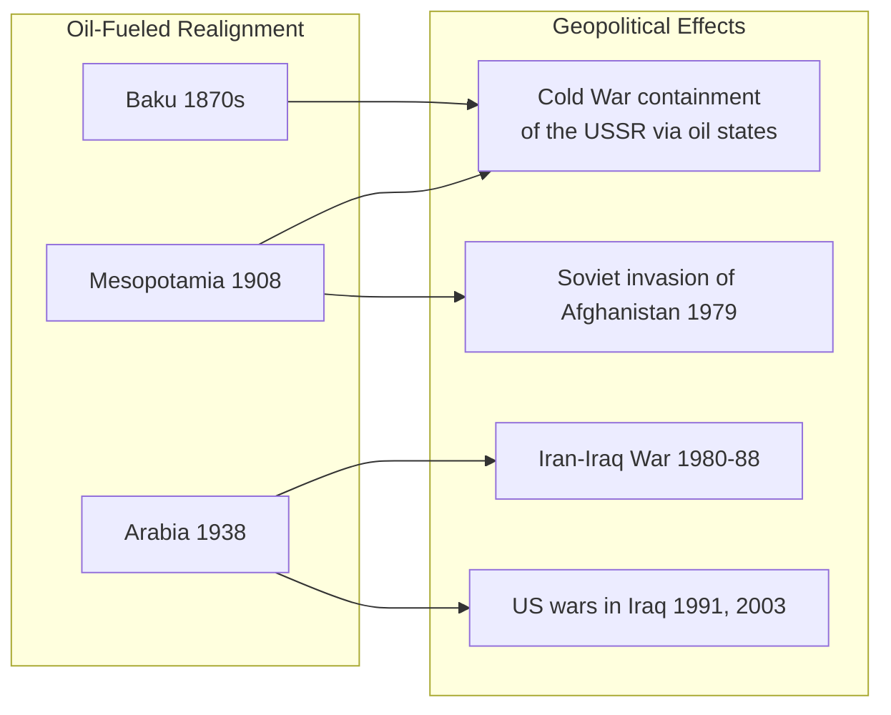

## The Premise

The phrase "Silk Road" was coined in 1877 by the German geographer
Ferdinand von Richthofen. Frankopan restores the original
plurality: there was never a single road, only a dense web of
overland and maritime routes linking the Mediterranean to the
Pacific.

The book's 25 chapters are each titled "The Road of ..." — Faiths,
Silver, Furs, Slaves, Heaven, Iron, Plague, Gold, Empires, Coffee,
Genocide, Cotton, Opium, Famine, Power, Oil, and so on. The titles
are not just literary devices; they signal that history moves on
specific corridors for specific cargoes.

---

## What the Silk Roads Actually Were

The network was not linear. It was a lattice: oasis cities
(Termez, Merv, Nishapur), river crossings (Oxus, Jaxartes), and
mountain passes (Pamirs, Hindu Kush) formed its nodes.

Three facts made this network exceptional:

1. **Distance.** It was the longest sustained trading system in
   human history, spanning roughly 8,000 km end to end.
2. **Longevity.** Goods, ideas, and pathogens traveled it for
   almost 2,000 years without interruption.
3. **Density.** Cities like Merv (12th c.) and Baghdad (9th c.)
   were larger, richer, and more cosmopolitan than anything in
   contemporary Europe.

---

## Timeline of the Corridor

---

## The Roads of Faith

Faiths moved along the same corridors as silk. Buddhism reached
China via the oasis cities of the Tarim Basin. Manichaeism — a
syncretic religion blending Christian, Zoroastrian, and Buddhist
elements — spread from Mesopotamia to the Uyghur khaganate and on
to the Tang court. Nestorian Christianity established bishoprics
in Merv, Samarkand, and even Beijing.

Frankopan's reading of religious transmission is deliberately
secular: ideas travel when merchants travel, and merchants travel
when the roads are safe.

---

## The Mongol Moment (1206–1368)

The Mongol Empire is the single most important silk-roads event in
the book. Chinggis Khan and his successors did not just conquer;
they knitted Eurasia into a single administrative unit. The
Pax Mongolica enabled:

- Safe travel from Korea to the Balkans for the first (and still
  only) time in history
- The transfer of Chinese gunpowder, printing, and compass
  technology to the West
- The transfer of Western astronomy, medicine, and engineering to
  the East
- And, inadvertently, the spread of *Yersinia pestis* from the
  steppe to the Black Sea ports, and from there to Europe as the
  Black Death

Frankopan reframes the Black Death as a *Silk Roads* event, not a
European tragedy. Roughly 30–60% of the population of Persia and
the Mediterranean died; the demographic and economic consequences
reshaped Europe for centuries.

---

## The Roads of Plague, Famine, and Silver

Three short chapters illustrate how the book uses single commodities
to unlock large arguments.

| Road | Commodity | Argument |
|---|---|---|
| Silver | Spanish-American silver flooding China | China, not Europe, was the 16th–18th c. global sink |
| Plague | Yersinia pestis | Disease, not ideology, is the silent driver of history |
| Cotton | Indian textiles | The Industrial Revolution was, in part, a response to Asian manufacturing |

The "Road of Silver" chapters are a sustained argument that the
early modern world economy was organized around China, not Europe.
European silver crossed the Pacific and the Silk Roads to pay for
Chinese silks, porcelains, and tea. The Qing were the creditor
empire; Europe was the debtor.

---

## The Roads of Holy War and Empire

Frankopan's treatment of the Crusades is one of the most cited
parts of the book. From a Mediterranean vantage, the Crusades are
the central event of the high Middle Ages. From a Silk Roads
vantage, they are a brief, violent intrusion into a long-running
competition between Byzantium, the Fatimids, the Seljuks, and the
Abbasids for control of Levantine trade.

A similar reframing is applied to the rise of Russia, the British
Raj, and the United States: each is treated as a continental
power extending into, and often disrupting, the corridor.

---

## The Twentieth Century: Roads of Oil

The book's pivot to the modern era is the *Road of Oil*. Frankopan
argues that the twentieth century is, structurally, a Silk Roads
century: the discovery of oil in Baku (1848, commercial 1870s) and
later in Mesopotamia and the Persian Gulf re-centered global
geopolitics on the corridor.

The point is not that oil *caused* these events. It is that the
geography of oil determined their shape, and that geography is the
same geography the silk caravans followed.

---

## The Twenty-First Century: The New Silk Roads

The final chapters argue that the 21st century is restoring the
corridor as the center of world affairs. China's Belt and Road
Initiative (2013), India's "Act East" policy, the reopening of
Iran, the war in Ukraine, and the energy transition are all
Silk Roads phenomena.

| Initiative | Region | Silk Roads Analogue |
|---|---|---|
| Belt and Road | China → Central Asia → Europe | Overland Silk Road |
| China-Pakistan Economic Corridor | Gwadar → Xinjiang | Southern Silk Road |
| INSTC | India → Iran → Russia | Northern branch of the Indian Ocean trade |
| Middle Corridor | Turkey → Caucasus → Caspian | Byzantine-Seljuk trade route |

Frankopan spun these arguments out into a 2018 sequel, *The New
Silk Roads*, and a 2023 environmental prequel, *The Earth
Transformed*.

---

## Key Lessons

- **Continuity beats novelty.** Patterns from 500 BCE recur in
  2025 CE because the geography has not changed.
- **The West is a recent and contingent actor.** Treating it as
  the default distorts the analysis.
- **Corridors, not nation-states, are the right unit of
  analysis** for most of human history.
- **Faiths, pathogens, and technologies travel together.** You
  cannot understand one without the others.
- **Oil was a Silk Roads commodity.** The modern Middle East is
  not an aberration; it is the corridor doing what it has always
  done.

---

## Action Plan

1. **Relabel your mental map.** When you read about "the
   Mediterranean" or "the Middle East," ask: from which side of
   the corridor am I looking?
2. **Follow the goods.** Pick a commodity (silk, silver, oil,
   lithium) and trace its corridor backward. You will rediscover
   Frankopan's argument from the data.
3. **Read at least one primary Silk Roads source.** Ibn Battuta,
   Marco Polo, Xuanzang, or the *Periplus of the Erythraean Sea*
   — each reads differently after this book.
4. **Pair it with Frankopan's other two books.** *The New Silk
   Roads* (2018) covers the 2010s; *The Earth Transformed* (2023)
   extends the lens to climate.
