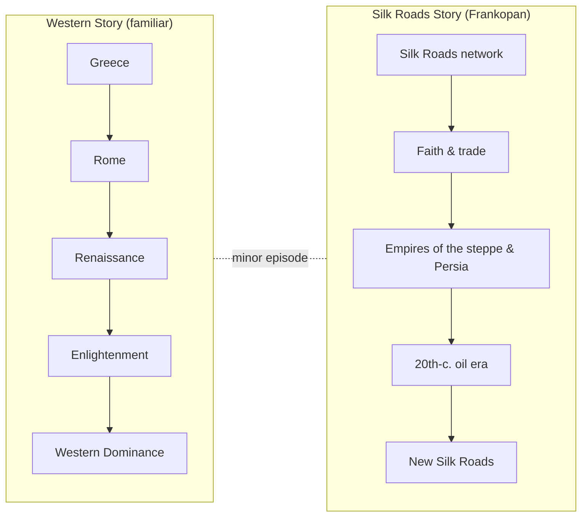

## Overview

*The Silk Roads: A New History of the World* (2015) by Peter Frankopan
is a 25-chapter, 640-page reframing of world history. The argument is
simple and provocative: the engines of history did not sit in
Greece, Rome, or Washington. They sat in the lands east of the
Caspian Sea, in the corridor connecting China, India, Persia, the
steppe, the Middle East, and the Mediterranean.

Frankopan walks the reader through 2,500 years of that corridor —
faith, silver, fur, slaves, plague, empire, oil — and shows that the
familiar story (Renaissance, Enlightenment, Western dominance) is the
exception, not the rule.

---

## Executive Summary

The book makes one big claim. World history is best understood as
the history of the *Silk Roads* — the network of land and maritime
routes that connected the Mediterranean to the Pacific. Every
significant shift in human affairs, from the spread of religions to
the price of bread, was driven by what happened on this corridor.

The familiar Eurocentric story — Greece to Rome to the
Renaissance to the Enlightenment to Western global dominance — is
treated as a recent, regional deviation. The West's "rise" was
brief, contingent, and is already ending.

The point is not that the West is unimportant. The point is that
it is *one* player in a much longer, much larger game.

---

## Key Takeaways

1. **Geography is destiny, but not in the way you were taught.**
   The center of the Eurasian landmass — not its western peninsula —
   is the natural hub of trade, ideas, and power.
2. **Faiths traveled on the Silk Roads.** Buddhism, Manichaeism,
   Nestorian Christianity, Zoroastrianism, and Islam all spread
   along the same corridors that carried silk and silver.
3. **The Crusades were a Western intrusion into a Silk Roads
   conflict.** From the East's vantage, the Crusades were a sideshow
   in a longer story between Byzantines, Seljuks, and Fatimids.
4. **The Mongol Empire was a silk-roads empire.** Pax Mongolica
   unified the corridor and made possible the Black Death — a
   pandemic that started in the steppe and reshaped Europe.
5. **The Renaissance was a refugee story.** Greek scholars, silk
   technologies, and Chinese inventions flowed west via the
   Mediterranean and the Mongol khans.
6. **The modern world is a 20th-century silk-roads story.** Oil,
   pipelines, railroads, and Cold War client states turned the
   corridor back into the center of geopolitics.
7. **The 21st century belongs to the East again.** China's Belt and
   Road, India's rise, and Central Asia's reopening are not new
   phenomena. They are the return of the default.

---

## Who Should Read

| Reader | Why |
|---|---|
| World-history readers tired of Eurocentrism | A genuinely different center of gravity |
| Investors and strategists watching Asia | Frame for the Belt-and-Road era |
| Students of religion and trade | Shows how faiths and goods co-traveled |
| Anyone puzzled by modern geopolitics | Explains why the "stans" matter again |
| Comparative-history fans | Pairs well with Diamond, Pomeranz, Beckwith |

## Who Should Skip

- Readers who want a single-country or single-era history
- Those who need a heavily footnoted academic monograph
- Anyone allergic to large-scale, thesis-driven synthesis
- Maritime-history purists (the seas get short shrift)

---

## Core Themes

| Theme | Description |
|---|---|
| The Corridor | The Silk Roads as the spine of world history |
| Connectedness | Disease, faith, money, and people moving together |
| Continuity | 2,500 years of recurring patterns |
| Oil & After Oil | The modern era framed by petroleum, then by debt and infrastructure |
| The East Strikes Back | China's Belt and Road as a return to form |

---

## Why This Book Matters

Most popular history still places the West at the center and
treats Asia as a backdrop. Frankopan reverses the camera. After
reading it, headlines about Xinjiang, the Caspian, or the Suez
read very differently: they read as the latest chapter of a story
that has been running for millennia.

The book is also a useful counterweight to two recent
bestsellers — *Sapiens* and *Guns, Germs, and Steel* — which both
treat Eurasian history through a Western-shaped lens.

---

## Related Books

| Book | Author | Connection |
|---|---|---|
| **The New Silk Roads** | Peter Frankopan | Sequel covering 2010s geopolitics |
| **The Earth Transformed** | Peter Frankopan | Prequel: environmental world history |
| **Guns, Germs, and Steel** | Jared Diamond | Geographic determinism, broader scope |
| **Destiny Disrupted** | Tamim Ansary | Complementary Islamic-world perspective |
| **The Great Divergence** | Kenneth Pomeranz | Why Europe industrialized first |
| **Empire of the Steppes** | René Grousset | Classic Central Asian history |

---

## Final Verdict

**Rating: 9.0/10** — A genuinely reframing book. Sweeping, opinionated,
and imperfect, but indispensable for anyone who wants to understand
the next fifty years, which will be written in the languages and
along the routes Frankopan maps.
