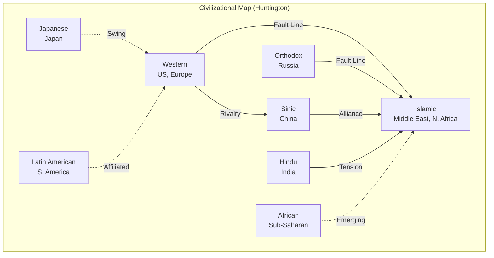
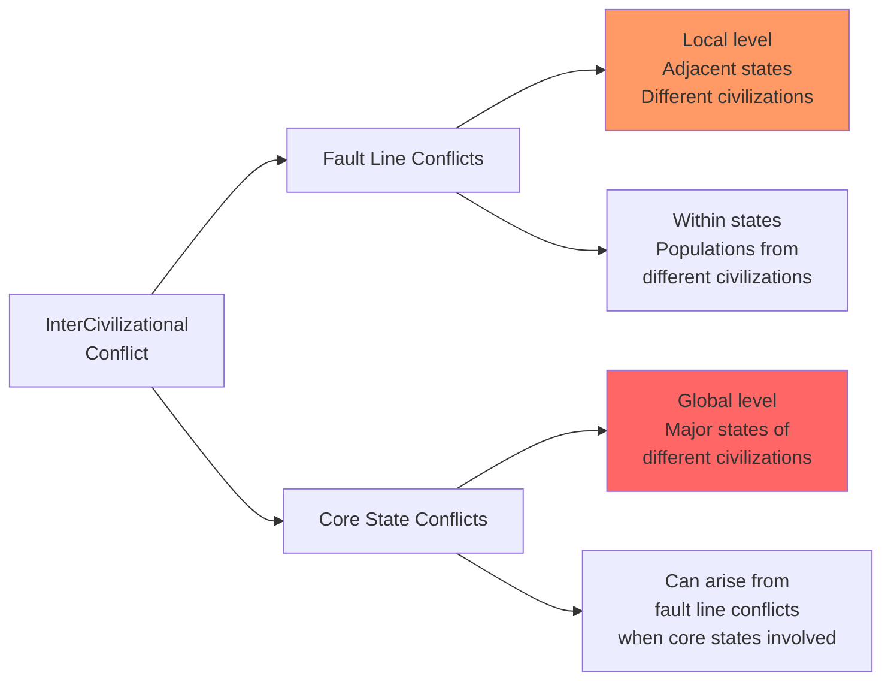
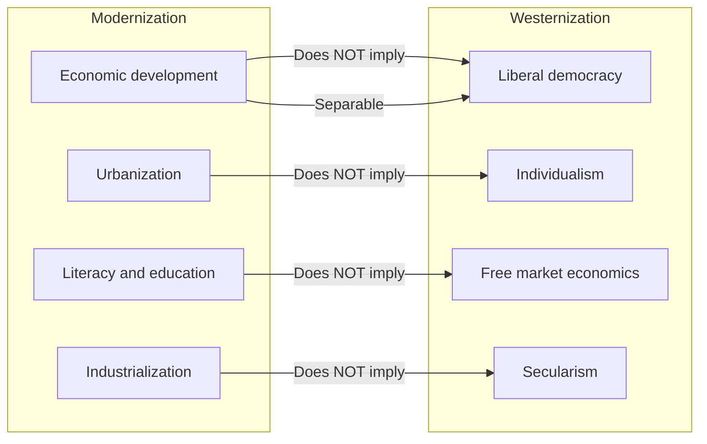
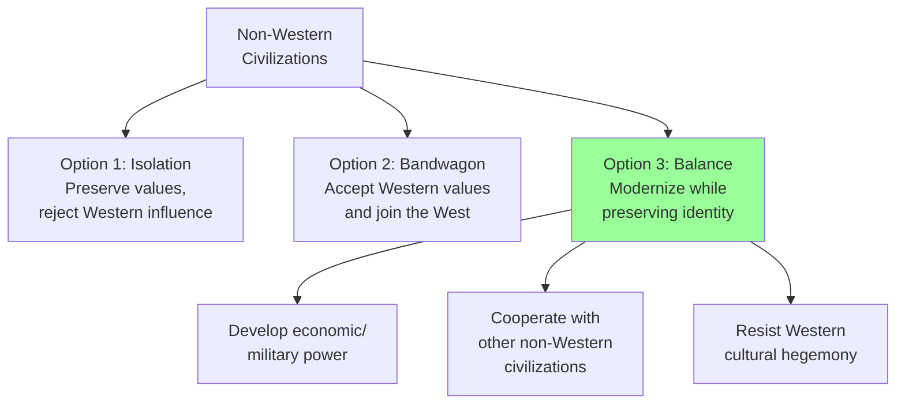

# Key Concepts: The Clash of Civilizations

## The Civilization Paradigm

Huntington's central argument is that civilizations—the broadest level of cultural identity—will be the primary organizing principle of post-Cold War global politics. A civilization is defined by common elements: language, history, religion, customs, institutions, and the subjective self-identification of people. Unlike nations or alliances, civilizations have no clear beginning or end, but they are the most comprehensive cultural entity to which a person can belong.

## The Eight Major Civilizations

Huntington identifies eight major civilizations in the contemporary world:

| Civilization | Core Region | Core State | Key Characteristics |
|---|---|---|---|
| **Western** | Europe, North America | United States | Individualism, pluralism, rule of law, democracy, market economics |
| **Orthodox** | Russia, Eastern Europe | Russia | Eastern Orthodox Christianity, strong state tradition, Byzantine heritage |
| **Islamic** | Middle East, North Africa, Central Asia, Pakistan, Indonesia | None (no core state) | Islam as organizing principle, caliphate tradition, diverse ethnic groups |
| **Sinic** | China, Korea, Vietnam, Singapore | China | Confucianism, Sinic writing, hierarchical social structures |
| **Hindu** | India, Nepal | India | Hinduism, caste system, Sanskrit tradition, dharma |
| **Japanese** | Japan | Japan | Hybrid of Chinese and indigenous traditions, unique island civilization |
| **Latin American** | Central and South America | None (debated) | Catholic heritage, corporatist traditions, Iberian cultural roots |
| **African** | Sub-Saharan Africa | None (emerging) | Pan-African identity emerging, diverse indigenous traditions |

## Why Civilizations Will Clash

Huntington provides six reasons why civilizational conflict is inevitable:

1. **Differences are basic**: Civilizations are differentiated by history, language, culture, tradition, and most importantly, religion. These differences are the product of centuries and will not disappear soon.

2. **The world is shrinking**: Increasing global interactions intensify civilizational consciousness and awareness of differences between civilizations.

3. **Religion fills the identity gap**: Economic modernization and social change separate people from traditional local identities. Religion replaces this gap, providing identity and commitment that transcends national boundaries.

4. **The dual role of the West**: The West is at the peak of its power, but non-Western civilizations are simultaneously experiencing a return-to-the-roots phenomenon, desiring and gaining the resources to shape the world in non-Western ways.

5. **Cultural characteristics are less mutable**: Political and economic differences can be compromised and resolved; cultural and religious differences cannot.

6. **Economic regionalism reinforces civilization consciousness**: Successful economic regionalism is rooted in a common civilization (e.g., the EU, NAFTA).

## Core State vs. Fault Line Conflicts

Huntington distinguishes between two forms of intercivilizational conflict:

**Fault line conflicts** occur on a local level between states or groups belonging to different civilizations, or within states with populations from different civilizations. These conflicts are communal, prolonged, violent, and identity-based.

**Core state conflicts** occur on a global level between the major states of different civilizations. They can arise when core states become involved in fault line conflicts.

## The Kin-Country Syndrome

One of Huntington's most controversial concepts is the "kin-country syndrome": in fault line conflicts, states and peoples rally to the support of their civilizational kin, regardless of other considerations. For example, in the Bosnian War, Saudi Arabia, Iran, and other Muslim countries supported Bosnian Muslims, while Orthodox Russia supported Serbia, and Western nations supported Croatia and Slovenia.

> **Key Insight**: "In a civilizational conflict, the resentful and fearful peoples who are on the receiving end of Western power inevitably turn to their own civilizations for guidance, leadership, and support."

## Modernization vs. Westernization

Huntington makes a crucial distinction between modernization and Westernization:

Countries like Japan, China, and the "Four Asian Tigers" (Hong Kong, Taiwan, South Korea, Singapore) have modernized economically while maintaining traditional or authoritarian societies. This demonstrates that modernization does not require Westernization—a key counterargument to Fukuyama's "End of History" thesis.

## Torn Countries

Torn countries are nations that are attempting to shift their civilizational identity from one civilization to another. Huntington's chief example is Turkey, whose political leadership has systematically tried to Westernize since the 1920s under Mustafa Kemal Atatürk. Other torn countries include:

- **Turkey**: Islamic heritage, Westernized political elite, seeking EU membership
- **Mexico**: Historically Western, increasingly tied to Latin American identity
- **Russia**: Debating between Western and Orthodox identity
- **Australia**: Western heritage but increasing economic engagement with Asia

For a torn country to successfully redefine its civilizational identity, three conditions must be met:
1. The political and economic elite must support the move
2. The public must accept the redefinition
3. The elites of the target civilization must accept the country

According to Huntington, no torn country has successfully redefined its civilizational identity.

## The West vs. The Rest

Huntington predicts that the central axis of world politics will be the conflict between Western and non-Western civilizations. Non-Western civilizations have three possible responses:

Huntington believes the third option—balancing—is most likely, and that the increasing power of non-Western civilizations will eventually force the West to abandon its claim to universality.

## The Sino-Islamic Connection

Huntington predicts a strategic alliance between Sinic and Islamic civilizations against the West. He identifies common interests in:
- Weapons proliferation
- Human rights and democracy issues
- Resistance to Western cultural universalism
- Military cooperation against Western hegemony

This "Sino-Islamic connection" represents one of the most significant long-term threats to Western dominance.

## Swing Civilizations

Russia, Japan, and India are what Huntington calls "swing civilizations"—major powers that may favor either side in civilizational conflicts:

- **Russia**: Clashes with Muslim populations on its southern border but cooperates with Iran and other Muslim states
- **Japan**: Western ally but culturally distinct; may shift alignment
- **India**: Hindu civilization with historical tensions with Islamic Pakistan, but non-aligned tradition

## Callout: Huntington's Warning

> **The West's Greatest Danger**: "In the emerging world of ethnic conflict and civilizational clash, Western belief in the universality of Western culture suffers three problems: it is false; it is immoral; and it is dangerous."

This quote encapsulates Huntington's core warning: the West's insistence on exporting its values will provoke civilizational conflict rather than prevent it.