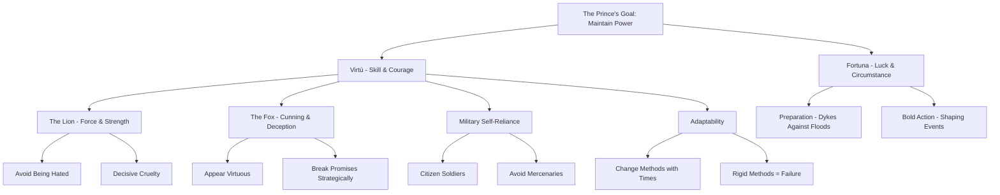

## Chapter Structure and Organization

*The Prince* consists of 26 chapters that can be divided into four thematic sections:

| Section | Chapters | Focus |
|---------|----------|-------|
| **Types of Principalities** | 1–9 | Classification of states and how to acquire and hold them |
| **Military Affairs** | 10–14 | Armies, mercenaries, and military organization |
| **The Prince's Character** | 15–23 | Virtue, fortune, cruelty, liberality, and appearances |
| **Italy and the Future** | 24–26 | Italy's political condition and the call for a liberator |

## Core Concepts

### Virtue (*Virtù*) vs. Fortune (*Fortuna*)

Machiavelli's most important theoretical distinction is between *virtù*—a combination of skill, courage, decisiveness, and adaptability—and *fortuna*, the unpredictable force of luck and circumstance. Fortune governs roughly half of human affairs, but a prince of *virtù* can shape the other half through bold action and preparation.

> "I compare fortune to one of those violent rivers which, when they are enraged, flood the plains, tear down trees and buildings... everyone flees before them, everyone yields to their impetus; there is no possibility of resistance. Yet... when times are quiet, men can make provision against [floods] with dykes and embankments."

Machiavelli uses the metaphor of fortune as a river: preparation and defensive structures can mitigate its destructive power. He argues that adaptability—changing one's approach to match circumstances—is the highest form of *virtù*. The prince who clings rigidly to one method will fail when conditions change.

### The Lion and the Fox

Machiavelli famously advises that a prince must combine the strengths of both the lion (force) and the fox (cunning):

> "A prince must know how to make good use of the natures of both the beast and the man... he must be a fox to recognize traps and a lion to frighten wolves."

This duality captures the essential Machiavellian insight: pure strength is vulnerable to deception, and pure cunning is vulnerable to force. Effective leadership requires both.

### Types of Principalities

Machiavelli opens with a taxonomy of states:

| Type | Description | Difficulty to Hold |
|------|-------------|-------------------|
| **Hereditary** | Passed down through a dynasty | Easier — established customs and loyalty |
| **Novel (New)** | Recently acquired by a new ruler | Difficult — no existing legitimacy |
| **Mixed** | Combination of hereditary and novel elements | Moderate |
| **Ecclesiastical** | Controlled by the Church | Easiest — maintained by religious authority |
| **Civil** | Based on the consent of citizens | Variable |
| **Military** | Based on the prince's own armed forces | Depends on military strength |

New principalities pose the greatest challenge because the prince must establish authority where none existed before. Machiavelli warns that novel princes who rely solely on fortune or the help of others will quickly lose what they have gained.

### The Ends Justify the Means

Perhaps the most controversial aspect of *The Prince* is Machiavelli's insistence that actions should be judged by their outcomes, not by their inherent morality:

> "It is necessary for a prince wishing to hold his own to know how to do wrong, and to make use of it or not according to necessity."

This does not mean Machiavelli endorses cruelty for its own sake. Rather, he argues that the prince must be willing to act immorally when the survival of the state demands it. Cruelty should be used sparingly and decisively—once, at the beginning—rather than persistently. The key question is always: does this action maintain or strengthen the state?

### New Prince vs. Hereditary Prince

Machiavelli devotes considerable attention to the contrast between new and hereditary princes:

| Aspect | New Prince | Hereditary Prince |
|--------|-----------|-------------------|
| **Legitimacy** | Must create from nothing | Inherited from predecessors |
| **Customs** | Must change established habits | Can rely on existing traditions |
| **Risk** | High — any mistake can be fatal | Lower — institutional support provides cushion |
| **Method** | Must be bold, decisive, sometimes violent | Can afford moderation and consistency |
| **Military** | Must build forces from scratch | Can rely on established military traditions |

Machiavelli uses Cesare Borgia as his primary example of a new prince. Borgia conquered Romagna through bold action, strategic alliances, and decisive cruelty—but ultimately fell when his fortune turned after his father Pope Alexander VI died.

### Maintaining Power

Machiavelli offers several key principles for maintaining power:

1. **Avoid being hated**: A prince can be feared, but must not be despised or hated. Hatred arises from seizing property and women of subjects.
2. **Keep promises selectively**: A prince should appear faithful but actually break promises when doing so serves the state.
3. **Be generous sparingly**: Generosity leads to taxation, which breeds resentment. It is better to be thought stingy than to be generous at subjects' expense.
4. **Use cruelty effectively**: Cruelty must be decisive and concentrated—not spread over time. The prince who acts cruelly once and then rewards the populace is more stable than the one who is gradually cruel.

### Military Strategy

Machiavelli devotes several chapters to military affairs, arguing that a prince's primary duty is war:

> "A prince... must have no other object or thought but war and its organization and discipline."

He严厉 criticizes mercenaries (relying on them is "useless and dangerous") and auxiliaries (equally unreliable and a threat to the prince's own authority). Only the prince's own citizen-soldiers provide a reliable foundation for military power. Machiavelli draws on his experience as secretary to the Florentine Republic, where he personally organized citizen militias.

## Mermaid Diagram: Machiavelli's Framework of Power

## Key Quotes and Analysis

| Quote | Chapter | Significance |
|-------|---------|--------------|
| "It is better to be feared than loved, if you cannot be both" | 17 | Central thesis on the psychology of power |
| "Everyone sees what you appear to be, few really know what you are" | 18 | The gap between appearance and reality |
| "I could not suggest better precepts to a new prince than the examples of Cesare's actions" | 7 | Cesare Borgia as the model new prince |
| "Fortune is a woman and it is necessary, if you wish to master her, to take her by force" | 25 | The aggressive posture toward fortune |
| "Men are ungrateful, fickle, false, cowardly, covetous" | 17 | Machiavelli's cynical view of human nature |
| "There is nothing more difficult to take in hand, more perilous to conduct, or more uncertain in its success, than to take the lead in the introduction of a new order of things" | 6 | The challenge of reform and innovation |

## The Role of Religion

Machiavelli treats religion as a political tool rather than a moral or spiritual guide. He praises the Roman ability to use religion to maintain civic order and criticizes Christianity for promoting meekness and otherworldliness, which he believes has weakened political resolve. The prince should use religious appearances to reinforce authority, but should not be bound by religious morality in political decision-making.

## Republican Machiavelli

While *The Prince* is often read in isolation, scholars increasingly emphasize that it represents only one dimension of Machiavelli's thought. His *Discourses on Livy* and *Florentine Histories* reveal a committed republican who believed that free institutions, popular participation, and the rule of law produced more stable and virtuous states than princely rule. This duality—princely advice alongside republican conviction—remains one of the great puzzles in the history of political thought.
