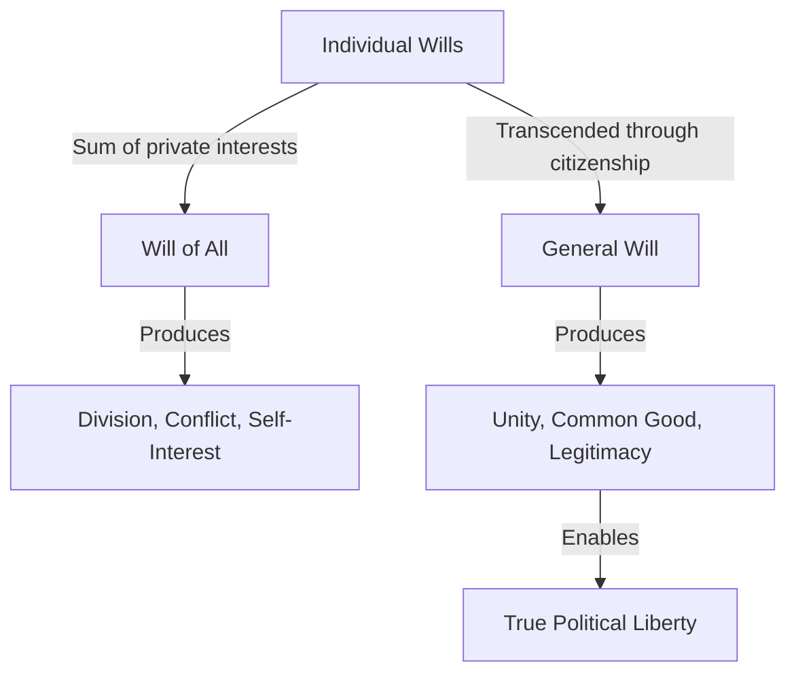
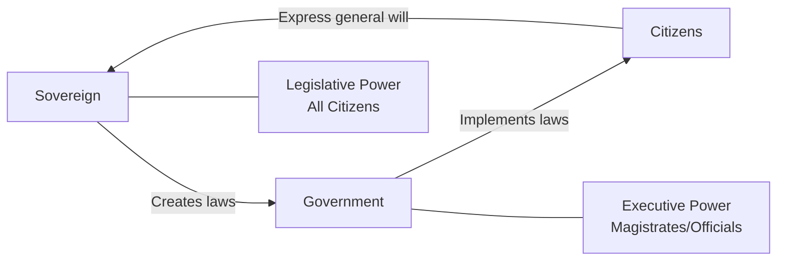
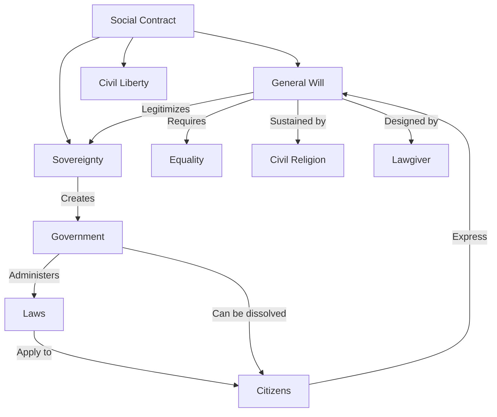

## The Central Problem

Rousseau opens with one of philosophy's most famous lines: "Man is born free, and everywhere he is in chains." The entire treatise is an attempt to answer the question posed in Book I, Chapter 1: "What can make it legitimate?"—that is, what can make political authority legitimate and compatible with individual freedom?

Rousseau surveys the historical justifications for political authority—right of the strongest, slavery, hereditary right—and finds each insufficient. Force, he argues, does not create right: "Let us then admit that force does not create right, and that we are obliged to obey only legitimate powers." The only path to legitimate authority is consent.

## The Social Contract

The social compact is the foundational act by which individuals unite to form a political community. Rousseau's version differs from those of his predecessors:

| Theorist | What Citizens Surrender | What They Receive |
|----------|------------------------|-------------------|
| **Hobbes** | All rights to a sovereign | Protection from violent death |
| **Locke** | Limited rights to a representative government | Protection of natural rights (life, liberty, property) |
| **Rousseau** | Natural freedom and natural rights | Civil freedom, civil rights, and equality |

Rousseau's formulation: each person puts their person and all their power under the supreme direction of the general will; each member becomes an indivisible part of the whole. Critically, citizens do not surrender their rights to a king or representative—they unite under their own collective will.

> "Each of us puts his person and all his common strength under the supreme direction of the general will; and in a body we receive each member as an indivisible part of the whole."

This exchange is favorable because what is surrendered—natural rights, whose enforcement depends on individual strength—is of dubious value, while what is received—civil rights enforced by the collective—is secure and legitimate.

## The General Will

The general will (*volonté générale*) is Rousseau's most important and most contested concept. It is:

- **Not** the sum of individual wills (that would be the "will of all")
- **Not** merely popular opinion or majority vote
- **The collective desire of the citizens for the common good**
- Always morally sound, though sometimes mistaken in application

The general will activates the social contract: it is the force that brings states and institutions into existence. When citizens assemble and deliberate about the common good, they express the general will. It reflects a public spirit in which individuals, transformed as right-thinking citizens with a love of virtue and justice, always seek the common good.

### General Will vs. Will of All

The distinction matters enormously. If the general will were simply majority rule, it could justify tyranny of the majority. Rousseau insists it must always aim at the common good—which means laws must be general in form (applying equally to all) and cannot target specific individuals or groups.

## Sovereignty

Sovereignty, for Rousseau, is the exercise of the general will by the citizens. It has three defining characteristics:

1. **Inalienable**: The people cannot transfer sovereignty to a representative or monarch. Rousseau insists that the English people are "free only during the election of members of parliament" and "as soon as they are elected, slavery overtakes it."

2. **Indivisible**: Sovereignty cannot be divided among branches of government. Legislative power belongs to the entire body of citizens.

3. **Absolute**: The sovereign's authority over citizens is absolute in the sense that no citizen has the right to resist the general will—but this absolutism is constrained by the requirement that laws must be general.

### The Sovereign vs. Government

Rousseau makes a sharp distinction between the sovereign and the government:

The sovereign is the legislative body—all citizens united. The government is merely the executive power that administers laws. The government is not sovereign and cannot override the general will. When the government exceeds its mandate, the people have the right to abolish it.

## Civil Liberty

Rousseau redefines freedom. Natural liberty—the right to do whatever one desires, limited only by individual strength—is surrendered in the social contract. In its place, citizens gain civil liberty: freedom guided by the general will.

> "The passage from the state of nature to the civil state produces a very remarkable change in man... he ought to lose by the social compact much of the natural liberty which it was never in his power to exercise effectively; but he recovers civil liberty and with it the full exercise of all his faculties."

Civil liberty means obedience to laws one has prescribed for oneself. It is "obedience to a self-imposed law." This is, for Rousseau, a higher form of freedom than natural liberty because it is both guaranteed and moral.

### Types of Freedom

| Type | Description | Source |
|------|-------------|--------|
| **Natural Liberty** | Unlimited right to do anything, limited only by individual strength | State of nature |
| **Civil Liberty** | Freedom to act within the bounds of laws prescribed by the general will | Social contract |
| **Moral Liberty** | Obedience to the law one prescribes for oneself; autonomy | Self-governance through the general will |

## Property and Equality

Rousseau traces the origin of property and inequality in his *Discourse on Inequality* and extends the argument here. Property is a civil right created by the social contract. The introduction of property marked a decisive step toward inequality:

> "The first man who, having enclosed a piece of land, bethought himself of saying 'This is mine,' and found people simple enough to believe him, was the real founder of civil society."

The social contract protects property, but Rousseau insists that extreme inequality undermines legitimacy. If the social contract produces conditions where some citizens are so impoverished that they cannot meaningfully participate in the general will, the contract is broken. Rousseau argues that legislation ought to preserve equality and prevent the concentration of wealth.

## Forms of Government

Rousseau classifies governments not by who rules but by the structure of the executive:

| Form | Executive Power | Rousseau's Assessment |
|------|-----------------|----------------------|
| **Democracy** | Half or more of the population | Rare in practice; "no government so subject to civil and intestine divisions" |
| **Aristocracy** | A few (between two and half the population) | Best for medium-sized states; elective aristocracy preferred |
| **Monarchy** | One individual | Most powerful; best for large states if the monarch is wise and just |
| **Mixed** | Combination | Most common in practice |

Rousseau argues that the larger the territory, the stronger the government must be relative to the sovereign. Small city-states like Geneva are ideal for democracy; large states require stronger executive power. The means by which executives come to power are irrelevant—monarchy need not be hereditary.

## Civil Religion

In Book IV, Chapter 8, Rousseau proposes a minimal civil religion necessary to sustain the social contract:

1. A benevolent deity exists
2. An afterlife with rewards and punishments
3. The sanctity of the social contract

Rousseau argues that Christianity, despite its truth, is useless as a republican religion because it directs citizens to the next world rather than inspiring civic virtue in this one. He does not propose a revival of pagan cults (as Machiavelli did) but insists on a civil faith that "does not admit of ceremonies" beyond profession of belief.

This chapter was the primary cause of the controversy that led to the book being banned. It was this chapter, not his ideas on liberty and sovereignty, that provoked the most outrage.

## The Lawgiver

Rousseau introduces the concept of the lawgiver—a great figure (like Solon, Lycurgus, or Calvin) who designs a constitution and system of laws for a new state. The lawgiver is not a ruler but an advisor who "obeys without power to compel" and must persuade citizens to accept good laws.

Rousseau acknowledges the paradox: the general will should determine the laws, but the people need a wise lawgiver to guide them. He even suggests that lawgivers must claim divine inspiration to persuade the "dim-witted multitude." This Machiavellian element has troubled many readers.

## The Right of Revolution

When the government violates the general will, citizens have the right to dissolve it and start anew. Rousseau states this clearly: if the governing body attempts to subvert the general will, the citizens have the right to replace the government. This right is not revolution in the modern sense but a return to the original contract. The social contract itself cannot be dissolved—only the particular government that administers it.

## Key Concepts at a Glance

