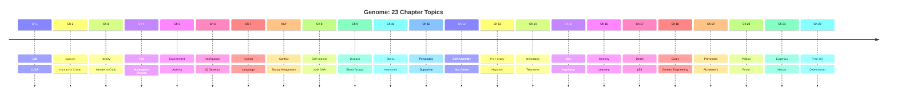

## Book Structure

_Genome_ is organised as 23 chapters — one per human chromosome pair — plus
a combined chapter for the X and Y sex chromosomes. The numbering runs 1
through 22, with the sex chromosomes placed between chapters 7 and 8.
Ridley was inspired by Primo Levi's _The Periodic Table_, in which each
chapter is named for a chemical element and uses it as a lens on human
experience.

---

## Chapter 1 — Chromosome 1: Life

The book opens with a question that is both biological and philosophical:
what is the "last universal common ancestor" (LUCA) — the single-celled
organism that lived approximately four billion years ago and from which all
life on Earth descends?

Ridley uses Chromosome 1 — the largest human chromosome, containing roughly
2,800 genes — to discuss the unity of life. He points out that many of the
most fundamental genes on Chromosome 1 are shared not just with apes or
mammals but with bacteria, plants, and fungi. The genes that control DNA
replication, repair, transcription, and translation are essentially the same
across all domains of life. This is not coincidence: it is ancestry. Every
living thing carries the genetic signature of a shared origin.

Key data point: the human genome contains about 3.2 billion base pairs, but
the number of protein-coding genes is only about 30,000 (the figure would be
revised downward to ~20,000 after the completion of the Human Genome Project).
Ridley introduces the idea that complexity does not come from gene count but
from gene regulation, alternative splicing, and the intricate interplay of
genes with their environment.

He quotes Alexander Pope: "Who sees with equal eye, as God of all, / A hero
perish, or a sparrow fall, / Atoms or systems into ruin hurled, / And now a
bubble burst, and now a world."

The chapter establishes the book's central framework: the genome as a
palimpsest of history, with the oldest and most essential genes written in a
script shared across all life, and progressively more recent additions
recording the divergence of species.

---

## Chapter 2 — Chromosome 2: Species

Chromosome 2 is chosen for the topic "Species" because of a remarkable
genetic fact: human chromosome 2 is the result of a fusion of two ancestral
ape chromosomes. Great apes have 24 pairs of chromosomes; humans have 23.
At some point in the last six million years, two chromosomes fused at their
telomeres to produce what is now chromosome 2. This fusion is one of the
defining genetic events that made us human.

Ridley compares the human and chimpanzee genomes, noting that at the DNA
sequence level they are 98.5% to 99% identical. Yet the differences —
in gene regulation, in the timing and location of gene expression, in the
duplication and deletion of specific sequences — produce two profoundly
different organisms.

He discusses the historical debate about how many chromosomes humans have.
Until the 1950s, the consensus — based on flawed microscopy — was 24 pairs.
The true count of 23 was established in 1956 by Joe Hin Tjio, an Indonesian
cytogeneticist working in Sweden.

The chapter also introduces the concept of "molecular clocks": the idea that
DNA sequences accumulate mutations at a roughly constant rate over time,
allowing geneticists to date evolutionary divergences by comparing sequences.
The human-chimpanzee split is estimated at roughly 5–7 million years ago,
though the precise date remains debated.

---

## Chapter 3 — Chromosome 3: History

This chapter provides a rapid, elegant history of genetics as a scientific
discipline. Chromosome 3 is chosen because it carries genes that were among
the first to be mapped and because its discovery history mirrors the
discipline's development.

Ridley covers Gregor Mendel's experiments with pea plants (1856–1863) and
his two laws of inheritance — the law of segregation and the law of
independent assortment — published in 1866 and ignored for 35 years. He
then describes the rediscovery of Mendel's work in 1900 by Hugo de Vries,
Carl Correns, and Erich von Tschermak.

The chapter moves through Thomas Hunt Morgan's fly lab at Columbia
University, where the chromosome theory of inheritance was established
(1910–1915); Hermann Muller's discovery that X-rays induce mutations (1927);
the determination that DNA — not protein — is the hereditary material
(Avery, MacLeod, McCarty, 1944); the discovery of the double helix (Watson
and Crick, 1953); and the cracking of the genetic code (Nirenberg, Khorana,
Holley, 1961–1966).

The narrative ends with a key insight: each generation of geneticists has
thought they had the gene figured out — as a Mendelian factor, as a
chromosomal locus, as a DNA sequence, as a transcription unit — and each
generation has been partly wrong. The gene is always more complicated than
the current model allows.

---

## Chapter 4 — Chromosome 4: Fate

Chromosome 4 carries the gene for Huntington's disease — one of the most
devastating and genetically instructive conditions known to medicine.
Huntington's is a late-onset neurodegenerative disorder caused by an expanded
CAG repeat in the huntingtin gene (HTT). People with 36 or more repeats
will develop the disease, typically in their thirties or forties, and die
within 15–20 years of onset. Because the mutation is dominant, each child of
an affected parent has a 50% chance of inheriting it. The condition is a
textbook example of a simple Mendelian disorder with complete penetrance —
if you have the mutation, you will get the disease.

Ridley tells the story of Nancy Wexler, the psychologist who led the
search for the Huntington's gene. Wexler's mother died of Huntington's;
Wexler herself had a 50% chance of carrying the mutation. She chose not to
be tested. Instead, she travelled to the shores of Lake Maracaibo in
Venezuela, where an extended family with an extraordinarily high incidence
of Huntington's lived in a fishing village. By collecting blood samples and
constructing a massive pedigree, Wexler and her team traced the gene to the
tip of chromosome 4 in 1983 — the first time a disease gene was mapped using
DNA markers without any prior knowledge of the gene's function.

The chapter is titled "Fate" because Huntington's represents the starkest
example of genetic predestination in human medicine. Yet Ridley uses this
extreme case to argue that most human traits and diseases are not like
Huntington's — they are not single-gene, fully penetrant, deterministically
fated. The exceptions (Huntington's, cystic fibrosis, Tay-Sachs) prove the
rule that most genes are probabilistic, not deterministic.

---

## Chapter 5 — Chromosome 5: Environment

Ridley tackles the nature-nurture question by discussing asthma. Asthma is
a complex disease involving roughly 15 different genetic loci, many of them
on chromosome 5. One of the most studied is the ADRB2 gene, which codes for
the beta-2-adrenergic receptor, a protein that controls bronchodilation. A
single base change — from adenosine (A) to guanine (G) at position 46 —
alters the receptor's function and influences asthma severity.

The crucial point: carrying this variant does not cause asthma on its own.
Asthma develops only in individuals who have both the genetic susceptibility
and exposure to environmental triggers such as allergens, air pollution, or
respiratory infections. The disease is a product of genes AND environment,
and trying to apportion blame to one or the other is conceptually misguided.

Ridley introduces the concept of pleiotropy — a single gene having multiple,
often unrelated effects. The ADRB2 gene, for instance, also influences
cardiovascular function and metabolism. Most genes are pleiotropic, which
means that the idea of "a gene for X" is almost always an oversimplification.

This chapter — placed early in the book — is Ridley's philosophical anchor.
He argues that the nature-nurture debate has been sterile because both sides
are right. Genes shape how we respond to environment; environment shapes
which genes are expressed. The system is a feedback loop, not a dichotomy.

---

## Chapter 6 — Chromosome 6: Intelligence

A controversial chapter, and one that attracted the sharpest criticism from
reviewers. Ridley discusses the genetics of intelligence, centering on a
1997 announcement by behavioural geneticist Robert Plomin. Plomin claimed
to have found a gene associated with intelligence: a marker on the IGF2R
gene (insulin-like growth factor 2 receptor) on chromosome 6.

Ridley describes the twin and adoption studies that have established that IQ
is substantially heritable — estimates range from 40% to 80% depending on
age and study design. But heritability is a population statistic, not an
individual destiny. A trait can be highly heritable (within a population at a
given time) and still be influenced by environment (across populations or
over time). Height, for example, is about 90% heritable within a population,
yet average height has increased dramatically in the last century due to
improved nutrition.

The IGF2R finding did not replicate well. Later studies showed that the
effect of any single gene on IQ is tiny — on the order of 0.5 IQ points or
less. Intelligence, like most complex traits, is highly polygenic: scores or
hundreds of genes, each contributing a minuscule effect.

Critically, Ridley's treatment of intelligence genetics was attacked by
Jerry Coyne in the London Review of Books for overstating the evidence and
for assuming that the IGF2R marker was indeed an "intelligence gene" when
the evidence was weak. Ridley's defenders argue that he accurately reported
Plomin's claims and that the surrounding chapter is more nuanced than its
critics allowed.

---

## Chapter 7 — Chromosome 7: Instinct

This chapter takes on language — the human faculty that many scientists
consider the defining feature of our species. Ridley explores the genetic
basis of language through the study of specific language impairment (SLI),
a condition in which children with otherwise normal intelligence struggle
with grammar and syntax.

The key figure is Myrna Gopnik, a Canadian linguist who studied a large
British family (the KE family) in which half the members across three
generations had severe grammatical deficits. The pattern of inheritance
suggested a single dominant gene. In 1998, the gene was located on
chromosome 7 and later identified as FOXP2 (forkhead box protein 2).

Ridley uses FOXP2 to discuss the Chomskyan theory of universal grammar —
the idea that the capacity for language is innate and genetically encoded.
He argues that FOXP2 provides at least partial support for this view: a
single gene can, when mutated, produce a specific language deficit without
affecting general intelligence. But he is careful to note that FOXP2 is
not "the grammar gene" — it is a regulatory gene that influences the
development of brain circuits involved in speech and language.

The chapter connects the genetics of language to the broader question of
instinct: how much of human behaviour is built in, and how much is learned?
Ridley sides with those who see the mind as neither a blank slate nor a
fully pre-programmed machine, but as a structure with innate predispositions
that are shaped and modified by experience.

---

## Chromosomes X & Y — Conflict

This combined chapter is the pivot of the book. The X and Y chromosomes
are fundamentally different from the 44 autosomes. The Y chromosome is tiny
— about 60 million base pairs, carrying fewer than 100 genes — and its
primary known function is sex determination, driven by the SRY gene (sex-
determining region Y), which triggers testis development in the embryo.

Ridley introduces the theory of genetic conflict: the idea that the
evolutionary interests of genes inherited from mother and father are not
aligned. Imprinted genes — genes that are expressed from only one parent's
copy — are a battlefield of sexual antagonism. The DAX1 gene on the X
chromosome, for example, promotes ovary development; the SRY gene on the
Y chromosome promotes testis development. They are engaged in a molecular
tug-of-war over the sex of the embryo.

The chapter also discusses the genetics of sexual orientation. The Xq28
region on the long arm of the X chromosome has been linked (tentatively and
controversially) to male homosexuality. Ridley is careful to present the
evidence as suggestive rather than conclusive, but he argues that the very
existence of a biological correlate of sexual orientation challenges the
idea that sexual behaviour is purely a matter of choice.

The rhetorical question that frames the chapter: are we bodies containing
genes, or are we genes that have built bodies as vehicles for their own
replication? This is the selfish gene perspective, and Ridley embraces it
enthusiastically.

---

## Chapter 8 — Chromosome 8: Self-Interest

Chromosome 8 is used to explore the "selfish gene" concept through the
lens of "junk DNA" — the vast stretches of the genome that do not code
for proteins. Over 95% of human DNA is non-coding, and for years it was
dismissed as evolutionary detritus. Ridley shows that this non-coding DNA
is anything but inert.

The chapter focuses on retrotransposons — genetic elements that copy
themselves from one location in the genome to another using an RNA
intermediate. The most abundant are LINE-1 elements (about 17% of the
human genome) and Alu sequences (about 11%). These elements are essentially
genetic parasites: they use the cell's machinery to replicate themselves,
often with no benefit (and sometimes with harm) to the host.

But Ridley explores the growing evidence that these "parasitic" elements
have been co-opted by evolution. Alu sequences, for example, have been
found to regulate gene expression, influence alternative splicing, and
even contribute to the evolution of new genes. Cytosine methylation —
the addition of methyl groups to DNA — may have evolved as a defence
mechanism against retrotransposons and now plays a crucial role in
gene regulation and development.

The chapter also introduces HIV and retroviruses. The human genome contains
fossilised remnants of ancient retroviruses (endogenous retroviruses) that
infected our ancestors millions of years ago. About 8% of the human genome
consists of these viral fossils. We are, in a very real sense, part virus.

---

## Chapter 9 — Chromosome 9: Disease

Chromosome 9 carries the ABO blood group genes, which determine one of the
most familiar genetic polymorphisms in humans. The ABO system was discovered
by Karl Landsteiner in 1901 and was the first human genetic polymorphism ever
identified. Ridley uses it to discuss the relationship between genetics,
disease, and evolution.

The different blood types (A, B, AB, and O) are determined by a single gene
that encodes a glycosyltransferase enzyme. The A and B versions differ by a
few critical amino acids; the O version is a non-functional variant. The
frequency of the different alleles varies dramatically across human
populations, suggesting a history of natural selection. People with type O
blood are more resistant to severe malaria; people with type A or B may be
more susceptible to certain cancers and cardiovascular diseases.

The chapter also discusses the CFTR gene on chromosome 7 (cystic fibrosis)
and the beta-globin gene on chromosome 11 (sickle cell anaemia). Ridley
uses these to introduce the concept of heterozygote advantage: carrying one
copy of a disease-causing mutation can confer resistance to another disease.
Sickle cell trait protects against malaria; the CF carrier state may protect
against typhoid fever and tuberculosis.

Ridley concludes that the Human Genome Project's goal of producing a single
"reference" human genome is fundamentally misleading. There is no such thing
as the human genome — there are 8 billion human genomes, each slightly
different, and those differences are the raw material of both disease and
adaptation.

---

## Chapter 10 — Chromosome 10: Stress

The CYP17 gene on chromosome 10 encodes an enzyme that is a critical player
in the production of steroid hormones. Ridley uses this to explore the
biology of stress — the chain of chemical events that begins with a
perceived threat and ends with the release of cortisol from the adrenal
glands.

The pathway: perceived stress activates the hypothalamus, which releases
corticotropin-releasing hormone (CRH). This signals the pituitary gland to
release adrenocorticotropic hormone (ACTH). ACTH travels through the
bloodstream to the adrenal cortex, which synthesises cortisol from
cholesterol — a process that requires CYP17 and a cascade of other enzymes.
Cortisol then mobilises energy stores, suppresses non-essential functions
(immune response, digestion, reproduction), and prepares the body for
action.

Ridley makes two key points. First, this stress response — essential for
survival in a dangerous world — becomes pathological when chronically
activated by the low-grade psychosocial stressors of modern life. Second,
the steroid hormone pathway connects stress to virtually every aspect of
physiology: metabolism, immune function, reproduction, brain function, and
aging. The CYP17 gene is not "a gene for stress" — it is a node in a
complex network that links environment (stressful events) to biology
(hormonal response) to health outcomes.

---

## Chapter 11 — Chromosome 11: Personality

Chromosome 11 carries the D4DR gene, which codes for the D4 dopamine
receptor, one of the key proteins in the brain's dopamine signalling system.
Dopamine is a neurotransmitter involved in reward, motivation, movement,
and attention.

Ridley discusses the discovery by Israel and colleagues in 1996 that a
particular variant of the D4DR gene (the 7-repeat allele) is associated
with novelty-seeking behaviour — a personality trait characterised by
impulsiveness, curiosity, and a willingness to take risks. The finding
was one of the first demonstrations of a statistically significant
association between a specific gene variant and a normal personality trait.

As with the intelligence gene on chromosome 6, the D4DR finding proved
controversial and not fully replicable. The effect size is small: the
7-repeat allele accounts for perhaps 4% of the variance in novelty-seeking
scores. But Ridley uses the finding — tentative as it is — as a launching
point for a broader discussion of the genetics of personality.

He explores the interaction between dopamine and serotonin, another key
neurotransmitter system. The serotonin transporter gene (5-HTT) has been
linked to anxiety and depression — but only in combination with stressful
life events. The chapter reinforces Ridley's central argument: genes and
environment interact in a continuous, circular fashion. The genome loads
the gun, but environment pulls the trigger.

---

## Chapter 12 — Chromosome 12: Self-Assembly

This chapter is about embryonic development — how a single fertilised egg
becomes a complex organism with a head, limbs, organs, and a recognisable
body plan. The key genes are the Hox (homeobox) genes, a family of
regulatory genes that control the basic body plan of all animals.

Ridley tells the story of Walter Gehring's discovery of the homeobox in
1983. Working on fruit flies, Gehring and his team identified a 180-base-pair
sequence — the homeobox — that was shared across a set of genes that
controlled the segmentation and identity of body parts. When a homeobox
gene is mutated, bizarre transformations occur: flies grow legs on their
heads (the Antennapedia mutation) or develop an extra set of wings.

The crucial discovery: the same homeobox sequences are found in essentially
the same order in the genomes of all animals — flies, mice, humans. The
Hox genes that sculpt our spine and limbs are the same genes that sculpt
the body of a fruit fly. This is not metaphor; it is molecular homology —
direct evidence of common ancestry.

Ridley describes the three classes of embryonic patterning genes: gap genes
(which establish broad regions), pair-rule genes (which divide the embryo
into segments), and segment-polarity genes (which give each segment a
front-back orientation). The entire process is a cascade of genetic
switches, each turning on the next, with the Hox genes acting as the
master controllers that specify the identity of each segment.

---

## Chapter 13 — Chromosome 13: Pre-History

In one of the book's most fascinating chapters, Ridley shows how genetics
reveals human prehistory. Chromosome 13 carries the BRCA2 gene, which
predisposes to breast cancer. But the chapter is not about cancer; it is
about using BRCA2 mutations as markers of human migration.

A specific mutation in BRCA2 — the 6174delT mutation — is found in
approximately 1% of Ashkenazi Jews and is virtually absent in other
populations. This mutation arose as a founder event approximately 400 years
ago in a single individual whose descendants survived and multiplied. By
tracing the distribution of such founder mutations, geneticists can map
the migrations and demographic history of human populations.

Ridley discusses the genetics of Indo-European language expansion, the
peopling of the Americas (via the Bering land bridge), and the discovery
of lactase persistence — the ability to digest milk in adulthood. This
last example is particularly revealing: lactase persistence arose as a
mutation in the regulatory region of the lactase gene and spread rapidly
in populations that domesticated cattle. It is a textbook example of
gene-culture co-evolution: a cultural innovation (dairy farming) created
a selective pressure that favoured a genetic change.

Ridley argues that this is not Lamarckism — acquired traits are not
inherited — but it is a form of feedback: our culture changes our
environment, and that changed environment changes which genes are
favoured by natural selection. The genome and the culture evolve together.

---

## Chapter 14 — Chromosome 14: Immortality

The theme here is cellular immortality. Chromosome 14 carries the TEP1
gene, which codes for a component of telomerase — the enzyme that
maintains the ends of chromosomes.

Telomeres are repetitive DNA sequences at the ends of chromosomes that
shorten with each cell division. When they become too short, the cell
stops dividing (cellular senescence) or dies. Telomerase can rebuild
telomeres, essentially resetting the clock. It is active in embryonic
cells, stem cells, and — ominously — most cancer cells, which use it to
achieve the immortality that makes them lethal.

Ridley explores the paradox: why do we age if our genes "want" us to
survive and reproduce? The answer, from evolutionary theory, is that
genes are selected for their effects on survival and reproduction in the
organism's prime, not for effects that appear late in life. Genes that
confer an advantage early in life (like fast growth or high fertility)
can be selected for even if they cause harm later (like cancer or
degeneration). This is the "antagonistic pleiotropy" theory of aging,
proposed by George Williams in 1957.

The chapter also discusses the Hayflick limit — the observation that
normal human cells divide only about 50 times before stopping — and the
connection between telomere length and lifespan. Ridley is careful to
note that telomeres are not the whole story of aging, but they are an
important piece of a puzzle that remains incompletely solved.

---

## Chapter 15 — Chromosome 15: Sex

Chromosome 15 is the site of two of the most extraordinary genetic
phenomena: Prader-Willi syndrome and Angelman syndrome. These are both
caused by deletions on chromosome 15, but the symptoms are entirely
different depending on which parent the deleted chromosome came from.
Prader-Willi (characterised by insatiable appetite, obesity, and
intellectual disability) results from a deletion on the paternal copy.
Angelman syndrome (characterised by severe developmental delay, seizures,
and a characteristic happy demeanour with frequent laughter) results from
a deletion on the maternal copy.

The explanation is genomic imprinting: some genes are expressed only from
the paternal copy or only from the maternal copy. The other copy is
silenced by methylation and other epigenetic marks. Prader-Willi and
Angelman involve a cluster of imprinted genes on chromosome 15.

Ridley explains the evolutionary theory of imprinting: it is a manifestation
of genetic conflict between the mother's and father's genes. Paternal genes
favour larger offspring (because the father's reproductive success is
maximised by big, healthy babies); maternal genes favour smaller offspring
(because the mother needs to conserve resources for future offspring).
Imprinted genes are the molecular battleground of this conflict. The
paternal contribution promotes growth (Prader-Willi involves loss of
paternally expressed growth-promoting genes); the maternal contribution
restricts growth (Angelman involves loss of maternally expressed
growth-restricting genes).

---

## Chapter 16 — Chromosome 16: Memory

This chapter explores the genetics of learning and memory. Chromosome 16
carries several genes involved in neurodevelopment and synaptic function,
though the chapter is more a philosophical meditation on the relationship
between genes, brain, and memory than a focused discussion of a single
chromosomal locus.

Ridley revisits the ancient debate about innate knowledge versus
experience. Are we born with knowledge already written into our brains,
or is the brain a blank slate to be filled by experience? He sides with
those who argue for a middle ground: the brain has innate structures —
genetically programmed — that constrain what and how we learn, but it is
experience that fills in the details.

He draws on Steven Pinker's argument for a "language instinct" — the idea
that children are born with an innate capacity for grammar that is
genetically encoded — and extends it to other domains of learning. The
capacity to recognise faces, to navigate space, to cooperate with others,
and to love one's children all appear to have genetic foundations.

But Ridley is careful to argue against genetic determinism: "Genes are not
there to dictate behaviour; they are there to allow behaviour to adapt to
circumstances." The brain is a learning machine — but it is a machine whose
architecture is built by genes and whose software is written by experience.

---

## Chapter 17 — Chromosome 17: Death

Chromosome 17 carries the TP53 gene, which produces the p53 protein — the
most important tumour suppressor in the human genome. p53 is sometimes
called "the guardian of the genome" because it monitors DNA damage and,
if damage is detected, can halt cell division, activate DNA repair, or
trigger programmed cell death (apoptosis).

Ridley explains the logic: every cell in the body carries the machinery
for its own destruction. The p53 protein is the gatekeeper. When a cell
accumulates genetic damage — from radiation, chemical carcinogens,
replication errors — p53 levels rise, and the cell is either repaired or
eliminated. More than half of all human cancers involve mutations that
disable p53, allowing damaged cells to survive and proliferate.

The chapter also discusses oncogenes — "cancer genes" that, when mutated
or overexpressed, drive uncontrolled cell growth. The first oncogene,
src, was discovered by Harold Varmus and Michael Bishop in the 1970s, a
discovery that won them the Nobel Prize. The balance between oncogenes
(gas pedals) and tumour suppressor genes like p53 (brakes) determines
whether a cell stays healthy or becomes cancerous.

Ridley uses the genetics of cancer to reinforce a broader theme: death is
not an accident or a failure of biology — it is built into the system.
Apoptosis, cellular senescence, and telomere shortening are programmed
mechanisms that limit the lifespan of cells and organisms. The genes that
cause death are not bugs; they are features that evolved because they
prevent cancer and maintain the health of the population.

---

## Chapter 18 — Chromosome 18: Cures

This chapter is about genetic engineering — the deliberate modification of
genes in living organisms. Ridley traces the history of recombinant DNA
technology, from the discovery of restriction enzymes (molecular scissors
that cut DNA at specific sequences) to the development of techniques for
inserting foreign DNA into bacteria, plants, and animals.

The first genetically engineered drug was human insulin, produced in
bacteria and approved in 1982. Before that, diabetics used insulin from
pigs and cows, which caused allergic reactions in some patients.
Recombinant human insulin is identical to the natural protein and causes
no such reactions. It was a landmark of biotechnology.

Ridley discusses the controversy over genetically modified (GM) crops,
which was at its peak in Europe when the book was written. He argues
forcefully in favour of genetic engineering in agriculture, pointing out
that conventional breeding is also genetic modification — just slower and
less precise. He attacks what he sees as the irrational fear of GM foods,
a theme that reflects his broader scepticism of environmental regulation
and his libertarian political views.

The chapter ends with a look at the future of gene therapy — the idea of
correcting genetic defects by introducing functional copies of genes into
patients' cells. In 1999, gene therapy was in its infancy; a patient (Jesse
Gelsinger) had recently died in a gene therapy trial, underscoring the
risks. Ridley predicts — correctly — that gene therapy would eventually
succeed, but only after a long and difficult period of setbacks.

---

## Chapter 19 — Chromosome 19: Prevention

Chromosome 19 carries the APOE gene, which codes for apolipoprotein E, a
protein involved in fat and cholesterol metabolism. The APOE gene comes in
three common variants (alleles): APOE2, APOE3, and APOE4. The APOE4 allele
is the single strongest genetic risk factor for late-onset Alzheimer's
disease. Carrying one copy increases the risk roughly threefold; carrying
two copies increases it roughly twelvefold.

Ridley discusses the concept of genetic testing for disease risk. If you
know you carry APOE4, you can take preventive measures — dietary changes,
exercise, cognitive stimulation — that may delay or reduce the risk of
Alzheimer's. But the link is probabilistic, not deterministic. Many people
with APOE4 never develop Alzheimer's; many people without it do.

The chapter also discusses the genetics of coronary heart disease, another
condition with both genetic and environmental components. The APOE gene
influences cholesterol levels; other genes (LDLR, PCSK9) affect lipid
metabolism; and lifestyle factors (diet, exercise, smoking) interact with
all of them.

Ridley argues that the combination of genetic testing and preventive
medicine has the potential to transform healthcare — moving from a
reactive model (treat disease after it appears) to a proactive model
(prevent disease before it develops). But he warns that this will require
individuals to have control over their own genetic information, free from
discrimination by insurers or employers.

---

## Chapter 20 — Chromosome 20: Politics

This is arguably the most unusual chapter in the book. Chromosome 20 carries
the PRP gene, which codes for the prion protein — an ordinary cellular
protein with a normal function (still incompletely understood) that can
misfold into an infectious, self-propagating, disease-causing form.

Prions were discovered by Stanley Prusiner, who won the Nobel Prize for
his work in 1997. They are the cause of scrapie in sheep, bovine spongiform
encephalopathy (BSE, or "mad cow disease") in cattle, and Creutzfeldt-Jakob
disease (CJD) in humans. The variant form of CJD (vCJD) that emerged in the
UK in the 1990s was linked to eating beef from cattle infected with BSE —
a human epidemic caused by a cattle disease amplified by industrial farming
practices.

Ridley uses the BSE/vCJD outbreak to examine how governments respond to
scientific uncertainty. The British government initially denied there was a
problem, then overreacted, destroying millions of cattle at enormous cost.
The human death toll from vCJD was tragic but modest (fewer than 200 in the
UK). Ridley argues that the political response was driven more by media
panic and bureaucratic self-protection than by rational risk assessment.

The chapter is titled "Politics" because Ridley believes the handling of
the BSE crisis reveals deep problems in the relationship between science,
government, and public opinion. He argues that politicians and regulators
systematically overreact to risks that are novel, uncertain, and
emotionally salient — and that this overreaction, while politically
expedient, causes more harm than good. The chapter is vintage Ridley:
provocative, politically charged, and grounded in detailed scientific
reporting.

---

## Chapter 21 — Chromosome 21: Eugenics

Chromosome 21 is the smallest human chromosome, but it carries an outsized
historical and moral weight. An extra copy (trisomy 21) causes Down
syndrome, a condition that was one of the primary targets of the eugenics
movement of the early 20th century.

Ridley provides a concise history of eugenics: Francis Galton's coining of
the term in 1883, the American eugenics movement that produced forced
sterilisation laws in 30 states, the 1927 Supreme Court case Buck v. Bell
in which Oliver Wendell Holmes Jr. wrote "Three generations of imbeciles
are enough," and the direct influence of American eugenicists on Nazi
racial policy. He argues that eugenics was not a fringe movement or a
pseudoscience — it was mainstream, supported by prominent scientists,
funded by major foundations, and endorsed by progressive reformers.

But Ridley's analysis takes a controversial turn. He argues that the
problem with eugenics was not the science but the coercion: "What was
wrong with eugenics was not the genetics — it was the authoritarianism."
This argument — that voluntary genetic choices by individuals are
fundamentally different from state-enforced genetic policies — is central
to Ridley's political philosophy. He distinguishes between the "old
eugenics" (state-mandated sterilisation, immigration restriction, racial
purification) and what he calls "individual genetic choice" (personal
decisions about testing, screening, and selection).

The chapter is one of the most debated in the book. Critics, including
Jerry Coyne, argue that Ridley's framing minimises the dangers of modern
genetic technologies by focusing exclusively on state coercion while
downplaying the risks of market-driven eugenics — a world in which the
wealthy can purchase genetic advantages for their children.

---

## Chapter 22 — Chromosome 22: Free Will

The final chapter addresses the deepest philosophical question raised by
genetics: if our genes influence our intelligence, personality, behaviour,
and even our political orientation, what room is left for free will?

Ridley argues that genetic determinism is a straw man. Genes do not
determine behaviour in the way that a blueprint determines a building.
Instead, genes create a range of possibilities, and the outcome depends
on the interaction between genes and environment across development. He
uses the analogy of a "dimmer switch" rather than an on-off switch: genes
set the baseline and the range, but environment adjusts the setting within
that range.

He discusses the data on the heritability of political attitudes: twin
studies suggest that approximately 40-50% of the variance in political
orientation is heritable. But he emphasises that heritability does not
mean immutability. People change their minds; they resist their
predispositions; they make choices that go against their genetic
inclinations.

For Ridley, free will is not an illusion, but it is constrained. We are
not blank slates, but we are not prisoners of our genes either. The human
capacity for self-reflection, for learning, for changing our environment,
and for making choices that alter the trajectory of our own development —
this is what distinguishes us from all other species, and it is itself
a product of the genome that made our brains capable of such complexity.

The book ends with a characteristically Ridleyesque flourish: "We are
entering the century of the genome. It is not a century in which we will
be enslaved by our genes. It is a century in which we will learn to
understand them, to use them, and to transcend them."

---

## Reading Guide

### Sufficiency
This 01-content file covers all 23 chapters of _Genome_ with specific
details about the key genes, experiments, and arguments in each.
It is sufficient for readers who want a thorough understanding of the
book's content without reading the original.

### Recommended Reading Path
For readers who intend to read the book itself, the most effective
approach is to read the chapters in order, as the arguments build on
one another. However, each chapter is self-contained, and readers with
specific interests — intelligence genetics (Ch 6), language (Ch 7),
sex chromosomes (X&Y), cancer (Ch 17), eugenics (Ch 21) — can dip into
individual chapters without loss.

### Chapters to Read Closely
- **Ch 1 (Life)** and **Ch 3 (History)**: Essential for understanding
  the book's framework and the history of genetics.
- **Ch 4 (Fate)**: The best illustration of simple Mendelian genetics
  and its limits.
- **Chromosomes X&Y (Conflict)**: The conceptual heart of the book.
- **Ch 8 (Self-Interest)**: For understanding the "selfish gene"
  perspective and the importance of non-coding DNA.
- **Ch 12 (Self-Assembly)**: A beautiful explanation of developmental
  genetics.
- **Ch 21 (Eugenics)** and **Ch 22 (Free Will)**: The books's moral
  and philosophical conclusions.

### Chapters That Can Be Skimmed
- **Ch 10 (Stress)** and **Ch 11 (Personality)**: Interesting but
  contain findings that have not always held up well.
- **Ch 20 (Politics)**: The prion science is fascinating, but the
  political analysis is dated and strongly coloured by Ridley's
  partisan views.
