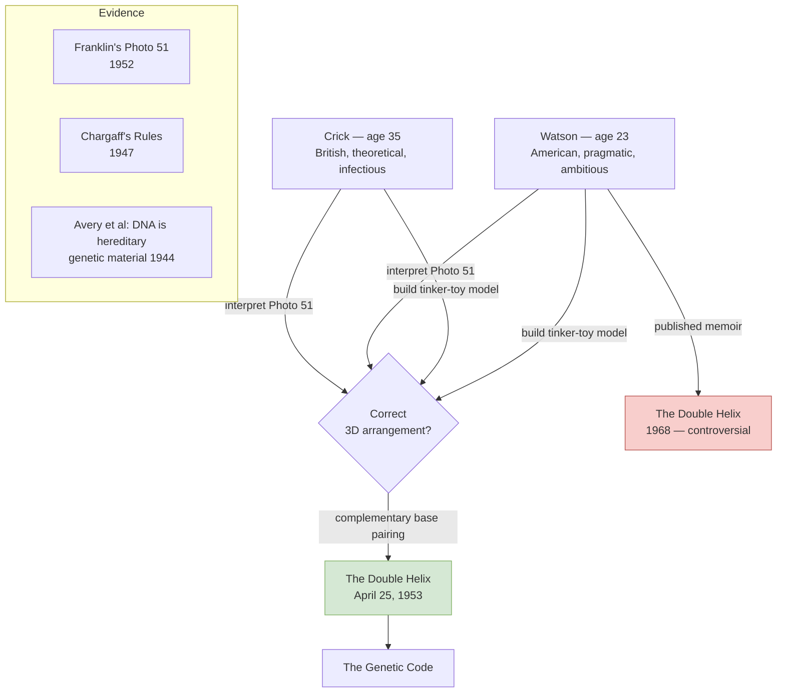
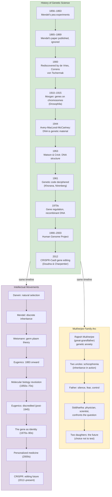

## Book Structure

The book is organised into five parts and nineteen chapters, interweaving
scientific history, biographical vignettes, and personal memoir:

```mermaid
mindmap
  root((The Gene))
  Part I: In the Garden of Mendel
  Ch 1: Missing Pages of History
  Ch 2: The Patriarch
  Ch 3: Mendel's Peas
  Ch 4: The Hereditary Material
  Part II: The Book of Life
  Ch 5: The Double Helix
  Ch 6: The Central Dogma
  Ch 7: Genes En Route
  Part III: Human Genetics
  Ch 8: Heredity and Identity
  Ch 9: The Patient's Destiny
  Ch 10: The Gene Map
  Part IV: The Gene Factory
  Ch 11: Life's Multitudes
  Ch 12: Sex, Lies, and DNA
  Ch 13: The DNA Age
  Part V: The Future of the Gene
  Ch 14: Future Reading
  Ch 15: Future Writing
  Ch 16: Post-Reading
  Epilogue: Gifts from the Genome
```

---

## Part I — In the Garden of Mendel

### Chapter 1: Missing Pages of History

Mukherjee opens in the library of Vyšší Brod monastery in the Czech
Republic, searching through the handwritten records of Gregor Mendel's
correspondence. The monk-scientist, who between 1856 and 1863 bred more than
28,000 pea plants and discovered the mathematical laws of heredity, published
his results in 1866 — and was ignored for 35 years.

Why? The chapter introduces two themes that run throughout the book:

- **Science is not self-executing.** Discoveries require not just truth but
  the right moment, the right messenger, and cultural readiness. Mendel
  glimpsed the atom of heredity but lacked a mechanism to explain how discrete
  units could produce continuous variation.

- **Genetics is a story about identity.** From its inception, the gene was
  understood not just as a unit of biology but as a carrier of human essence —
  of race, of family, of self. This conflation of biology and identity sets
  up every later chapter.

---

### Chapter 2: The Patriarch

Here Mukherjee introduces his great-grandfather, Rajesh Mukherjee, whose
principled life in early 20th-century India is disrupted by the arrival of a
British genetics textbook — and a question: what causes schizophrenia?

Rajesh's son (Mukherjee's grandfather) and Rajesh's brother (Mukherjee's grand
uncle) both develop schizophrenia. Rajesh, struggling to understand heredity
through the limited lens available in 1920s India, represents the book's
central collision: the family trying to read the language of its own suffering.

```mermaid
flowchart LR
  R["Rajesh Mukherjee<br/>(the patriarch)"] -->|"fear of passing on"| S["His son<br/>(has schizophrenia)"]
  R -->|"urges restraint"| B["His brother<br/>(not able to marry)"]
  S -.->|"the genetic question"| DO["Mukherjee's father<br/>(who never spoke of it)"]
  DO -.->|"the same fear"| SM["Siddhartha Mukherjee<br/>(the author)"]
  SM -->|"must decide: to test or not?"| D[Two daughters<br/>(the question of fate)]
  style R fill:#8dd3c7,stroke:#382119
  style S fill:#f8cecc,stroke:#b85450
  style SM fill:#e1d5e7,stroke:#9673a6
  style D fill:#d5e8d4,stroke:#82b366
```

---

### Chapter 3: Mendel's Peas

Mendel's experiments were meticulous: seven traits of the pea plant (*Pisum
sativum*), each with two discrete forms, bred across generations to reveal a
pattern so clean it seems faked:

- 3:1 ratio of dominant to recessive phenotypes in F2
- Discovery of homozygous and heterozygous genotypes
- The concept of a discrete, non-blending unit of inheritance
- Two laws: the Law of Segregation and the Law of Independent Assortment

Mukherjee describes Mendel's quiet scientific rigour — the mathematics, the
careful record-keeping, his courteous submission to the Natural History
Society in Brno — and then his profound isolation after the paper was read
once, shelved, and forgotten.

The chapter closes with the rediscovery in 1900 by Hugo de Vries, Carl
Correns, and Erich von Tschermak, almost simultaneously in three countries.
What changed? Science had changed: Darwinism had created a problem — how
does variation arise? — that Mendel answered perfectly.

---

### Chapter 4: The Hereditary Material

The first half of the 20th century was a battle to find what genes are made
of. The contenders: protein (the favourite, because it is complex and
versatile) and DNA (dismissed as too simple by most scientists).

Key milestones covered:

- **Thomas Hunt Morgan (1910–1915):** Using the fruit fly _Drosophila_
  melanogaster, Morgan confirmed that genes are carried on chromosomes — with
  the discovery of sex-linked inheritance in white-eyed mutant flies.

- **Frederick Griffith (1928):** The "transforming principle" experiment
  showed that a substance from dead bacteria could genetically transform live
  bacteria — implying that genes can move between organisms.

- **Oswald Avery, Colin MacLeod, Maclyn McCartney (1944):** Identified DNA
  as the transforming principle — the hereditary material. The paper was met
  with caution but proved revolutionary.

- **Erwin Chargaff (1947):** Discovered Chargaff's rules — the base ratios
  A:T and G:C are equal within a species, consistent across species with
  ratios varying between species. This was a crucial constraint on any model
  of DNA structure.

- **Rosalind Franklin (1952):** X-ray crystallography of DNA produced
  Photograph 51, the image that revealed the helical structure and the
  3.4-angstrom base-pair spacing.

- **James Watson and Francis Crick (1953):** The double helix model —
  complementary base pairing, antiparallel strands, the genetic code as a
  replicating polymer. Published in _Nature_ April 25, 1953.

Mukherjee details the human drama, the scientific politics, and the unfair
diminishment of Franklin in the Nobel-award narrative of 1962 (at which point
Franklin, who had died of ovarian cancer in 1958, was no longer eligible).

---

## Part II — The Book of Life

### Chapter 5: The Double Helix

Watson and Crick's discovery was not an isolated eureka moment — it was
the convergence of experimental physics, chemistry, and biology. The two
young scientists (Watson 23, Crick 35) built physical models of tinker-toy
DNA in Cambridge and raced against Linus Pauling's lab in Caltech, where
Pauling had already proposed a triple-helix model (wrongly).



The discovery of complementary base pairing (A always pairs with T, G always
with C) immediately implied a mechanism for replication: each strand serves as
a template for its complement. The gene was a textual, reproducible entity —
a word in the language of life.

---

### Chapter 6: The Central Dogma

Francis Crick coined the term "central dogma" in 1957: **DNA makes RNA, and
RNA makes protein.** Information flows in one direction: DNA → RNA → Protein.

The chapter traces how this simple concept became the organising principle of
all molecular biology:

- **Messenger RNA (mRNA):** Discovered by Jacob and Monod (1961) and
  independently by Brenner, Jacob, and Meselson. RNA is the intermediary
  between DNA's nuclear archive and the cytoplasmic protein factory.

- **Transfer RNA (tRNA):** The adaptor molecule that reads the genetic code
  one codon at a time and delivers the correct amino acid.

- **Ribosomes:** The molecular machines where translation occurs.

- **The Genetic Code:** Deciphered in the early 1960s by Khorana, Nirenberg,
  Matthaei, and Holley — showing that sequences of three nucleotides (codons)
  specify each of 20 amino acids. The code is universal, redundant, and
  unambiguous.

---

### Chapter 7: Genes En Route

The middle chapters of Part II shift to the 1960s–1970s — the revolution
in understanding gene *regulation*. The focus turns to François Jacob and
Jacques Monod's work on the **lac operon** in _E. coli_, the genetic switch
that turns genes on and off.

This was the conceptual breakthrough: genes are not just passive blueprints.
They are dynamic, regulated, subject to environmental signals. Cells choose
when to express genes based on context. This insight foreshadows everything
from developmental biology to epigenetic regulation.

Also covered: the discovery of **reverse transcriptase** (Howard Temin,
David Baltimore, 1970) — an enzyme found in retroviruses that can transcribe
RNA back into DNA. This overturned the strict one-directional central dogma
and became the foundation of modern molecular biology tools.

---

## Part III — Human Genetics

### Chapter 8: Heredity and Identity

The book's emotional centre. Mukherjee reflects on his family's history —
his two uncles with schizophrenia, his father's silence about the illness,
his own generation's first encounter with the question of genetic testing.

He covers the historical period when "genetics" meant "identity" in its most
dangerous sense:

- **The eugenics movement in America (1900–1935):** Led by figures like
  Charles Davenport, funded by the Carnegie Institution and the Rockefeller
  Foundation, practiced through 30 states' laws authorizing forced sterilization
  of the "unfit." The Supreme Court upheld such laws in _Buck v. Bell_ (1927),
  with Oliver Wendell Holmes Jr. writing: "Three generations of imbeciles are
  enough."

- **Nazi Germany:** The American eugenics laws directly inspired the 1933
  German Law for the Prevention of Hereditarily Diseased Offspring, which
  led to 400,000 forced sterilizations and provided the legal infrastructure
  for the T4 "euthanasia" programme and ultimately the Holocaust.

- **The post-war reckoning:** After Nuremberg, genetics underwent a
  profound self-examination. But the damage was done: for decades after World
  War II, the word "genetics" was toxic, especially to communities that had
  been its victims.

---

### Chapter 9: The Patient's Destiny

Mukherjee draws on his experience as a cancer physician and geneticist at
Columbia University Medical Center to explore how genetic knowledge transforms
medical practice:

- **Single-gene disorders (Mendelian):** Huntington's disease (dominant, fully
  penetrant, onset in midlife); cystic fibrosis (recessive, carrier frequency
  1 in 25 in populations of European ancestry); sickle cell disease.

- **Complex disorders (polygenic):** Heart disease, diabetes, most cancers —
  influenced by dozens or hundreds of genes plus environment, with no simple
  inheritance pattern.

- **Prenatal testing and preimplantation genetic diagnosis (PGD):** The
  technology to choose embryos by genetic status is already widespread. It
  sidesteps the moral mess of abortion but introduces the question of which
  traits are "worthy" of selection.

- **Direct-to-consumer genetic testing (23andMe, 2007 onward):** For the
  first time in history, individuals can learn their genetic risk profile
  without a medical intermediary. This democratization of genetic information
  is powerful — and psychologically destabilizing.

---

### Chapter 10: The Gene Map

The human genome contains approximately 3.2 billion base pairs arranged in 23
pairs of chromosomes. The Human Genome Project (HGP), launched in 1990 and
completed in 2003, produced a reference sequence at a cost of roughly 3 billion
dollars. By 2016, individual human genomes could be sequenced for under 1,500
dollars.

Mukherjee covers the landmark findings:

- Gene count: ~20,687 protein-coding genes — fewer than a rice plant or
  a tiny nematode worm, but massively more complex through gene regulation,
  alternative splicing, and non-coding RNA.

- Non-coding DNA: Often dismissed as "junk DNA," it contains regulatory
  elements, enhancers, epigenetic marks, and vast regions whose function we
  still do not understand.

- Heritability of GWAS traits: Genome-wide association studies show that for
  most common diseases, identified genes account for a fraction of estimated
  heritability. The "missing heritability" problem remains largely unsolved.

---

## Part IV — The Gene Factory (Genes in Society)

### Chapter 11: Life's Multitudes

On the evolution of genomic diversity and what it means for human identity.
Mukherjee examines the concept of race through a genetic lens:

- There is more genetic variation *within* any racial group than *between*
  racial groups. Race has no biological reality as a meaningful genetic
  category — yet its social reality is overwhelming.

- The genetics of disease does differ between populations (sickle cell in
  African populations, BRIP1 in African-American populations), but these
  differences are population-specific, not racial.

- The chapter also covers the rise of population-level genomic medicine, the
  exclusion of non-European populations from genomic research, and the ethical
  obligation to diversify genetic databases.

---

### Chapter 12: Sex, Lies, and DNA

On the Y chromosome, sex determination, and the genetic determinism of sexual
difference. Mukherjee examines the faulty science and social assumptions that
have been used to claim male or female genetic superiority, and the ways in
which such claims have historically been weaponised.

The chapter also explores how our understanding of sex at the genetic level
has become far more nuanced than XX/XY: intersex conditions, mosaicism, and
the role of the SRY gene in sex determination.

---

### Chapter 13: The DNA Age

By the 2000s, DNA had become a cultural symbol of authority — in courts, in
medicine, in popular culture. Mukherjee traces the history of DNA forensics,
the ethics of genetic privacy in the age of large-scale data, and the
questions raised by collecting DNA from suspects, patients, employees, and
citizens.

---

## Part V — The Future of the Gene

### Chapter 14: Future Reading

Personalized genetic prediction: what can a genome tell us about our future?
This chapter covers pharmacogenomics (how genes affect drug response —
illustrated with the story of a child dying from a fatal reaction to the
antipsychotic clozapine due to a *CYP2D6* variant), whole-genome sequencing
in cancer (the genomic "fingerprint" of each individual tumour), and the
limits of prediction:

- Most genetic scores are probabilistic, not deterministic.
- Environmental factors interact with genes in ways we do not fully model.
- The right to *not* know your genetic future is a genuine ethical claim.

---

### Chapter 15: Future Writing

CRISPR-Cas9 — Clustered Regularly Interspaced Short Palindromic Repeats — is
the chapter that generated the most attention and controversy. Mukherjee traces
the discovery:

- Discovered in *Streptococcus pyogenes* by Francisco Mojica in the early
  1990s, understood to be part of a bacterial immune system against viruses.

- Jennifer Doudna (University of California, Berkeley) and Emmanuelle
  Charpentier (Max Planck Institute for Infection Biology) realised in 2012
  that the CRISPR system could be repurposed as a programmable gene-editing
  tool. Their landmark _Science_ paper opened the era of precise genome editing.

**What CRISPR can do:**

- Cure genetic diseases: first successful therapy approved in 2023 for sickle
  cell disease (Casgevy).
- Edit embryos to remove disease-causing mutations.
- Engineer human cells for cancer immunotherapy (CAR-T).
- Potentially edit complex traits — intelligence, height, personality.

---

### Chapter 16: Post-Reading

The most ethically charged chapter. What happens when we can read and write
the genome with the ease of editing a text document?

Key dilemmas explored:

- **Therapy vs. enhancement:** Where does treatment of disease end and
  "designer baby" manipulation begin? Height, IQ, athletic ability, and beauty
  are all partially heritable.

- **Germline editing:** Changes to an embryo affect not just that individual
  but every descendant. The 2018 creation of CRISPR babies by He Jiankui in
  Shenzhen was condemned globally — but it was also a technical success that
  proved feasibility.

- **Inequality:** Access to genetic therapy will not be universal. Wealthy
  parents may be able to purchase genetic advantages for their children —
  biology gatekeeping social mobility in a new way.

- **The non-personhood argument:** Some ethicists argue that preventing the
  birth of disabled individuals through selection implies that existing disabled
  people are less valuable — an inherently ableist position.

- **Mukherjee's position:** He argues strongly for responsible innovation —
  not prohibitions, not a moratorium, but serious ethical engagement. "The
  power to edit the genome is the power to edit the definition of what it
  means to be human."

---

### Epilogue: Gifts from the Genome

The book closes on three interwoven gifts that the gene offers:

1. **The gift of identity** — genes make each of us who we are, in ways we
   are only beginning to understand.
2. **The gift of connectedness** — we share genes with every living thing;
   our genomes contain the scripts written by 4 billion years of evolution.
3. **The gift of choice** — the gene was for most of history a sentence we
   had to serve. It is becoming a sentence we can revise.

But the book's deepest gift is its refusal to let any single narrative —
scientific, genetic, deterministic — have the last word. As Mukherjee writes
near the end, examining his own daughters: "I have chosen to prohibit their
genetic testing... That choice, I now realise, is itself an act of genetic
determinism — I am defining their future by what I have chosen not to know."
The gene is never just a gene. It is always also a mirror.

---

## Structural Diagram: The Full Gene Arc


